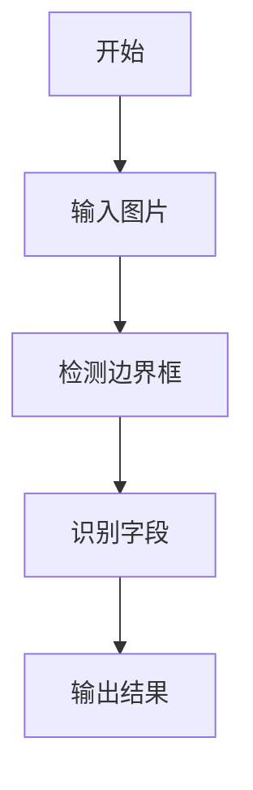
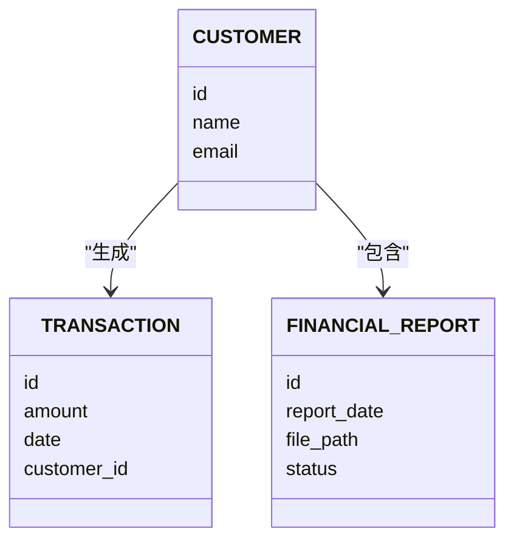
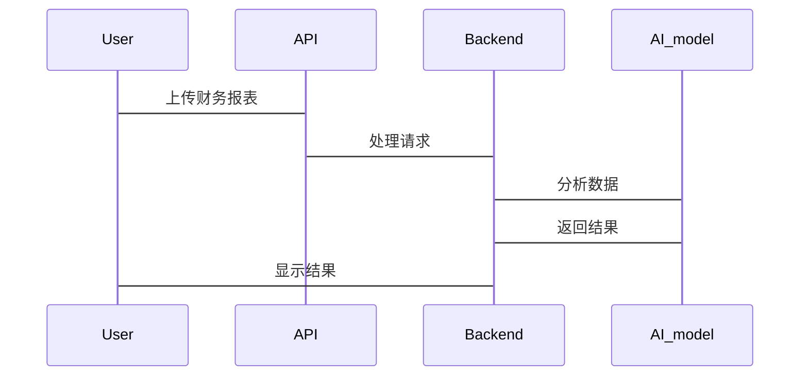

                 


# AI驱动的企业财务报表质量动态监控系统

> 关键词：AI，财务报表，动态监控，企业质量，技术实现，系统设计

> 摘要：本文探讨了如何利用人工智能技术构建企业财务报表质量动态监控系统。通过分析AI技术在财务报表监控中的应用，详细阐述了系统的设计思路、核心算法、系统架构和实际案例。文章内容涵盖了从理论到实践的各个方面，旨在为企业提供一套高效、可靠的财务报表质量监控解决方案。

---

## 第一章：AI驱动的财务报表监控系统背景

### 1.1 问题背景

#### 1.1.1 财务报表质量的重要性
财务报表是企业经济活动的重要记录，是投资者、债权人和管理层决策的关键依据。确保财务报表的准确性和完整性对于企业运营至关重要。

#### 1.1.2 传统财务报表监控的局限性
传统财务报表监控依赖人工审核，效率低、成本高且容易出错。随着企业规模的扩大和数据量的增加，传统方法难以应对复杂的财务问题。

#### 1.1.3 AI技术在财务领域的应用潜力
人工智能技术，尤其是自然语言处理（NLP）、计算机视觉和机器学习，能够高效处理大量数据，识别潜在问题，显著提升财务报表监控的效率和准确性。

### 1.2 问题描述

#### 1.2.1 财务报表中的常见问题
- 数据错误：如数字输入错误、格式不一致。
- 异常交易：如虚构交易、关联交易。
- 财务舞弊：如虚增收入、隐瞒债务。

#### 1.2.2 数据准确性与完整性挑战
- 数据来源多样，格式不统一，难以整合。
- 数据量大，人工处理效率低。
- 数据更新频繁，需要实时监控。

#### 1.2.3 系统需求与目标
- 实时监控财务数据，快速识别异常。
- 自动化审核，减少人工干预。
- 提供智能分析报告，辅助决策。

### 1.3 问题解决

#### 1.3.1 AI技术如何提升财务报表监控
- 使用NLP分析文本数据，识别关键词和异常。
- 通过计算机视觉技术处理图像数据，如OCR识别表格。
- 运用机器学习模型预测潜在风险，分类异常交易。

#### 1.3.2 动态监控的核心优势
- 实时性：数据输入后立即进行监控。
- 智能性：AI算法自动识别异常，减少误判。
- 可扩展性：系统可扩展到更多数据源和业务场景。

#### 1.3.3 系统设计的关键要素
- 数据采集：多种数据源的接入和处理。
- 数据预处理：清洗、转换、标准化。
- 模型训练：选择合适的算法，训练分类和回归模型。
- 系统部署：构建实时监控平台，提供可视化界面。

### 1.4 边界与外延

#### 1.4.1 系统功能的边界
- 仅监控财务报表数据，不涉及业务处理。
- 不处理原始数据，仅分析现有数据。

#### 1.4.2 外延与扩展的可能性
- 扩展到其他业务数据监控，如销售数据、库存管理。
- 集成更多AI技术，如深度学习、强化学习。

#### 1.4.3 系统与其他系统的交互
- 与企业ERP系统集成，获取实时数据。
- 与财务管理系统对接，提供分析结果。

### 1.5 核心概念与要素

#### 1.5.1 AI技术的核心要素
- 数据：高质量的财务数据是模型训练的基础。
- 算法：选择合适的算法，如随机森林、神经网络。
- 计算能力：高性能计算支持模型训练和推理。

#### 1.5.2 财务报表的结构
- 财务报表的组成：资产负债表、利润表、现金流量表。
- 关键字段：收入、成本、利润、现金流。

#### 1.5.3 动态监控的核心要素
- 实时性：数据输入后立即处理。
- 智能性：AI算法自动识别异常。
- 可视化：用户友好的监控界面。

---

## 第二章：核心概念与联系

### 2.1 AI技术在财务监控中的原理

#### 2.1.1 自然语言处理（NLP）
- 用于分析财务报告中的文本数据，识别关键词和异常。
- 使用BERT模型进行文本分类，判断财务报告的合规性。

#### 2.1.2 计算机视觉（Computer Vision）
- 用于处理图像数据，如OCR识别财务表格。
- 使用目标检测算法识别表格结构。

#### 2.1.3 机器学习（Machine Learning）
- 使用监督学习训练分类模型，识别异常交易。
- 使用无监督学习发现数据中的潜在关联。

### 2.2 核心技术对比

| 技术领域 | 自然语言处理 | 计算机视觉 | 机器学习 |
|----------|--------------|------------|----------|
| 主要任务 | 分析文本数据 | 处理图像数据 | 分类预测 |
| 典型算法 | BERT, LSTM | CNN, YOLO | Random Forest, SVM |
| 应用场景 | 文本分类，关键词提取 | 图像识别，表格结构识别 | 异常检测，风险预测 |

### 2.3 ER实体关系图

```mermaid
erDiagram
    customer[CUSTOMER] {
        id : integer
        name : string
        email : string
    }
    transaction[TRANSACTION] {
        id : integer
        amount : float
        date : date
        customer_id : integer
    }
    financial_report[FINANCIAL_REPORT] {
        id : integer
        report_date : date
        file_path : string
        status : string
    }
    CUSTOMER --|> TRANSACTION : "生成"
    CUSTOMER --|> FINANCIAL_REPORT : "包含"
```

---

## 第三章：算法原理讲解

### 3.1 自然语言处理（NLP）算法

#### 3.1.1 BERT模型
- 使用双向Transformer结构，处理上下文信息。
- 代码示例：
  ```python
  from transformers import BertTokenizer, BertModel
  tokenizer = BertTokenizer.from_pretrained('bert-base-uncased')
  model = BertModel.from_pretrained('bert-base-uncased')
  inputs = tokenizer("财务报表分析", return_tensors="pt")
  outputs = model(**inputs)
  print(outputs.last_hidden_state)
  ```

#### 3.1.2 数学模型
- BERT模型的数学表达式：
  $$ H = f(B, \theta) $$
  其中，\( B \) 是输入的BERT编码，\( \theta \) 是模型参数。

### 3.2 计算机视觉算法

#### 3.2.1 目标检测
- 使用YOLO算法检测财务表格中的关键字段。
- 代码示例：
  ```python
  import cv2
  def detect_tables(image_path):
      # 加载预训练模型
      net = cv2.dnn.readNet("yolov4-tiny.cfg", "yolov4-tiny.weights")
      # 处理图片
      image = cv2.imread(image_path)
      # ...
  ```

#### 3.2.2 模型流程图


### 3.3 时间序列分析

#### 3.3.1 ARIMA模型
- 用于预测财务数据的趋势。
- 代码示例：
  ```python
  from statsmodels.tsa.arima_model import ARIMA
  model = ARIMA(train_data, order=(5,1,0))
  model_fit = model.fit(disp=0)
  ```

#### 3.3.2 数学模型
- ARIMA模型的数学表达式：
  $$ y_t = \phi_1 y_{t-1} + \epsilon_t $$

---

## 第四章：系统分析与架构设计

### 4.1 应用场景

#### 4.1.1 实时监控
- 实时处理财务数据，立即识别异常。

#### 4.1.2 异常检测
- 通过AI算法发现潜在的财务问题。

### 4.2 系统功能设计

#### 4.2.1 领域模型


### 4.3 系统架构设计

#### 4.3.1 架构图


### 4.4 接口设计

#### 4.4.1 API接口
- RESTful API，提供数据上传和查询接口。

#### 4.4.2 交互流程图


---

## 第五章：项目实战

### 5.1 环境安装

#### 5.1.1 安装Python和相关库
- 使用pip安装必要的库，如`transformers`, `tensorflow`, `statsmodels`。

### 5.2 核心代码实现

#### 5.2.1 自然语言处理部分
```python
from transformers import BertTokenizer, BertModel
tokenizer = BertTokenizer.from_pretrained('bert-base-uncased')
model = BertModel.from_pretrained('bert-base-uncased')
```

#### 5.2.2 计算机视觉部分
```python
import cv2
def detect_tables(image_path):
    net = cv2.dnn.readNet("yolov4-tiny.cfg", "yolov4-tiny.weights")
    # 处理图片
    image = cv2.imread(image_path)
    # ...
```

### 5.3 案例分析

#### 5.3.1 中型企业财务报表监控系统
- 实施步骤：数据采集、预处理、模型训练、系统部署。

#### 5.3.2 系统优缺点
- 优点：高效、智能、准确。
- 缺点：初期成本高，需要大量数据训练。

---

## 第六章：最佳实践

### 6.1 经验与技巧

#### 6.1.1 数据处理
- 数据清洗、去重、标准化。

#### 6.1.2 模型调优
- 调整超参数，优化模型性能。

#### 6.1.3 系统维护
- 定期更新模型，维护数据源。

### 6.2 小结
本文详细介绍了AI驱动的企业财务报表质量动态监控系统的设计与实现，从理论到实践，为读者提供了一套完整的解决方案。

### 6.3 注意事项
- 数据安全：确保财务数据的安全性。
- 模型更新：定期更新模型，适应业务变化。

### 6.4 拓展阅读
- 推荐阅读相关书籍和论文，深入学习AI技术在财务领域的应用。

---

## 第七章：总结

### 7.1 致谢
感谢读者的耐心阅读，感谢所有在AI领域研究的先驱者。

### 7.2 附录
- 参考文献
- 代码示例

---

通过以上章节的详细讲解，读者可以系统地了解AI在企业财务报表监控中的应用，并能够实际操作构建一个动态监控系统。

