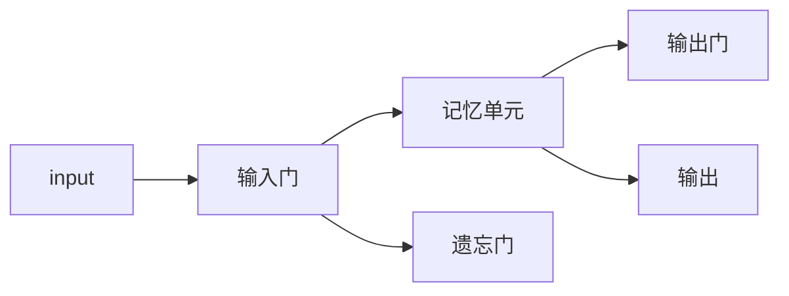

                 


# AI驱动的企业财务舞弊模式演化预测系统

## 关键词
AI技术，财务舞弊，模式演化，预测系统，深度学习，时间序列分析

## 摘要
随着企业财务舞弊手段的不断进化，传统的财务舞弊检测方法已经难以应对复杂的舞弊模式。本文提出了一种基于AI的财务舞弊模式演化预测系统，利用时间序列分析、深度学习和集成学习等技术，对财务舞弊模式进行预测和演化分析。本文详细探讨了系统的构建过程，包括数据预处理、特征提取、模型训练与预测，以及系统的实际应用案例，为企业的财务风险管理提供了新的思路。

---

## 第一部分：引言

### 第1章：问题背景与研究意义

#### 1.1 企业财务舞弊的现状与挑战
财务舞弊是指企业通过虚构交易、虚增收入、隐瞒债务等手段， manipulate financial statements to mislead stakeholders。随着企业竞争的加剧，财务舞弊手段日益复杂，传统的基于规则的检测方法逐渐失效。

- **财务舞弊的类型**：常见的财务舞弊包括虚增收入、隐瞒费用、虚减负债等。这些舞弊行为通常通过复杂的财务操作实现，难以被传统方法检测。
- **传统检测方法的局限性**：传统方法依赖于财务报表分析和审计，但其主观性和滞后性使得检测效率低下，难以应对舞弊手段的多样化。

#### 1.2 问题描述与目标
本文提出的问题是，如何利用AI技术，预测财务舞弊模式的演化趋势。目标包括：
- 建立一个能够实时监测财务数据的系统。
- 预测舞弊模式的演化方向，提前采取防范措施。

#### 1.3 研究意义与创新点
- **理论意义**：本文提出了一种结合时间序列分析和深度学习的混合模型，为财务舞弊预测提供了新的理论框架。
- **实际应用价值**：该系统能够帮助企业在财务舞弊发生前采取措施，降低财务风险。
- **创新点**：首次将模式演化预测应用于财务舞弊检测，结合多种AI技术，提高检测的准确性和及时性。

---

## 第二部分：核心概念与理论基础

### 第2章：AI驱动的财务舞弊模式演化预测系统

#### 2.1 核心概念解析
- **财务舞弊模式**：指企业在财务报表中采用的舞弊手段和策略。模式具有动态性，会随着时间推移而变化。
- **模式演化**：指舞弊模式随时间的推移而发生的变化，可能是量变也可能是质变。

| 概念 | 定义 | 特征 |
|------|------|------|
| 财务舞弊模式 | 舞弊手段和策略 | 动态性、隐蔽性、多样性 |
| 模式演化 | 舞弊模式的变化 | 时间依赖性、复杂性 |

- **实体关系图**：展示了系统中各个实体及其关系。例如，财务数据与舞弊模式的关系。

```mermaid
erDiagram
    customer[企业] {
        id
        name
        financial_data
    }
    fraud_mode[舞弊模式] {
        id
        mode_type
        evolution Trend
    }
    transaction[财务数据] {
        id
        date
        value
        fraud_flag
    }
    customer -> transaction : 提供
    fraud_mode -> transaction : 关联
```

---

## 第三部分：算法原理与数学模型

### 第3章：时间序列分析与模式识别

#### 3.1 时间序列分析基础
时间序列分析是研究数据随时间变化的模式，常用于预测未来趋势。

- **ARIMA模型**：一个广泛应用于时间序列预测的模型，由自回归（AR）、差分（I）和移动平均（MA）部分组成。

$$ ARIMA(p, d, q) $$
其中：
- $p$：自回归阶数
- $d$：差分阶数
- $q$：移动平均阶数

- **LSTM网络结构**：LSTM是一种特殊的RNN，用于处理长序列数据，适合时间序列预测。



$$ LSTM的输出为：h_t = \sigma(gate_c) \cdot h_{t-1} $$
其中，$\sigma$为sigmoid函数。

---

## 第四部分：系统设计与实现

### 第4章：系统架构设计

#### 4.1 系统功能模块设计
系统主要包括以下几个模块：

- **数据采集模块**：负责收集企业的财务数据，包括收入、支出、利润等。
- **特征提取模块**：从财务数据中提取特征，如波动率、趋势变化等。
- **模型训练与预测模块**：利用训练好的模型进行预测。
- **结果可视化模块**：将预测结果以图表形式展示。

- **系统架构图**：


---

## 第五部分：项目实战与案例分析

### 第5章：环境搭建与核心实现

#### 5.1 环境搭建
- 需要安装Python、TensorFlow、Keras等库。

```bash
pip install numpy pandas tensorflow matplotlib
```

#### 5.2 核心实现
- 数据预处理：

```python
import pandas as pd
import numpy as np

# 加载数据
data = pd.read_csv('financial_data.csv')

# 数据清洗
data.dropna()
data = data.replace([np.inf, -np.inf], np.nan).dropna()
```

- 特征工程：

```python
from sklearn.preprocessing import StandardScaler

scaler = StandardScaler()
features = data[['revenue', 'expenses', 'profit']]
scaled_features = scaler.fit_transform(features)
```

- 模型实现：

```python
from tensorflow.keras import layers

model = tf.keras.Sequential([
    layers.LSTM(50, return_sequences=True),
    layers.LSTM(50),
    layers.Dense(1)
])

model.compile(optimizer='adam', loss='mse')
```

- 训练与预测：

```python
model.fit(X_train, y_train, epochs=50, batch_size=32)
predictions = model.predict(X_test)
```

---

## 总结与展望

本文提出了一个基于AI的财务舞弊模式演化预测系统，通过时间序列分析、深度学习和集成学习等技术，实现了对财务舞弊模式的预测和演化分析。系统的构建为企业的财务风险管理提供了新的思路，具有重要的理论意义和实际应用价值。

**最佳实践 tips**：
- 数据质量至关重要，需进行充分的预处理。
- 模型调优是关键，建议尝试不同的超参数。
- 系统部署时，需考虑数据隐私和安全性。

希望本文能为企业在财务风险管理方面的探索提供有益的参考和启示。

