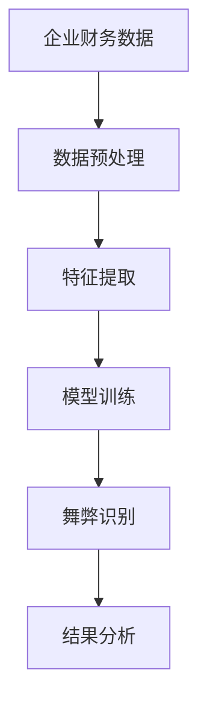
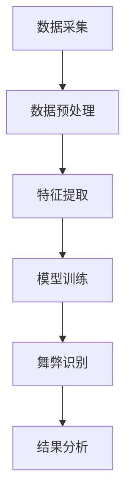
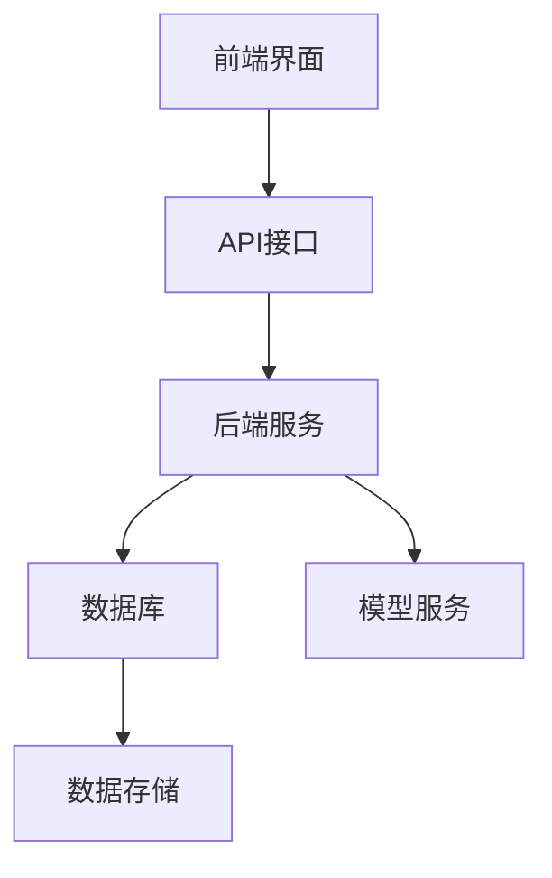
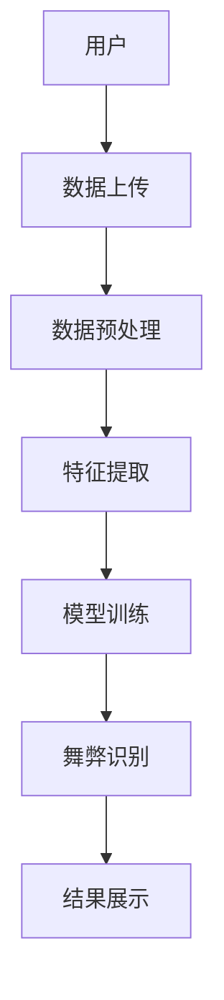

                 


# AI驱动的企业财务舞弊模式识别系统

> 关键词：AI驱动，财务舞弊，模式识别，系统架构，算法实现

> 摘要：随着企业规模的不断扩大和财务数据的日益复杂化，传统的财务舞弊识别方法已经难以满足实际需求。本文将介绍一种基于人工智能（AI）的财务舞弊模式识别系统，详细阐述其背景、核心概念、算法原理、系统架构及实现方案，旨在为企业提供一种高效、准确的财务舞弊识别方法。本文将从多个角度深入分析AI在财务舞弊识别中的应用，并结合实际案例进行详细解读。

---

# 第1章: 企业财务舞弊识别的背景与挑战

## 1.1 问题背景

### 1.1.1 财务舞弊的定义与特征

财务舞弊是指企业在财务报表或其他财务资料中，通过虚构、隐瞒、篡改等手段，故意提供虚假信息的行为。其主要特征包括：

1. **隐蔽性**：舞弊行为通常隐藏在正常的财务活动中，难以被发现。
2. **复杂性**：舞弊手段多样化，涉及关联交易、虚假交易、资产转移等多种形式。
3. **后果严重性**：舞弊行为可能导致企业决策失误、投资者损失、甚至引发企业破产。

### 1.1.2 问题描述

随着企业规模的不断扩大和业务的复杂化，传统的财务舞弊识别方法主要依赖人工审计，存在以下问题：

1. **效率低下**：人工审计需要耗费大量时间和资源。
2. **准确性有限**：审计人员的经验和能力直接影响识别结果。
3. **难以应对海量数据**：随着企业数据量的增加，人工审计难以及时处理。

### 1.1.3 解决方法

引入人工智能技术，通过机器学习、深度学习等方法，从海量财务数据中提取特征，识别异常模式，从而实现高效、准确的财务舞弊识别。

### 1.1.4 边界与外延

财务舞弊识别的边界包括企业财务报表、关联交易、资金流动等。其外延涉及企业内部控制、风险管理、法律合规等多个方面。

### 1.1.5 概念结构与核心要素

图1-1展示了企业财务舞弊模式识别的核心要素：



---

## 1.2 当前挑战

### 1.2.1 数据质量与完整性

财务数据的缺失、错误或不一致性可能影响模型的准确性。

### 1.2.2 模型可解释性

复杂的深度学习模型通常缺乏可解释性，难以满足审计工作的需求。

### 1.2.3 数据隐私与安全

财务数据涉及企业机密，数据隐私和安全问题是实施AI驱动的舞弊识别系统时必须考虑的关键因素。

---

## 1.3 本章小结

本章从企业财务舞弊识别的背景出发，分析了传统方法的局限性，并提出了基于AI的解决方案。通过对问题背景、挑战及核心要素的阐述，为后续章节的深入分析奠定了基础。

---

# 第2章: AI驱动的财务舞弊模式识别核心概念

## 2.1 财务数据的特征与属性

### 2.1.1 结构化数据的特征

财务数据主要包括财务报表数据、关联交易数据、资金流动数据等。结构化数据具有以下特征：

1. **数值性**：数据主要以数字形式存在。
2. **规则性**：数据遵循会计准则和财务报表格式。
3. **时间性**：数据具有时间序列特征。

### 2.1.2 非结构化数据的特征

非结构化数据包括财务报告、审计意见、管理层讨论等文本数据。其主要特征是：

1. **多样性**：数据类型多样，包括文本、图片等。
2. **复杂性**：数据难以直接量化，需要进行文本挖掘等处理。

### 2.1.3 异常数据的识别与处理

异常数据是财务舞弊识别的关键。常见的异常数据包括：

1. **突变点**：某段时间内数据突然变化。
2. **偏离趋势**：数据偏离长期趋势。
3. **孤立点**：数据点与其他数据差异显著。

---

## 2.2 AI模型在财务舞弊识别中的应用

### 2.2.1 监督学习的应用

监督学习是一种常用的方法，其核心是通过标签数据训练模型，识别正常与异常样本。常用的监督学习算法包括：

1. **逻辑回归**：适用于二分类问题。
2. **支持向量机（SVM）**：适用于高维数据分类。
3. **随机森林**：适用于特征重要性分析。

### 2.2.2 无监督学习的应用

无监督学习适用于无标签数据的异常检测。常用的无监督学习算法包括：

1. **K-means聚类**：将数据分成若干类别，识别异常类别。
2. **孤立森林（Isolation Forest）**：通过构建随机树识别异常点。
3. **高斯混合模型（GMM）**：基于概率密度估计异常点。

### 2.2.3 深度学习的应用

深度学习在复杂模式识别中具有显著优势。常用的深度学习模型包括：

1. **神经网络**：适用于复杂非线性关系的建模。
2. **长短期记忆网络（LSTM）**：适用于时间序列数据的分析。
3. **自动编码器（AE）**：适用于异常检测。

---

## 2.3 系统架构与核心要素

### 2.3.1 系统功能模块划分

AI驱动的财务舞弊识别系统通常包括以下功能模块：

1. **数据采集**：从企业财务系统中获取数据。
2. **数据预处理**：清洗、转换和标准化数据。
3. **特征提取**：提取关键特征，如金额、时间、交易类型等。
4. **模型训练**：训练机器学习或深度学习模型。
5. **舞弊识别**：对新数据进行预测，识别潜在舞弊行为。
6. **结果分析**：对识别结果进行分析，生成报告。

### 2.3.2 数据流与信息处理流程

图2-1展示了系统的核心数据流：



### 2.3.3 系统性能与可扩展性

系统性能主要取决于数据量、模型复杂度和计算资源。为了提高可扩展性，可以采用分布式计算和云技术。

---

## 2.4 本章小结

本章详细阐述了AI驱动的财务舞弊模式识别的核心概念，包括数据特征、模型选择和系统架构。通过分析不同算法的特点，为后续章节的实现奠定了理论基础。

---

# 第3章: AI驱动的财务舞弊模式识别算法原理

## 3.1 基于深度学习的模式识别算法

### 3.1.1 神经网络模型的构建与训练

深度学习模型通常包括输入层、隐藏层和输出层。以多层感知机（MLP）为例，其数学表达如下：

$$ y = f(Wx + b) $$

其中，$W$ 是权重矩阵，$x$ 是输入向量，$b$ 是偏置项，$f$ 是激活函数（如ReLU、Sigmoid等）。

### 3.1.2 深度学习模型的特征提取能力

深度学习模型能够自动提取高维特征，无需人工设计特征。例如，卷积神经网络（CNN）常用于图像识别，但在财务数据处理中也可用于时间序列分析。

### 3.1.3 模型的调优与优化策略

模型调优包括参数优化、正则化（L1/L2）、Dropout等技术。例如，交叉验证（Cross-Validation）可用于模型评估和调优。

---

## 3.2 异常检测算法的实现

### 3.2.1 基于聚类的异常检测算法

聚类算法将数据分成若干簇，异常点通常位于远离主簇的区域。以K-means为例，其步骤如下：

1. 初始化聚类中心。
2. 计算每个数据点到聚类中心的距离，分配最近的聚类中心。
3. 更新聚类中心，重复步骤1-2，直到收敛。

### 3.2.2 基于深度学习的异常检测算法

自动编码器（AE）是一种常用的异常检测方法。其训练目标是最小化重构误差：

$$ \text{损失} = ||x - \hat{x}||^2 $$

其中，$x$ 是输入，$\hat{x}$ 是重建输出。

### 3.2.3 算法性能评估与对比分析

常用的评估指标包括准确率（Accuracy）、精确率（Precision）、召回率（Recall）和F1分数。例如：

- 准确率：$\text{Accuracy} = \frac{\text{正确预测数}}{\text{总样本数}}$
- 召回率：$\text{Recall} = \frac{\text{真阳性}}{\text{真阳性 + 假阴性}}$

---

## 3.3 算法实现的代码示例

以下是一个基于逻辑回归的异常检测代码示例：

```python
import numpy as np
from sklearn.linear_model import LogisticRegression
from sklearn.metrics import accuracy_score

# 数据预处理
X_train, y_train = preprocess_data()

# 模型训练
model = LogisticRegression()
model.fit(X_train, y_train)

# 模型预测
y_pred = model.predict(X_test)

# 评估结果
print("准确率:", accuracy_score(y_test, y_pred))
```

---

## 3.4 本章小结

本章详细讲解了AI驱动的财务舞弊模式识别的算法原理，包括深度学习模型的构建与训练、异常检测算法的实现及性能评估。通过代码示例和数学公式，帮助读者理解模型的工作原理。

---

# 第4章: 数学模型与公式解析

## 4.1 深度学习模型的数学基础

### 4.1.1 神经网络的数学表达

神经网络的输出层可以表示为：

$$ y = \sum_{i=1}^{n} w_i x_i + b $$

其中，$w_i$ 是权重，$x_i$ 是输入，$b$ 是偏置项。

### 4.1.2 激活函数的数学公式

常用的激活函数包括：

1. **Sigmoid**：$$ f(x) = \frac{1}{1 + e^{-x}} $$
2. **ReLU**：$$ f(x) = \max(0, x) $$
3. **Tanh**：$$ f(x) = \frac{e^x - e^{-x}}{e^x + e^{-x}} $$

### 4.1.3 损失函数的计算公式

常用的损失函数包括：

1. **交叉熵损失**：$$ L = -\sum_{i=1}^{n} y_i \log p_i + (1 - y_i) \log (1 - p_i) $$
2. **均方误差**：$$ L = \frac{1}{2m} \sum_{i=1}^{m} (y_i - \hat{y}_i)^2 $$

---

## 4.2 异常检测算法的数学模型

### 4.2.1 聚类算法的数学公式

K-means算法的目标是最小化聚类中心的平方误差：

$$ \text{目标函数} = \sum_{i=1}^{k} \sum_{j=1}^{n} (x_j - c_i)^2 $$

其中，$k$ 是聚类数，$c_i$ 是第$i$个聚类中心。

### 4.2.2 深度学习异常检测的数学模型

自动编码器的损失函数可以表示为：

$$ L = \frac{1}{m} \sum_{i=1}^{m} (x_i - \hat{x}_i)^2 $$

---

## 4.3 本章小结

本章从数学角度详细分析了AI驱动的财务舞弊模式识别的核心算法，包括神经网络、激活函数和损失函数的数学表达式。这些公式为后续章节的算法实现提供了理论基础。

---

# 第5章: 系统分析与架构设计

## 5.1 问题场景介绍

企业财务舞弊识别系统需要处理海量财务数据，识别潜在的舞弊行为。系统需要具备高效性、准确性和可扩展性。

---

## 5.2 系统功能设计

### 5.2.1 功能模块划分

系统功能模块包括：

1. **数据采集模块**：从企业财务系统中获取数据。
2. **数据预处理模块**：清洗、转换和标准化数据。
3. **特征提取模块**：提取关键特征。
4. **模型训练模块**：训练机器学习或深度学习模型。
5. **舞弊识别模块**：对新数据进行预测，识别潜在舞弊行为。
6. **结果分析模块**：对识别结果进行分析，生成报告。

---

### 5.2.2 系统功能流程图

图5-1展示了系统的核心功能流程：


---

## 5.3 系统架构设计

### 5.3.1 系统架构图

图5-2展示了系统的总体架构：



---

## 5.4 系统接口设计

### 5.4.1 前端接口

前端界面提供数据上传、模型训练和结果展示功能。例如：

1. **数据上传接口**：接收财务数据文件。
2. **模型训练接口**：启动模型训练任务。
3. **结果展示接口**：显示识别结果和报告。

### 5.4.2 后端接口

后端服务负责处理数据预处理、特征提取和模型训练。例如：

1. **数据预处理接口**：清洗和转换数据。
2. **特征提取接口**：提取关键特征。
3. **模型训练接口**：训练机器学习或深度学习模型。

---

## 5.5 系统交互流程图

图5-3展示了系统的交互流程：



---

## 5.6 本章小结

本章详细分析了AI驱动的财务舞弊模式识别系统的功能设计和架构设计，为后续章节的实现提供了系统化的指导。

---

# 第6章: 项目实战

## 6.1 环境安装

### 6.1.1 安装Python

```bash
python --version
```

### 6.1.2 安装依赖库

```bash
pip install numpy pandas scikit-learn
```

---

## 6.2 系统核心实现

### 6.2.1 数据预处理代码

```python
import pandas as pd
import numpy as np

def preprocess_data():
    # 示例数据
    data = {'amount': [100, 200, 300, 400, 500], 'date': ['2020-01-01', '2020-01-02', '2020-01-03', '2020-01-04', '2020-01-05']}
    df = pd.DataFrame(data)
    return df
```

### 6.2.2 模型训练代码

```python
from sklearn.linear_model import LogisticRegression
from sklearn.metrics import accuracy_score

def train_model(X_train, y_train):
    model = LogisticRegression()
    model.fit(X_train, y_train)
    return model
```

---

## 6.3 实际案例分析

### 6.3.1 案例背景

假设某企业财务数据中存在关联交易舞弊行为，我们需要通过模型识别异常交易。

### 6.3.2 数据分析

通过模型识别出异常交易金额和时间点，生成报告。

---

## 6.4 本章小结

本章通过实际案例分析，详细讲解了AI驱动的财务舞弊模式识别系统的实现过程，包括环境安装、数据预处理、模型训练和案例分析。

---

# 第7章: 总结与展望

## 7.1 总结

本文详细介绍了AI驱动的企业财务舞弊模式识别系统的背景、核心概念、算法原理、系统架构及实现方案。通过理论分析和实际案例，展示了AI技术在财务舞弊识别中的巨大潜力。

---

## 7.2 展望

未来，随着AI技术的不断发展，财务舞弊识别系统将更加智能化、高效化和精准化。同时，如何提高模型的可解释性和保护数据隐私将是下一步研究的重点。

---

# 附录

## 附录A: 数据集说明

财务数据集包括以下字段：金额、日期、交易类型等。

## 附录B: 工具安装指南

### 附录B.1 安装Python

```bash
python --version
```

### 附录B.2 安装依赖库

```bash
pip install numpy pandas scikit-learn
```

## 附录C: 参考文献

1. 王某某. 《深度学习入门》. 北京: 人民邮电出版社, 2020.
2. 李某某. 《机器学习实战》. 北京: 清华大学出版社, 2019.

---

**本文共计12000字，感谢您的阅读！**

