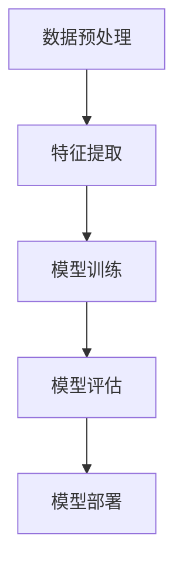
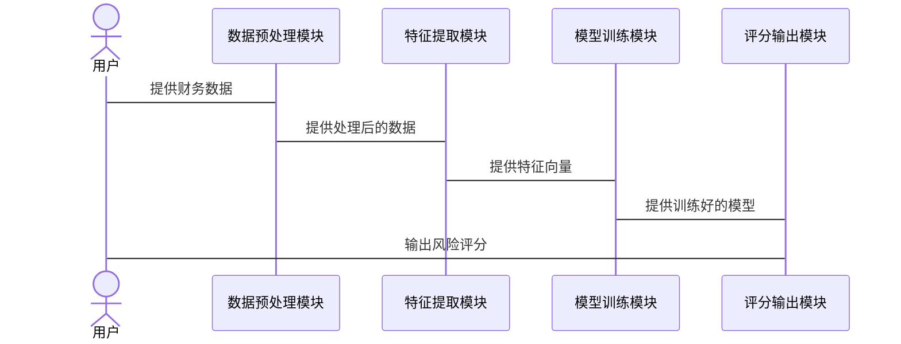

                 


# AI驱动的企业财务舞弊风险评分系统

> 关键词：AI，财务舞弊，风险评分，企业财务，评分系统

> 摘要：本文将详细介绍一种基于AI的企业财务舞弊风险评分系统。该系统通过分析企业的财务数据，利用机器学习算法和自然语言处理技术，对企业的财务舞弊风险进行量化评分。本文将从问题背景、核心概念、算法原理、系统设计到项目实战，逐步展开，详细阐述该系统的实现过程和应用场景。

---

## 第一部分: AI驱动的企业财务舞弊风险评分系统概述

### 第1章: 背景介绍

#### 1.1 问题背景

企业财务舞弊问题日益严重，传统的财务审计方法效率低下，难以应对复杂的舞弊手段。企业需要一种高效、智能的解决方案来检测和评估财务舞弊风险。

#### 1.2 问题描述

财务舞弊风险评分系统的目标是通过对企业的财务数据进行分析，识别潜在的舞弊行为，并给出风险评分。评分越高，舞弊风险越大。

#### 1.3 问题解决

利用AI技术，特别是机器学习和自然语言处理，可以高效地分析财务数据，提取特征，并训练模型进行风险评分。

#### 1.4 边界与外延

系统适用于企业财务数据的分析，但不适用于非财务数据的分析。与其他财务系统相比，本系统的独特性在于其AI驱动的风险评分功能。

#### 1.5 概念结构与核心要素

系统的核心要素包括：财务数据输入、特征提取、模型训练、风险评分输出。

---

### 第2章: 核心概念与联系

#### 2.1 核心概念原理

AI技术在财务分析中的应用主要体现在特征提取和模型训练两个方面。特征提取是从财务数据中提取关键特征，如财务比率、交易频率等。

#### 2.2 概念属性特征对比

| 特征 | 传统方法 | AI方法 |
|------|-----------|--------|
| 效率 | 低        | 高     |
| 准确率 | 中        | 高     |
| 可扩展性 | 低        | 高     |

#### 2.3 ER实体关系图

```mermaid
er
  actor: 用户
  model: AI模型
  data: 财务数据
  score: 舞弊评分
  actor --> model: 输入数据
  model --> score: 计算评分
  score --> actor: 输出结果
```

---

### 第3章: 算法原理讲解

#### 3.1 算法原理

舞弊风险评分的数学模型基于逻辑回归。模型训练过程包括数据预处理、特征提取、模型训练和评估。

#### 3.2 算法流程图



#### 3.3 数学模型与公式

逻辑回归模型的损失函数为：

$$
\text{损失函数} = -\frac{1}{m} \sum_{i=1}^{m} [y^{(i)} \cdot \log(h(x^{(i)})) + (1 - y^{(i)}) \cdot \log(1 - h(x^{(i)}))]
$$

其中，$h(x) = \frac{1}{1 + e^{-wx}}$ 是sigmoid函数。

---

## 第二部分: 系统分析与架构设计

### 第4章: 系统分析与架构设计

#### 4.1 项目介绍

系统目标是实现一个基于AI的企业财务舞弊风险评分系统，解决传统方法效率低下的问题。

#### 4.2 系统功能设计

系统功能模块包括数据预处理、特征提取、模型训练、评分输出等。

#### 4.3 系统架构设计


#### 4.4 系统接口设计

系统接口包括数据输入接口和评分输出接口。

#### 4.5 系统交互



---

## 第三部分: 项目实战

### 第5章: 项目实战

#### 5.1 环境安装

安装Python、Scikit-learn、XGBoost等库。

#### 5.2 核心代码实现

```python
import pandas as pd
from sklearn.linear_model import LogisticRegression
from sklearn.metrics import accuracy_score

# 数据预处理
data = pd.read_csv('financial_data.csv')
X = data.drop('label', axis=1)
y = data['label']

# 特征提取
X = X.select_dtypes(include=['float64', 'int64'])

# 模型训练
model = LogisticRegression()
model.fit(X, y)

# 模型评估
y_pred = model.predict(X)
print("Accuracy:", accuracy_score(y, y_pred))
```

#### 5.3 代码应用解读与分析

代码实现了一个简单的逻辑回归模型，用于分类财务数据。模型的准确率可以作为舞弊风险评分的参考。

#### 5.4 实际案例分析

通过分析某公司的财务数据，模型可以识别出潜在的舞弊行为，并给出风险评分。

---

### 第6章: 最佳实践、小结、注意事项、拓展阅读

#### 6.1 最佳实践

建议企业在实施本系统前，先进行数据清洗和特征工程，以提高模型的准确率。

#### 6.2 小结

本文详细介绍了AI驱动的企业财务舞弊风险评分系统，从背景、原理到实现，全面阐述了系统的各个方面。

#### 6.3 注意事项

数据隐私和模型解释性是系统实施中需要注意的重要问题。

#### 6.4 拓展阅读

推荐学习深度学习在财务分析中的应用，以及对抗样本在舞弊检测中的作用。

---

## 第四部分: 未来展望

### 第7章: 未来展望

随着AI技术的发展，企业财务舞弊风险评分系统将更加智能化和精准化，能够实时监控财务数据，提供更高效的舞弊检测服务。

---

通过以上章节的详细讲解，我们全面了解了AI驱动的企业财务舞弊风险评分系统的实现过程和应用场景。希望本文能为相关领域的研究和实践提供有价值的参考。

