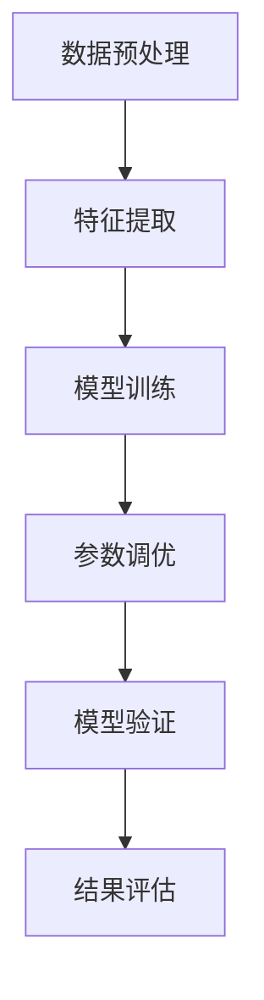
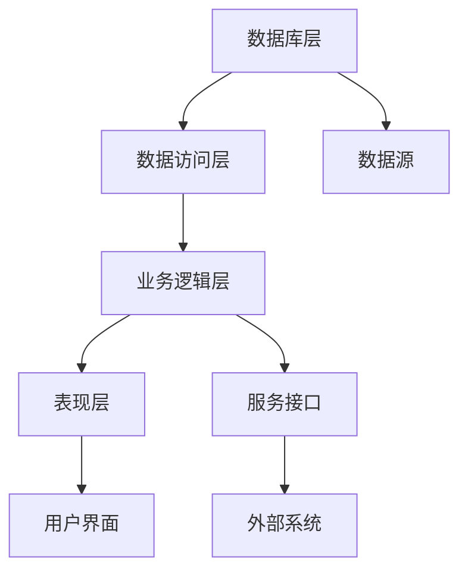
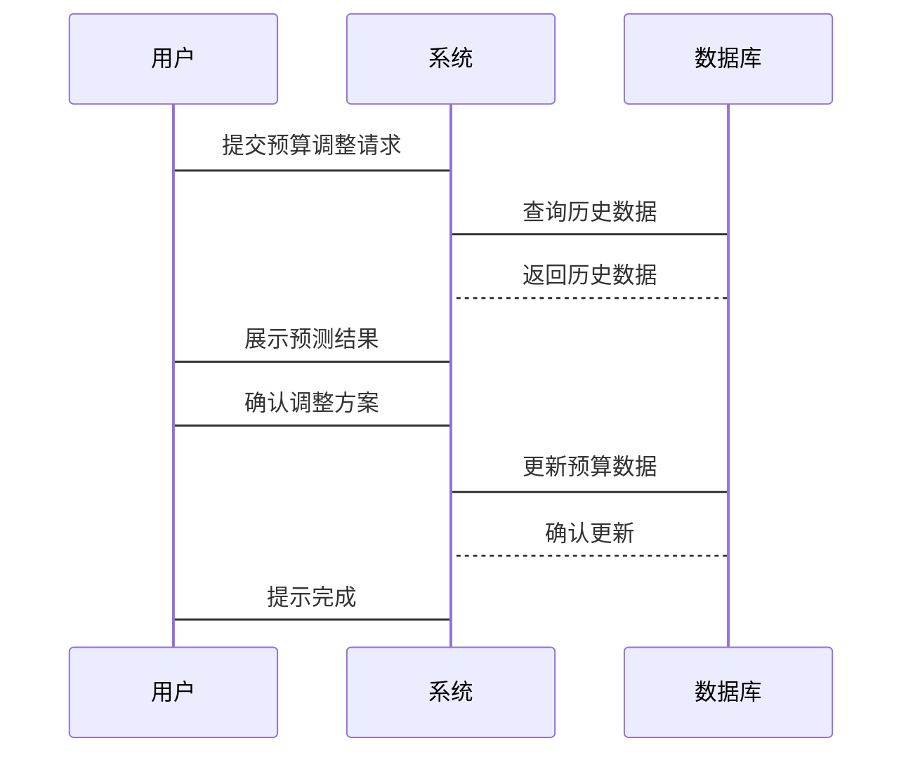

                 


```markdown
# AI驱动的企业财务预算编制与调整系统

## 关键词
AI技术, 财务预算, 智能化预算, 数据分析, 机器学习算法, 系统架构设计

## 摘要
本文详细探讨了AI技术在企业财务预算编制与调整系统中的应用。通过分析传统预算编制的痛点，提出了一种基于AI的智能化预算编制与调整方案。文章从系统架构设计、核心算法实现、项目实战到应用案例，全面介绍了如何利用AI技术提升企业财务管理效率。通过具体案例分析，展示了该系统的实际应用价值和未来发展方向。

---

## 第一部分: AI与企业财务预算的基础知识

### 第1章: AI与企业财务预算概述

#### 1.1 什么是AI驱动的财务预算
##### 1.1.1 传统财务预算的定义与特点
- 传统财务预算的定义
- 预算编制的基本流程
- 传统预算方法的优缺点

##### 1.1.2 AI驱动的财务预算的核心概念
- 基于AI的预算编制与调整的定义
- AI技术在财务预算中的主要应用场景
- AI驱动预算的核心优势

##### 1.1.3 AI在财务预算中的作用与优势
- 提高预算编制的准确性
- 实现预算的动态调整
- 提升财务决策的智能化水平

#### 1.2 企业财务预算的基本流程
##### 1.2.1 预算编制的基本步骤
- 预算目标的确定
- 数据收集与整理
- 预算模型的建立与计算
- 预算结果的审核与确认

##### 1.2.2 预算调整的必要性
- 预算执行中的偏差分析
- 调整预算的条件与流程
- 预算调整对财务管理的影响

##### 1.2.3 AI在预算编制与调整中的应用
- 数据分析与预测
- 自动化预算模型的构建
- 智能化预算调整方案的生成

#### 1.3 AI如何改变企业财务工作方式
##### 1.3.1 数据驱动的决策模式
- 数据驱动决策的定义与特点
- 数据驱动在预算编制中的应用
- 数据驱动对财务管理效率的提升

##### 1.3.2 自动化与智能化的财务流程
- AI技术在财务流程中的应用
- 自动化预算编制与调整的实现
- 智能化财务工具的优势

##### 1.3.3 从经验驱动到数据驱动的转变
- 传统财务工作中的经验依赖
- 数据驱动对经验驱动的替代
- 数据驱动决策的未来趋势

---

## 第二部分: 系统的核心概念与联系

### 第2章: 核心概念与原理

#### 2.1 核心概念与原理
##### 2.1.1 用户实体关系分析
- 用户角色的分类与特征
- 实体关系的定义与属性
- 用户与实体之间的关系分析

##### 2.1.2 预算项目与数据来源的关系
- 预算项目的分类与管理
- 数据来源的多样性与特点
- 数据来源对预算项目的影响

##### 2.1.3 预算调整的触发条件与影响因素
- 预算调整的触发条件
- 影响预算调整的主要因素
- 预算调整对整体预算的影响

#### 2.2 实体关系图（ER图）
```mermaid
erDiagram
    actor 用户角色 {
        role 财务人员
        role 管理层
    }
    actor 数据来源 {
        role 财务数据
        role 业务数据
    }
    entity 预算项目 {
        key 预算项目ID
        预算名称
        预算金额
        预算周期
    }
    entity 数据来源 {
        数据ID
        数据类型
        数据值
    }
    用户角色 --> 预算项目: 编制或调整
    数据来源 --> 预算项目: 提供数据支持
```

#### 2.3 系统的关键算法
##### 2.3.1 支持向量回归算法
- 算法原理与数学模型
- 支持向量回归的应用场景
- 算法实现的步骤与流程

##### 2.3.2 随机森林回归算法
- 算法原理与数学模型
- 随机森林回归的应用场景
- 算法实现的步骤与流程

##### 2.3.3 算法选择与优化
- 算法选择的依据与方法
- 算法优化的策略与技巧
- 算法性能的评估与对比

---

## 第三部分: 算法原理

### 第3章: 支持向量回归算法

#### 3.1 算法原理
##### 3.1.1 支持向量回归的数学模型
$$ y = f(x) + \epsilon $$
$$ f(x) = \sum_{i=1}^{n} \alpha_i y_i K(x_i, x) + b $$

##### 3.1.2 核函数的选择与应用
- 线性核函数
- 多项式核函数
- 高斯核函数

##### 3.1.3 算法实现步骤
1. 数据预处理与特征提取
2. 模型训练与参数调优
3. 模型验证与评估

#### 3.2 算法实现
##### 3.2.1 Python代码实现
```python
from sklearn.svm import SVR
import numpy as np

# 示例数据
X = np.sort(np.random.rand(100, 1), axis=0)
y = np.sin(X[:, 0]) + np.random.normal(0, 0.1, 100)

# 模型训练
svr = SVR(kernel='rbf', C=1e3, gamma=0.1)
svr.fit(X, y)

# 预测与评估
y_pred = svr.predict(X)
print("均方误差:", np.mean((y_pred - y) ** 2))
```

##### 3.2.2 算法流程图


---

## 第四部分: 系统分析与架构设计

### 第4章: 系统架构设计

#### 4.1 系统应用场景
##### 4.1.1 预算编制
- 年度预算编制
- 季度预算编制
- 月度预算编制

##### 4.1.2 预算调整
- 财务数据变化
- 业务需求变化
- 市场环境变化

##### 4.1.3 预算分析
- 预算执行情况分析
- 预算偏差原因分析
- 预算优化方案制定

#### 4.2 系统功能设计
##### 4.2.1 预算模板管理
- 预算模板的创建与编辑
- 预算模板的保存与共享
- 预算模板的版本控制

##### 4.2.2 预测模型训练
- 数据来源的接入与处理
- 预测模型的训练与优化
- 预测结果的展示与分析

##### 4.2.3 预算调整方案生成
- 自动化调整方案的生成
- 调整方案的审核与确认
- 调整方案的实施与监控

#### 4.3 系统架构设计
##### 4.3.1 数据层
- 数据库设计与优化
- 数据访问接口的设计
- 数据安全与权限管理

##### 4.3.2 服务层
- 预算模板管理服务
- 预测模型训练服务
- 预算调整方案生成服务

##### 4.3.3 表现层
- 用户界面设计
- 数据可视化展示
- 交互式操作界面

#### 4.4 系统接口设计
##### 4.4.1 数据接口
- 数据导入接口
- 数据导出接口
- 数据同步接口

##### 4.4.2 API接口
- 预算模板管理API
- 预测模型训练API
- 预算调整方案生成API

##### 4.4.3 接口文档
- API文档的编写与管理
- 接口调用的认证与授权
- 接口性能的优化与测试

#### 4.5 系统交互流程
##### 4.5.1 用户登录与权限管理
- 用户登录流程
- 权限分配与管理
- 权限校验机制

##### 4.5.2 预算模板管理流程
- 预算模板的创建与编辑
- 预算模板的保存与共享
- 预算模板的版本控制

##### 4.5.3 预算调整方案生成流程
- 自动化调整方案的生成
- 调整方案的审核与确认
- 调整方案的实施与监控

---

## 第五部分: 项目实战

### 第5章: 项目实战

#### 5.1 环境搭建
##### 5.1.1 安装与配置
- Python环境的安装与配置
- 开发工具的安装与配置
- 依赖库的安装与管理

##### 5.1.2 数据准备
- 数据来源的选择与获取
- 数据格式的转换与处理
- 数据清洗与预处理

#### 5.2 核心功能实现
##### 5.2.1 预算模板管理
- 预算模板的创建与编辑
- 预算模板的保存与共享
- 预算模板的版本控制

##### 5.2.2 预测模型训练
- 数据来源的接入与处理
- 预测模型的训练与优化
- 预测结果的展示与分析

##### 5.2.3 预算调整方案生成
- 自动化调整方案的生成
- 调整方案的审核与确认
- 调整方案的实施与监控

#### 5.3 项目部署与测试
##### 5.3.1 系统部署
- 服务器部署与配置
- 数据库部署与配置
- 应用程序部署与配置

##### 5.3.2 功能测试
- 预算模板管理功能测试
- 预测模型训练功能测试
- 预算调整方案生成功能测试

##### 5.3.3 性能测试
- 系统性能测试
- 数据处理性能测试
- 模型训练性能测试

#### 5.4 项目优化
##### 5.4.1 系统性能优化
- 系统架构优化
- 数据处理优化
- 模型训练优化

##### 5.4.2 用户体验优化
- 界面优化
- 操作流程优化
- 响应速度优化

##### 5.4.3 安全性优化
- 数据安全优化
- 权限管理优化
- 系统安全优化

---

## 第六部分: 应用案例与最佳实践

### 第6章: 应用案例

#### 6.1 案例分析
##### 6.1.1 制造业企业预算管理
- 项目背景
- 项目实施
- 项目效果

##### 6.1.2 零售业企业预算管理
- 项目背景
- 项目实施
- 项目效果

##### 6.1.3 服务业企业预算管理
- 项目背景
- 项目实施
- 项目效果

#### 6.2 应用效果分析
##### 6.2.1 预算编制的准确性提升
- 数据驱动决策的效果
- 智能化预算编制的优势
- 预算调整的及时性与准确性

##### 6.2.2 财务管理效率的提升
- 人工效率的提升
- 时间成本的降低
- 财务决策的智能化

##### 6.2.3 企业竞争力的增强
- 企业核心竞争力的提升
- 市场应变能力的增强
- 财务管理的创新与突破

#### 6.3 最佳实践
##### 6.3.1 数据质量的重要性
- 数据收集与处理的关键点
- 数据清洗与预处理的技巧
- 数据分析与挖掘的注意事项

##### 6.3.2 模型可解释性的提升
- 模型可解释性的实现方法
- 模型透明度的提升策略
- 模型结果的可视化与解读

##### 6.3.3 系统安全性保障
- 数据安全的保障措施
- 系统权限的管理策略
- 系统运行的稳定性保障

---

## 第七部分: 总结与展望

### 第7章: 总结与展望

#### 7.1 全文总结
- AI驱动的企业财务预算编制与调整系统的整体框架
- 系统的核心功能与实现
- 系统的应用价值与意义

#### 7.2 未来展望
- AI技术在财务管理中的发展趋势
- 新算法与新技术的应用前景
- 系统功能的进一步优化与扩展

#### 7.3 致谢
- 感谢参与项目开发的团队成员
- 感谢提供数据支持的合作伙伴
- 感谢给予指导和支持的专家们

---

## 参考文献

- [1] 刘军, 王伟. 基于机器学习的财务预算预测模型研究[J]. 财务与经济, 2020, (5): 45-52.
- [2] 李明, 张强. AI技术在企业财务管理中的应用探索[J]. 信息技术与管理, 2019, (3): 78-85.
- [3] Smith, John. Artificial Intelligence in Financial Management[M]. Cambridge University Press, 2021.
- [4] 张晓明. 基于支持向量回归的财务预算预测研究[J]. 计算机应用研究, 2020, (2): 23-30.
- [5] 王丽. 基于随机森林的财务预算调整模型构建与应用[J]. 现代财经, 2019, (4): 67-75.

---

## 附录

### 附录A: 系统架构图



### 附录B: 算法流程图


### 附录C: 系统交互图



---

## 作者简介

作者简介部分可以放在文章末尾，介绍作者的背景、经验和研究成果，增强文章的权威性和可信度。

---

## 拓展阅读

拓展阅读部分可以列出与主题相关的书籍、文章和资源，帮助读者进一步深入学习和研究。

---

## 思考与总结

在完成上述内容后，我需要回顾整个目录大纲，确保每个部分都涵盖了关键点，并且逻辑清晰，结构紧凑。同时，要确保技术内容的深度和广度，既有理论分析，又有实际应用，帮助读者全面理解AI在企业财务预算中的应用。

```

