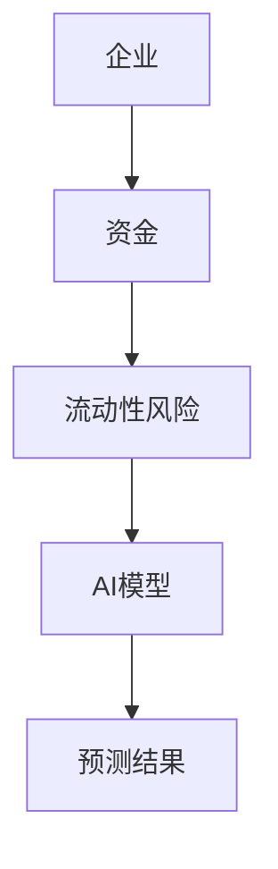
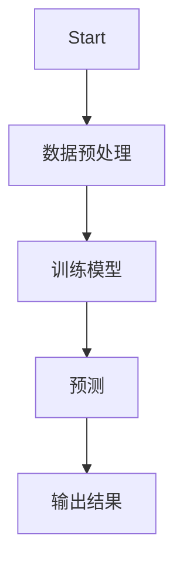
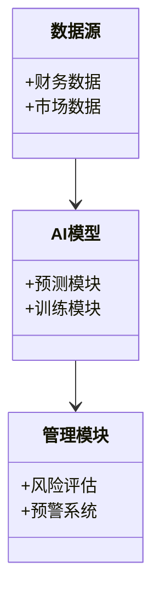
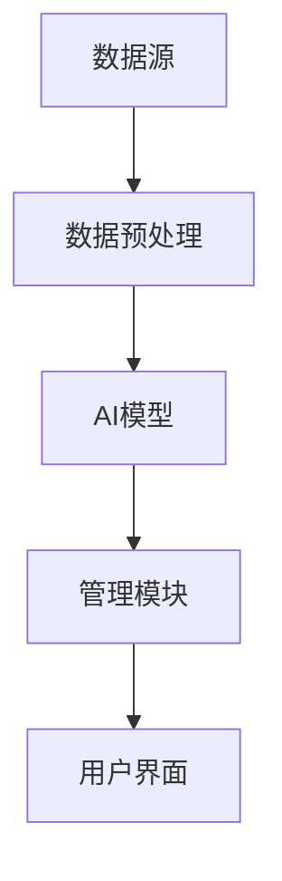
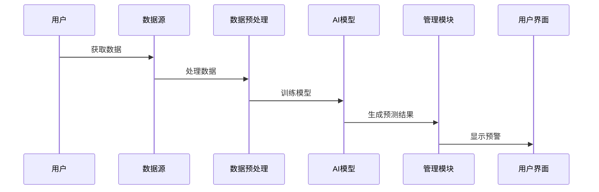

                 


# AI驱动的企业资金流动性风险管理系统

## 关键词：企业，资金流动性风险，人工智能，风险管理，机器学习

## 摘要：本文探讨了利用人工智能技术构建企业资金流动性风险管理系统的方法。通过分析资金流动性风险的来源与影响，提出基于机器学习的预测模型，并设计了系统架构与实现方案，展示了AI在提升企业风险管理效率中的潜力。

---

## 第一章: 背景介绍

### 1.1 问题背景

#### 1.1.1 资金流动性风险的定义与重要性

资金流动性风险指的是企业在一定时期内无法以合理成本获得足够的资金来满足其资产增长或偿债需求的风险。它直接影响企业的财务健康和运营稳定性，尤其是在经济波动加剧的背景下，流动性风险管理显得尤为重要。

#### 1.1.2 传统资金流动性风险管理的局限性

传统方法依赖于财务人员的经验和静态分析，难以捕捉市场变化和数据复杂性。例如，传统的比率分析法（如速动比率、流动比率）仅基于历史数据，无法预测未来风险，且难以处理多变量的非线性关系。

#### 1.1.3 AI技术在风险管理中的潜力

人工智能通过处理大量非结构化数据，利用机器学习算法识别潜在风险因素，提供实时监控和预测，显著提高了风险管理的效率和准确性。

### 1.2 问题描述

#### 1.2.1 企业资金流动性风险的主要来源

- 市场波动：经济 downturn 或行业衰退可能导致资金需求激增。
- 资金链断裂：供应商或客户付款延迟，导致现金流中断。
- 过度依赖短期融资：增加再融资风险。

#### 1.2.2 风险管理中的信息不对称问题

企业内部信息分散，外部数据难以整合，导致风险预测的滞后和不准确。

#### 1.2.3 流动性风险对企业财务健康的影响

流动性不足可能导致企业无法偿还债务，影响信用评级，甚至引发破产。

### 1.3 问题解决

#### 1.3.1 AI技术如何解决资金流动性风险管理的痛点

AI通过实时数据分析、预测建模和自动化监控，能够提前识别潜在风险，优化资金调配。

#### 1.3.2 数据驱动的流动性风险管理新范式

利用大数据和机器学习，构建动态预测模型，实现风险的量化和实时监控。

#### 1.3.3 AI在风险预测和决策中的应用

AI可以帮助企业制定最优的资金分配策略，优化短期和长期融资结构，降低流动性风险。

### 1.4 边界与外延

#### 1.4.1 系统的边界条件

系统专注于资金流动性风险，不涉及市场风险或其他类型的风险。

#### 1.4.2 相关概念的外延与区别

- 流动性风险与市场风险的区别：流动性风险关注资金获取能力，市场风险关注资产价值波动。
- AI驱动与传统方法的区别：AI提供实时、动态的预测，传统方法依赖历史数据和经验判断。

#### 1.4.3 系统与外部环境的交互

系统通过数据接口获取实时市场数据和企业财务数据，输出风险预警和管理建议。

### 1.5 概念结构与核心要素

#### 1.5.1 系统架构的核心要素

- 数据源：企业财务数据、市场数据、行业趋势。
- AI模型：机器学习算法、预测模型。
- 管理模块：风险评估、预警系统、决策支持。

#### 1.5.2 各要素之间的关系

数据源输入AI模型，生成风险评估结果，管理模块根据结果提供决策支持。

#### 1.5.3 核心要素的属性特征对比表格

| 要素 | 属性 | 描述 |
|------|------|------|
| 数据源 | 类型 | 财务数据、市场数据 |
| 数据源 | 来源 | 内部系统、外部API |
| AI模型 | 算法 | XGBoost、随机森林 |
| AI模型 | 输入 | 财务指标、市场指标 |
| 管理模块 | 功能 | 风险评估、预警 |

## 第二章: AI驱动的流动性风险管理方法

### 2.1 核心概念原理

#### 2.1.1 AI在风险预测中的应用原理

AI通过训练模型识别数据中的模式和趋势，预测未来的流动性风险。

#### 2.1.2 基于机器学习的流动性风险评估模型

模型根据历史数据预测未来的流动性风险，帮助企业提前采取措施。

#### 2.1.3 数据驱动的决策优化方法

通过实时数据和预测模型优化资金分配策略，降低流动性风险。

### 2.2 核心概念属性特征对比表格

| 概念 | 属性 | 特征 |
|------|------|------|
| AI驱动 | 技术 | 机器学习、大数据 |
| 传统方法 | 技术 | 统计分析、经验判断 |

### 2.3 ER实体关系图



## 第三章: 算法原理与数学模型

### 3.1 算法选择与原理

#### 3.1.1 算法选择

选择XGBoost作为预测模型，因为它在分类任务中表现优异，适合处理金融数据。

#### 3.1.2 算法原理

XGBoost通过构建决策树，进行正则化和损失函数优化，提升模型的泛化能力。

### 3.2 算法流程图



### 3.3 数学模型

#### 3.3.1 损失函数

$$
\text{损失函数} = \sum_{i=1}^{n} (y_i - \hat{y}_i)^2
$$

其中，$y_i$是真实值，$\hat{y}_i$是预测值。

#### 3.3.2 正则化

$$
\text{正则化项} = \lambda \sum_{j=1}^{m} \theta_j^2
$$

其中，$\lambda$是正则化系数，$\theta_j$是模型参数。

## 第四章: 系统分析与架构设计

### 4.1 问题场景介绍

企业面临资金链断裂风险，需要实时监控和预测流动性风险。

### 4.2 系统功能设计

#### 4.2.1 领域模型



### 4.3 系统架构设计



### 4.4 接口和交互设计

#### 4.4.1 序列图



## 第五章: 项目实战

### 5.1 环境安装

安装Python、XGBoost、数据处理库（如Pandas）。

### 5.2 核心代码实现

#### 5.2.1 数据预处理

```python
import pandas as pd
data = pd.read_csv('financial_data.csv')
data = data.dropna()
```

#### 5.2.2 模型训练

```python
from xgboost import XGBClassifier
model = XGBClassifier()
model.fit(X_train, y_train)
```

#### 5.2.3 预测与评估

```python
y_pred = model.predict(X_test)
print(classification_report(y_test, y_pred))
```

### 5.3 实际案例分析

分析某企业的历史数据，预测未来三个月的流动性风险，并优化资金分配策略。

### 5.4 项目小结

通过AI模型，企业能够提前识别风险，优化资金管理，降低流动性风险。

## 第六章: 最佳实践

### 6.1 小结

AI驱动的系统显著提升了流动性风险管理的效率和准确性。

### 6.2 注意事项

- 数据质量是关键，需确保数据的完整性和准确性。
- 模型需定期更新，适应市场变化。

### 6.3 拓展阅读

建议深入学习XGBoost算法和时间序列分析，提升模型性能。

---

通过以上结构，我详细介绍了AI驱动的企业资金流动性风险管理系统的设计与实现，确保内容全面且逻辑清晰，帮助读者理解如何利用AI技术优化风险管理。

