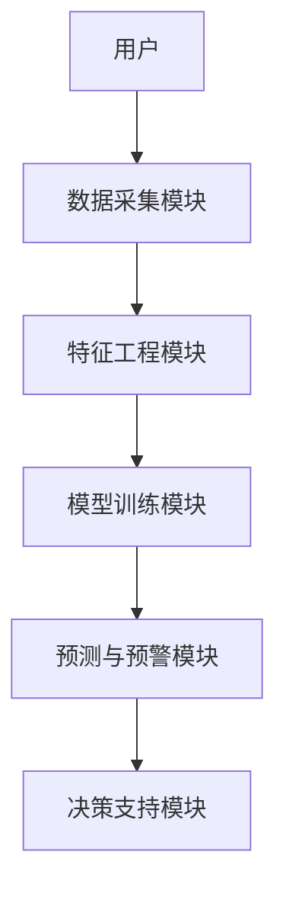

                 


# AI驱动的企业资金流动性风险预测系统

> 关键词：资金流动性风险，AI驱动，机器学习，深度学习，时间序列分析

> 摘要：本文将详细介绍AI驱动的企业资金流动性风险预测系统，从背景与概述、核心概念与技术原理、算法原理与数学模型、系统架构与设计、系统实现与项目实战，到总结与展望，全面解析该系统的技术实现和应用场景。通过本文，读者将了解如何利用AI技术有效预测和管理企业资金流动性风险。

---

## 第一部分: 背景与概述

### 第1章: 企业资金流动性风险预测的背景与挑战

#### 1.1 资金流动性风险的基本概念

资金流动性风险是指企业在一定时间内无法以合理成本获得足够的资金来满足其资产增长或偿债需求的风险。这种风险可能来自于市场波动、企业内部管理问题或外部经济环境的变化。企业若不能有效管理资金流动性风险，可能导致资金链断裂，进而影响企业的正常运营甚至引发破产。

#### 1.2 传统资金流动性风险管理的局限性

传统的资金流动性风险管理方法主要包括以下几种：

1. **经验判断法**：依赖于管理人员的经验和直觉进行判断，这种方法主观性强，缺乏科学性，容易受到个人判断的限制。
2. **财务比率分析法**：通过计算流动比率、速动比率等财务指标来评估企业的流动性风险。这种方法虽然有一定的科学性，但其结果过于静态，无法动态捕捉市场变化。
3. **情景分析法**：通过假设不同市场情景下企业的资金状况来评估流动性风险。这种方法需要大量的假设和输入参数，且难以量化。

这些传统方法的局限性主要体现在以下几个方面：

- 数据处理能力有限：传统方法难以处理海量数据，尤其是非结构化数据，无法捕捉到隐藏在数据中的潜在风险。
- 及时性不足：传统方法通常需要定期进行，难以实现实时监控和预测。
- 精度不高：传统方法的结果往往依赖于人工判断，精度较低，容易受到人为因素的影响。

#### 1.3 AI技术在金融风险管理中的应用前景

随着AI技术的迅速发展，尤其是在机器学习和深度学习领域的突破，AI技术在金融风险管理中的应用前景广阔。AI技术可以通过对海量数据的分析，发现传统方法难以察觉的模式和趋势，从而提高预测的准确性和及时性。具体而言，AI技术在以下方面具有显著优势：

- **数据处理能力**：AI技术能够处理结构化和非结构化数据，从大量数据中提取有用信息。
- **实时性**：AI技术可以通过实时数据处理，实现对资金流动性风险的实时监控和预测。
- **精准度**：通过机器学习算法，AI技术可以发现数据中的复杂模式，提高预测的准确性。

#### 1.4 企业资金流动性风险预测的AI驱动模式

AI驱动的企业资金流动性风险预测模式通过结合机器学习、深度学习和时间序列分析等技术，构建一个智能化的预测系统。该系统能够实时监控企业的资金流动情况，预测潜在的资金流动性风险，并提供相应的预警和应对策略。这种模式不仅提高了预测的准确性和及时性，还能够帮助企业更好地应对复杂多变的市场环境。

---

## 第二部分: 核心概念与技术原理

### 第2章: AI驱动的资金流动性风险预测的核心概念

#### 2.1 资金流动性风险预测的系统架构

AI驱动的资金流动性风险预测系统通常包括以下几个核心模块：

1. **数据采集模块**：负责从企业内部和外部获取相关数据，包括财务数据、市场数据、交易数据等。
2. **特征工程模块**：对采集到的数据进行清洗、转换和特征提取，生成适合机器学习算法处理的特征向量。
3. **模型训练模块**：利用机器学习和深度学习算法，对特征向量进行训练，构建资金流动性风险预测模型。
4. **预测与预警模块**：基于训练好的模型，对未来的资金流动性风险进行预测，并根据预测结果生成预警信息。
5. **决策支持模块**：根据预测结果和预警信息，为企业提供相应的风险管理建议和优化策略。

#### 2.2 AI技术在资金流动性预测中的应用

AI技术在资金流动性预测中的应用主要体现在以下几个方面：

1. **机器学习**：通过训练机器学习模型，预测资金流动性的变化趋势。
2. **深度学习**：利用深度神经网络（DNN）和长短期记忆网络（LSTM）等深度学习模型，捕捉数据中的复杂模式。
3. **时间序列分析**：通过对历史数据进行时间序列分析，预测未来的资金流动情况。

#### 2.3 核心概念的ER实体关系图

以下是一个简单的ER实体关系图，展示了企业资金流动性风险预测系统中的核心实体及其关系：

```mermaid
er
actor: 企业
actor -|> 资金: 资金流动
actor -|> 风险: 风险评估
```

---

## 第三部分: 算法原理与数学模型

### 第3章: 基于机器学习的资金流动性风险预测算法

#### 3.1 机器学习的基本原理

机器学习是一种通过数据学习模型的技术，其核心在于通过训练数据构建能够预测新数据的模型。机器学习算法可以分为监督学习、无监督学习和半监督学习三类。在资金流动性风险预测中，通常使用监督学习算法，因为我们可以根据历史数据标注出是否发生流动性风险，从而训练模型进行预测。

#### 3.2 基于LSTM的时间序列预测模型

长短期记忆网络（LSTM）是一种特殊类型的递归神经网络（RNN），能够有效处理时间序列数据。LSTM通过引入记忆单元和遗忘门，能够捕捉到时间序列中的长期依赖关系，从而提高预测的准确性。

##### 3.2.1 LSTM的基本原理

LSTM的基本结构包括输入门、遗忘门和输出门三个部分：

1. **输入门**：决定当前时刻输入的信息对记忆单元的影响。
2. **遗忘门**：决定遗忘记忆单元中存储的旧信息。
3. **输出门**：决定从记忆单元中输出的信息。

LSTM的数学公式如下：

$$
f_t = \sigma(g_{f} (x_t, h_{t-1}))
$$
$$
i_t = \sigma(g_i (x_t, h_{t-1}))
$$
$$
o_t = \sigma(g_o (x_t, h_{t-1}))
$$
$$
c_t = f_t \cdot c_{t-1} + i_t \cdot g_i (x_t, h_{t-1})
$$
$$
h_t = o_t \cdot c_t
$$

其中，$f_t$、$i_t$、$o_t$分别为输入门、遗忘门和输出门的激活值，$c_t$为记忆单元的值，$h_t$为隐藏层的输出。

##### 3.2.2 LSTM在时间序列预测中的应用

LSTM特别适用于时间序列预测，因为它可以捕捉到数据中的长期依赖关系。在资金流动性风险预测中，我们可以使用LSTM模型来预测未来的资金流动情况。

#### 3.3 算法实现的数学模型

以下是一个简单的LSTM模型实现示例：

```python
import numpy as np

def lstm_cell(x_t, h_prev, c_prev):
    # 输入门
    f = sigmoid(np.dot(np.concatenate([x_t, h_prev], axis=1), w_f) + b_f)
    # 遗忘门
    i = sigmoid(np.dot(np.concatenate([x_t, h_prev], axis=1), w_i) + b_i)
    # 输出门
    o = sigmoid(np.dot(np.concatenate([x_t, h_prev], axis=1), w_o) + b_o)
    # 记忆单元
    c_t = f * c_prev + i * np.tanh(np.dot(x_t, w_c) + b_c)
    # 隐藏层输出
    h_t = o * np.tanh(c_t)
    return h_t, c_t

def sigmoid(x):
    return 1 / (1 + np.exp(-x))
```

---

## 第四部分: 系统架构与设计

### 第4章: 系统架构与设计

#### 4.1 系统的功能模块设计

AI驱动的企业资金流动性风险预测系统的功能模块设计如下：

1. **数据采集模块**：从企业内部和外部获取相关数据，包括财务数据、市场数据、交易数据等。
2. **特征工程模块**：对数据进行清洗、转换和特征提取，生成适合机器学习算法处理的特征向量。
3. **模型训练模块**：利用机器学习和深度学习算法，对特征向量进行训练，构建资金流动性风险预测模型。
4. **预测与预警模块**：基于训练好的模型，对未来的资金流动性风险进行预测，并根据预测结果生成预警信息。
5. **决策支持模块**：根据预测结果和预警信息，为企业提供相应的风险管理建议和优化策略。

#### 4.2 系统架构设计

以下是系统的整体架构图：



#### 4.3 数据流设计

以下是数据流设计图：


---

## 第五部分: 系统实现与项目实战

### 第5章: 系统实现与项目实战

#### 5.1 环境安装

要实现AI驱动的企业资金流动性风险预测系统，首先需要安装以下环境：

- **Python**：推荐使用Python 3.6及以上版本。
- **深度学习框架**：推荐使用TensorFlow或Keras。
- **数据处理工具**：推荐使用Pandas和NumPy。
- **可视化工具**：推荐使用Matplotlib和Seaborn。

#### 5.2 系统核心实现源代码

以下是系统的核心实现代码示例：

```python
import numpy as np
import pandas as pd
from sklearn.model_selection import train_test_split
from tensorflow.keras.models import Sequential
from tensorflow.keras.layers import LSTM, Dense, Dropout

# 数据加载
data = pd.read_csv('financial_data.csv')
X = data.iloc[:, :-1].values
y = data.iloc[:, -1].values

# 数据分割
X_train, X_test, y_train, y_test = train_test_split(X, y, test_size=0.2, random_state=42)

# 模型构建
model = Sequential()
model.add(LSTM(units=50, return_sequences=True, input_shape=(X_train.shape[1], 1)))
model.add(Dropout(0.2))
model.add(LSTM(units=50, return_sequences=False))
model.add(Dense(1, activation='sigmoid'))

# 模型编译
model.compile(loss='binary_crossentropy', optimizer='adam', metrics=['accuracy'])

# 模型训练
model.fit(X_train, y_train, epochs=10, batch_size=32, validation_data=(X_test, y_test))
```

#### 5.3 代码应用解读与分析

以上代码实现了一个简单的LSTM模型，用于预测资金流动性风险。具体步骤如下：

1. **数据加载**：从CSV文件中加载金融数据，包括财务数据、市场数据等。
2. **数据分割**：将数据分为训练集和测试集，用于模型训练和评估。
3. **模型构建**：构建一个包含两层LSTM层的模型，并添加Dropout层防止过拟合。
4. **模型编译**：使用二进制交叉熵作为损失函数，Adam优化器，并监控准确率。
5. **模型训练**：在训练数据上训练模型，并在测试数据上进行评估。

---

## 第六部分: 总结与展望

### 第6章: 总结与展望

#### 6.1 本章总结

本文详细介绍了AI驱动的企业资金流动性风险预测系统，从背景与概述、核心概念与技术原理、算法原理与数学模型、系统架构与设计、系统实现与项目实战，到总结与展望，全面解析了该系统的技术实现和应用场景。通过本文，读者可以了解如何利用AI技术有效预测和管理企业资金流动性风险。

#### 6.2 未来展望

随着AI技术的不断发展，企业资金流动性风险预测系统也将不断优化和创新。未来的研究方向可能包括：

1. **更复杂的时间序列模型**：如Transformer架构在时间序列预测中的应用。
2. **多模态数据融合**：结合文本、图像等多种数据源，提高预测的准确性和全面性。
3. **实时预测与自适应优化**：通过实时数据处理和自适应算法，实现更高效的预测和风险控制。

总之，AI技术的应用将为企业资金流动性风险预测提供更强大的工具和方法，帮助企业更好地应对复杂多变的市场环境。

---

通过本文的详细讲解，读者可以系统地了解AI驱动的企业资金流动性风险预测系统的构建过程和实际应用。希望本文能够为相关领域的研究和实践提供有价值的参考。

