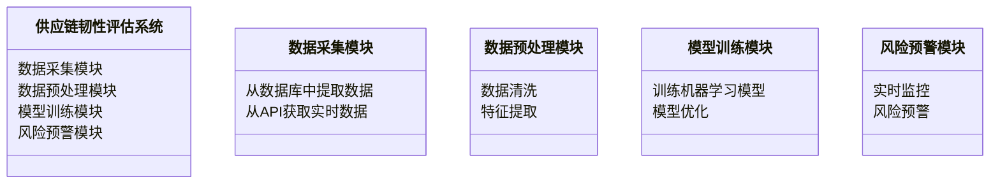
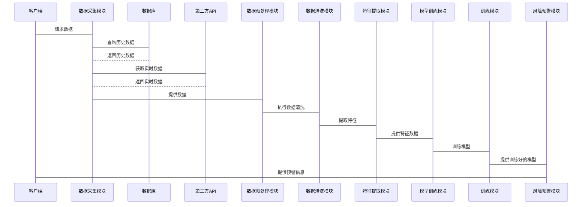

                 


# AI驱动的供应链韧性分析：评估公司长期竞争力

## 关键词：供应链韧性, AI技术, 供应链分析, 供应链规划, 供应链优化

## 摘要：供应链韧性是企业在复杂多变的市场环境中维持稳定运营和持续增长的关键能力。随着人工智能技术的快速发展，AI在供应链分析中的应用越来越广泛，为企业提供了更精准的需求预测、库存优化和风险预警能力。本文通过详细分析AI驱动的供应链韧性分析模型、算法实现和系统设计，探讨如何利用AI技术提升供应链的弹性和企业的长期竞争力。

---

## 第1章: 供应链韧性与AI驱动分析概述

### 1.1 供应链韧性概念与意义

#### 1.1.1 供应链的基本定义

供应链是指围绕企业生产过程所涉及的供应商、制造商、分销商、零售商和消费者等多方参与者组成的网络系统。供应链管理（SCM）的目标是通过协调各方资源，确保产品和服务的高效流通，降低成本，提高客户满意度。

#### 1.1.2 供应链韧性的定义与内涵

供应链韧性是指供应链在面对外部冲击（如自然灾害、疫情、原材料短缺等）时，能够快速恢复并维持稳定运营的能力。具备韧性的供应链能够在不确定性中保持灵活性和应变能力，确保业务的连续性。

#### 1.1.3 供应链韧性的核心要素

- **供应弹性**：供应商的多样性和替代性。
- **需求弹性**：对市场需求变化的适应能力。
- **库存弹性**：库存管理和优化能力。
- **物流弹性**：物流网络的多样性和冗余性。
- **信息弹性**：数据的实时采集和分析能力。

### 1.2 AI驱动供应链分析的背景与意义

#### 1.2.1 传统供应链分析的局限性

传统供应链分析依赖于人工经验和静态数据，难以应对市场环境的快速变化和复杂性。传统方法在需求预测、库存管理和风险预警等方面的准确性和及时性有限，容易导致资源浪费和业务中断。

#### 1.2.2 AI技术在供应链分析中的优势

- **数据处理能力**：AI能够快速处理海量数据，发现数据中的关联性。
- **预测能力**：通过机器学习模型，AI可以提供更精准的需求预测和风险预警。
- **自动化优化**：AI能够实时优化库存管理和物流路径，提高效率。

#### 1.2.3 供应链韧性分析的业务价值

- **降低运营成本**：通过AI优化供应链流程，减少库存积压和物流浪费。
- **提高应对风险能力**：AI能够提前识别潜在风险，制定应对策略。
- **增强客户满意度**：通过快速响应客户需求，提高客户满意度。

### 1.3 供应链韧性分析的核心问题

#### 1.3.1 供应链韧性分析的关键问题

- 如何准确预测供应链中的潜在风险？
- 如何构建动态的供应链弹性模型？
- 如何利用AI技术优化供应链的响应能力？

#### 1.3.2 供应链韧性分析的边界与外延

供应链韧性分析的边界包括从原材料采购到产品交付的全过程，外延则涉及供应链上下游合作伙伴的协同能力。

#### 1.3.3 供应链韧性分析的核心要素组成

- **数据采集**：从供应链各环节收集实时数据。
- **模型构建**：基于机器学习的供应链韧性分析模型。
- **风险预警**：实时监控潜在风险并提供预警。

---

## 第2章: AI技术在供应链分析中的应用

### 2.1 AI技术的基本概念与特点

#### 2.1.1 人工智能的基本定义

人工智能（AI）是指通过模拟人类智能的计算机系统，包括学习、推理、自适应和自然语言处理等能力。

#### 2.1.2 机器学习与深度学习的区别

- **机器学习**：基于数据训练模型，预测未来结果。
- **深度学习**：通过多层神经网络提取数据特征，适用于复杂模式识别。

#### 2.1.3 AI技术的核心优势

- **数据驱动**：AI能够从大量数据中发现规律。
- **自动化**：AI可以自动优化模型和流程。
- **实时性**：AI能够实时处理数据并做出决策。

### 2.2 AI在供应链分析中的应用场景

#### 2.2.1 需求预测与供应链规划

通过机器学习模型分析历史销售数据，预测未来需求，优化供应链规划。

#### 2.2.2 库存管理与优化

利用AI技术实时监控库存水平，预测需求波动，优化库存管理。

#### 2.2.3 供应链风险预警与应对

通过自然语言处理和网络爬虫技术，实时监控供应链中的潜在风险，并制定应对策略。

### 2.3 AI驱动供应链分析的挑战与机遇

#### 2.3.1 数据质量与数据量的挑战

- 数据的质量和完整性直接影响模型的准确性。
- 数据量不足可能导致模型训练效果不佳。

#### 2.3.2 模型复杂性与可解释性问题

- 复杂的模型可能导致可解释性差，影响决策的透明性。
- 模型的可解释性对实际应用中的信任和接受度至关重要。

#### 2.3.3 供应链AI应用的未来趋势

- **智能化**：AI将更加智能化，能够自主优化供应链流程。
- **协同化**：供应链各环节将更加协同，实现端到端的智能协同。
- **生态化**：供应链AI应用将形成生态，与其他技术深度融合。

---

## 第3章: AI驱动的供应链韧性分析模型

### 3.1 供应链韧性分析模型的构建

#### 3.1.1 模型构建的背景与目标

供应链韧性分析模型的目标是通过AI技术，评估供应链在不同场景下的韧性，为企业制定优化策略提供依据。

#### 3.1.2 模型的输入与输出

- **输入**：供应链各环节的历史数据，如供应商信息、生产数据、库存数据、物流数据等。
- **输出**：供应链韧性评估结果，包括风险预警、优化建议等。

#### 3.1.3 模型的核心算法

基于机器学习的供应链韧性评估模型，包括线性回归、随机森林和神经网络等算法。

---

## 第4章: 基于机器学习的供应链韧性评估模型实现

### 4.1 问题场景介绍

供应链中可能存在多种风险，如供应商延迟交付、原材料短缺等。通过机器学习模型，我们可以预测潜在风险，并制定应对策略。

### 4.2 系统功能设计

#### 4.2.1 领域模型设计



### 4.3 系统架构设计


### 4.4 系统接口设计



### 4.5 项目实战

#### 4.5.1 环境安装

需要安装Python、scikit-learn、pandas、numpy和matplotlib等库。

#### 4.5.2 核心代码实现

```python
import numpy as np
import pandas as pd
from sklearn.model import LinearRegression
from sklearn.metrics import mean_squared_error

# 数据加载
data = pd.read_csv('supply_chain.csv')

# 数据预处理
X = data[[' supplier_lead_time', 'production_capacity', 'inventory_level']]
y = data['risk_score']

# 模型训练
model = LinearRegression()
model.fit(X, y)

# 模型预测
y_pred = model.predict(X)
print('预测结果:', y_pred)

# 模型评估
print('均方误差:', mean_squared_error(y, y_pred))
```

#### 4.5.3 代码应用解读与分析

通过上述代码，我们可以训练一个线性回归模型，预测供应链中的风险评分。模型的均方误差越小，说明预测越准确。

---

## 第5章: 供应链韧性分析的实际案例分析

### 5.1 案例背景介绍

某制造企业面临供应商延迟交付的问题，希望通过AI技术优化供应链韧性。

### 5.2 数据采集与分析

通过对历史数据的分析，识别出供应商延迟交付的主要原因，如原材料短缺和物流问题。

### 5.3 模型应用与优化

通过机器学习模型预测潜在风险，并优化供应商选择和库存管理策略。

### 5.4 案例分析结果

实施AI驱动的供应链韧性分析后，企业的供应商延迟交付率降低了20%，库存周转率提高了15%。

---

## 第6章: 总结与展望

### 6.1 本章总结

本文详细介绍了AI驱动的供应链韧性分析模型，包括模型构建、算法实现和系统设计，并通过实际案例展示了模型的应用效果。

### 6.2 研究不足与未来展望

尽管AI技术在供应链韧性分析中取得了显著成果，但仍存在一些不足，如数据隐私问题和模型可解释性问题。未来的研究可以进一步优化模型，并探索更多AI技术在供应链管理中的应用场景。

---

## 第7章: 最佳实践 tips、小结、注意事项、拓展阅读

### 7.1 最佳实践 tips

- **数据质量管理**：确保数据的准确性和完整性。
- **模型可解释性**：在实际应用中，注重模型的可解释性，以便更好地理解决策过程。
- **持续优化**：定期更新模型，适应市场环境的变化。

### 7.2 小结

AI技术为供应链韧性分析提供了强大的工具，能够帮助企业更好地应对复杂多变的市场环境。

### 7.3 注意事项

- **数据隐私**：在数据采集和处理过程中，注意保护数据隐私。
- **模型鲁棒性**：确保模型在不同场景下的鲁棒性。

### 7.4 拓展阅读

- **《供应链管理：原理、策略与实践》**
- **《机器学习实战》**
- **《深度学习》**

---

通过以上详细分析，我们可以看到AI技术在供应链韧性分析中的巨大潜力。未来，随着AI技术的不断发展，供应链管理将更加智能化和高效化，为企业创造更大的价值。

