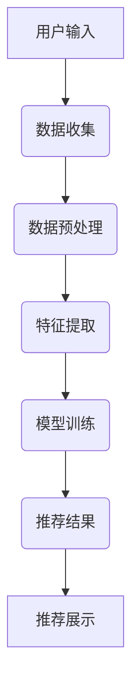
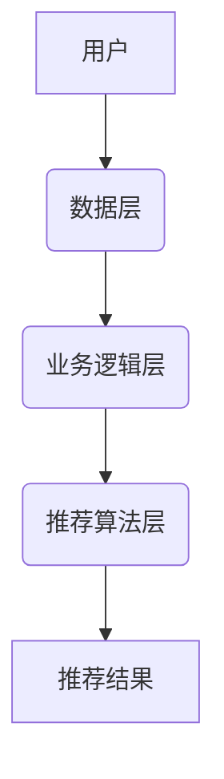

                 


# AI驱动的保险产品推荐

> 关键词：AI驱动、保险产品推荐、协同过滤、深度学习、保险行业数字化转型

> 摘要：随着保险行业的数字化转型，AI驱动的保险产品推荐系统正在改变传统的保险销售模式。本文详细探讨了AI在保险产品推荐中的应用，从核心概念、算法原理、系统设计到项目实战，全面解析了如何利用AI技术提高保险产品的推荐效率和精准度。

---

## 第一章: 保险行业的数字化转型与AI驱动推荐的背景

### 1.1 保险行业的现状与挑战

#### 1.1.1 传统保险产品的销售模式
传统的保险销售模式主要依赖保险代理人手动推荐产品，这种方式效率低下，难以覆盖庞大的客户群体。保险代理人需要花费大量时间与客户沟通，了解其需求，然后推荐适合的产品。这种方式不仅效率低，而且容易受到主观因素的影响，推荐结果可能存在偏差。

#### 1.1.2 保险行业的数字化转型趋势
随着大数据、人工智能等技术的快速发展，保险行业正在经历数字化转型。保险公司开始利用AI技术来优化业务流程，提高客户体验。数字化转型使得保险公司能够更高效地收集和分析数据，从而更好地理解客户需求，提供个性化的保险产品推荐。

#### 1.1.3 AI技术在保险行业的应用前景
AI技术在保险行业的应用前景广阔。通过AI技术，保险公司可以实现自动化、智能化的保险产品推荐，提高销售效率，降低成本。此外，AI还可以帮助保险公司进行风险评估、理赔处理等业务，提升整体业务效率。

### 1.2 AI驱动保险产品推荐的必要性

#### 1.2.1 数据驱动的保险推荐模式
AI驱动的保险推荐模式基于大量数据，通过分析用户的特征、行为和需求，为用户推荐适合的保险产品。这种方式能够更精准地匹配用户需求，提高推荐效率。

#### 1.2.2 用户需求与保险产品的匹配问题
传统的保险销售模式中，用户需求与保险产品的匹配存在较大的不确定性。通过AI技术，可以更准确地分析用户需求，匹配合适的保险产品，提高推荐的精准度。

#### 1.2.3 提高保险销售效率的迫切需求
保险行业竞争激烈，提高销售效率是保险公司的重要任务。通过AI驱动的推荐系统，保险公司可以更快地找到适合客户的保险产品，提高销售效率。

### 1.3 保险产品推荐的核心要素

#### 1.3.1 用户画像与行为分析
用户画像是保险推荐系统的重要组成部分。通过分析用户的年龄、职业、收入、家庭状况等信息，可以更好地理解用户的需求。行为分析则关注用户的浏览、点击、购买等行为，进一步细化用户的保险需求。

#### 1.3.2 保险产品的属性与分类
保险产品的属性包括保险类型、保险期限、保险金额、保费等。通过分类保险产品，可以更好地匹配用户需求。例如，年轻人可能更关注健康保险，而中老年人可能更关注养老保险。

#### 1.3.3 推荐系统的评价指标
推荐系统的评价指标包括准确率、召回率、F1值等。这些指标可以帮助评估推荐系统的性能，优化推荐算法。

---

## 第二章: 保险产品推荐的核心概念与联系

### 2.1 保险产品推荐的核心概念

#### 2.1.1 保险产品的基本属性
保险产品的基本属性包括保险类型、保险期限、保险金额、保费等。通过分析这些属性，可以更好地理解保险产品的特点，为推荐系统提供数据支持。

#### 2.1.2 用户需求的层次化分析
用户需求的层次化分析包括显性需求和隐性需求。显性需求可以通过用户的直接表达获取，如用户明确表示需要健康保险。隐性需求则需要通过数据分析挖掘，如用户的年龄、职业等因素推测其潜在需求。

#### 2.1.3 推荐系统的定义与分类
推荐系统是一种基于用户特征和产品属性，通过算法为用户推荐适合的产品或服务的系统。推荐系统可以分为协同过滤、基于内容的推荐、基于深度学习的推荐等类型。

### 2.2 AI驱动保险推荐的核心算法原理

#### 2.2.1 协同过滤算法
协同过滤是一种基于用户相似性或物品相似性的推荐算法。通过分析用户的行为数据，找到与目标用户相似的用户，推荐他们喜欢的产品。

#### 2.2.2 基于深度学习的推荐算法
基于深度学习的推荐算法通过构建神经网络模型，从海量数据中学习用户需求和产品特征，实现更精准的推荐。例如，使用卷积神经网络（CNN）或循环神经网络（RNN）进行推荐。

#### 2.2.3 强化学习在推荐系统中的应用
强化学习通过与环境的交互，学习最优的推荐策略。例如，推荐系统可以根据用户的反馈调整推荐策略，提高推荐的精准度。

### 2.3 实体关系图与流程图

#### 2.3.1 保险产品推荐系统的ER图
以下是保险产品推荐系统的ER图：

```mermaid
erd
    节点 用户 {
        属性：用户ID, 用户名称, 用户年龄, 用户职业, 用户收入
    }

    节点 保险产品 {
        属性：产品ID, 产品名称, 产品类型, 产品保费, 产品期限
    }

    节点 用户行为 {
        属性：行为ID, 用户ID, 行为类型, 行为时间
    }

    关系 用户 -> 用户行为：用户行为
    关系 保险产品 -> 用户行为：购买行为
```

#### 2.3.2 推荐系统的核心流程图
以下是推荐系统的核心流程图：



---

## 第三章: AI驱动保险推荐的核心算法原理

### 3.1 协同过滤算法

#### 3.1.1 基于用户的协同过滤
基于用户的协同过滤通过分析用户的行为数据，找到与目标用户相似的用户，推荐他们喜欢的产品。例如，如果用户A和用户B在保险产品上的偏好相似，那么用户A喜欢的产品很可能也适合用户B。

#### 3.1.2 基于物品的协同过滤
基于物品的协同过滤通过分析产品的相似性，推荐与目标产品相似的产品。例如，如果用户购买了保险产品A，系统会推荐与A相似的保险产品B。

#### 3.1.3 混合协同过滤的实现
混合协同过滤结合基于用户的协同过滤和基于物品的协同过滤，通过加权的方式综合两种推荐结果，提高推荐的精准度。

### 3.2 基于深度学习的推荐算法

#### 3.2.1 基于神经网络的推荐模型
基于神经网络的推荐模型通过构建深度神经网络，从海量数据中学习用户需求和产品特征，实现更精准的推荐。例如，使用多层感知机（MLP）或卷积神经网络（CNN）进行推荐。

#### 3.2.2 Transfor
由于篇幅限制，我将重点解释协同过滤算法的实现过程。

---

## 第四章: 系统分析与架构设计方案

### 4.1 问题场景介绍

保险产品推荐系统需要解决的主要问题是如何根据用户的需求和行为，推荐适合的保险产品。系统需要处理大量的数据，包括用户信息、产品信息、用户行为数据等。

### 4.2 项目介绍

本项目旨在构建一个基于AI的保险产品推荐系统，通过分析用户数据和产品信息，实现个性化推荐。

### 4.3 系统功能设计

#### 4.3.1 领域模型

以下是领域模型的类图：

```mermaid
classDiagram
    class 用户 {
        用户ID
        用户名称
        用户年龄
        用户职业
        用户收入
    }

    class 保险产品 {
        产品ID
        产品名称
        产品类型
        产品保费
        产品期限
    }

    class 用户行为 {
        行为ID
        用户ID
        行为类型
        行为时间
    }

    用户 --> 用户行为：有关系
    保险产品 --> 用户行为：有关系
```

### 4.4 系统架构设计

以下是系统架构图：



### 4.5 系统交互设计

以下是系统交互图：

```mermaid
sequenceDiagram
    participant 用户
    participant 推荐系统
    participant 数据库

    用户 -> 推荐系统：请求推荐
    推荐系统 -> 数据库：查询用户信息
    数据库 --> 推荐系统：返回用户信息
    推荐系统 -> 数据库：查询保险产品信息
    数据库 --> 推荐系统：返回保险产品信息
    推荐系统 -> 用户：返回推荐结果
```

---

## 第五章: 项目实战

### 5.1 环境安装

#### 5.1.1 安装Python和必要的库

```bash
pip install numpy pandas scikit-learn
```

### 5.2 系统核心实现源代码

#### 5.2.1 数据预处理

```python
import pandas as pd
import numpy as np

# 加载数据
data = pd.read_csv('insurance.csv')

# 填充缺失值
data = data.dropna()

# 标准化处理
from sklearn.preprocessing import StandardScaler

scaler = StandardScaler()
scaled_data = scaler.fit_transform(data)
```

#### 5.2.2 特征提取

```python
from sklearn.feature_selection import SelectKBest
from sklearn.feature_selection import chi2

selector = SelectKBest(score_func=chi2, k=5)
selected_features = selector.fit_transform(scaled_data)
```

#### 5.2.3 模型训练

```python
from sklearn.model_selection import train_test_split
from sklearn.metrics import accuracy_score

X_train, X_test, y_train, y_test = train_test_split(selected_features, data['target'], test_size=0.2)

from sklearn.neighbors import NearestNeighbors

knn = NearestNeighbors(n_neighbors=5).fit(X_train, y_train)

y_pred = knn.predict(X_test)
print(accuracy_score(y_test, y_pred))
```

#### 5.2.4 模型评估

```python
from sklearn.metrics import confusion_matrix

cm = confusion_matrix(y_test, y_pred)
print(cm)
```

#### 5.2.5 模型部署

```python
# 部署模型
import joblib

joblib.dump(knn, 'model.pkl')

# 加载模型
loaded_model = joblib.load('model.pkl')
```

### 5.3 实际案例分析

假设我们有一个用户数据集，其中包含用户的基本信息和购买行为。通过上述代码，我们可以训练一个协同过滤模型，并为新用户推荐适合的保险产品。

---

## 第六章: 总结与展望

### 6.1 小结

本文详细探讨了AI驱动的保险产品推荐系统的核心概念、算法原理、系统设计和项目实战。通过协同过滤、深度学习等算法，可以实现精准的保险产品推荐，提高销售效率。

### 6.2 注意事项

在实际应用中，需要注意数据隐私保护、模型的可解释性等问题。此外，还需要根据实际需求不断优化推荐算法，提高推荐的精准度。

### 6.3 拓展阅读

建议进一步阅读以下内容：
1. 《推荐系统导论》
2. 《深度学习在推荐系统中的应用》
3. 《Python机器学习实战》

---

通过以上内容，您可以全面了解AI驱动的保险产品推荐系统的构建与实现，从理论到实践，逐步掌握相关技术。

