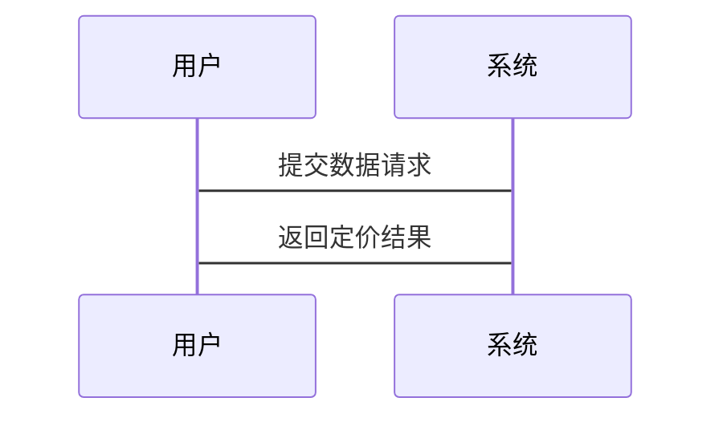

                 

<think>
好的，我将按照您的要求逐步构建《AI驱动的保险定价优化模型》的目录大纲。首先，我们需要明确文章的核心内容和主题思想，然后逐步展开各个章节的内容。

# AI驱动的保险定价优化模型

> 关键词：保险定价，人工智能，定价优化模型，机器学习，保险科技

> 摘要：本文详细介绍了AI驱动的保险定价优化模型的构建与应用。通过分析传统保险定价的局限性，探讨了AI技术在保险定价中的优势，详细阐述了基于机器学习的定价优化模型的算法原理、系统架构及实际应用案例。本文还提供了从数据预处理、模型训练到模型部署的完整实现流程，帮助读者理解和掌握AI驱动保险定价的核心技术。

---

# 第一部分: AI驱动的保险定价优化模型背景与基础

# 第1章: 保险定价概述

## 1.1 保险定价的基本概念

### 1.1.1 保险定价的核心要素
- 保险风险评估
- 保险产品定价
- 保险市场分析

### 1.1.2 保险定价的基本原理
- 风险定价模型
- 风险分担原则
- 市场供需关系

### 1.1.3 保险定价的常见方法
- 基于经验数据的定价
- 基于精算模型的定价
- 基于客户画像的定价

## 1.2 AI技术在保险行业的应用

### 1.2.1 AI在保险行业的应用场景
- 保险产品设计
- 风险评估与控制
- 客户行为预测

### 1.2.2 AI驱动保险定价的优势
- 数据处理能力强大
- 模型灵活性高
- 自动化程度高

### 1.2.3 AI在保险定价中的挑战
- 数据隐私问题
- 模型解释性不足
- 传统定价体系的阻力

## 1.3 保险定价优化模型的必要性

### 1.3.1 传统保险定价的局限性
- 数据维度单一
- 模型静态化
- 人工干预过多

### 1.3.2 数据驱动定价的潜力
- 数据多样性
- 模型可迭代性
- 个性化定价能力

### 1.3.3 AI优化定价的前景
- 提高定价精度
- 降低运营成本
- 提升客户体验

## 1.4 本章小结

---

# 第2章: AI驱动的保险定价优化模型核心概念

## 2.1 定价优化模型的基本概念

### 2.1.1 定价优化模型的定义
- 基于机器学习的定价模型
- 数据驱动的定价优化框架
- 动态调整定价策略的方法

### 2.1.2 定价优化模型的核心要素
- 数据特征提取
- 模型训练与优化
- 结果解释与反馈

### 2.1.3 定价优化模型的分类
- 基于线性回归的模型
- 基于树模型的定价优化
- 基于神经网络的定价优化

## 2.2 AI在定价优化中的作用

### 2.2.1 数据分析与特征提取
- 数据清洗与预处理
- 特征选择与降维
- 高维特征的构建

### 2.2.2 模型训练与优化
- 算法选择与调参
- 模型评估与验证
- 超参数优化

### 2.2.3 结果解释与反馈
- 模型解释性分析
- 定价策略调整
- 模型性能监控

## 2.3 定价优化模型的数学基础

### 2.3.1 线性回归模型
- 线性回归的数学公式
$$ y = \beta_0 + \beta_1x + \epsilon $$
- 模型假设与参数估计
- 模型优度的评估

### 2.3.2 非线性回归模型
- 非线性回归的数学公式
$$ y = f(x) + \epsilon $$
- 常见非线性回归模型（如逻辑回归、多项式回归）
- 模型适用场景

### 2.3.3 聚类分析与分类算法
- 聚类分析在定价中的应用
- 分类算法在客户细分中的作用
- 混淆矩阵与分类性能评估

## 2.4 本章小结

---

# 第3章: AI驱动的保险定价优化模型算法原理

## 3.1 线性回归模型

### 3.1.1 线性回归的基本原理
- 线性回归的假设与基本公式
- 梯度下降法的优化过程
- 线性回归的优缺点

### 3.1.2 线性回归的数学公式
$$ y = \beta_0 + \beta_1x + \epsilon $$

### 3.1.3 线性回归的实现步骤
1. 数据清洗与预处理
2. 特征选择与标准化
3. 模型训练与参数估计
4. 模型评估与优化

## 3.2 支持向量回归

### 3.2.1 支持向量回归的基本原理
- 支持向量机的数学基础
- 软边界的回归方法
- 核函数的使用与选择

### 3.2.2 支持向量回归的数学公式
$$ y = \text{sign}(w \cdot x + b) $$

### 3.2.3 支持向量回归的实现步骤
1. 数据转换与核函数选择
2. 参数优化与模型训练
3. 模型验证与评估

## 3.3 神经网络模型

### 3.3.1 神经网络的基本原理
- 神经网络的结构组成
- 前向传播与反向传播
- 激活函数的使用

### 3.3.2 神经网络的数学公式
$$ y = f(Wx + b) $$

### 3.3.3 神经网络的实现步骤
1. 网络结构设计
2. 数据预处理与输入
3. 模型训练与优化
4. 模型部署与应用

## 3.4 本章小结

---

# 第4章: AI驱动的保险定价优化模型系统架构

## 4.1 系统架构设计

### 4.1.1 系统功能模块划分
- 数据采集模块
- 数据处理模块
- 模型训练模块
- 模型部署模块

### 4.1.2 系统架构的层次结构
- 数据层
- 业务逻辑层
- 表现层

### 4.1.3 系统架构的优缺点
- 优点：模块化设计，便于扩展
- 缺点：初期开发成本较高

## 4.2 系统功能设计

### 4.2.1 数据采集模块
- 数据来源：客户数据、市场数据、产品数据
- 数据格式：结构化数据与非结构化数据

### 4.2.2 数据处理模块
- 数据清洗与预处理
- 特征工程与数据增强

### 4.2.3 模型训练模块
- 算法选择与参数调优
- 模型训练与验证
- 模型保存与导出

### 4.2.4 模型部署模块
- API接口设计
- 模型在线调优
- 结果展示与反馈

## 4.3 系统接口设计

### 4.3.1 API接口设计
- RESTful API设计
- 接口文档编写
- 接口测试与优化

## 4.4 系统交互设计

### 4.4.1 系统交互流程
- 用户输入数据
- 系统处理请求
- 返回定价结果

### 4.4.2 交互图示

## 4.5 本章小结

---

接下来，我将根据上述目录大纲，逐步展开每个章节的内容，确保文章逻辑清晰、结构紧凑、简单易懂。同时，我会按照您的要求，加入必要的数学公式、算法流程图和代码示例，帮助读者更好地理解和掌握AI驱动的保险定价优化模型的核心技术。

