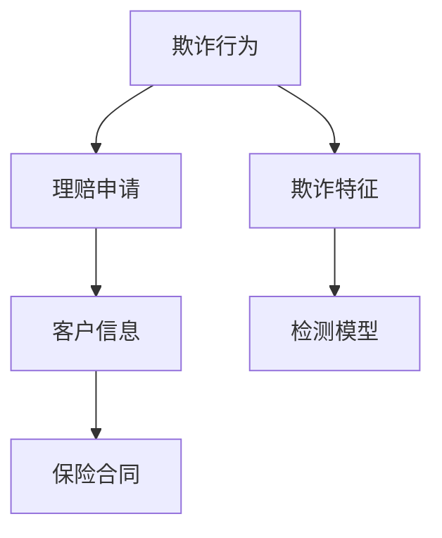
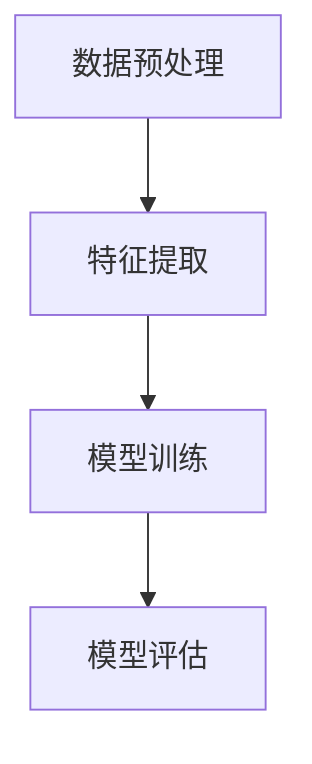
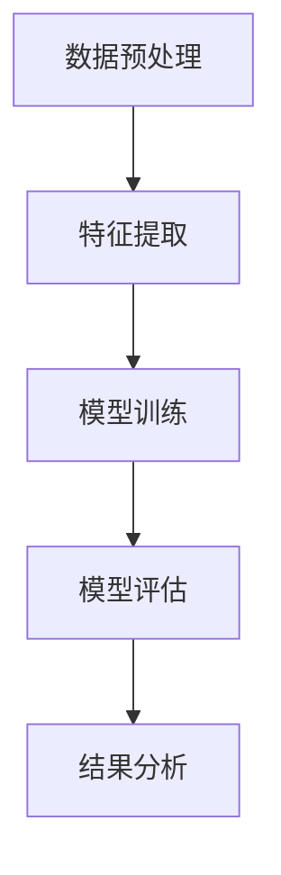
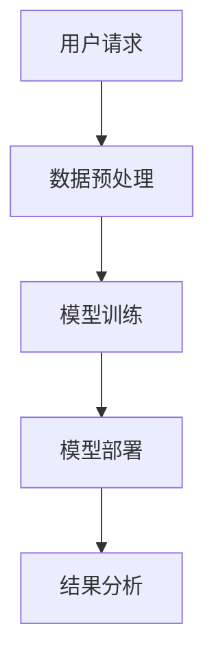

                 


# AI驱动的保险理赔欺诈检测

> 关键词：保险欺诈检测，人工智能，机器学习，自然语言处理，风险管理

> 摘要：本文将详细探讨AI技术在保险理赔欺诈检测中的应用，从背景、核心概念到算法原理，再到系统架构和项目实战，全面解析如何利用AI技术提升欺诈检测的效率和准确性。

---

# 第一章: 保险欺诈检测的背景与挑战

## 1.1 保险欺诈的现状与问题

### 1.1.1 保险欺诈的定义与类型

保险欺诈是指故意提供虚假信息或隐瞒重要事实，以获得不当保险赔偿的行为。常见的保险欺诈类型包括：

- **故意制造事故**：人为制造事故或夸大损失。
- **虚报理赔金额**：夸大损失金额以获取更多赔偿。
- **虚构理赔人**：使用虚假身份提交理赔申请。
- **重复理赔**：同一事故多次理赔，试图获得多倍赔偿。

### 1.1.2 保险欺诈带来的经济损失

保险欺诈不仅导致保险公司经济损失，还增加了保险成本，间接影响消费者。据统计，全球每年因保险欺诈造成的损失高达数百亿美元。

### 1.1.3 传统欺诈检测方法的局限性

传统欺诈检测依赖人工审查和规则-based系统，存在以下问题：

- **效率低下**：人工审查耗时长，成本高。
- **漏检率高**：难以发现复杂和隐蔽的欺诈行为。
- **规则局限性**：固定规则难以应对新型欺诈手段。

## 1.2 AI技术在保险欺诈检测中的应用前景

### 1.2.1 AI技术的核心优势

AI技术通过大数据分析和模式识别，能够快速识别复杂模式，显著提高欺诈检测的准确性和效率。

### 1.2.2 保险行业对AI技术的需求

保险行业需要高效、智能的欺诈检测工具，以应对日益复杂的欺诈手段。

### 1.2.3 未来发展趋势与挑战

AI技术在保险欺诈检测中的应用将更加普及，但也面临数据隐私、模型解释性等挑战。

---

# 第二章: 保险欺诈检测的核心概念与技术

## 2.1 欺诈行为的特征分析

### 2.1.1 欺诈行为的模式识别

通过分析理赔数据中的异常模式，识别潜在欺诈行为。例如，频繁提交理赔申请或理赔金额异常。

### 2.1.2 欺诈行为的关键特征

- **时间特征**：理赔时间过于集中或集中在特定时间段。
- **地点特征**：理赔地点过于集中或位于高欺诈风险区域。
- **金额特征**：理赔金额异常高或与历史数据不符。
- **客户特征**：客户信息不一致或缺乏可信度。

### 2.1.3 不同保险类型中的欺诈行为差异

不同保险类型（如车险、健康险）中的欺诈行为表现不同，需针对性分析。

## 2.2 欺诈检测的关键技术

### 2.2.1 机器学习在欺诈检测中的应用

- **监督学习**：使用标注数据训练模型，识别欺诈行为。
- **无监督学习**：识别数据中的异常模式，发现潜在欺诈。
- **半监督学习**：结合少量标注数据和大量未标注数据进行训练。

### 2.2.2 自然语言处理在理赔文本分析中的作用

通过NLP技术分析理赔申请中的文本信息，识别虚假陈述或不一致信息。

### 2.2.3 图神经网络在欺诈网络识别中的应用

构建欺诈网络，识别关联的欺诈行为，发现团伙欺诈。

## 2.3 核心概念的ER实体关系图



---

# 第三章: 保险欺诈检测的算法原理

## 3.1 基于机器学习的欺诈检测算法

### 3.1.1 监督学习算法

#### 1. 决策树算法

决策树通过特征分裂构建树状结构，预测欺诈概率。



数学模型：

$$ Gini指数 = \sum_{i=1}^{n} p_i (1 - p_i) $$

#### 2. 随机森林算法

随机森林通过多棵决策树投票，提高准确性和鲁棒性。

数学模型：

$$ OOB误差 = \frac{1}{n} \sum_{i=1}^{n} \text{错误预测数} $$

#### 3. 支持向量机(SVM)

SVM通过找到最佳分割超平面，区分正常和欺诈样本。

### 3.1.2 无监督学习算法

#### 1. K-means聚类

将数据分为簇，识别异常簇。

#### 2. DBSCAN算法

基于密度的聚类算法，识别异常点。

#### 3. 层次聚类

通过层次化方法，识别异常模式。

## 3.2 算法流程图



---

# 第四章: 保险欺诈检测系统的架构设计

## 4.1 系统功能模块

### 1. 数据预处理模块

处理和清洗数据，提取关键特征。

### 2. 模型训练模块

训练机器学习模型，优化参数。

### 3. 模型部署模块

将模型部署到生产环境，实时检测欺诈。

## 4.2 系统架构图



---

# 第五章: 保险欺诈检测的项目实战

## 5.1 项目背景

介绍项目目标和数据来源，如公开保险欺诈数据集。

## 5.2 环境配置

安装必要的Python库，如scikit-learn、XGBoost。

## 5.3 系统核心实现

### 1. 数据预处理

清洗数据，处理缺失值和异常值。

```python
import pandas as pd

data = pd.read_csv('insurance_fraud.csv')
data = data.dropna()
```

### 2. 特征工程

提取关键特征，如理赔金额、时间、地点等。

### 3. 模型训练

训练模型，评估性能。

```python
from sklearn.ensemble import RandomForestClassifier
model = RandomForestClassifier()
model.fit(X_train, y_train)
```

### 4. 模型部署

部署模型，实时检测欺诈。

## 5.4 案例分析

分析实际案例，展示模型如何识别欺诈行为。

---

# 第六章: 最佳实践与总结

## 6.1 最佳实践

### 1. 模型调优

通过网格搜索优化模型参数。

### 2. 特征选择

选择对欺诈检测最重要的特征。

### 3. 数据隐私保护

确保数据安全，遵守隐私保护法规。

## 6.2 小结

总结全文，强调AI技术在保险欺诈检测中的重要性。

## 6.3 注意事项

提醒读者注意模型的可解释性、数据质量和模型维护。

## 6.4 拓展阅读

推荐相关书籍和论文，供读者深入学习。

---

# 结语

通过系统的分析和实际案例的展示，本书为读者提供了AI驱动的保险欺诈检测的全面指南，帮助读者掌握相关技术和最佳实践，应对复杂的保险欺诈挑战。

