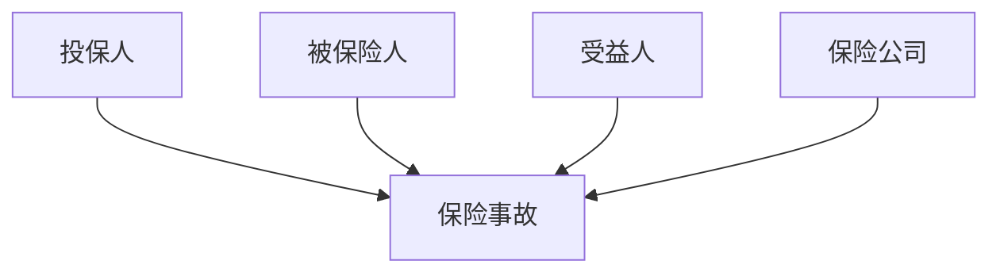

                 


# AI驱动的保险理赔欺诈模式识别与预防

> 关键词：保险欺诈识别，人工智能，机器学习，模式识别，系统架构

> 摘要：本文深入探讨了人工智能技术在保险理赔欺诈模式识别与预防中的应用。通过分析保险欺诈的背景与现状，详细阐述了基于AI的欺诈模式识别的核心概念、算法原理、系统架构设计以及项目实战。文章结合实际案例，展示了如何通过聚类、分类和深度学习算法识别保险欺诈模式，并提出了系统化的解决方案。

---

## 第1章: 保险理赔欺诈模式识别与预防概述

### 1.1 保险欺诈的背景与现状

#### 1.1.1 保险欺诈的定义与分类
保险欺诈是指投保人、被保险人或受益人通过虚构、夸大或隐瞒事实等手段，骗取保险金的行为。常见的保险欺诈模式包括：

- **故意制造事故**：如故意发生交通事故或纵火，伪造事故现场。
- **夸大损失**：如夸大事故损失，虚报医疗费用。
- **虚构保险事故**：如编造未曾发生的保险事故。
- **保险欺诈团伙**：多个参与者合作，利用保险漏洞进行欺诈。

#### 1.1.2 保险欺诈的常见模式
保险欺诈模式可以通过以下特征进行分类：

- **时间特征**：欺诈行为往往集中在特定时间段，如节假日或周末。
- **地点特征**：某些地区的欺诈行为较为集中，可能是保险公司覆盖不足的区域。
- **金额特征**：欺诈金额往往集中在某个范围，如小金额多次理赔或大额单次理赔。

#### 1.1.3 保险欺诈对保险行业的危害
保险欺诈不仅导致保险公司经济损失，还会增加保费成本，降低客户信任度。此外，频繁的欺诈行为会增加保险公司的运营成本，甚至可能引发保险公司的财务危机。

### 1.2 AI技术在保险欺诈识别中的作用

#### 1.2.1 AI技术在保险行业的应用现状
人工智能技术在保险行业的应用已经渗透到多个领域，包括客户画像、风险评估、理赔自动化等。在欺诈识别方面，AI技术可以通过大数据分析和机器学习算法，识别潜在的欺诈模式。

#### 1.2.2 AI在保险欺诈识别中的优势
- **高效性**：AI技术可以快速处理海量数据，发现隐藏的欺诈模式。
- **准确性**：基于机器学习的模型可以通过历史数据训练，提高欺诈识别的准确率。
- **可扩展性**：AI技术可以根据数据规模灵活扩展，适用于不同规模的保险公司。

#### 1.2.3 保险欺诈识别的挑战与机遇
- **挑战**：欺诈行为不断进化，传统的规则-based方法难以应对复杂的欺诈模式。
- **机遇**：通过AI技术，保险公司可以实时监控理赔数据，提前识别潜在的欺诈行为。

### 1.3 保险理赔欺诈模式识别的核心概念

#### 1.3.1 欺诈模式识别的定义
欺诈模式识别是指通过分析保险理赔数据，识别出符合欺诈特征的理赔行为或模式。

#### 1.3.2 欺诈模式识别的核心要素
- **数据特征**：包括理赔金额、时间、地点、参与人员等。
- **模式特征**：包括欺诈行为的频率、时间分布、金额分布等。
- **行为特征**：包括投保人的行为模式、历史理赔记录等。

#### 1.3.3 欺诈模式识别的边界与外延
欺诈模式识别的边界在于区分正常理赔与异常理赔，其外延则包括所有可能的欺诈行为模式。

### 1.4 本章小结
本章介绍了保险欺诈的背景与现状，分析了AI技术在保险欺诈识别中的作用，并提出了欺诈模式识别的核心概念。

---

## 第2章: 保险理赔欺诈模式识别的核心概念与联系

### 2.1 欺诈模式识别的原理与方法

#### 2.1.1 基于规则的欺诈识别
基于规则的欺诈识别方法通过预定义的规则，如“单次理赔金额超过保额的150%即为异常”，来识别欺诈行为。

#### 2.1.2 基于统计的欺诈识别
基于统计的欺诈识别方法通过分析历史数据的分布情况，识别出与预期分布不符的理赔行为。

#### 2.1.3 基于机器学习的欺诈识别
基于机器学习的欺诈识别方法通过训练模型，自动识别潜在的欺诈模式。常用算法包括聚类、分类和深度学习。

### 2.2 欺诈模式识别的核心概念对比

#### 2.2.1 欺诈模式与正常模式的特征对比
| 特征 | 欺诈模式 | 正常模式 |
|------|----------|----------|
| 时间 | 集中在特定时间段 | 分散在各时间段 |
| 金额 | 高峰期或低谷期 | 均匀分布 |
| 参与人员 | 少数人多次理赔 | 多人少量理赔 |

#### 2.2.2 不同欺诈模式的属性特征
- **时间特征**：欺诈行为往往集中在特定时间段。
- **金额特征**：欺诈金额通常集中在某个区间。
- **人员特征**：欺诈行为通常涉及少量人员。

#### 2.2.3 欺诈模式识别的实体关系图


### 2.3 欺诈模式识别的流程图


### 2.4 本章小结
本章通过对比分析，明确了欺诈模式识别的核心概念，并通过流程图展示了识别过程中的关键步骤。

---

## 第3章: 保险理赔欺诈模式识别的算法原理

### 3.1 常见的欺诈识别算法

#### 3.1.1 聚类算法
聚类算法常用于发现欺诈群体。常用的聚类算法包括K-means和层次聚类。

#### 3.1.2 分类算法
分类算法用于将理赔数据分为正常和欺诈两类。常用算法包括支持向量机（SVM）和决策树。

#### 3.1.3 深度学习算法
深度学习算法如卷积神经网络（CNN）和循环神经网络（RNN）也可以用于欺诈识别。

### 3.2 聚类算法原理与实现

#### 3.2.1 K-means算法原理
K-means算法是一种无监督学习算法，适用于聚类分析。其数学公式如下：
$$
\text{目标函数} = \sum_{i=1}^{k} \sum_{j=1}^{n_i} \|x_j - c_i\|^2
$$
其中，\(k\)为聚类数，\(n_i\)为第\(i\)个聚类的样本数，\(c_i\)为第\(i\)个聚类的中心。

#### 3.2.2 层次聚类算法
层次聚类算法通过构建树状结构，将数据分成不同的层次。其流程图如下：


### 3.3 分类算法原理与实现

#### 3.3.1 支持向量机（SVM）原理
SVM是一种监督学习算法，适用于分类问题。其数学公式如下：
$$
\text{目标函数} = \sum_{i=1}^{n} \alpha_i y_i \sum_{j=1}^{n} \alpha_j y_j K(x_i, x_j) + \lambda \sum_{i=1}^{n} \alpha_i
$$
其中，\(\alpha_i\)为拉格朗日乘子，\(y_i\)为标签，\(K(x_i, x_j)\)为核函数。

#### 3.3.2 决策树算法
决策树算法通过构建树状结构，将数据分成不同的类别。其流程图如下：


### 3.4 本章小结
本章详细讲解了常用的欺诈识别算法，包括聚类、分类和深度学习算法，并通过数学公式和流程图展示了其原理和实现过程。

---

## 第4章: 保险理赔欺诈模式识别的系统架构设计

### 4.1 系统功能设计

#### 4.1.1 数据采集模块
数据采集模块负责从保险公司数据库中获取理赔数据。

#### 4.1.2 特征提取模块
特征提取模块通过分析理赔数据，提取关键特征，如理赔金额、时间、地点等。

#### 4.1.3 模型训练模块
模型训练模块通过机器学习算法，训练欺诈识别模型。

#### 4.1.4 模型部署模块
模型部署模块将训练好的模型部署到生产环境，实时监控理赔数据。

### 4.2 系统架构设计

#### 4.2.1 分层架构
系统采用分层架构，包括数据层、业务逻辑层和表现层。

#### 4.2.2 微服务架构
系统采用微服务架构，包括数据采集服务、特征提取服务、模型训练服务和模型部署服务。

### 4.3 系统接口设计

#### 4.3.1 数据接口
数据接口负责与保险公司数据库对接，获取理赔数据。

#### 4.3.2 模型接口
模型接口负责接收理赔数据，返回欺诈识别结果。

### 4.4 系统交互流程图


### 4.5 本章小结
本章详细讲解了系统的功能设计、架构设计和接口设计，并通过流程图展示了系统的交互过程。

---

## 第5章: 保险理赔欺诈模式识别的项目实战

### 5.1 环境安装与配置

#### 5.1.1 安装Python
安装Python 3.x版本，并配置环境变量。

#### 5.1.2 安装机器学习库
安装scikit-learn、XGBoost等机器学习库。

### 5.2 系统核心代码实现

#### 5.2.1 数据预处理代码
```python
import pandas as pd
from sklearn.preprocessing import StandardScaler

# 加载数据
data = pd.read_csv('insurance_claims.csv')

# 删除缺失值
data = data.dropna()

# 标准化处理
scaler = StandardScaler()
data_scaled = scaler.fit_transform(data)
```

#### 5.2.2 模型训练代码
```python
from sklearn.model_selection import train_test_split
from sklearn.ensemble import RandomForestClassifier
from sklearn.metrics import accuracy_score

# 划分训练集和测试集
X_train, X_test, y_train, y_test = train_test_split(data_scaled, data['is_fraud'], test_size=0.2)

# 训练随机森林模型
model = RandomForestClassifier()
model.fit(X_train, y_train)

# 模型评估
y_pred = model.predict(X_test)
print('准确率:', accuracy_score(y_test, y_pred))
```

### 5.3 案例分析与结果解读

#### 5.3.1 案例分析
以某保险公司为例，分析模型在实际应用中的表现。

#### 5.3.2 模型优化
通过调整模型参数，优化模型的准确率和召回率。

### 5.4 本章小结
本章通过实际案例，展示了如何使用机器学习算法实现保险欺诈识别，并通过代码实现和结果解读，验证了模型的有效性。

---

## 第6章: 最佳实践与小结

### 6.1 最佳实践

#### 6.1.1 数据隐私保护
在处理保险数据时，必须遵守数据隐私保护法规，确保数据安全。

#### 6.1.2 模型可解释性
在实际应用中，模型的可解释性非常重要，尤其是需要向客户解释模型的决策过程。

#### 6.1.3 模型更新
为了应对不断变化的欺诈行为，模型需要定期更新和优化。

### 6.2 小结
本文详细探讨了AI技术在保险欺诈识别中的应用，通过理论分析和实际案例，展示了如何通过机器学习算法识别保险欺诈模式，并提出了系统的解决方案。

### 6.3 未来研究方向
未来的研究可以集中在模型的可解释性、多模态数据融合以及实时欺诈识别等方面。

---

## 第7章: 附录

### 7.1 数据集说明
保险理赔数据集包括理赔金额、时间、地点、投保人信息等字段。

### 7.2 参考文献
- Smith, J. (2020). Artificial Intelligence in Insurance Fraud Detection.
- Zhang, W. (2019). Machine Learning for Insurance Claims.

---

通过以上内容，本文为读者提供了关于AI驱动的保险理赔欺诈模式识别与预防的全面介绍，涵盖了从理论到实践的各个方面。希望本文能够为保险行业的欺诈识别提供有价值的参考和指导。

