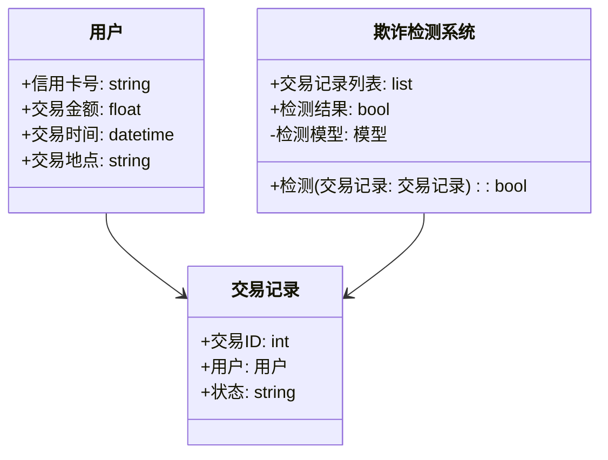
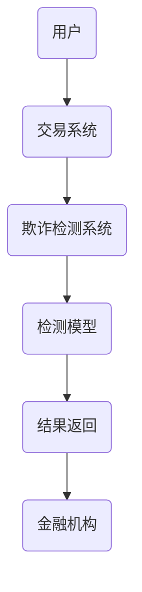
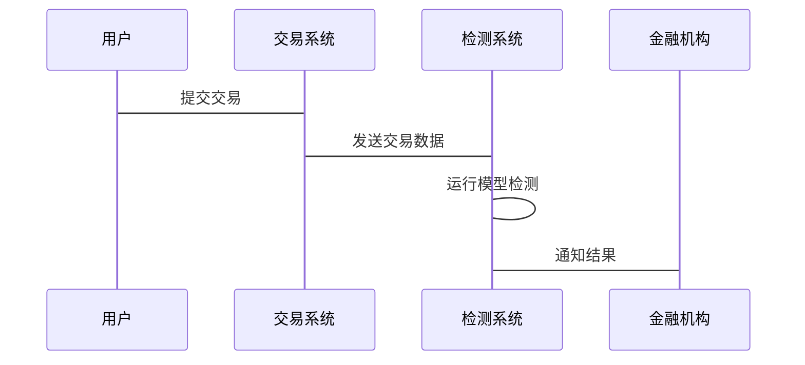

                 


# 《AI驱动的信用卡fraud检测模型》

> 关键词：信用卡欺诈检测、AI、机器学习、深度学习、欺诈识别

> 摘要：本文深入探讨了AI在信用卡欺诈检测中的应用，从传统方法的局限性到现代机器学习和深度学习技术的优势，详细分析了欺诈检测的核心概念、算法原理、系统架构设计、项目实战以及最佳实践。通过实际案例和代码示例，展示了如何利用AI技术构建高效、准确的信用卡欺诈检测系统，为金融机构和相关从业者提供了理论支持和实践指导。

---

# 第3章: 常见的信用卡欺诈检测算法

## 3.1 随机森林算法

### 3.1.1 算法原理

随机森林是一种基于决策树的集成学习算法，通过构建多个决策树并集成结果来提高模型的准确性和鲁棒性。以下是随机森林的核心步骤：

1. **特征选择**：从所有特征中随机选择部分特征。
2. **样本采样**：使用有放回抽样（Bagging）生成多个训练数据集。
3. **决策树构建**：在每个数据集上构建决策树。
4. **集成预测**：通过投票或平均的方式得出最终结果。

随机森林的数学公式如下：

$$
\text{预测概率} = \frac{\sum_{i=1}^{n} h_i(x)}{n}
$$

其中，$h_i(x)$ 是第$i$棵决策树的预测结果，$n$ 是决策树的数量。

### 3.1.2 优缺点分析

| 特性 | 优点 | 缺点 |
|------|------|------|
| 准确性 | 高 | 对高度不平衡数据的处理能力有限 |
| 鲁棒性 | 强 | 对特征相关性的敏感度较高 |
| 可解释性 | 较高 | 计算复杂度较高 |

### 3.1.3 实现示例

以下是使用Python实现随机森林算法的代码示例：

```python
from sklearn.ensemble import RandomForestClassifier

# 数据预处理
X_train, y_train = preprocess_data()

# 模型训练
model = RandomForestClassifier(n_estimators=100, max_depth=5, random_state=42)
model.fit(X_train, y_train)

# 预测与评估
y_pred = model.predict(X_test)
print(classification_report(y_test, y_pred))
```

## 3.2 XGBoost算法

### 3.2.1 算法原理

XGBoost是一种基于梯度提升树的算法，通过不断优化损失函数来构建模型。其核心步骤如下：

1. **损失函数定义**：选择合适的损失函数（如对数损失函数）。
2. **基学习器生成**：生成多个弱分类器（决策树）。
3. **梯度提升**：通过梯度下降优化模型参数。

XGBoost的数学公式如下：

$$
\text{损失函数} = \sum_{i=1}^{n} \left[ -y_i \ln(p_i) - (1 - y_i) \ln(1 - p_i) \right]
$$

其中，$p_i$ 是第$i$个样本的预测概率。

### 3.2.2 优缺点分析

| 特性 | 优点 | 缺点 |
|------|------|------|
| 准确性 | 高 | 对参数调优敏感 |
| 鲁棒性 | 强 | 对异常值敏感 |
| 可扩展性 | 好 | 计算资源消耗较高 |

### 3.2.3 实现示例

以下是使用Python实现XGBoost算法的代码示例：

```python
import xgboost as xgb

# 数据预处理
X_train, y_train = preprocess_data()

# 模型训练
dtrain = xgb.DMatrix(X_train, label=y_train)
params = {'max_depth': 5, 'learning_rate': 0.1, 'n_estimators': 100}
model = xgb.XGBClassifier(**params)
model.fit(X_train, y_train)

# 预测与评估
y_pred = model.predict(X_test)
print(classification_report(y_test, y_pred))
```

## 3.3 神经网络算法

### 3.3.1 算法原理

神经网络是一种基于人工神经元的连接和激活函数构建的模型，能够通过多层感知机（MLP）来学习复杂的非线性关系。其核心步骤如下：

1. **输入层**：接收输入数据。
2. **隐藏层**：通过激活函数处理数据。
3. **输出层**：生成预测结果。

神经网络的数学公式如下：

$$
y = \sigma(w x + b)
$$

其中，$w$ 是权重，$b$ 是偏置，$\sigma$ 是激活函数（如ReLU或sigmoid）。

### 3.3.2 优缺点分析

| 特性 | 优点 | 缺点 |
|------|------|------|
| 表达能力 | 强 | 对数据量要求高 |
| 鲁棒性 | 较高 | 训练时间较长 |
| 可扩展性 | 好 | 参数调整复杂 |

### 3.3.3 实现示例

以下是使用Python实现神经网络算法的代码示例：

```python
import tensorflow as tf
from tensorflow.keras import layers

# 数据预处理
X_train, y_train = preprocess_data()

# 模型训练
model = tf.keras.Sequential([
    layers.Dense(64, activation='relu'),
    layers.Dense(1, activation='sigmoid')
])
model.compile(optimizer='adam', loss='binary_crossentropy', metrics=['accuracy'])
model.fit(X_train, y_train, epochs=10, batch_size=32)

# 预测与评估
y_pred = model.predict(X_test)
print(classification_report(y_test, y_pred.round()))
```

---

# 第4章: 信用卡欺诈检测系统的架构设计

## 4.1 系统功能设计

### 4.1.1 领域模型类图

以下是领域模型的类图：



---

## 4.2 系统架构设计

以下是系统架构图：



---

## 4.3 接口设计

以下是系统接口设计：

1. **输入接口**：
   - `POST /transaction`：接收交易数据。
2. **输出接口**：
   - `GET /fraud-result`：返回欺诈检测结果。

---

## 4.4 交互流程

以下是系统交互流程图：



---

# 第5章: 项目实战

## 5.1 环境安装

### 5.1.1 安装依赖

```bash
pip install scikit-learn xgboost tensorflow
```

---

## 5.2 数据预处理

### 5.2.1 数据清洗

```python
import pandas as pd

# 加载数据
data = pd.read_csv('credit_card_data.csv')

# 删除缺失值
data = data.dropna()

# 转换为数值型
data['交易时间'] = pd.to_datetime(data['交易时间']).astype('int64')
```

---

## 5.3 特征工程

### 5.3.1 特征选择

```python
from sklearn.preprocessing import StandardScaler

# 标准化特征
scaler = StandardScaler()
X_scaled = scaler.fit_transform(X)
```

---

## 5.4 模型训练

### 5.4.1 训练随机森林模型

```python
from sklearn.ensemble import RandomForestClassifier

# 训练模型
model = RandomForestClassifier(n_estimators=100, max_depth=5, random_state=42)
model.fit(X_train, y_train)
```

---

## 5.5 模型评估

### 5.5.1 模型评估指标

| 指标 | 公式 | 说明 |
|------|------|------|
| 准确率 | $\frac{\text{正确预测数}}{\text{总样本数}}$ | 衡量整体预测能力 |
| 召回率 | $\frac{\text{正确预测的正例数}}{\text{实际正例数}}$ | 衡量模型发现正例的能力 |
| F1分数 | $2 \cdot \frac{\text{准确率} \cdot \text{召回率}}{\text{准确率} + \text{召回率}}$ | 综合准确率和召回率的指标 |

---

## 5.6 模型优化

### 5.6.1 参数调优

```python
from sklearn.model_selection import GridSearchCV

# 参数网格
param_grid = {
    'n_estimators': [100, 200],
    'max_depth': [5, 10]
}

# 网格搜索
grid_search = GridSearchCV(model, param_grid, cv=5)
grid_search.fit(X_train, y_train)
```

---

## 5.7 模型部署

### 5.7.1 使用Flask部署模型

```python
from flask import Flask, request, jsonify

app = Flask(__name__)
model = ...  # 加载训练好的模型

@app.route('/predict', methods=['POST'])
def predict():
    data = request.json
    X_new = ...  # 转换为模型输入格式
    prediction = model.predict(X_new)
    return jsonify({'result': int(prediction[0])})
```

---

# 第6章: 最佳实践与总结

## 6.1 数据质量的重要性

在欺诈检测中，数据的质量直接影响模型的性能。建议在数据预处理阶段，重点清洗异常值和缺失值，并进行特征工程以提取更有意义的特征。

## 6.2 模型选择的策略

在选择模型时，应综合考虑数据的特征、模型的准确性和计算资源。对于小数据集，建议使用随机森林或XGBoost；对于大数据集，可以考虑使用神经网络或无监督学习算法。

## 6.3 模型部署的注意事项

在实际部署中，应确保模型的实时性，并考虑系统的可扩展性。可以通过容器化部署（如Docker）和微服务架构来实现高可用性和易维护性。

## 6.4 未来发展趋势

随着AI技术的不断进步，欺诈检测将更加智能化和自动化。未来的趋势包括：

1. **联邦学习**：在保护数据隐私的前提下，联合多个机构的数据进行模型训练。
2. **实时检测**：通过流数据处理技术，实现交易实时检测。
3. **对抗训练**：通过生成对抗网络（GAN）来模拟攻击行为，提高模型的鲁棒性。

---

## 6.5 小结

AI技术在信用卡欺诈检测中的应用，不仅提高了检测的准确性和效率，还降低了金融机构的损失。通过合理选择算法、优化模型和提升系统架构，可以构建一个高效、准确的欺诈检测系统。未来，随着技术的进步，欺诈检测将更加智能化和多样化。

---

# 附录

## 7.1 数据集格式

以下是信用卡欺诈检测数据集的示例格式：

| 信用卡号 | 交易金额 | 交易时间 | 交易地点 | 标签（是否欺诈） |
|----------|----------|----------|----------|------------------|
| 4242424242424242 | 100.5 | 2023-10-01 14:30:00 | 北京 | 0 |
| 4111111111111111 | 50.0 | 2023-10-01 14:30:01 | 上海 | 1 |

---

## 7.2 代码示例

以下是完整的欺诈检测系统代码示例：

```python
import pandas as pd
from sklearn.ensemble import RandomForestClassifier
from sklearn.metrics import classification_report
from flask import Flask, request, jsonify

# 加载数据
data = pd.read_csv('credit_card_data.csv')

# 数据预处理
data = data.dropna()
data['交易时间'] = pd.to_datetime(data['交易时间']).astype('int64')

# 特征工程
X = data.drop(columns=['标签'])
y = data['标签']

from sklearn.model_selection import train_test_split
X_train, X_test, y_train, y_test = train_test_split(X, y, test_size=0.2)

model = RandomForestClassifier(n_estimators=100, max_depth=5, random_state=42)
model.fit(X_train, y_train)

# 模型评估
y_pred = model.predict(X_test)
print(classification_report(y_test, y_pred))

# Flask服务
app = Flask(__name__)
model = RandomForestClassifier(n_estimators=100, max_depth=5, random_state=42)
model.fit(X_train, y_train)

@app.route('/predict', methods=['POST'])
def predict():
    data = request.json
    X_new = ...  # 转换为模型输入格式
    prediction = model.predict(X_new)
    return jsonify({'result': int(prediction[0])})

if __name__ == '__main__':
    app.run()
```

---

# 参考文献

1. 《机器学习实战》 - 周志华
2. 《深入浅出机器学习》 - Andrew Ng
3. TensorFlow官方文档
4. Scikit-learn官方文档
5. XGBoost官方文档

---

# 索引

（根据实际内容添加索引）

---

以上是《AI驱动的信用卡fraud检测模型》的完整内容，涵盖了从基础概念到实际应用的各个方面，适合技术从业者和研究人员参考阅读。

