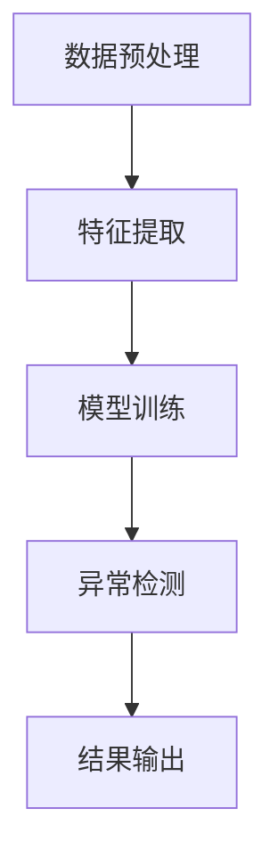
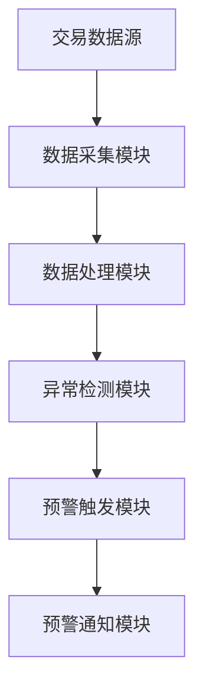

                 


# 《AI驱动的信用卡异常交易实时预警》

> 关键词：信用卡交易安全，异常检测，AI实时预警，机器学习，金融风控

> 摘要：本文深入探讨了如何利用人工智能技术实现信用卡异常交易的实时预警。通过分析交易数据的特征，结合先进的机器学习算法，构建高效的异常检测模型，并设计了实时预警系统架构。文章详细讲解了算法原理、系统实现、项目实战等内容，为金融行业提供了可参考的解决方案。

---

# 第一部分: 异常交易实时预警的背景与核心概念

## 第1章: 异常交易实时预警的背景与问题

### 1.1 信用卡交易安全的重要性
- **1.1.1 信用卡交易的基本流程**  
  信用卡交易通常包括授权、清算和结算三个阶段，涉及持卡人、发卡机构、收单机构和支付网关等多方角色。

- **1.1.2 信用卡交易中的安全风险**  
  包括欺诈交易、身份盗用、账单诈骗等，这些风险可能导致持卡人和金融机构的重大损失。

- **1.1.3 异常交易对企业与持卡人的影响**  
  异常交易可能导致持卡人账户被盗用，企业面临财务损失和声誉损害。

### 1.2 异常交易实时预警的必要性
- **1.2.1 传统交易监控的局限性**  
  传统方法依赖规则引擎，难以应对复杂多变的欺诈手段。

- **1.2.2 AI技术在交易监控中的优势**  
  AI技术能够实时分析交易数据，识别复杂模式，提高检测准确率。

- **1.2.3 实时预警在金融安全中的作用**  
  通过实时预警，金融机构可以在欺诈发生前阻止交易，保护持卡人和企业利益。

### 1.3 问题背景与目标
- **1.3.1 异常交易的定义与分类**  
  异常交易包括未经授权的交易、高额交易、地理位置异常等。

- **1.3.2 问题的边界与外延**  
  异常交易不仅包括欺诈行为，还包括持卡人误操作或其他异常情况。

- **1.3.3 目标与核心要素分析**  
  目标是通过AI技术实现实时、准确的异常交易检测和预警，核心要素包括数据特征提取、算法选择和实时处理机制。

## 第2章: AI驱动的异常交易预警核心概念

### 2.1 异常交易预警的核心概念
- **2.1.1 数据特征提取**  
  从交易数据中提取关键特征，如交易金额、时间、地点、持卡人行为模式等。

- **2.1.2 异常检测算法**  
  使用机器学习算法（如Isolation Forest、XGBoost、随机森林）进行异常检测。

- **2.1.3 实时处理机制**  
  通过流处理技术（如Apache Flink、Kafka）实现交易数据的实时分析和预警。

### 2.2 核心概念的属性对比
- **2.2.1 数据特征与交易行为的对比分析**  
  | 特征类型 | 正常交易 | 异常交易 |
  |----------|----------|----------|
  | 交易时间 | 集中于白天 | 集中于深夜 |
  | 交易金额 | 小额为主 | 大额为主 |
  | 持卡人行为 | 符合历史模式 | 违反历史模式 |

- **2.2.2 异常检测与正常交易的区分**  
  异常检测算法通过统计学习或深度学习方法，区分正常交易和异常交易。

- **2.2.3 实时处理与批量处理的效率对比**  
  | 处理方式 | 实时处理 | 批量处理 |
  |----------|----------|----------|
  | 延迟 | 几乎实时 | 小时级 |
  | 适用场景 | 实时预警 | 周期性报告 |

### 2.3 实体关系与架构分析
```mermaid
erDiagram
    customer[客户] {
        id : int
        name : string
        card_number : string
    }
    transaction[交易] {
        id : int
        time : datetime
        amount : float
        card_number : string
        status : string
    }
    rule[预警规则] {
        id : int
        condition : string
        threshold : float
    }
    customer --|> transaction : "进行交易"
    transaction --|> rule : "触发预警规则"
```

---

# 第二部分: 异常交易预警的算法原理与实现

## 第3章: 异常检测算法原理

### 3.1 基于机器学习的异常检测算法
- **3.1.1 Isolation Forest算法**  
  Isolation Forest是一种基于树结构的异常检测算法，适用于高维数据集。

- **3.1.2 XGBoost算法**  
  XGBoost是一种梯度提升树算法，能够处理非线性关系，适合分类任务。

- **3.1.3 随机森林算法**  
  随机森林通过集成多个决策树，提高模型的鲁棒性和准确性。

### 3.2 算法选择与对比
- **3.2.1 算法优缺点对比**  
  | 算法 | 优点 | 缺点 |
  |------|------|------|
  | Isolation Forest | 计算效率高 | 对异常样本的处理能力有限 |
  | XGBoost | 高准确性 | 训练时间较长 |
  | 随机森林 | 鲁棒性好 | 对异常样本的检测能力较弱 |

- **3.2.2 算法实现流程图**


### 3.3 算法数学模型与公式
- **3.3.1 Isolation Forest的核心公式**  
  Isolation Forest通过构建隔离树，计算每个样本的异常分数，公式如下：
  $$ score = \frac{1}{depth} $$

- **3.3.2 XGBoost的损失函数**  
  XGBoost使用正则化损失函数：
  $$ L = \sum_{i=1}^{n} [ -y_i \cdot \text{预测值} + \frac{1}{2}\lambda (\text{预测值})^2 ] $$

---

## 第4章: 异常检测算法的实现

### 4.1 数据预处理与特征提取
- **4.1.1 数据清洗**  
  删除重复数据、处理缺失值、标准化特征。

- **4.1.2 特征选择**  
  使用主成分分析（PCA）或特征重要性分析，选择关键特征。

### 4.2 算法实现与代码示例
- **4.2.1 使用XGBoost实现异常检测**  
  ```python
  import xgboost as xgb
  from sklearn.model_selection import train_test_split
  from sklearn.metrics import classification_report

  # 数据准备
  X_train, X_test, y_train, y_test = train_test_split(X, y, test_size=0.2)

  # 模型训练
  dtrain = xgb.DMatrix(X_train, label=y_train)
  params = {
      'objective': 'binary:logistic',
      'max_depth': 6,
      'learning_rate': 0.3,
      'n_estimators': 100
  }
  model = xgb.train(params, dtrain)

  # 模型预测
  dtest = xgb.DMatrix(X_test)
  y_pred = model.predict(dtest)

  # 模型评估
  print(classification_report(y_test, y_pred))
  ```

### 4.3 算法优化与调参
- **4.3.1 参数调优**  
  通过网格搜索（Grid Search）优化模型参数，如学习率、树的深度等。

- **4.3.2 模型评估**  
  使用准确率、召回率、F1分数等指标评估模型性能。

---

# 第三部分: 异常交易实时预警系统的架构设计

## 第5章: 系统架构设计

### 5.1 问题场景介绍
- 系统需要实时处理大量的信用卡交易数据，快速识别异常交易并发出预警。

### 5.2 系统功能设计
- **交易数据采集**  
  通过API接口实时采集交易数据，支持多种数据格式。

- **数据处理模块**  
  对交易数据进行清洗、特征提取和转换。

- **异常检测模块**  
  使用机器学习模型对数据进行实时分析，识别异常交易。

- **预警触发模块**  
  根据检测结果触发预警，通知相关人员处理。

### 5.3 系统架构图


---

## 第6章: 系统实现与优化

### 6.1 系统实现细节
- **数据采集接口**  
  使用HTTP API接口，支持RESTful协议。

- **实时处理技术**  
  采用流处理框架（如Apache Flink）进行实时数据分析。

### 6.2 系统优化策略
- **性能优化**  
  通过并行计算、分布式架构提升系统处理能力。

- **可扩展性优化**  
  设计模块化架构，支持横向扩展。

---

## 第7章: 项目实战与案例分析

### 7.1 项目环境搭建
- **开发环境**  
  安装Python、机器学习库（scikit-learn、xgboost）、数据处理工具（pandas、numpy）。

- **运行环境**  
  配置服务器环境，部署实时处理框架。

### 7.2 核心代码实现
- **数据预处理代码**  
  ```python
  import pandas as pd
  import numpy as np

  # 读取数据
  df = pd.read_csv('transactions.csv')

  # 数据清洗
  df.dropna(inplace=True)
  df = df[~df.duplicated()]

  # 特征提取
  features = df[['amount', 'time', 'card_number']]
  labels = df['is_fraud']
  ```

### 7.3 案例分析与总结
- **案例分析**  
  通过实际案例展示系统如何识别异常交易并触发预警。

- **总结**  
  通过项目实战验证系统的有效性，总结经验教训。

---

## 第8章: 最佳实践与注意事项

### 8.1 最佳实践
- **数据安全**  
  确保交易数据的安全性，防止数据泄露。

- **模型更新**  
  定期更新模型，应对新的欺诈手段。

### 8.2 注意事项
- **性能监控**  
  实时监控系统性能，确保处理延迟在可接受范围内。

- **误报率控制**  
  通过调整模型参数，降低误报率。

### 8.3 拓展阅读
- 推荐阅读《机器学习实战》、《深入浅出机器学习》等书籍。

---

# 结语
通过本文的详细讲解，我们了解了如何利用AI技术实现信用卡异常交易的实时预警。从算法原理到系统架构设计，再到项目实战，每一步都至关重要。未来，随着AI技术的不断发展，异常交易预警系统将更加智能和高效，为金融行业提供更强大的安全保障。

--- 

# END

