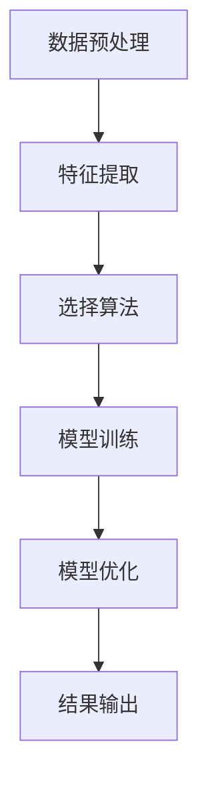
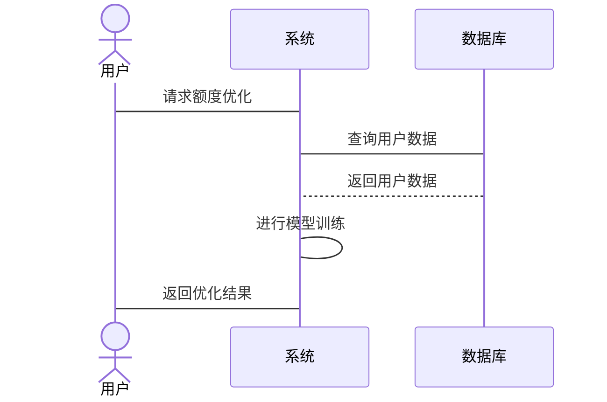

                 


# AI驱动的信用卡额度优化模型

## 关键词：
AI技术、信用卡额度优化、机器学习、风险管理、深度学习

## 摘要：
本文介绍了一种基于AI的信用卡额度优化模型，结合机器学习和深度学习技术，通过分析用户信用评估、交易行为和风险控制等多维度数据，实现智能化、动态化的额度调整。文章详细讲解了模型的背景、核心概念、算法原理、系统架构，并通过实际案例分析展示了模型的应用效果。最后，总结了模型的优势与局限性，并提出了改进建议。

---

# 第一部分：AI驱动的信用卡额度优化模型背景与概述

## 第1章：信用卡额度优化的背景与问题

### 1.1 信用卡额度优化的重要性

#### 1.1.1 信用卡额度优化的定义与目标
信用卡额度优化是指根据用户的信用状况、消费行为和市场环境等因素，动态调整信用卡授信额度，以实现风险控制和收益最大化的过程。其目标是通过科学的模型和算法，为银行和用户创造双赢的局面。

#### 1.1.2 信用卡额度优化的现实意义
信用卡额度优化能够帮助银行降低坏账率，提高客户满意度，同时还能提升银行的收益。传统的额度优化主要依赖人工经验，而AI技术的应用能够显著提高优化的效率和精准度。

#### 1.1.3 传统额度优化的局限性与挑战
传统额度优化方法存在以下问题：
1. **数据维度有限**：传统方法通常只考虑少量的用户特征，忽略了复杂的行为模式和实时数据。
2. **模型可解释性差**：复杂的金融模型往往难以解释，导致决策过程缺乏透明性。
3. **计算效率低**：面对海量数据时，传统方法的计算效率难以满足实时需求。

### 1.2 AI技术在信用卡额度优化中的应用前景

#### 1.2.1 AI技术的基本概念与特点
AI技术通过模拟人类学习和推理能力，能够处理复杂的数据关系和模式识别。其特点包括：
- 数据驱动：依赖大量数据进行训练。
- 自适应性：能够根据新的数据动态调整模型。
- 高效性：能够快速处理和分析海量数据。

#### 1.2.2 AI在金融领域的应用现状
AI技术已经在金融领域的多个方面得到了广泛应用，包括股票交易、风险管理、客户画像等。在信用卡业务中，AI技术被用于信用评估、欺诈检测和额度优化等方面。

#### 1.2.3 信用卡额度优化中AI的优势与潜力
AI技术在信用卡额度优化中的优势包括：
- **精准性**：能够基于多维度数据进行深度分析，提高额度调整的准确性。
- **实时性**：能够快速响应用户的信用变化，实现动态调整。
- **个性化**：能够根据用户的特征和行为提供个性化的额度建议。

---

# 第二部分：AI驱动的信用卡额度优化模型核心概念与原理

## 第2章：核心概念与联系

### 2.1 信用卡额度优化模型的核心要素

#### 2.1.1 用户信用评估的核心指标
用户信用评估的核心指标包括：
1. **信用评分**：基于用户的信用历史、还款记录等。
2. **收入水平**：用户的收入能力直接影响其还款能力。
3. **负债情况**：用户的现有负债情况也是重要的评估指标。

#### 2.1.2 交易行为分析的关键特征
交易行为分析的关键特征包括：
1. **消费频率**：用户的消费频率和金额。
2. **消费场景**：用户的消费场景（如餐饮、购物、旅行等）。
3. **交易时间**：用户的交易时间分布。

#### 2.1.3 风险控制的主要维度
风险控制的主要维度包括：
1. **信用风险**：用户的信用评分和还款记录。
2. **欺诈风险**：用户的交易行为是否异常。
3. **市场风险**：宏观经济环境对信用的影响。

### 2.2 AI驱动模型的原理与特征

#### 2.2.1 机器学习在信用卡额度优化中的作用
机器学习通过训练模型，能够自动学习数据中的模式和关系，从而实现对用户信用状况的精准评估。常用算法包括线性回归、随机森林和神经网络等。

#### 2.2.2 深度学习与传统机器学习的对比分析
深度学习与传统机器学习的对比如下：
| 对比维度 | 传统机器学习 | 深度学习 |
|----------|---------------|----------|
| 数据特征 | 需要特征工程 | 自动提取特征 |
| 计算效率 | 低 | 高 |
| 模型复杂度 | 简单 | 复杂 |

#### 2.2.3 模型的可解释性与鲁棒性
模型的可解释性是指模型的决策过程能够被理解和解释。深度学习模型通常具有较差的可解释性，而传统机器学习模型（如线性回归）具有较好的可解释性。

模型的鲁棒性是指模型在面对数据噪声和异常值时的表现。深度学习模型通常具有较强的鲁棒性，但需要更多的数据支持。

### 2.3 核心概念对比分析表

#### 表2.1：不同模型在信用卡额度优化中的表现对比

| 模型类型       | 优点                           | 缺点                           |
|----------------|--------------------------------|--------------------------------|
| 线性回归       | 简单、可解释性强                | 模型能力有限                   |
| 随机森林       | 高精度、能够处理非线性关系      | 对特征工程依赖较高             |
| 神经网络       | 强大的特征提取能力              | 可解释性差                     |

### 2.4 实体关系图（ER图）

#### 图2.1：信用卡额度优化模型的ER实体关系图

```mermaid
er
    actor 用户
    actor 银行
    entity 信用卡
    entity 交易记录
    entity 额度调整记录
    用户 --> 信用卡: 持有
    用户 --> 交易记录: 进行
    用户 --> 额度调整记录: 引发
    信用卡 --> 额度调整记录: 记录
    银行 --> 额度调整记录: 决策
```

---

# 第三部分：AI驱动的信用卡额度优化模型算法原理

## 第3章：算法原理与数学模型

### 3.1 线性回归模型

#### 3.1.1 线性回归的基本原理
线性回归是一种简单且常用的回归算法，其目标是通过最小化预测值与实际值之间的平方差之和，找到最佳拟合直线。

#### 3.1.2 普通最小二乘法的数学推导
普通最小二乘法的数学推导如下：
$$
\text{损失函数} = \sum_{i=1}^{n} (y_i - \hat{y}_i)^2
$$
其中，$y_i$是实际值，$\hat{y}_i$是预测值。

#### 3.1.3 线性回归的优缺点与适用场景
线性回归的优点：
- 简单、易于理解。
- 计算效率高。

线性回归的缺点：
- 无法处理非线性关系。
- 对异常值敏感。

### 3.2 随机森林模型

#### 3.2.1 随机森林的算法原理
随机森林是一种基于决策树的集成学习算法，通过构建多个决策树并进行投票或平均，提高模型的准确性和稳定性。

#### 3.2.2 Bagging与Boosting的区别与联系
Bagging和Boosting的区别如下：
| 对比维度 | Bagging | Boosting |
|----------|----------|----------|
| 样本选择 | 有放回抽样 | 无放回抽样 |
| 权重分配 | 不加权重 | 加权重 |

#### 3.2.3 随机森林在信用卡额度优化中的应用
随机森林能够处理高维数据，并且具有较强的抗过拟合能力，适用于信用卡额度优化中的用户信用评估和风险控制。

### 3.3 神经网络模型

#### 3.3.1 神经网络的基本结构
神经网络的基本结构包括输入层、隐藏层和输出层。通过调整权重和激活函数，神经网络能够学习复杂的非线性关系。

#### 3.3.2 深度学习中的卷积神经网络（CNN）与循环神经网络（RNN）
- **CNN**：常用于图像识别和序列数据处理。
- **RNN**：适用于时间序列数据的处理。

#### 3.3.3 神经网络模型的训练与优化
神经网络模型的训练过程包括正向传播和反向传播两个阶段。通过优化算法（如梯度下降）调整权重，以最小化损失函数。

### 3.4 混合模型与集成学习

#### 3.4.1 混合模型的基本概念
混合模型是将多个不同模型的预测结果进行融合，以提高模型的准确性和稳定性。

#### 3.4.2 集成学习的原理与优势
集成学习通过组合多个基模型的结果，能够显著提高模型的泛化能力。常用方法包括Bagging和Boosting。

#### 3.4.3 混合模型在信用卡额度优化中的应用
混合模型能够结合不同算法的优势，适用于信用卡额度优化中的复杂场景。

### 3.5 算法流程图

#### 图3.1：信用卡额度优化模型的算法流程图



---

# 第四部分：AI驱动的信用卡额度优化模型系统架构与实现

## 第4章：系统架构与设计方案

### 4.1 系统功能设计

#### 4.1.1 用户信用评估模块
用户信用评估模块基于用户的信用历史、收入水平和负债情况，评估用户的信用风险。

#### 4.1.2 交易行为分析模块
交易行为分析模块通过分析用户的消费频率、场景和时间，识别用户的交易风险。

#### 4.1.3 风险控制模块
风险控制模块结合信用评估和交易分析的结果，制定风险控制策略。

#### 4.1.4 模型训练与优化模块
模型训练与优化模块通过历史数据和实时数据，不断优化模型的性能。

### 4.2 系统架构设计

#### 4.2.1 分层架构设计
系统架构分为数据层、业务逻辑层和用户界面层。

#### 4.2.2 微服务架构设计
系统采用微服务架构，每个功能模块独立运行，便于扩展和维护。

#### 4.2.3 数据流与服务调用关系
数据流从用户请求开始，经过数据处理、模型训练和结果输出，最终返回给用户。

### 4.3 系统接口设计

#### 4.3.1 数据接口规范
系统需要支持多种数据格式的接口，如JSON和XML。

#### 4.3.2 模型调用接口
模型调用接口需要支持批量处理和实时调用。

#### 4.3.3 结果输出接口
结果输出接口需要支持多种格式，如JSON和CSV。

### 4.4 系统交互流程图

#### 图4.1：系统交互流程图



---

# 总结与展望

AI驱动的信用卡额度优化模型通过结合机器学习和深度学习技术，能够实现精准的信用评估和动态的额度调整。本文详细介绍了模型的背景、核心概念、算法原理和系统架构，并通过实际案例分析展示了模型的应用效果。未来，随着AI技术的不断发展，信用卡额度优化模型将更加智能化和个性化，为银行和用户提供更优质的服务。

---

# 致谢

感谢读者的耐心阅读，感谢合作伙伴的支持，感谢技术团队的努力。

