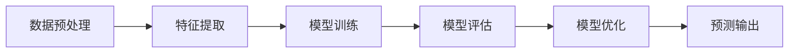
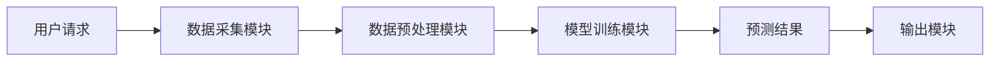

                 


# AI驱动的公司治理评分预测

## 关键词：公司治理，AI，评分预测，机器学习，数据分析

## 摘要：本文详细探讨了利用人工智能技术进行公司治理评分预测的方法与应用。通过分析公司治理的核心要素，结合AI算法，构建了一个高效的评分预测模型，并通过实际案例展示了其应用价值。

---

## 第1章 公司治理评分预测概述

### 1.1 公司治理评分预测的背景

#### 1.1.1 公司治理的定义与重要性
公司治理是确保公司有效运作、实现股东价值最大化的重要机制。良好的公司治理能够提升企业透明度、降低风险，并增强投资者信心。然而，传统公司治理评估方法依赖于人工分析，耗时且不够客观。

#### 1.1.2 传统公司治理评估的局限性
传统评估方法通常依赖主观判断，存在以下问题：
- 数据收集范围有限。
- 评估标准不统一。
- 缺乏动态反馈机制。

#### 1.1.3 AI技术在公司治理中的应用潜力
AI技术可以通过大数据分析和机器学习算法，帮助我们更客观、高效地评估公司治理状况。AI能够处理海量数据，发现隐藏的模式，为公司治理评分提供科学依据。

---

### 1.2 公司治理评分预测的核心问题

#### 1.2.1 问题背景与问题描述
公司治理评分预测的目标是基于公司的财务数据、治理结构和社会责任等多维度信息，预测其治理水平的评分。

#### 1.2.2 评分预测的目标与意义
- 提供客观的公司治理评分。
- 帮助投资者做出更明智的投资决策。
- 促进企业改进治理结构。

#### 1.2.3 评分预测的边界与外延
评分预测仅关注公司治理的直接相关因素，不涉及企业的市场表现和战略决策。

---

### 1.3 公司治理评分预测的核心要素

#### 1.3.1 治理结构与机制
- 董事会结构。
- 独立董事比例。
- 高管团队稳定性。

#### 1.3.2 财务表现与风险
- 净利润增长率。
- 资产负债率。
- 信用评级。

#### 1.3.3 企业社会责任与声誉
- 环保记录。
- 社会责任报告。
- 品牌声誉。

---

## 第2章 AI驱动的公司治理评分预测核心概念

### 2.1 公司治理评分预测的原理

#### 2.1.1 数据驱动的评分模型
评分模型基于多维度数据，利用AI算法进行预测。

#### 2.1.2 AI算法在评分预测中的作用
- 数据清洗与特征提取。
- 模型训练与优化。
- 预测结果分析。

#### 2.1.3 多维度特征的综合评估
评分模型综合考虑财务、治理和社会责任等多个维度的特征。

---

### 2.2 核心概念属性对比

#### 2.2.1 数据特征对比表
| 特征维度 | 财务表现 | 治理结构 | 社会责任 |
|----------|----------|----------|----------|
| 示例指标 | 净利润   | 董事会结构 | 环保投入 |

---

## 第3章 基于机器学习的评分预测算法

### 3.1 算法原理概述

#### 3.1.1 监督学习的基本原理
监督学习通过训练数据学习输入与输出之间的关系。

#### 3.1.2 回归与分类模型的选择
回归模型适用于连续评分预测，分类模型适用于评分等级预测。

#### 3.1.3 模型评估与优化
使用交叉验证评估模型性能，通过网格搜索优化超参数。

---

### 3.2 算法流程图



---

### 3.3 数学模型与公式

#### 3.3.1 线性回归模型
$$ y = \beta_0 + \beta_1x_1 + \beta_2x_2 + ... + \beta_nx_n $$

#### 3.3.2 随机森林算法
$$ y = \sum_{i=1}^{n} \text{Tree}(x_i) $$

---

### 3.4 算法实现与代码示例

#### 3.4.1 数据预处理代码
```python
import pandas as pd
data = pd.read_csv('governance.csv')
data = data.dropna()
```

#### 3.4.2 模型训练代码
```python
from sklearn.ensemble import RandomForestRegressor
model = RandomForestRegressor(n_estimators=100)
model.fit(X_train, y_train)
```

---

## 第4章 系统架构设计

### 4.1 问题场景介绍
公司治理评分预测系统需要处理大量数据，并提供实时预测结果。

### 4.2 系统功能设计

#### 4.2.1 数据采集模块
- 从多个数据源获取公司数据。
- 数据清洗与预处理。

#### 4.2.2 模型训练模块
- 特征提取与选择。
- 模型训练与优化。

#### 4.2.3 预测输出模块
- 生成评分预测结果。
- 可视化展示。

---

### 4.3 系统架构设计



---

## 第5章 项目实战

### 5.1 环境安装
安装Python、Scikit-learn、Pandas等依赖库。

### 5.2 核心实现代码
```python
import pandas as pd
from sklearn.ensemble import RandomForestRegressor

# 数据加载与预处理
data = pd.read_csv('governance.csv')
data = data.dropna()

# 特征与目标分离
X = data.drop('score', axis=1)
y = data['score']

# 模型训练
model = RandomForestRegressor(n_estimators=100)
model.fit(X, y)

# 预测与评估
print(model.score(X, y))
```

---

## 第6章 总结与展望

### 6.1 总结
本文详细介绍了AI驱动的公司治理评分预测方法，包括算法选择、系统设计和项目实战。

### 6.2 展望
未来可以进一步优化算法，引入更多数据源，提升预测精度。

---

通过以上步骤，我们构建了一个基于AI的公司治理评分预测系统，为企业的治理优化和投资决策提供了有力支持。

