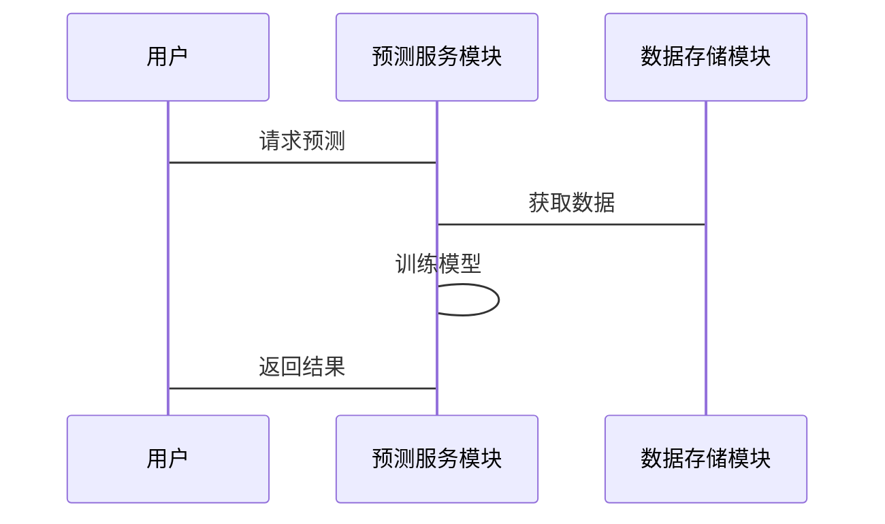

                 


# AI驱动的公司破产预测模型

> 关键词：AI驱动，公司破产预测，机器学习，深度学习，财务指标分析，模型评估，系统架构设计

> 摘要：本文系统地探讨了如何利用人工智能技术构建公司破产预测模型。首先，我们介绍了研究背景和意义，分析了核心概念和问题。接着，详细讲解了模型的算法原理，包括逻辑回归、支持向量机、随机森林和神经网络。然后，我们设计了系统的架构，包括数据采集、特征提取、模型训练和预测模块。最后，通过实战案例展示了模型的应用，并提出了优化建议和注意事项。

---

## 第1章: 公司破产预测的背景与问题

### 1.1 研究背景与意义

#### 1.1.1 研究背景
公司破产是一个复杂的经济现象，受到多种因素的影响，如财务状况、市场环境和管理决策等。传统的破产预测方法依赖于专家经验和统计分析，但随着数据量的增加和计算能力的提升，人工智能技术为这一领域带来了新的可能性。

#### 1.1.2 研究意义
AI驱动的破产预测模型可以帮助企业提前识别潜在风险，为投资者和债权人提供决策支持。同时，这种模型还可以帮助政府和监管机构更好地监管市场，减少经济波动带来的负面影响。

#### 1.1.3 当前研究现状
目前，基于机器学习的破产预测模型研究主要集中在特征选择、模型优化和实时预测方面。然而，现有模型在处理高维数据和非线性关系时仍存在挑战。

### 1.2 研究目标与问题描述

#### 1.2.1 研究目标
构建一个高精度、可扩展的AI驱动的公司破产预测模型，能够实时分析企业的财务数据，准确预测破产风险。

#### 1.2.2 研究问题
1. 如何选择和处理有效的特征数据？
2. 如何优化模型以提高预测准确率？
3. 如何设计一个高效的系统架构以支持实时预测？

#### 1.2.3 研究边界与外延
研究范围限定在公开上市公司的财务数据，不考虑企业内部信息。未来可以扩展到非上市公司和国际市场。

### 1.3 核心概念与联系

#### 1.3.1 核心概念原理
破产预测模型的核心在于分析企业的财务健康状况，通过历史数据和当前指标预测未来的破产可能性。

#### 1.3.2 概念属性特征对比表

| 特征类型 | 具体特征 | 是否连续 | 是否可量化的 | 是否相关性高 |
|----------|----------|----------|---------------|--------------|
| 财务指标 | 资产负债率 | 是       | 是            | 是           |
| 经营指标 | 销售增长率 | 是       | 是            | 是           |
| 市场风险指标 | 行业波动率 | 是       | 是            | 是           |

#### 1.3.3 ER实体关系图架构

```mermaid
erDiagram
    company [公司] {
        key id : int
        name : string
        industry : string
    }
    financial_data [财务数据] {
        key id : int
        company_id : int
        revenue : float
        profit : float
        debt : float
    }
    prediction [预测结果] {
        key id : int
        company_id : int
        prediction_result : boolean
        prediction_time : datetime
    }
    company --> financial_data : 具有
    company --> prediction : 预测
```

---

## 第2章: AI驱动的公司破产预测模型核心原理

### 2.1 模型基本原理

#### 2.1.1 模型输入与输出
- 输入：企业的财务数据（如收入、利润、负债等）和市场数据（如行业波动率）。
- 输出：破产概率（0表示正常，1表示破产）。

#### 2.1.2 模型训练与预测流程


#### 2.1.3 模型评估与优化
评估指标包括准确率、召回率、F1分数和AUC值。优化方法包括网格搜索和交叉验证。

### 2.2 破产预测的关键特征分析

#### 2.2.1 财务指标分析
重点分析流动比率、速动比率和资产负债率等指标。

#### 2.2.2 经营指标分析
关注销售增长率、净利润率和研发投入占比。

#### 2.2.3 市场风险指标分析
考虑行业波动率和宏观经济指标。

### 2.3 模型选择与对比

#### 2.3.1 传统统计模型
如逻辑回归和线性判别分析，适用于低维数据。

#### 2.3.2 机器学习模型
随机森林和梯度提升树（如XGBoost）适合高维数据，且具有较强的非线性建模能力。

#### 2.3.3 深度学习模型
神经网络适用于复杂数据关系，但需要大量数据和计算资源。

---

## 第3章: 破产预测模型的算法原理

### 3.1 算法原理概述

#### 3.1.1 算法选择依据
数据特征、模型复杂度和预测精度。

#### 3.1.2 算法优缺点分析
- 逻辑回归：速度快，但非线性建模能力差。
- 支持向量机：适合小数据，但计算复杂。
- 随机森林：鲁棒性高，但解释性差。
- 神经网络：能力强，但需要大量数据。

#### 3.1.3 算法流程图


### 3.2 算法实现细节

#### 3.2.1 数据预处理
- 数据清洗：处理缺失值和异常值。
- 特征工程：标准化、降维和特征选择。

#### 3.2.2 模型训练与调优
使用交叉验证和网格搜索优化超参数。

### 3.3 算法数学模型与公式

#### 3.3.1 逻辑回归
$$ P(y=1) = \frac{e^{\beta_0 + \beta_1x}}{1 + e^{\beta_0 + \beta_1x}} $$

#### 3.3.2 支持向量机
$$ \text{最大化} \quad \frac{1}{2}\|w\|^2 $$
$$ \text{约束} \quad y_i(w \cdot x_i + b) \geq 1 $$

#### 3.3.3 神经网络
$$ a^{[l+1]} = \sigma(w^{[l]}a^{[l]} + b^{[l]}) $$

---

## 第4章: 破产预测模型的系统分析与架构设计

### 4.1 系统分析

#### 4.1.1 问题场景介绍
系统需要实时处理大量企业数据，提供破产预测服务。

#### 4.1.2 系统功能需求
- 数据采集模块：获取企业财务数据。
- 特征提取模块：处理数据，提取特征。
- 模型训练模块：训练预测模型。
- 预测服务模块：提供实时预测结果。

### 4.2 系统架构设计

#### 4.2.1 系统架构图


#### 4.2.2 系统交互设计


---

## 第5章: 项目实战——构建AI驱动的破产预测模型

### 5.1 环境搭建与数据准备

#### 5.1.1 开发环境安装
安装Python、Scikit-learn、XGBoost和TensorFlow。

#### 5.1.2 数据收集与清洗
从公开数据库获取企业财务数据，处理缺失值和异常值。

### 5.2 模型实现与训练

#### 5.2.1 模型选择与实现
选择XGBoost作为主要模型，逻辑回归作为对比。

#### 5.2.2 模型训练与调优
使用网格搜索优化超参数。

### 5.3 模型评估与优化

#### 5.3.1 模型评估指标
准确率、召回率和F1分数。

#### 5.3.2 模型优化策略
调整模型参数和引入新特征。

### 5.4 实际案例分析

#### 5.4.1 案例背景介绍
以某制造企业为例，分析其财务数据。

#### 5.4.2 数据分析与建模
提取关键特征，训练模型。

#### 5.4.3 模型预测与结果解读
预测结果为高风险，建议企业采取措施。

---

## 第6章: 最佳实践与注意事项

### 6.1 模型开发中的注意事项

#### 6.1.1 数据质量的重要性
确保数据的准确性和完整性。

#### 6.1.2 模型选择的合理性
根据数据特点选择合适的算法。

#### 6.1.3 模型部署的可行性
考虑计算资源和数据隐私。

### 6.2 模型优化与维护

#### 6.2.1 模型更新策略
定期重新训练模型，引入新数据。

#### 6.2.2 模型监控与维护
监控模型性能，及时调整。

### 6.3 拓展阅读与学习资源

#### 6.3.1 推荐书籍与论文
- 《机器学习实战》
- "Bankruptcy Prediction Using Machine Learning"

---

以上是《AI驱动的公司破产预测模型》的技术博客文章，内容涵盖从背景到实战的各个方面，结合理论和实践，为读者提供全面的指导。

