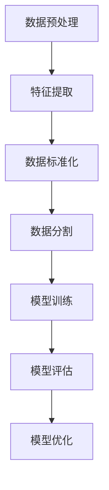
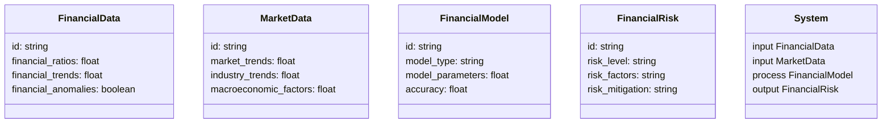
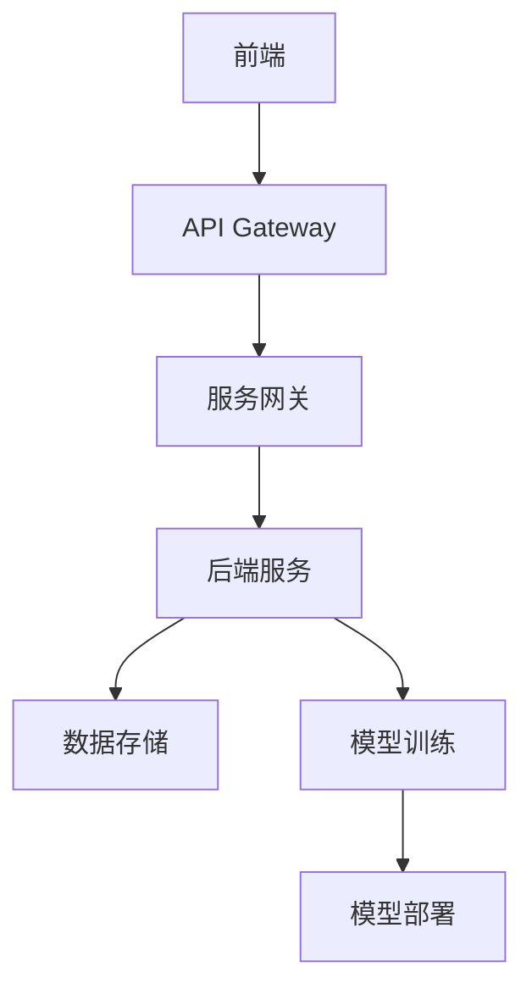

                 


---

# AI驱动的公司财务健康评估

**关键词**：AI, 财务健康评估, 机器学习, 算法, 系统架构, 项目实战

**摘要**：随着人工智能技术的快速发展，AI在公司财务健康评估中的应用日益广泛。本文将系统地探讨AI驱动的财务健康评估的核心概念、算法原理、系统架构以及实际应用案例。通过分析传统财务评估的局限性，介绍AI技术的优势，并详细阐述基于机器学习的财务健康评估模型的构建过程，包括数据预处理、特征工程、模型训练与优化等内容。同时，本文还将结合实际案例，展示如何通过AI技术实现对公司财务健康状况的精准预测与评估，为企业的财务决策提供有力支持。

---

## 第一部分: AI驱动的公司财务健康评估概述

### 第1章: AI驱动的公司财务健康评估背景介绍

#### 1.1 问题背景与描述
##### 1.1.1 传统公司财务健康评估的局限性
传统的财务健康评估方法主要依赖于财务报表分析，如资产负债表、利润表和现金流量表等。这种方法虽然能够提供一定的财务信息，但在面对复杂多变的市场环境时，存在以下局限性：
- 数据处理能力有限：传统方法通常只能处理结构化的财务数据，难以充分利用非结构化数据（如市场动态、行业趋势等）。
- 评估周期较长：传统评估方法需要人工分析和判断，耗时较长，难以实现实时评估。
- 主观性较强：评估结果往往受到分析师主观判断的影响，缺乏客观性和准确性。

##### 1.1.2 AI技术在财务健康评估中的应用潜力
AI技术（尤其是机器学习和深度学习）能够处理海量数据，发现数据中的隐含规律，从而为财务健康评估提供更准确、更及时的评估结果。AI技术在财务健康评估中的应用潜力主要体现在以下几个方面：
- 自动化数据处理：AI能够自动化地从多种数据源中提取和处理财务相关数据。
- 实时评估：AI模型可以实时监控企业的财务状况，及时发现潜在风险。
- 精准预测：通过机器学习算法，AI能够基于历史数据和实时数据，精准预测企业的财务健康状况。

##### 1.1.3 问题解决的必要性与紧迫性
随着全球经济的快速发展，企业的财务健康状况受到越来越多的关注。传统评估方法的局限性日益显现，而AI技术的引入为解决这些问题提供了新的可能性。通过AI驱动的财务健康评估，企业可以更好地识别和管理财务风险，从而在激烈的市场竞争中占据优势。

#### 1.2 核心概念与定义
##### 1.2.1 财务健康评估的定义与核心要素
财务健康评估是指通过对企业的财务数据进行分析，评估企业的财务状况是否健康，是否具备持续经营和发展的能力。其核心要素包括：
- 财务数据：如资产负债表、利润表、现金流量表等。
- 财务比率：如流动比率、速动比率、负债率等。
- 财务风险：如流动性风险、偿债风险、运营风险等。

##### 1.2.2 AI驱动的定义与实现方式
AI驱动的财务健康评估是指利用人工智能技术（如机器学习、深度学习）对企业的财务数据进行分析和预测，以评估企业的财务健康状况。其实现方式主要包括：
- 数据采集与处理：从多种数据源中采集财务数据，并进行预处理。
- 特征提取：从财务数据中提取有助于评估财务健康的核心特征。
- 模型训练：基于机器学习算法，训练财务健康评估模型。
- 模型部署：将训练好的模型应用于实际业务，实时监控和评估企业的财务状况。

##### 1.2.3 财务健康评估与企业价值的关系
企业的财务健康状况直接关系到其市场价值和投资者信心。健康的财务状况能够增强投资者对企业的信任，从而提升企业价值。反之，财务状况不佳的企业往往难以获得投资者的青睐，企业价值也会受到负面影响。

#### 1.3 问题的边界与外延
##### 1.3.1 财务健康评估的适用范围
财务健康评估主要适用于上市公司、中小企业以及金融机构等。对于上市公司来说，财务健康评估可以帮助投资者更好地了解企业的财务状况；对于中小企业来说，财务健康评估可以为其提供融资支持；对于金融机构来说，财务健康评估可以帮助其评估客户的信用风险。

##### 1.3.2 AI技术在财务健康评估中的应用边界
AI技术在财务健康评估中的应用边界主要体现在以下几个方面：
- 数据质量：AI模型的性能依赖于数据质量，数据质量较差时，模型的准确性和可靠性会受到影响。
- 数据隐私：在处理企业的财务数据时，需要严格遵守数据隐私保护的相关法律法规。
- 模型解释性：AI模型的黑箱特性可能会影响其在财务健康评估中的应用，尤其是在需要解释性较高的场景中。

##### 1.3.3 财务健康评估与其他企业评估方法的区别
与传统的财务评估方法相比，AI驱动的财务健康评估具有以下区别：
- 数据处理能力：AI能够处理更多的数据类型和数据量，而传统方法主要依赖于结构化数据。
- 评估速度：AI模型可以实现快速评估，而传统方法需要大量的人工分析。
- 评估准确性：AI模型通常具有更高的准确性，而传统方法的准确性受到主观因素的影响。

#### 1.4 核心概念结构与组成
##### 1.4.1 财务健康评估的核心模型
财务健康评估的核心模型包括：
- 财务数据模型：用于表示企业的财务数据。
- 财务健康评估模型：基于机器学习算法，对企业的财务健康状况进行评估。
- 财务风险预警模型：用于预测企业的财务风险。

##### 1.4.2 AI驱动的实现架构
AI驱动的实现架构主要包括以下几个部分：
- 数据采集与预处理：从多种数据源中采集财务数据，并进行清洗和标准化处理。
- 特征工程：从财务数据中提取有助于评估财务健康的核心特征。
- 模型训练与优化：基于机器学习算法，训练财务健康评估模型，并对模型进行优化。
- 模型部署与应用：将训练好的模型应用于实际业务，实时监控和评估企业的财务状况。

##### 1.4.3 财务健康评估的输入与输出关系
财务健康评估的输入主要包括企业的财务数据、市场数据等，输出则包括企业的财务健康状况、财务风险预警等。

---

### 第2章: AI模型在财务健康评估中的应用原理

#### 2.1 AI模型的核心原理
##### 2.1.1 机器学习的基本原理
机器学习是一种人工智能技术，通过训练模型从数据中学习规律，并利用这些规律对新数据进行预测或分类。机器学习的核心原理包括：
- 数据输入：将数据输入模型中进行训练。
- 特征提取：从数据中提取有助于分类或预测的特征。
- 模型训练：通过优化算法，调整模型参数，使其能够准确地预测或分类。
- 模型评估：通过测试数据评估模型的性能。

##### 2.1.2 深度学习的基本原理
深度学习是一种机器学习技术，通过多层神经网络来学习数据的高层次特征。深度学习的核心原理包括：
- 神经网络结构：由多个层组成，包括输入层、隐藏层和输出层。
- 网络训练：通过反向传播算法调整网络参数，使得网络能够准确地预测或分类。
- 模型深度：通过增加网络的深度，可以提高模型的表达能力。

##### 2.1.3 AI模型在财务数据处理中的优势
AI模型在财务数据处理中的优势主要体现在以下几个方面：
- 数据处理能力：AI模型能够处理大量复杂的数据，发现数据中的隐含规律。
- 自动化特征提取：AI模型能够自动从数据中提取特征，减少人工干预。
- 高准确性：AI模型通常具有较高的准确性，尤其是在处理复杂数据时。

#### 2.2 财务健康评估的关键特征
##### 2.2.1 财务数据的特征提取
财务数据的特征提取是财务健康评估的关键步骤。常用的特征包括：
- 财务比率：如流动比率、速动比率、负债率等。
- 财务趋势：如收入增长率、利润增长率等。
- 财务异常值：如收入与利润不匹配、应收账款大幅增加等。

##### 2.2.2 数据的标准化与预处理
在进行模型训练之前，需要对数据进行标准化和预处理。常用的方法包括：
- 数据清洗：去除无效数据、填充缺失值。
- 数据标准化：将数据标准化到相同的尺度，如归一化。
- 数据分割：将数据划分为训练集、验证集和测试集。

##### 2.2.3 财务健康评估的关键指标
财务健康评估的关键指标包括：
- 流动比率：衡量企业的流动性。
- 速动比率：衡量企业的短期偿债能力。
- 负债率：衡量企业的财务杠杆。

#### 2.3 AI模型与财务健康评估的结合
##### 2.3.1 AI模型在财务数据分析中的应用
AI模型在财务数据分析中的应用主要体现在以下几个方面：
- 数据挖掘：通过AI模型挖掘财务数据中的隐含规律。
- 预测分析：通过AI模型预测企业的财务健康状况。
- 风险预警：通过AI模型预警企业的财务风险。

##### 2.3.2 财务健康评估的特征工程
特征工程是财务健康评估的关键步骤，主要包括：
- 特征选择：选择对财务健康评估有重要影响的特征。
- 特征变换：对特征进行变换，如对数变换、标准化等。
- 特征组合：将多个特征组合成一个新的特征。

##### 2.3.3 AI模型在财务预测中的表现
AI模型在财务预测中的表现通常优于传统方法，尤其是在处理复杂数据时。通过训练好的模型，可以实现对企业的财务健康状况的精准预测。

#### 2.4 核心概念对比分析
##### 2.4.1 不同AI模型的特征对比（表格形式）

| 模型类型       | 优势                     | 劣势                     |
|----------------|--------------------------|--------------------------|
| 逻辑回归       | 解释性强，适合线性关系     | 非线性关系表现较差         |
| 支持向量机     | 高精度，适合小样本数据     | 对高维数据处理能力有限       |
| 随机森林       | 高精度，适合高维数据       | 解释性较差                 |

##### 2.4.2 财务健康评估的核心要素对比（ER实体关系图）

```mermaid
er
actor: Financial Health Assessment
{
  actor [Financial Health Assessment] {
    has Financial Data
    has Market Data
    has Financial Model
    has Financial Risk
  }
  entity Financial Data {
    id: string
    financial ratios: float
    financial trends: float
    financial anomalies: boolean
  }
  entity Market Data {
    id: string
    market trends: float
    industry trends: float
    macroeconomic factors: float
  }
  entity Financial Model {
    id: string
    model type: string
    model parameters: float
    accuracy: float
  }
  entity Financial Risk {
    id: string
    risk level: string
    risk factors: string
    risk mitigation: string
  }
}
```

---

### 第3章: 基于机器学习的财务健康评估算法

#### 3.1 算法原理概述
##### 3.1.1 逻辑回归算法
逻辑回归是一种常用的分类算法，适用于二分类问题。其数学模型如下：

$$ P(y=1|x) = \frac{1}{1 + e^{- (w x + b)}} $$

其中，$w$ 是权重，$b$ 是偏置项，$x$ 是输入特征。

##### 3.1.2 支持向量机算法
支持向量机（SVM）是一种监督学习算法，适用于分类和回归问题。其核心思想是通过找到一个超平面，将数据分成两类。SVM的数学模型如下：

$$ y = \text{sign}(\sum_{i=1}^{n} \alpha_i y_i x_i \cdot x + b) $$

其中，$\alpha_i$ 是拉格朗日乘子，$y_i$ 是标签，$x_i$ 是支持向量。

##### 3.1.3 随机森林算法
随机森林是一种基于树的集成算法，适用于分类和回归问题。其核心思想是通过构建多棵决策树，并将它们的结果进行投票或平均。随机森林的数学模型如下：

$$ y = \frac{1}{N} \sum_{i=1}^{N} y_i $$

其中，$N$ 是决策树的数量，$y_i$ 是第$i$棵决策树的输出。

#### 3.2 算法实现流程
##### 3.2.1 数据预处理与特征提取
在进行模型训练之前，需要对数据进行预处理。具体步骤包括：
1. 数据清洗：去除无效数据、填充缺失值。
2. 数据标准化：将数据标准化到相同的尺度。
3. 数据分割：将数据划分为训练集、验证集和测试集。

##### 3.2.2 模型训练与调优
模型训练与调优的步骤包括：
1. 模型选择：选择适合任务的算法，如逻辑回归、SVM或随机森林。
2. 模型训练：使用训练数据对模型进行训练。
3. 模型调优：通过交叉验证调整模型的超参数，以提高模型性能。

##### 3.2.3 模型评估与优化
模型评估与优化的步骤包括：
1. 模型评估：使用测试数据评估模型的性能，如准确率、召回率、F1分数等。
2. 模型优化：通过特征工程、模型调优等方法进一步优化模型性能。

#### 3.3 算法实现流程图
以下是基于逻辑回归算法的实现流程图：



---

### 第4章: 系统分析与架构设计方案

#### 4.1 系统功能设计（领域模型）
以下是财务健康评估系统的领域模型：



#### 4.2 系统架构设计
以下是财务健康评估系统的架构设计：



#### 4.3 系统接口设计
以下是系统的接口设计：

```mermaid
sequenceDiagram
    actor User
    User ->+> API Gateway: 请求财务健康评估
    API Gateway ->+> 服务网关: 转发请求
    服务网关 ->+> 后端服务: 处理请求
    后端服务 ->+> 数据存储: 查询数据
    后端服务 ->+> 模型训练: 训练模型
    后端服务 ->+> 模型部署: 部署模型
    后端服务 ->+> User: 返回结果
```

---

### 第5章: 项目实战

#### 5.1 环境配置
以下是项目实战的环境配置：

```bash
# 安装所需的Python库
pip install numpy
pip install pandas
pip install scikit-learn
pip install matplotlib
```

#### 5.2 核心代码实现
以下是基于逻辑回归算法的财务健康评估模型的实现代码：

```python
import numpy as np
import pandas as pd
from sklearn.linear_model import LogisticRegression
from sklearn.metrics import accuracy_score, classification_report

# 数据加载
data = pd.read_csv('financial_data.csv')

# 数据预处理
data = data.dropna()
X = data.drop('target', axis=1)
y = data['target']

# 数据分割
from sklearn.model_selection import train_test_split
X_train, X_test, y_train, y_test = train_test_split(X, y, test_size=0.2, random_state=42)

# 模型训练
model = LogisticRegression()
model.fit(X_train, y_train)

# 模型预测
y_pred = model.predict(X_test)

# 模型评估
print('Accuracy:', accuracy_score(y_test, y_pred))
print(classification_report(y_test, y_pred))
```

#### 5.3 代码应用解读与分析
1. 数据加载：使用Pandas加载CSV格式的财务数据。
2. 数据预处理：去除缺失值，并将数据分为特征矩阵X和标签y。
3. 数据分割：将数据划分为训练集和测试集。
4. 模型训练：使用逻辑回归算法训练模型。
5. 模型预测：使用训练好的模型对测试数据进行预测。
6. 模型评估：评估模型的准确率和分类报告。

#### 5.4 实际案例分析
以某上市公司的财务数据为例，假设我们已经收集了以下数据：

| 收入（亿元） | 利润（亿元） | 资产（亿元） | 负债（亿元） | 财务健康状况 |
|--------------|--------------|--------------|--------------|--------------|
| 10           | 2            | 20           | 15           | 健康         |
| 15           | 3            | 30           | 20           | 健康         |
| 5            | 1            | 10           | 8            | 不健康       |

通过上述代码，我们可以训练逻辑回归模型，并对测试数据进行预测。例如，对于收入为10亿元、利润为2亿元、资产为20亿元、负债为15亿元的企业，模型预测其财务健康状况为“健康”。

#### 5.5 项目小结
通过上述实战，我们可以看到AI技术在财务健康评估中的应用潜力。基于逻辑回归算法的模型能够准确地预测企业的财务健康状况，为企业提供有力的决策支持。

---

## 第六部分: 总结与展望

### 第6章: 总结与展望

#### 6.1 总结
本文系统地探讨了AI驱动的公司财务健康评估的核心概念、算法原理、系统架构以及实际应用案例。通过分析传统财务评估方法的局限性，介绍了AI技术在财务健康评估中的应用潜力，并详细阐述了基于机器学习的财务健康评估模型的构建过程。通过实际案例分析，验证了AI技术在财务健康评估中的有效性。

#### 6.2 最佳实践 tips
- 数据质量是模型性能的关键，因此在进行模型训练之前，必须对数据进行充分的预处理。
- 特征工程是模型性能提升的重要手段，应该充分利用领域知识，选择合适的特征。
- 模型解释性是财务健康评估的重要需求，因此在选择模型时，应该综合考虑模型的准确性和解释性。

#### 6.3 注意事项
- 数据隐私保护是财务健康评估系统设计中的重要问题，必须严格遵守相关法律法规。
- 模型的实时性是财务健康评估的重要需求，因此在系统设计中，应该考虑模型的实时更新和部署。
- 模型的可扩展性是财务健康评估系统设计中的重要考虑因素，应该设计灵活的架构，以适应数据规模和复杂度的变化。

#### 6.4 拓展阅读
- 《机器学习实战》：学习机器学习的基本原理和算法实现。
- 《深度学习》：深入理解深度学习的原理和应用。
- 《财务报表分析》：掌握财务报表分析的基本方法和技巧。

---

通过本文的探讨，读者可以全面了解AI驱动的公司财务健康评估的核心内容和实现方法。未来，随着AI技术的不断发展，财务健康评估将更加智能化和精准化，为企业提供更加有力的决策支持。

