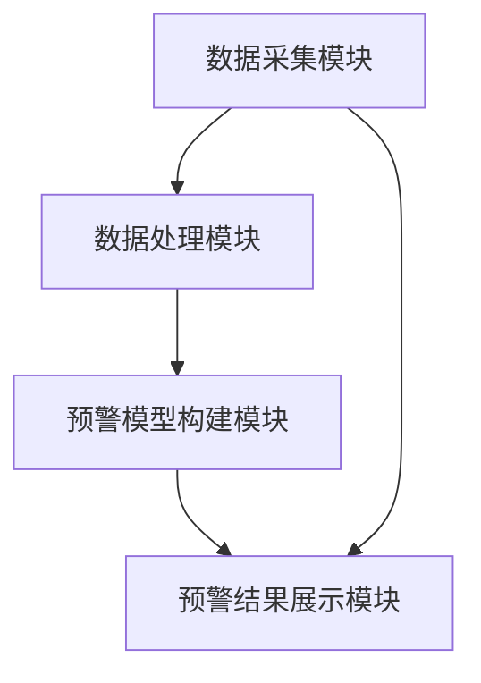
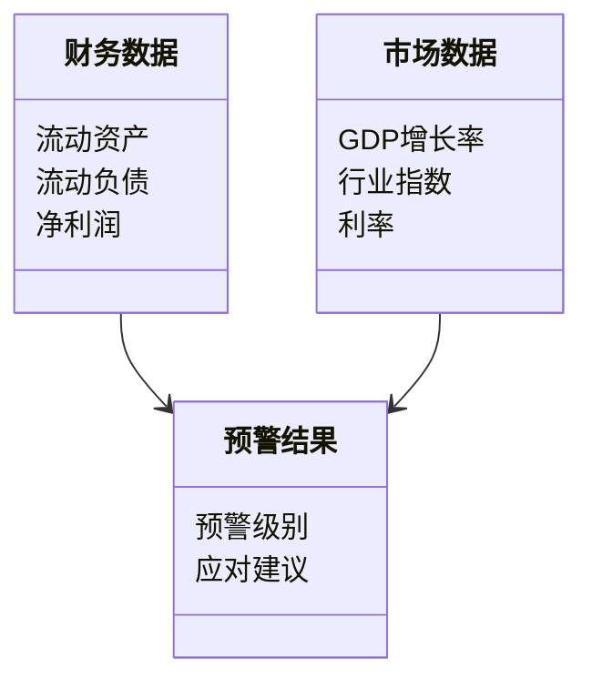

                 


# AI驱动的公司财务压力预警

> 关键词：AI技术，财务压力预警，企业风险管理，深度学习，财务数据分析

> 摘要：本文详细探讨了如何利用人工智能技术构建公司财务压力预警系统，从问题背景、核心概念、算法原理到系统架构设计，再到项目实战，全面分析了AI在财务压力预警中的应用。通过多维度数据融合和深度学习模型的构建，企业能够实现财务风险的早期识别和预警，从而在复杂多变的经济环境中保持稳健运营。

---

# 第一部分：AI驱动的公司财务压力预警背景与核心概念

## 第1章：财务压力预警的背景与问题描述

### 1.1 财务压力预警的背景
#### 1.1.1 经济波动与企业财务风险的加剧
经济环境的不确定性增加，企业面临更多的财务风险。传统的财务分析方法难以及时捕捉潜在风险。

#### 1.1.2 传统财务分析的局限性
- 数据维度单一，难以全面反映企业财务状况。
- 需要大量人工干预，效率低下。
- 预警模型缺乏动态调整能力。

#### 1.1.3 AI技术在财务分析中的潜力
- AI能够处理海量数据，发现隐藏的模式。
- 机器学习算法可以实时更新模型，提高预警准确性。

### 1.2 问题背景与目标
#### 1.2.1 财务压力预警的核心问题
- 如何从多维度数据中提取有效的预警信号。
- 如何构建高精度的财务压力预测模型。

#### 1.2.2 企业财务健康评估的挑战
- 数据清洗与特征选择的复杂性。
- 不同行业、不同规模企业的财务指标差异大。

#### 1.2.3 AI驱动预警的目标与意义
- 实现财务风险的早期识别。
- 提供数据驱动的决策支持，帮助企业制定应对策略。

### 1.3 问题解决思路
#### 1.3.1 数据驱动的分析方法
- 采用多源数据融合，包括财务数据、市场数据、行业数据等。
- 使用大数据技术进行数据清洗和特征提取。

#### 1.3.2 AI技术在财务预警中的应用路径
- 利用深度学习模型（如LSTM）捕捉时间序列数据中的异常模式。
- 使用传统机器学习算法（如逻辑回归、随机森林）进行分类预测。

#### 1.3.3 多维度数据融合的预警模型构建
- 综合考虑财务指标、市场环境、企业运营等多个维度的数据。
- 构建多层次预警模型，提高预警的准确性和鲁棒性。

---

## 第2章：AI驱动的财务压力预警核心概念

### 2.1 财务压力预警的定义与特征
#### 2.1.1 财务压力预警的定义
- 财务压力预警是指通过分析企业的财务数据和相关外部数据，预测企业是否存在潜在的财务危机，并提前发出预警信号。

#### 2.1.2 财务压力预警的关键特征
- 数据驱动性：依赖多源数据进行分析。
- 实时性：能够快速响应财务状况的变化。
- 预测性：基于历史数据预测未来的财务风险。

### 2.2 核心概念的构成要素
#### 2.2.1 财务指标分析
- 常见的财务指标包括流动比率、速动比率、负债率等。
- 这些指标能够反映企业的短期偿债能力和长期财务健康状况。

#### 2.2.2 市场环境因素
- 包括行业景气度、宏观经济指标（如GDP增长率、利率变化）等。
- 这些因素会影响企业的经营环境和财务状况。

#### 2.2.3 企业运营数据
- 包括销售数据、成本数据、供应链数据等。
- 这些数据能够反映企业的运营效率和管理能力。

### 2.3 核心概念之间的关系
#### 2.3.1 财务指标与市场环境的关系
- 市场环境的变化会影响企业的财务指标。
- 例如，经济衰退可能导致企业负债率上升。

#### 2.3.2 市场环境与企业运营的关系
- 企业的运营数据受到市场环境的影响。
- 例如，市场需求下降可能影响企业的销售数据。

#### 2.3.3 综合预警模型的构建
- 将财务指标、市场环境和企业运营数据进行融合，构建综合预警模型。
- 通过加权分析，确定各因素的重要性。

---

## 第3章：AI驱动的财务压力预警系统架构

### 3.1 系统整体架构
#### 3.1.1 数据采集模块
- 数据来源包括企业财务报表、市场数据、行业报告等。
- 数据格式多样，需要进行统一处理。

#### 3.1.2 数据处理模块
- 数据清洗：处理缺失值、异常值。
- 特征提取：从原始数据中提取有用的特征。
- 数据标准化：将数据转换为统一的格式。

#### 3.1.3 预警模型构建模块
- 选择合适的算法（如LSTM、XGBoost）进行模型训练。
- 调参优化，提高模型性能。

#### 3.1.4 预警结果展示模块
- 以可视化的方式展示预警结果，方便用户理解。
- 提供预警级别和应对建议。

### 3.2 系统功能设计
#### 3.2.1 数据清洗与特征提取
- 使用Python的Pandas库进行数据清洗。
- 通过特征工程提取有用的特征。

#### 3.2.2 预警模型训练与优化
- 使用机器学习框架（如TensorFlow、Scikit-learn）训练模型。
- 通过交叉验证优化模型参数。

#### 3.2.3 预警结果可视化
- 使用可视化工具（如Matplotlib、Tableau）展示预警结果。
- 提供交互式界面，方便用户查询历史预警记录。

### 3.3 系统架构图


---

## 第4章：AI驱动的财务压力预警算法原理

### 4.1 基于LSTM的财务压力预警模型
#### 4.1.1 LSTM简介
- 长短期记忆网络（LSTM）是一种特殊的循环神经网络（RNN）。
- 能够有效捕捉时间序列数据中的长期依赖关系。

#### 4.1.2 LSTM模型的结构
- 包含输入门、遗忘门和输出门。
- 通过 gates 的交互，实现对长期信息的保留和更新。

#### 4.1.3 LSTM在财务预警中的应用
- 使用企业的财务数据和市场数据，训练LSTM模型。
- 预测未来一段时间内企业的财务压力级别。

#### 4.1.4 LSTM模型代码示例
```python
import numpy as np
from tensorflow.keras import layers

model = layers.LSTM(64, return_sequences=True)(input_layer)
model = layers.Dense(1, activation='sigmoid')(model)
model.compile(optimizer='adam', loss='binary_crossentropy')
```

### 4.2 基于XGBoost的财务压力预警模型
#### 4.2.1 XGBoost简介
- 增量梯度提升树（XGBoost）是一种强大的回归和分类算法。
- 具有较高的准确性和效率。

#### 4.2.2 XGBoost模型的训练
- 使用企业的财务指标作为特征。
- 通过XGBoost算法训练分类模型。

#### 4.2.3 XGBoost模型代码示例
```python
import xgboost as xgb

params = {'n_estimators': 100, 'learning_rate': 0.1, 'max_depth': 6}
model = xgb.XGBClassifier(**params)
model.fit(X_train, y_train)
```

---

## 第5章：系统分析与架构设计方案

### 5.1 系统分析
#### 5.1.1 问题场景介绍
- 某企业面临财务压力，需要建立预警系统。
- 数据来源包括财务报表、市场数据等。

#### 5.1.2 项目介绍
- 项目目标：构建AI驱动的财务压力预警系统。
- 项目范围：涵盖数据采集、模型训练、结果展示等。

### 5.2 系统功能设计
#### 5.2.1 领域模型


#### 5.2.2 系统架构设计


---

## 第6章：项目实战

### 6.1 环境安装
- 安装Python、TensorFlow、XGBoost等依赖库。
- 安装数据可视化工具（如Matplotlib、Seaborn）。

### 6.2 核心代码实现
#### 6.2.1 数据预处理
```python
import pandas as pd

data = pd.read_csv('financial_data.csv')
data = data.dropna()
```

#### 6.2.2 模型训练
```python
from sklearn.model_selection import train_test_split
from sklearn.metrics import accuracy_score

X_train, X_test, y_train, y_test = train_test_split(X, y, test_size=0.2)
model.fit(X_train, y_train)
y_pred = model.predict(X_test)
print("Accuracy:", accuracy_score(y_test, y_pred))
```

#### 6.2.3 模型优化
```python
from sklearn.model_selection import GridSearchCV

param_grid = {
    'n_estimators': [50, 100, 150],
    'max_depth': [4, 6, 8]
}
grid_search = GridSearchCV(model, param_grid, cv=5)
grid_search.fit(X_train, y_train)
best_model = grid_search.best_estimator_
```

### 6.3 案例分析
#### 6.3.1 数据分析
- 通过可视化工具分析企业的财务指标变化趋势。
- 发现潜在的财务压力信号。

#### 6.3.2 模型分析
- 评估模型的准确率、召回率等性能指标。
- 根据实际数据调整模型参数。

#### 6.3.3 结果解读
- 根据模型的预警结果，制定应对策略。
- 提供具体的财务改善建议。

---

## 第7章：最佳实践与总结

### 7.1 最佳实践
#### 7.1.1 数据质量管理
- 确保数据的完整性和准确性。
- 定期更新数据源，保持模型的有效性。

#### 7.1.2 模型优化
- 根据实际情况调整模型参数。
- 定期重新训练模型，避免模型过时。

#### 7.1.3 结果解释
- 提供可操作的预警结果和建议。
- 帮助企业管理层理解模型的输出。

### 7.2 小结
- AI技术在财务压力预警中的应用前景广阔。
- 通过多维度数据融合和深度学习模型，企业能够实现财务风险的早期识别和预警。

### 7.3 注意事项
- 数据隐私和安全问题需要高度重视。
- 模型的解释性需要进一步提升，以便更好地指导企业决策。
- 在实际应用中，需要结合企业的具体情况进行调整和优化。

### 7.4 拓展阅读
- 推荐阅读《机器学习实战》、《深度学习》等书籍。
- 关注最新的AI在金融领域的应用案例。

---

通过以上内容，您可以构建一个完整的《AI驱动的公司财务压力预警》技术博客文章，涵盖从理论到实践的各个方面，帮助读者全面理解AI在财务压力预警中的应用。

