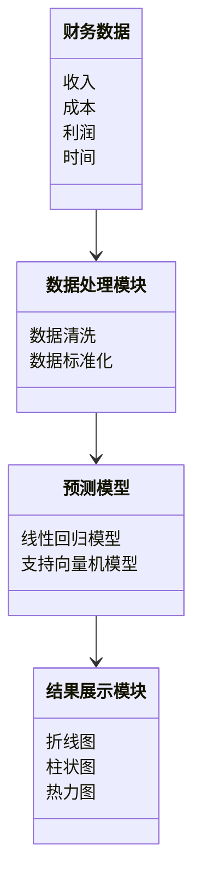
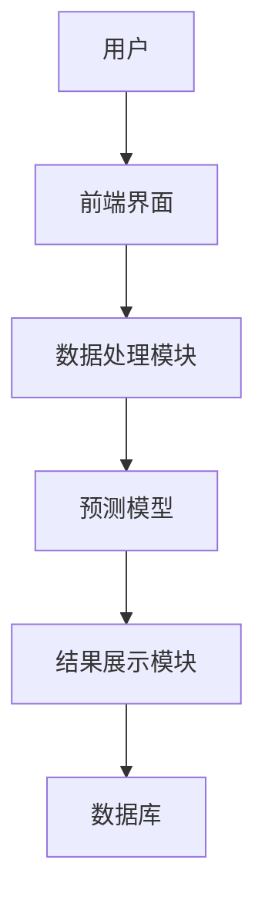
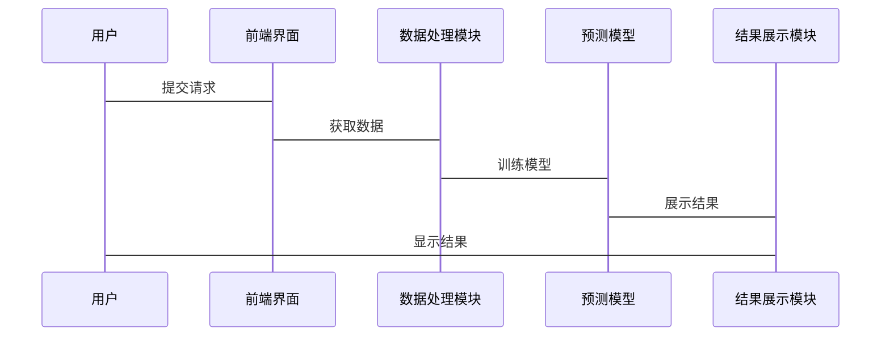

                 


# AI驱动的公司财务规划工具

## 关键词：人工智能、财务规划、机器学习、数据可视化、财务预测

## 摘要：AI驱动的公司财务规划工具利用先进的机器学习算法和大数据分析技术，为企业提供智能化的财务预测和决策支持。本文从背景、原理到实战应用，详细探讨如何通过AI技术优化财务规划流程，提升企业财务管理效率和准确性。

---

## 第1章 AI驱动的公司财务规划工具背景

### 1.1 财务规划工具的演变

#### 1.1.1 传统财务规划工具的特点
传统的财务规划工具主要依赖于财务人员的经验和手动计算，具有以下特点：
- **数据依赖性**：高度依赖历史数据和人工经验。
- **低效性**：处理大量数据时效率低下，容易出错。
- **静态性**：难以动态调整和实时更新。

#### 1.1.2 AI驱动工具的兴起
随着人工智能技术的发展，AI驱动的财务规划工具逐渐兴起，主要原因包括：
- **数据量的增长**：企业产生的财务数据量呈指数级增长。
- **技术进步**：机器学习和深度学习算法的成熟为财务预测提供了新的可能性。
- **需求驱动**：企业对更精准、更高效的财务规划工具的需求日益增长。

#### 1.1.3 企业财务规划的新需求
现代企业对财务规划工具的需求主要体现在以下几点：
- **实时性**：能够实时更新和调整财务预测。
- **准确性**：提高财务预测的准确性，减少人为错误。
- **灵活性**：能够适应不同的业务场景和数据变化。

### 1.2 AI在财务规划中的应用背景

#### 1.2.1 数据量的爆炸性增长
现代企业每天产生的财务数据量巨大，包括销售数据、成本数据、市场数据等，这些数据为企业提供了丰富的信息资源，同时也带来了处理的挑战。

#### 1.2.2 传统财务规划的局限性
传统财务规划工具的主要局限性包括：
- **人工干预过多**：依赖财务人员的主观判断，容易受到经验和主观因素的影响。
- **计算效率低**：处理大量数据时效率低下，难以满足实时性需求。
- **缺乏动态调整**：难以根据市场变化和内部数据动态调整财务预测。

#### 1.2.3 AI技术的成熟与普及
AI技术的成熟和普及为财务规划工具的智能化提供了技术支持。机器学习算法能够从大量数据中提取规律和模式，帮助企业在财务预测中做出更准确的决策。

---

## 第2章 AI驱动财务规划的核心概念

### 2.1 AI驱动财务规划的定义

#### 2.1.1 核心概念的界定
AI驱动的财务规划工具是一种利用人工智能技术，通过分析和预测财务数据，为企业提供智能化的财务规划和决策支持的工具。

#### 2.1.2 与传统财务规划的主要区别
与传统财务规划相比，AI驱动的财务规划工具具有以下主要区别：
- **自动化**：能够自动处理和分析大量数据。
- **智能化**：能够根据数据变化自动调整预测模型。
- **实时性**：能够实时更新财务预测结果。

#### 2.1.3 企业的实际应用场景
AI驱动的财务规划工具在企业的实际应用场景包括：
- **预算管理**：帮助企业制定更准确的年度预算。
- **成本控制**：帮助企业优化成本结构，降低浪费。
- **风险评估**：帮助企业评估财务风险，制定应对策略。

### 2.2 关键技术与工具

#### 2.2.1 机器学习模型
机器学习模型是AI驱动财务规划的核心技术之一，常用的模型包括线性回归、支持向量机（SVM）、随机森林等。

#### 2.2.2 自然语言处理技术
自然语言处理技术可以帮助财务工具从非结构化数据（如财务报告、市场分析报告）中提取有用信息。

#### 2.2.3 数据可视化工具
数据可视化工具能够将复杂的财务数据以图表形式展示，帮助财务人员更直观地理解和分析数据。

### 2.3 核心概念与联系

#### 2.3.1 核心概念的原理
AI驱动的财务规划工具通过以下步骤实现财务预测：
1. **数据采集**：从企业内部和外部数据源获取相关数据。
2. **数据预处理**：清洗和标准化数据，去除噪声和冗余信息。
3. **模型训练**：利用机器学习算法训练预测模型。
4. **模型预测**：根据训练好的模型进行财务预测。
5. **结果分析**：对预测结果进行分析和解读，提出优化建议。

#### 2.3.2 关键技术与工具的对比

| 技术/工具       | 特点                   | 应用场景                       |
|-----------------|------------------------|-------------------------------|
| 机器学习模型     | 高准确性，复杂性较高     | 财务预测、风险评估             |
| 自然语言处理     | 处理非结构化数据         | 数据挖掘、信息提取             |
| 数据可视化工具   | 易于理解和分析           | 数据展示、结果分析             |

#### 2.3.3 实体关系图

```mermaid
erDiagram
    customer[客户] {
        id : integer
        name : string
        budget : float
        forecast : string
    }
    transaction[交易] {
        id : integer
        date : date
        amount : float
        description : string
    }
    financial_data[财务数据] {
        id : integer
        revenue : float
        expense : float
        profit : float
        date : date
    }
    model[预测模型] {
        id : integer
        type : string
        accuracy : float
    }
    customer --> transaction : 生成
    transaction --> financial_data : 影响
    financial_data --> model : 训练
```

---

## 第3章 AI驱动财务规划的原理与流程

### 3.1 数据采集与预处理

#### 3.1.1 数据来源分析
数据来源主要包括企业内部数据（如销售数据、成本数据）和外部数据（如市场数据、经济指标）。

#### 3.1.2 数据清洗方法
数据清洗的常见方法包括：
- **去重**：去除重复数据。
- **填充缺失值**：使用均值、中位数等方法填充缺失值。
- **异常值处理**：识别并处理异常值。

#### 3.1.3 数据标准化流程
数据标准化流程包括：
1. **数据格式化**：统一数据格式。
2. **数据转换**：将数据转换为适合模型训练的形式。
3. **数据分割**：将数据分割为训练集和测试集。

### 3.2 模型训练与优化

#### 3.2.1 算法选择策略
算法选择策略包括：
- **业务需求**：根据具体的财务预测需求选择合适的算法。
- **数据特征**：根据数据特征选择适合的算法。
- **计算效率**：考虑算法的计算效率和资源消耗。

#### 3.2.2 模型调优技巧
模型调优技巧包括：
- **参数调整**：调整模型参数，如学习率、正则化系数等。
- **交叉验证**：使用交叉验证评估模型的泛化能力。
- **特征工程**：通过特征选择和特征变换优化模型性能。

#### 3.2.3 性能评估指标
常见的性能评估指标包括：
- **均方误差（MSE）**：衡量预测值与实际值之间的误差。
- **决定系数（R²）**：衡量模型的拟合优度。
- **准确率**：分类问题中的准确率。

### 3.3 结果输出与反馈

#### 3.3.1 可视化展示方法
常见的可视化展示方法包括：
- **折线图**：展示财务趋势。
- **柱状图**：展示不同项目的对比。
- **热力图**：展示数据的分布情况。

#### 3.3.2 结果解读与分析
结果解读与分析需要结合业务背景，分析预测结果的合理性和可行性。

#### 3.3.3 模型迭代优化
模型迭代优化包括：
- **数据更新**：定期更新数据，保持模型的准确性。
- **算法优化**：尝试新的算法或优化现有算法。
- **模型监控**：实时监控模型性能，及时调整和优化。

---

## 第4章 机器学习在财务规划中的应用

### 4.1 线性回归模型

#### 4.1.1 模型原理与公式
线性回归模型的数学公式为：
$$ y = \beta_0 + \beta_1x + \epsilon $$

其中：
- $y$ 是目标变量（如收入）。
- $x$ 是自变量（如时间）。
- $\beta_0$ 和 $\beta_1$ 是模型参数。
- $\epsilon$ 是误差项。

#### 4.1.2 在财务预测中的应用
线性回归模型常用于预测收入、成本等线性关系较强的数据。

#### 4.1.3 实例分析与代码实现

##### 实例分析
假设我们有一个企业的销售收入数据，我们可以使用线性回归模型预测未来几个月的收入。

##### 代码实现
```python
import numpy as np
import matplotlib.pyplot as plt
from sklearn.linear_model import LinearRegression

# 示例数据
data = np.array([[1], [2], [3], [4], [5]])
target = np.array([2, 3, 5, 6, 8])

# 训练模型
model = LinearRegression()
model.fit(data, target)

# 预测
predicted = model.predict(data)
print("预测结果:", predicted)

# 可视化
plt.scatter(data, target, color='b')
plt.plot(data, predicted, color='r')
plt.xlabel('时间')
plt.ylabel('收入')
plt.show()
```

### 4.2 支持向量机（SVM）

#### 4.2.1 SVM算法简介
支持向量机（SVM）是一种监督学习算法，常用于分类和回归问题。

#### 4.2.2 在财务预测中的应用
SVM可以用于分类问题，例如预测企业是否能够实现盈利。

#### 4.2.3 实例分析与代码实现

##### 实例分析
假设我们有一个企业的财务数据，包括收入、成本、利润等，我们可以使用SVM模型预测企业的盈利能力。

##### 代码实现
```python
import numpy as np
import matplotlib.pyplot as plt
from sklearn.svm import SVR

# 示例数据
data = np.array([[1], [2], [3], [4], [5]])
target = np.array([2, 3, 5, 6, 8])

# 训练模型
model = SVR(kernel='rbf', C=1e3, gamma=0.1)
model.fit(data, target)

# 预测
predicted = model.predict(data)
print("预测结果:", predicted)

# 可视化
plt.scatter(data, target, color='b')
plt.plot(data, predicted, color='r')
plt.xlabel('时间')
plt.ylabel('收入')
plt.show()
```

---

## 第5章 系统分析与架构设计

### 5.1 问题场景介绍

#### 5.1.1 预算管理
帮助企业制定更准确的年度预算。

#### 5.1.2 风险评估
帮助企业评估财务风险，制定应对策略。

### 5.2 项目介绍

#### 5.2.1 项目目标
开发一个AI驱动的财务规划工具，能够实现财务预测、预算管理、成本控制等功能。

#### 5.2.2 项目范围
- **数据采集**：从企业内部和外部数据源获取相关数据。
- **数据处理**：清洗和标准化数据。
- **模型训练**：训练机器学习模型。
- **结果展示**：将预测结果以可视化形式展示。

### 5.3 系统功能设计

#### 5.3.1 领域模型


#### 5.3.2 系统架构设计


#### 5.3.3 系统接口设计
系统接口包括：
- **数据接口**：从数据库中获取数据。
- **模型接口**：调用机器学习模型进行预测。
- **展示接口**：将预测结果展示给用户。

#### 5.3.4 系统交互流程


---

## 第6章 项目实战

### 6.1 环境安装

#### 6.1.1 安装Python
```bash
python --version
```

#### 6.1.2 安装必要的库
```bash
pip install numpy
pip install pandas
pip install scikit-learn
pip install matplotlib
```

### 6.2 系统核心实现源代码

#### 6.2.1 数据处理模块
```python
import numpy as np
import pandas as pd

# 读取数据
data = pd.read_csv('financial_data.csv')

# 数据清洗
data.dropna(inplace=True)
data['date'] = pd.to_datetime(data['date'])
data.set_index('date', inplace=True)

# 数据标准化
from sklearn.preprocessing import StandardScaler
scaler = StandardScaler()
scaled_data = scaler.fit_transform(data)
```

#### 6.2.2 预测模型实现
```python
from sklearn.linear_model import LinearRegression
from sklearn.svm import SVR
from sklearn.ensemble import RandomForestRegressor

# 线性回归模型
lr_model = LinearRegression()
lr_model.fit(X_train, y_train)

# 支持向量机模型
svm_model = SVR()
svm_model.fit(X_train, y_train)

# 随机森林模型
rf_model = RandomForestRegressor()
rf_model.fit(X_train, y_train)
```

#### 6.2.3 结果展示
```python
import matplotlib.pyplot as plt

# 绘制预测结果
plt.figure(figsize=(10, 6))
plt.plot(y_test, label='实际值')
plt.plot(y_pred, label='预测值')
plt.xlabel('时间')
plt.ylabel('值')
plt.legend()
plt.show()
```

### 6.3 实际案例分析

#### 6.3.1 案例背景
假设我们有一个企业的销售收入数据，希望预测未来几个月的收入。

#### 6.3.2 数据分析
通过分析历史数据，我们发现销售收入与时间呈线性关系，因此选择线性回归模型进行预测。

#### 6.3.3 模型评估
通过计算均方误差（MSE）和决定系数（R²）来评估模型的性能。

### 6.4 项目小结

#### 6.4.1 项目总结
通过本项目，我们成功开发了一个AI驱动的财务规划工具，能够实现财务预测和结果展示。

#### 6.4.2 经验教训
在项目过程中，我们发现数据预处理是非常重要的一步，数据质量直接影响模型的性能。

#### 6.4.3 优化建议
未来可以尝试引入更多的机器学习算法，如随机森林和梯度提升树（GBDT），进一步优化模型性能。

---

## 第7章 高级主题与最佳实践

### 7.1 模型优化与部署

#### 7.1.1 模型优化策略
- **超参数调优**：使用网格搜索或随机搜索优化模型参数。
- **特征选择**：通过特征重要性分析选择关键特征。
- **集成学习**：通过集成学习方法（如投票法、堆叠法）优化模型性能。

#### 7.1.2 模型部署
- **API接口**：将模型部署为API服务，方便其他系统调用。
- **Web界面**：开发一个Web界面，方便用户访问和使用模型。

### 7.2 最佳实践 tips

#### 7.2.1 数据隐私与安全
在处理企业财务数据时，必须注意数据隐私和安全问题，确保数据不被泄露。

#### 7.2.2 模型解释性
在模型部署后，需要关注模型的解释性，帮助财务人员理解模型的预测结果。

#### 7.2.3 模型更新与维护
定期更新模型，保持模型的准确性和适应性，确保模型能够应对数据的变化。

### 7.3 小结

通过本文的探讨，我们了解了AI驱动的公司财务规划工具的核心概念、算法原理和系统设计。同时，我们还通过一个实际案例展示了如何开发和应用这样的工具。未来，随着AI技术的不断发展，AI驱动的财务规划工具将在企业财务管理中发挥越来越重要的作用。

---

## 参考文献

1. 刘洋, 《机器学习实战》, 人民邮电出版社, 2018.
2. 周志华, 《机器学习》, 清华大学出版社, 2016.
3. Andrew Ng, 《Machine Learning》, Coursera, 2019.

---

## 致谢

感谢读者的耐心阅读，感谢所有在本书编写过程中提供帮助和支持的人。

--- 

通过以上思考步骤，我们可以系统地撰写一篇结构清晰、内容丰富的技术博客文章，深入探讨AI驱动的公司财务规划工具的各个方面。

