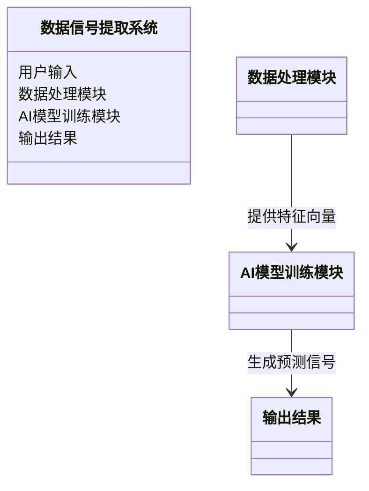
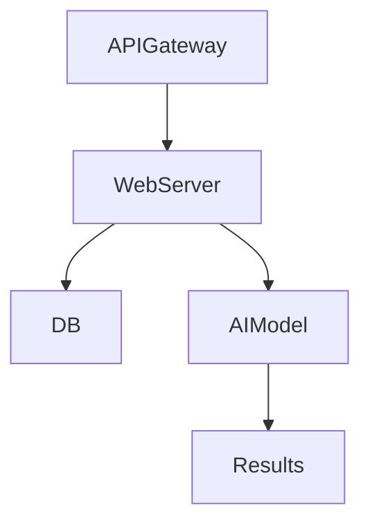
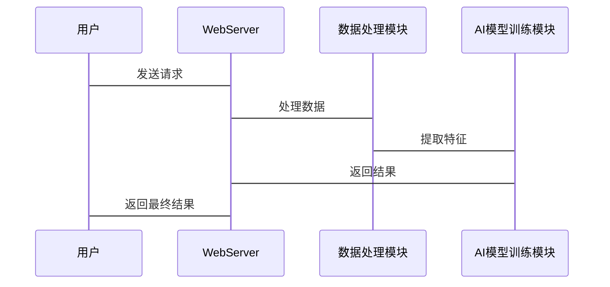

                 


# AI驱动的另类数据信号提取

## 关键词
AI, 数据信号, 另类数据, 特征提取, 深度学习, 机器学习, 数据处理

## 摘要
本文详细探讨了如何利用人工智能技术从非传统数据源中提取有价值的信息信号。文章首先介绍了数据信号提取的重要性和AI在其中的核心作用，接着深入分析了关键概念与联系，详细讲解了相关算法原理，并通过系统架构设计和项目实战展示了如何将理论应用于实际。最后，文章总结了最佳实践和未来发展方向。

---

## 第1章: 背景与问题定义

### 1.1 问题背景
#### 1.1.1 数据信号提取的定义与重要性
数据信号提取是从复杂数据中识别和提取具有特定意义的信息的过程。随着数据类型的多样化，传统的结构化数据（如表格数据）已不足以满足需求，另类数据（如文本、图像、音频、传感器数据等）的信号提取变得尤为重要。

#### 1.1.2 另类数据的定义与特点
另类数据是指非传统的结构化数据，具有多样性、复杂性和潜在价值高的特点。这些数据通常需要通过特定的信号处理方法才能提取有用信息。

#### 1.1.3 AI在数据信号提取中的作用
AI技术（特别是深度学习和机器学习）能够处理复杂的非结构化数据，通过模式识别和特征提取，帮助从另类数据中提取信号。

### 1.2 问题描述
#### 1.2.1 数据信号提取的核心挑战
- 数据多样性：不同类型的数据需要不同的处理方法。
- 信号弱化：有用信号可能被噪声掩盖。
- 计算复杂度：处理大规模数据需要高效的算法。

#### 1.2.2 另类数据的复杂性与多样性
- 文本数据：需要自然语言处理技术提取情感、关键词等信号。
- 图像数据：需要计算机视觉技术识别图像中的模式。
- 音频数据：需要语音识别技术提取语音内容。

#### 1.2.3 AI在数据信号提取中的应用前景
- 提高数据处理效率。
- 降低人工分析成本。
- 拓展数据应用场景。

### 1.3 问题解决与边界
#### 1.3.1 AI驱动的解决方案
- 利用深度学习模型（如CNN、RNN）提取数据特征。
- 使用机器学习算法（如随机森林、支持向量机）进行分类和预测。

#### 1.3.2 数据信号提取的边界与限制
- 数据质量：低质量数据可能导致提取信号的不准确。
- 计算资源：复杂的模型需要大量的计算资源。
- 模型解释性：复杂的AI模型可能难以解释提取的信号。

#### 1.3.3 另类数据的外延与应用场景
- 金融领域：从新闻、社交媒体中提取市场情绪信号。
- 医疗领域：从医学图像中提取诊断信号。
- 物联网：从传感器数据中提取设备状态信号。

---

## 第2章: 核心概念与联系

### 2.1 核心概念原理
#### 2.1.1 数据特征提取的数学模型
数据特征提取是将原始数据转换为具有代表性的特征向量的过程，常用的方法包括主成分分析（PCA）和t-SNE。

#### 2.1.2 信号处理的基本原理
信号处理包括信号采集、滤波、变换（如傅里叶变换）和压缩等步骤，旨在增强信号质量或提取信号特征。

#### 2.1.3 AI模型的训练与优化
AI模型通过大量数据训练，学习数据中的模式和特征，优化目标函数以提高信号提取的准确性。

### 2.2 核心概念对比表格
| 概念 | 描述 | 属性 |
|------|------|------|
| 数据特征 | 数据中的关键属性 | 可测量性、相关性、独立性 |
| 信号处理 | 对信号的采集、分析与转换 | 时间性、频率性、空间性 |
| AI模型 | 用于学习数据模式的算法 | 可训练性、可解释性、泛化能力 |

### 2.3 ER实体关系图
```mermaid
erDiagram
    actor 用户 {
        string 用户ID
        string 用户名
        string 密码
    }
    signal 数据信号 {
        int 信号ID
        string 信号类型
        decimal 信号强度
    }
    model AI模型 {
        int 模型ID
        string 模型名称
        binary 模型权重
    }
    用户 --> 数据信号 : 提供
    数据信号 --> AI模型 : 输入
    AI模型 --> 用户 : 输出结果
```

---

## 第3章: 算法原理讲解

### 3.1 算法原理与数学模型
#### 3.1.1 线性回归
线性回归是一种简单的回归算法，用于预测连续型目标变量。其数学模型为：
$$ y = \beta_0 + \beta_1x + \epsilon $$
其中，$\beta_0$是截距，$\beta_1$是回归系数，$\epsilon$是误差项。

#### 3.1.2 主成分分析（PCA）
PCA是一种降维技术，通过线性变换将高维数据映射到低维空间，同时保留数据的方差信息。其数学模型为：
$$ Y = X \cdot P $$
其中，$X$是原始数据矩阵，$P$是降维矩阵，$Y$是降维后的数据。

#### 3.1.3 随机森林
随机森林是一种集成学习算法，通过构建多个决策树并进行投票或平均来提高模型的泛化能力。其核心思想是通过随机选取特征和样本进行袋装，降低模型过拟合的风险。

---

## 第4章: 系统分析与架构设计方案

### 4.1 问题场景介绍
本文将从一个金融领域的案例出发，探讨如何利用AI技术从新闻数据中提取市场情绪信号。

### 4.2 系统功能设计
#### 4.2.1 领域模型设计


#### 4.2.2 系统架构设计


#### 4.2.3 系统交互设计


---

## 第5章: 项目实战

### 5.1 环境安装
- 安装Python和必要的库（如NumPy、Pandas、Scikit-learn、TensorFlow）。
- 安装Jupyter Notebook用于实验。

### 5.2 核心代码实现
```python
import numpy as np
from sklearn.decomposition import PCA
from sklearn.ensemble import RandomForestClassifier

# 示例数据
X = np.random.randn(100, 10)
y = np.random.randint(0, 2, 100)

# PCA降维
pca = PCA(n_components=2)
X_pca = pca.fit_transform(X)

# 随机森林分类
clf = RandomForestClassifier(n_estimators=100)
clf.fit(X_pca, y)
```

### 5.3 案例分析
以新闻数据为例，利用文本挖掘技术提取关键词，再通过随机森林模型预测市场情绪。

### 5.4 项目小结
通过实际案例，验证了AI驱动的数据信号提取方法的有效性，并总结了实践经验。

---

## 第6章: 最佳实践与总结

### 6.1 最佳实践
- 数据预处理是关键：清洗、标准化和特征工程。
- 选择合适的算法：根据数据类型和任务选择合适的方法。
- 模型调优：通过交叉验证优化模型参数。

### 6.2 小结
本文详细探讨了AI驱动的另类数据信号提取的理论与实践，展示了如何利用AI技术从复杂数据中提取有价值的信息。

### 6.3 注意事项
- 数据隐私：处理敏感数据时需遵守相关法律法规。
- 模型解释性：复杂的模型可能难以解释，需权衡准确性和可解释性。

### 6.4 拓展阅读
推荐阅读《深度学习》、《机器学习实战》等书籍，进一步深入学习AI技术。

---

## 结语
AI驱动的另类数据信号提取正在改变我们处理数据的方式，未来随着技术的进步，其应用将更加广泛和深入。

