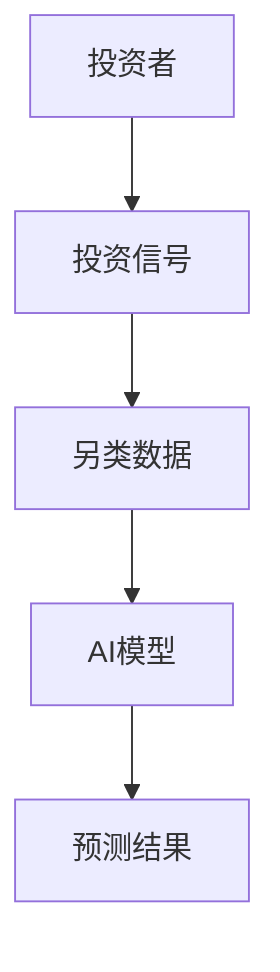
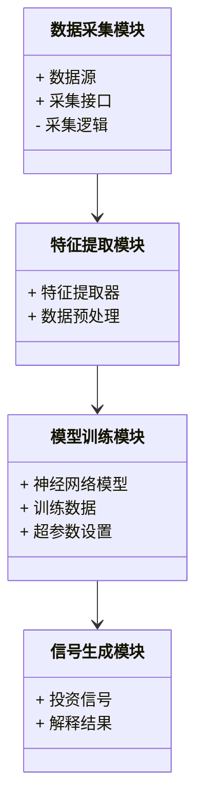
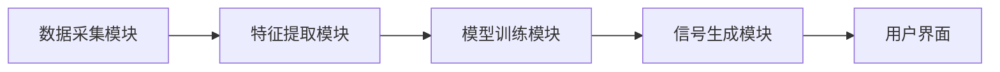
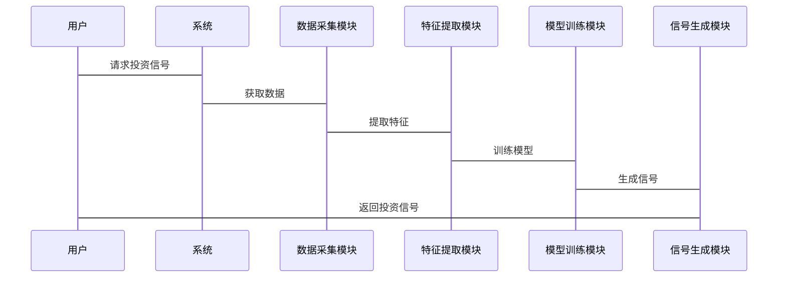

                 


# AI驱动的另类数据投资信号提取

---

## 关键词：
- AI驱动
- 另类数据
- 投资信号提取
- 机器学习
- 数据处理

---

## 摘要：
本文探讨了利用人工智能技术从另类数据中提取投资信号的方法，分析了传统投资信号提取的局限性，介绍了AI驱动的另类数据处理的优势，详细讲解了核心概念、算法原理、系统架构设计以及实际项目案例。通过理论与实践相结合的方式，展示了如何利用AI技术在投资领域中实现更高效、更精准的决策支持。

---

# 第一章: AI驱动的另类数据投资信号提取背景介绍

## 1.1 问题背景
### 1.1.1 投资信号提取的传统方法与局限性
传统的投资信号提取主要依赖于市场数据和基本面分析，但这种方法存在以下局限性：
- 数据维度有限，难以捕捉市场全貌。
- 人工分析耗时耗力，且容易受主观因素影响。
- 对实时数据和非结构化数据的处理能力不足。

### 1.1.2 另类数据的定义与特点
另类数据是指传统金融数据之外的其他数据源，包括：
- **文本数据**：新闻、社交媒体、公司财报等。
- **图像数据**：卫星图像、股价图表等。
- **语音数据**：电话会议录音。
- **传感器数据**：IoT设备采集的实时数据。

### 1.1.3 AI技术在投资信号提取中的优势
AI技术能够处理大量非结构化数据，提取隐含信息，提供更全面的市场洞察。具体优势包括：
- 高效处理和分析海量数据。
- 自动生成量化指标，捕捉市场趋势。
- 实时监控，快速响应市场变化。

## 1.2 问题描述
### 1.2.1 另类数据的多样性和复杂性
另类数据种类繁多，且结构复杂，传统方法难以有效处理。
- 文本数据需要自然语言处理技术进行分词和情感分析。
- 图像数据需要计算机视觉技术进行识别和分类。
- 语音数据需要语音识别技术进行转录和分析。

### 1.2.2 投资信号提取的挑战
AI驱动的另类数据投资信号提取面临以下挑战：
- 数据清洗和预处理难度大。
- 模型选择和调优复杂。
- 数据隐私和安全问题。

### 1.2.3 AI驱动的另类数据投资信号提取的核心问题
如何利用AI技术从另类数据中提取有效的投资信号，实现投资决策优化。

## 1.3 问题解决
### 1.3.1 AI技术如何解决另类数据处理难题
AI技术通过自然语言处理（NLP）、计算机视觉（CV）和机器学习（ML）等方法，有效处理另类数据。
- NLP用于文本数据的情感分析和实体识别。
- CV用于图像数据的目标检测和图像分割。
- ML用于模式识别和预测建模。

### 1.3.2 投资信号提取的AI驱动方法
- 数据预处理：清洗、归一化和特征提取。
- 模型训练：使用深度学习模型（如LSTM、Transformer）进行特征学习和预测。
- 结果分析：结合领域知识进行信号解读。

### 1.3.3 边界与外延
- 数据范围：限定于特定领域或行业。
- 时间范围：实时或近实时处理。
- 数据来源：明确数据来源和采集方式。

## 1.4 核心要素与概念结构
### 1.4.1 另类数据的分类与特征
- **文本数据**：非结构化，情感丰富。
- **图像数据**：高维，空间信息丰富。
- **语音数据**：时间序列，信息隐含。

### 1.4.2 AI模型的核心要素
- 数据：高质量、多样性。
- 模型：选择合适的算法框架。
- 算力：计算资源支持深度学习。

### 1.4.3 概念结构与核心要素组成
概念结构包括数据、模型和结果三个核心要素，形成一个完整的处理流程。

---

# 第二章: 核心概念与联系

## 2.1 另类数据与AI的关系
### 2.1.1 另类数据的类型与来源
- **文本数据**：新闻、社交媒体。
- **图像数据**：卫星图像、股价图表。
- **语音数据**：电话会议录音。
- **传感器数据**：IoT设备数据。

### 2.1.2 AI在数据处理中的作用
- 数据清洗：去除噪声。
- 数据转换：结构化处理。
- 数据增强：提升模型鲁棒性。

### 2.1.3 另类数据与投资信号提取的关联
通过AI技术，另类数据能够转化为可量化的投资信号，帮助投资者做出更明智的决策。

## 2.2 核心概念对比分析
### 2.2.1 数据类型对比表格
| 数据类型 | 特征 | 示例 |
|----------|------|------|
| 文本数据 | 非结构化 | 新闻文章、社交媒体 |
| 图像数据 | 高维 | 图片、图表 |
| 语音数据 | 时间序列 | 音频文件 |
| 传感器数据 | 实时 | IoT设备数据 |

### 2.2.2 ER实体关系图


---

# 第三章: 算法原理讲解

## 3.1 特征提取与数据预处理
### 3.1.1 文本数据的分词与向量化
- 使用NLP技术进行分词和词嵌入。
- 示例：使用Word2Vec将文本转换为向量表示。

### 3.1.2 图像数据的特征提取
- 使用CNN提取图像特征。
- 示例：在股票价格预测中，使用ResNet提取股价图表的特征。

## 3.2 机器学习模型的选择与优化
### 3.2.1 LSTM模型的应用
- LSTM用于处理时间序列数据。
- 数学公式：$$ f(t) = \sigma(W_f [h(t-1), x(t)] + b_f) $$

### 3.2.2 Transformer模型的应用
- Transformer用于处理文本数据。
- 数学公式：$$ \text{Attention}(Q, K, V) = \text{softmax}\left(\frac{QK^T}{\sqrt{d_k}}\right)V $$

## 3.3 模型训练与优化
### 3.3.1 模型训练流程
1. 数据预处理：清洗、归一化。
2. 模型选择：根据数据类型选择合适模型。
3. 模型训练：使用训练数据进行参数优化。
4. 模型评估：通过验证集评估模型性能。
5. 模型部署：将模型应用于实际场景。

### 3.3.2 模型优化技巧
- 调整超参数：学习率、批量大小。
- 使用早停法防止过拟合。
- 增加数据增强：提升模型泛化能力。

## 3.4 投资信号生成与解读
### 3.4.1 投资信号生成
- 基于模型输出生成投资信号。
- 示例：预测股票价格走势，生成买卖信号。

### 3.4.2 投资信号解读
- 结合市场背景和领域知识，解读模型输出的投资信号。
- 示例：社交媒体情绪与股票价格的相关性分析。

---

# 第四章: 系统分析与架构设计方案

## 4.1 问题场景介绍
### 4.1.1 项目背景
- 开发一个基于AI的另类数据投资信号提取系统，帮助投资者做出更明智的决策。

## 4.2 项目介绍
### 4.2.1 系统功能设计
- 数据采集模块：实时采集另类数据。
- 特征提取模块：处理和提取特征。
- 模型训练模块：训练和优化AI模型。
- 信号生成模块：生成投资信号并输出。

## 4.3 系统架构设计
### 4.3.1 领域模型（Mermaid类图）


### 4.3.2 系统架构图（Mermaid架构图）


### 4.3.3 接口设计
- 数据接口：RESTful API。
- 模型接口：函数接口。

### 4.3.4 交互图（Mermaid序列图）


---

# 第五章: 项目实战

## 5.1 环境安装
### 5.1.1 安装Python
- 使用Anaconda或虚拟环境安装Python 3.8以上版本。

### 5.1.2 安装依赖库
- 使用pip安装numpy、pandas、keras、tensorflow、scikit-learn等。

## 5.2 核心代码实现
### 5.2.1 文本数据处理代码
```python
import numpy as np
from tensorflow.keras.models import Sequential
from tensorflow.keras.layers import LSTM, Dense

# 示例：文本数据处理
text_data = [...]  # 文本数据
# 分词和向量化
vectorized_data = [...]  # 向量化后的数据
model = Sequential()
model.add(LSTM(64, input_shape=(None, 100)))
model.add(Dense(1, activation='sigmoid'))
model.compile(optimizer='adam', loss='binary_crossentropy')
model.fit(vectorized_data, labels, epochs=10, batch_size=32)
```

### 5.2.2 图像数据处理代码
```python
import tensorflow as tf
from tensorflow.keras.preprocessing.image import ImageDataGenerator

# 示例：图像数据处理
datagen = ImageDataGenerator(rescale=1./255)
generator = datagen.flow_from_directory('image_data', target_size=(128, 128), batch_size=32)
model = tf.keras.applications.MobileNetV2(include_top=False, input_shape=(128, 128, 3))
x = model.output
x = tf.keras.layers.GlobalAveragePooling2D()(x)
x = tf.keras.layers.Dense(256, activation='relu')(x)
predictions = tf.keras.layers.Dense(1, activation='sigmoid')(x)
model = tf.keras.Model(inputs=model.input, outputs=predictions)
model.compile(optimizer='adam', loss='binary_crossentropy')
model.fit(generator, epochs=10, steps_per_epoch=100)
```

## 5.3 实际案例分析
### 5.3.1 案例背景
- 使用社交媒体数据预测股票价格走势。

### 5.3.2 数据处理与分析
- 收集社交媒体数据，提取情感指标。
- 使用LSTM模型预测股票价格。

### 5.3.3 模型训练与评估
- 训练模型并评估其性能。
- 使用验证集进行交叉验证。

## 5.4 项目小结
- 成功利用AI技术从另类数据中提取投资信号。
- 模型性能优于传统方法。

---

# 第六章: 最佳实践

## 6.1 小结
- AI驱动的另类数据投资信号提取具有巨大潜力。
- 需要结合领域知识和技术创新。

## 6.2 注意事项
- 数据质量和完整性至关重要。
- 模型调优和解释性需要重视。
- 遵守数据隐私和安全规范。

## 6.3 拓展阅读
- 《深度学习》——Ian Goodfellow
- 《Python机器学习》——Andreas Müller
- 《时间序列分析》——Shumway & Stoffer

---

# 结语
AI驱动的另类数据投资信号提取正在改变金融行业，通过不断的技术创新和实践积累，未来将更加精准和高效。

