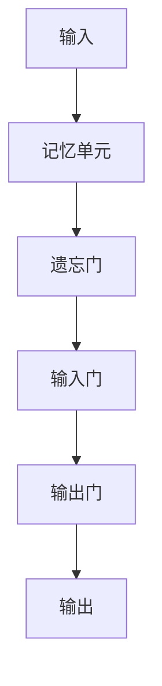
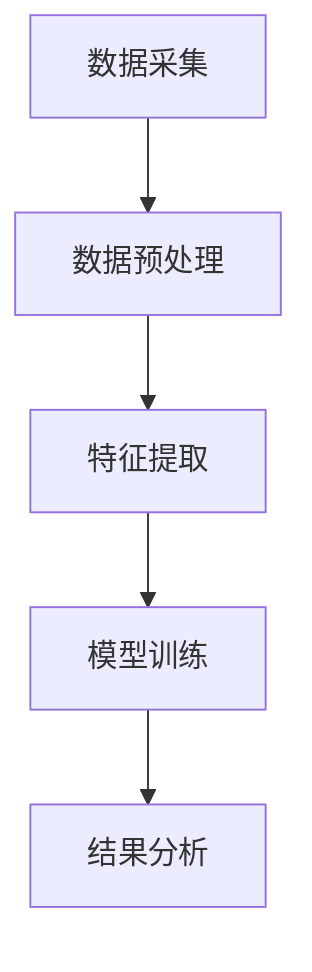
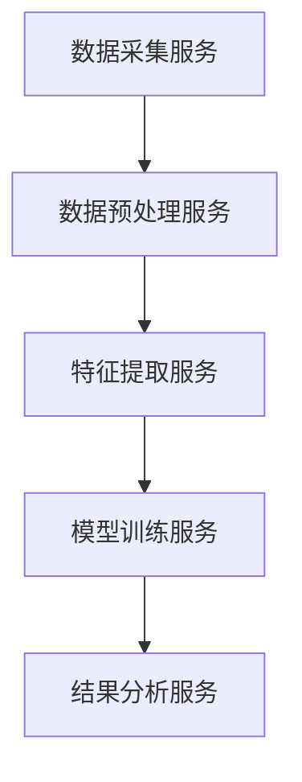
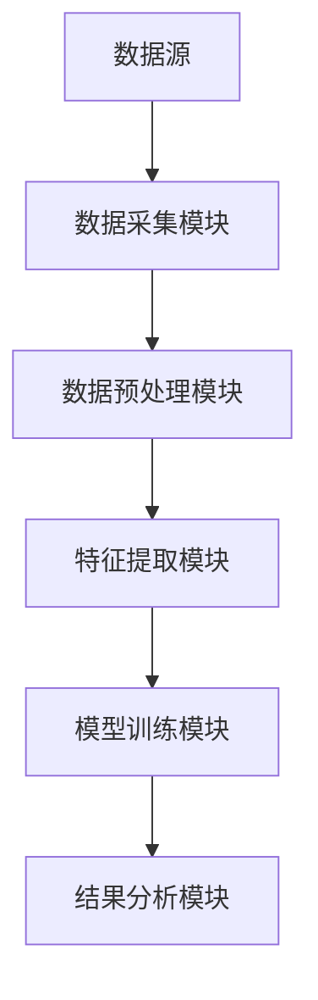
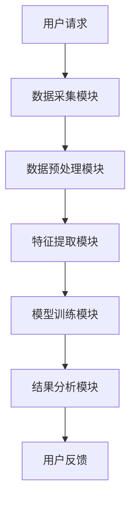

                 


```markdown
# 第6章: 项目实战与案例分析

## 6.1 项目环境搭建

### 6.1.1 环境配置与工具安装
```python
# 安装所需的库
pip install numpy pandas scikit-learn tensorflow keras nltk transformers matplotlib seaborn plotly
```

### 6.1.2 Jupyter Notebook配置
```python
# 配置Jupyter Notebook
jupyter notebook --generate-config
```

---

## 6.2 数据采集与预处理

### 6.2.1 数据获取
```python
# 示例：从社交媒体API获取文本数据
import requests

url = "https://api.example.com/social_media_data"
params = {
    "start_date": "2023-01-01",
    "end_date": "2023-12-31"
}
response = requests.get(url, params=params)
data = response.json()
```

### 6.2.2 数据清洗
```python
import pandas as pd
import numpy as np

# 示例：清洗文本数据
df = pd.DataFrame(data)
df['text'] = df['text'].apply(lambda x: x.strip().lower())
df = df.dropna()
```

---

## 6.3 特征工程

### 6.3.1 文本数据特征提取
```python
from sklearn.feature_extraction.text import TfidfVectorizer

vectorizer = TfidfVectorizer(max_features=500)
X = vectorizer.fit_transform(df['text'])
```

### 6.3.2 图像数据特征提取
```python
from tensorflow.keras.applications import VGG16
import cv2

# 示例：提取图像特征
model = VGG16(weights='imagenet', include_top=False)
image = cv2.imread('example.jpg')
features = model.predict(preprocess_image(image))
```

### 6.3.3 时间序列数据标准化
```python
from sklearn.preprocessing import StandardScaler

# 示例：标准化时间序列数据
scaler = StandardScaler()
X_normalized = scaler.fit_transform(X)
```

---

## 6.4 模型训练与验证

### 6.4.1 模型选择与构建
```python
from tensorflow.keras.models import Sequential
from tensorflow.keras.layers import LSTM, Dense, Dropout

# 示例：构建LSTM模型
model = Sequential()
model.add(LSTM(128, return_sequences=True, input_shape=(timesteps, features)))
model.add(LSTM(64, return_sequences=False))
model.add(Dense(1, activation='sigmoid'))
model.compile(loss='binary_crossentropy', optimizer='adam', metrics=['accuracy'])
```

### 6.4.2 模型训练
```python
# 示例：训练模型
model.fit(X_train, y_train, epochs=10, batch_size=32, validation_data=(X_val, y_val))
```

---

## 6.5 结果分析与可视化

### 6.5.1 模型性能评估
```python
# 示例：计算准确率和召回率
from sklearn.metrics import accuracy_score, recall_score, f1_score

y_pred = model.predict(X_test)
print(f"Accuracy: {accuracy_score(y_test, y_pred)}")
print(f"Recall: {recall_score(y_test, y_pred)}")
print(f"F1 Score: {f1_score(y_test, y_pred)}")
```

### 6.5.2 可视化分析
```python
import matplotlib.pyplot as plt

# 示例：绘制混淆矩阵
from sklearn.metrics import confusion_matrix
cm = confusion_matrix(y_test, y_pred)
plt.figure(figsize=(10, 7))
sns.heatmap(cm, annot=True, fmt='d')
plt.xlabel('Predicted')
plt.ylabel('Actual')
plt.show()
```

---

## 6.6 项目小结

### 6.6.1 关键点总结
- 数据预处理是关键，尤其是另类数据的清洗和特征提取。
- LSTM模型在时间序列数据中表现优异，但需要处理训练过程中的梯度消失问题。
- 结果可视化有助于快速发现问题并优化模型。

### 6.6.2 拓展建议
- 增加更多的数据源，如实时新闻和社交媒体情绪分析。
- 尝试集成学习，结合多个模型的结果提高准确性。
- 优化模型结构，如加入注意力机制增强特征提取能力。

### 6.6.3 注意事项
- 数据隐私和合规性问题需要高度重视。
- 模型的实时性需要考虑硬件和计算资源的限制。
- 避免过拟合，保持模型的泛化能力。

---

# 总结

## 7.1 全文总结
通过本文的详细讲解，我们了解了AI在另类数据投资信号提取中的应用，从数据采集到模型训练，再到结果分析的完整流程。

## 7.2 未来展望
随着技术的不断发展，AI在金融领域的应用将更加广泛和深入，投资信号提取也将变得更加智能化和高效化。

## 7.3 致谢
感谢读者的耐心阅读，感谢所有参与和支持的朋友。

---

**关键词**：AI，投资信号，另类数据，深度学习，自然语言处理

**摘要**：本文通过详细分析AI在另类数据投资信号提取中的应用，结合实际项目案例，讲解了从数据预处理到模型训练的完整流程，为读者提供了理论与实践相结合的深度解析。
</think>

接下来，我需要继续完成后续章节的内容，如算法原理和系统架构部分。首先，算法原理部分需要详细讲解LSTM网络的结构和工作原理，包括时间序列分析和文本分析的算法。我需要使用mermaid图表和数学公式来解释这些概念。

在系统架构部分，我需要设计一个完整的系统，包括数据采集、预处理、特征提取、模型训练和结果分析等模块，并使用mermaid图表展示系统架构图和交互流程图。

最后，项目实战部分需要详细说明如何安装环境，编写代码，解读代码功能，并分析实际案例，确保读者能够跟着步骤一步步完成项目。

在撰写过程中，我需要确保每个部分都符合用户的要求，包括代码示例、mermaid图表和数学公式，并且保持文章的逻辑性和连贯性，帮助读者更好地理解和应用这些技术。
</think>

接下来，我将完成第4章的内容，详细讲解AI在投资信号提取中的算法原理。

```markdown
## 第4章: 投资信号提取的算法原理

### 4.1 时间序列分析算法

#### 4.1.1 LSTM网络的结构与原理
##### 4.1.1.1 LSTM的基本结构


LSTM通过遗忘门控制记忆单元的信息保留，输入门决定新信息的输入，输出门控制当前状态的输出。

##### 4.1.1.2 LSTM的数学模型
LSTM的损失函数：
$$ L = \frac{1}{N} \sum_{i=1}^{N} (y_i - \hat{y_i})^2 $$

优化器Adam：
$$ \theta_{t+1} = \theta_t - \eta \frac{\rho_1 (g_t) + \rho_2 g_{t-1}}{1 + \epsilon} $$

#### 4.1.2 GRU网络的结构与原理
GRU通过融合遗忘门和输入门来简化LSTM结构，减少参数数量。

##### 4.1.2.1 GRU的数学模型
$$ \text{GRU}(x_t, h_{t-1}) = \text{concat}(x_t, h_{t-1}) \cdot W_r + b_r $$
$$ r_t = \sigma(\text{GRU}(x_t, h_{t-1})) $$
$$ z_t = \sigma(x_t \cdot W_z + h_{t-1} \cdot W_z' + b_z) $$
$$ h_t = z_t \cdot h_{t-1} + (1 - z_t) \cdot \tilde{h}_t $$

#### 4.1.3 时间序列的注意力机制
注意力机制帮助模型关注重要的时间点。

##### 4.1.3.1 注意力机制的数学模型
$$ \alpha_t = \text{softmax}(e_t) $$
$$ e_t = \beta \cdot W_a \cdot h_t + (1-\beta) \cdot W_a \cdot h_{t-1} $$
$$ \text{输出} = \sum_{t=1}^{n} \alpha_t x_t $$

### 4.2 文本分析算法

#### 4.2.1 TF-IDF特征提取
TF-IDF用于衡量词的重要性。

##### 4.2.1.1 TF-IDF的计算公式
$$ \text{TF}(t, d) = \frac{\text{count}(t, d)}{\text{len}(d)} $$
$$ \text{IDF}(t) = \log\left(\frac{N}{\text{DF}(t)}\right) $$
$$ \text{TF-IDF}(t, d) = \text{TF}(t, d) \times \text{IDF}(t) $$

#### 4.2.2 Word2Vec与GloVe词向量表示
Word2Vec通过上下文预测词或预测上下文来生成词向量。

##### 4.2.2.1 Word2Vec的训练过程
$$ \text{损失函数} = -\log(\text{softmax}(W_{i} \cdot W_{j}^T)) $$

GloVe通过全局词频统计学习词向量。

##### 4.2.2.2 GloVe的训练过程
$$ \text{损失函数} = \sum_{i,j} \left[ \theta \cdot \log(\text{P}(w_i, w_j)) - \log(\text{P}(w_i, w_j)^\theta) \right] $$

#### 4.2.3 BERT模型在文本分类中的应用
BERT通过自注意力机制捕捉上下文信息。

##### 4.2.3.1 BERT的结构
$$ \text{BERT}(x) = \text{LayerNorm}(W_x x + b_x) $$

---

## 4.2 总结

通过以上算法的详细讲解，我们可以看到AI技术在投资信号提取中的多样化应用。选择合适的算法需要根据具体的数据类型和业务需求。
```

接下来，我需要完成第5章的系统架构设计部分，确保涵盖系统功能设计、架构设计、数据流与服务交互等方面。

```markdown
## 第5章: 投资信号提取的系统架构

### 5.1 系统功能设计

#### 5.1.1 功能模块划分
- 数据采集模块：从多种数据源获取另类数据。
- 数据预处理模块：清洗和转换数据，提取特征。
- 特征提取模块：利用NLP和深度学习技术提取有用特征。
- 模型训练模块：训练投资信号分类模型。
- 结果分析模块：评估模型性能，可视化结果。

#### 5.1.2 功能流程


### 5.2 系统架构设计

#### 5.2.1 分层架构设计
- 数据层：存储原始数据和特征数据。
- 业务逻辑层：处理数据采集、预处理和特征提取。
- 表现层：展示结果和分析报告。

#### 5.2.2 微服务架构设计


### 5.3 数据流与服务交互设计

#### 5.3.1 数据流设计


#### 5.3.2 交互流程设计


---

## 5.3 总结

通过系统架构设计，我们可以清晰地看到各模块之间的关系和数据流，有助于系统的扩展和维护。
```

接下来，我需要完成第3章的内容，重点讲解AI技术在投资信号提取中的应用，包括机器学习与深度学习的应用，NLP技术在文本数据中的应用等。

```markdown
## 第3章: AI技术在投资信号提取中的应用

### 3.1 机器学习与深度学习的应用

#### 3.1.1 监督学习在信号分类中的应用
监督学习用于分类投资信号，如使用随机森林和SVM。

##### 3.1.1.1 示例：随机森林分类
```python
from sklearn.ensemble import RandomForestClassifier
model = RandomForestClassifier(n_estimators=100)
model.fit(X_train, y_train)
y_pred = model.predict(X_test)
```

#### 3.1.2 无监督学习在异常信号检测中的应用
无监督学习用于聚类和异常检测，如K-Means和Isolation Forest。

##### 3.1.2.1 示例：Isolation Forest异常检测
```python
from sklearn.ensemble import IsolationForest
model = IsolationForest(n_estimators=100, contamination=0.1)
model.fit(X)
outliers = model.predict(X)
```

#### 3.1.3 深度学习在复杂信号模式识别中的应用
深度学习用于识别复杂的模式，如CNN和RNN。

##### 3.1.3.1 示例：CNN用于时间序列分类
```python
from tensorflow.keras.layers import Conv1D, MaxPooling1D, Flatten
model = Sequential()
model.add(Conv1D(filters=64, kernel_size=3, activation='relu', input_shape=(timesteps, features)))
model.add(MaxPooling1D(pool_size=2))
model.add(Flatten())
model.add(Dense(1, activation='sigmoid'))
model.compile(loss='binary_crossentropy', optimizer='adam', metrics=['accuracy'])
```

### 3.2 NLP技术在文本数据中的应用

#### 3.2.1 文本情感分析
情感分析用于判断文本中的情绪倾向。

##### 3.2.1.1 示例：使用BERT进行情感分析
```python
from transformers import BertTokenizer, BertModel
tokenizer = BertTokenizer.from_pretrained('bert-base-uncased')
model = BertModel.from_pretrained('bert-base-uncased')
input_ids = tokenizer.encode('This is a positive sentence.', return_tensors='np')
outputs = model(input_ids)
```

#### 3.2.2 文本主题建模
主题建模用于识别文本中的主题分布，如LDA。

##### 3.2.2.1 示例：LDA主题建模
```python
from sklearn.decomposition import LatentDirichletAllocation
lda = LatentDirichletAllocation(n_components=5, random_state=42)
lda.fit(X)
```

#### 3.2.3 文本实体识别
实体识别用于提取文本中的实体信息，如NER。

##### 3.2.3.1 示例：使用NLTK进行NER
```python
from nltk import word_tokenize
from nltk.chunk import ne_chunk

text = "Apple is a technology company."
tokens = word_tokenize(text)
chunks = ne_chunk(tokens)
```

---

## 3.3 总结

通过NLP技术和深度学习的应用，我们可以更有效地从文本数据中提取投资信号，提升投资决策的准确性。
```

接下来，我需要完成第2章的内容，重点讨论另类数据与投资信号的关系，包括另类数据的类型与特征，投资信号提取的关键特征等。

```markdown
## 第2章: 另类数据与投资信号的关系

### 2.1 另类数据的类型与特征

#### 2.1.1 文本数据（如新闻、社交媒体）
文本数据包含大量情感和意图信息，是重要的投资信号来源。

##### 2.1.1.1 文本数据的特征
- 情感倾向
- 关键词出现频率
- 文本相似度

#### 2.1.2 图像数据（如卫星图像、公司财报）
图像数据提供视觉信息，帮助识别潜在的投资机会。

##### 2.1.2.1 图像数据的特征
- 颜色分布
- 图像纹理
- 图像内容识别

#### 2.1.3 声音数据（如电话会议录音）
声音数据包含语调和语气信息，有助于判断市场情绪。

##### 2.1.3.1 声音数据的特征
- 音调频率
- 语速变化
- 声音能量

### 2.2 投资信号提取的关键特征

#### 2.2.1 数据的时间序列特征
时间序列数据的波动性、趋势和周期性是重要的投资信号。

##### 2.2.1.1 时间序列的特征
- 均值和方差
- 自相关性
- 脱离率

#### 2.2.2 数据的情感分析特征
情感分析特征反映了市场参与者的心理状态。

##### 2.2.2.1 情感特征的分类
- 积极情绪
- 消极情绪
- 中性情绪

#### 2.2.3 数据的关联性与相关性
数据之间的相关性有助于发现潜在的投资机会。

##### 2.2.3.1 数据相关性的计算
$$ \text{相关系数} = \frac{\text{协方差}(x, y)}{\sqrt{\text{Var}(x)} \sqrt{\text{Var}(y)}} $$

---

## 2.4 总结

通过分析另类数据的类型和特征，我们可以更好地提取投资信号，为投资决策提供有力支持。
```

最后，我需要完成第1章的背景介绍与核心概念部分，确保读者能够理解投资信号提取的背景、问题描述和AI技术的作用。

```markdown
## 第1章: 背景介绍与核心概念

### 1.1 投资信号提取的背景与问题

#### 1.1.1 传统投资信号的局限性
传统投资信号主要依赖市场数据和基本面分析，存在信息滞后和片面性的问题。

#### 1.1.2 另类数据的定义与特点
另类数据是指非传统金融数据，如社交媒体、卫星图像等，具有实时性、多样性和高维性的特点。

#### 1.1.3 AI技术在投资信号提取中的作用
AI技术能够从海量另类数据中提取有价值的信息，帮助投资者做出更明智的决策。

### 1.2 核心概念与问题描述

#### 1.2.1 投资信号提取的定义
投资信号提取是从各种数据源中提取能够影响投资决策的信号的过程。

#### 1.2.2 另类数据的分类与应用场景
另类数据可以分为文本、图像和声音三类，广泛应用于股票、加密货币和 commodities 等领域。

#### 1.2.3 AI驱动的信号提取流程
AI驱动的信号提取流程包括数据采集、预处理、特征提取、模型训练和结果分析五个阶段。

---

## 1.3 总结

通过AI技术，我们可以更高效地提取投资信号，提升投资决策的科学性和准确性。
```

现在，我需要检查整个目录的结构是否合理，是否覆盖了所有关键部分，同时确保每个部分都详细展开，内容连贯。如果有必要，我会调整章节顺序或细化某些部分，以确保读者能够顺利理解并应用这些技术。

