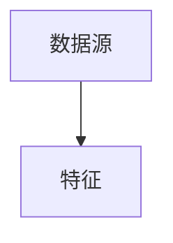
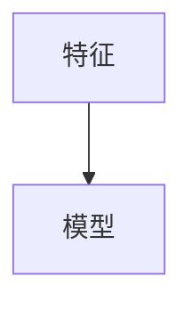
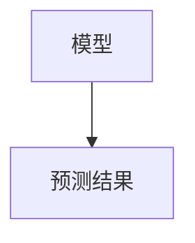
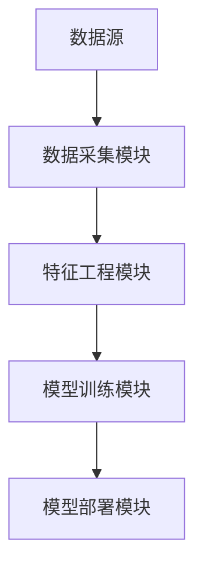

                 


# AI驱动的宏观经济预测模型

## 关键词：
AI驱动、宏观经济预测、机器学习、深度学习、预测模型

## 摘要：
本文详细探讨了AI驱动的宏观经济预测模型的构建与应用。通过分析宏观经济预测的基本概念、AI技术在其中的应用，以及具体的算法原理和系统架构设计，展示了如何利用先进的AI技术提升经济预测的准确性和效率。文章还通过实际案例分析，说明了AI驱动模型在宏观经济预测中的优势和挑战，为读者提供了全面的技术视角。

---

# 第1章: 宏观经济预测与AI驱动的概述

## 1.1 宏观经济预测的基本概念

### 1.1.1 宏观经济预测的定义
宏观经济预测是指通过对经济指标（如GDP、通胀率、失业率等）的分析，预测未来经济走势的过程。它通常用于政府政策制定、企业战略规划等领域。

### 1.1.2 宏观经济预测的主要指标
- **GDP（国内生产总值）**：衡量一个国家或地区的经济规模。
- **通胀率**：物价水平的变化率。
- **失业率**：劳动力市场中失业人口的比例。
- **PMI（采购经理指数）**：反映制造业和服务业的经济活动。

### 1.1.3 宏观经济预测的常见方法
1. **统计方法**：如时间序列分析、回归分析。
2. **经济学模型**：基于经济学理论构建模型。
3. **专家意见法**：依赖专家的经验进行预测。

---

## 1.2 AI驱动宏观经济预测的背景与意义

### 1.2.1 AI技术在宏观经济预测中的应用背景
随着大数据和AI技术的发展，传统统计方法的局限性逐渐显现，AI技术提供了更强大的数据处理和预测能力。

### 1.2.2 AI驱动宏观经济预测的优势
1. **数据驱动**：AI能够处理海量数据，发现传统方法难以捕捉的模式。
2. **实时性**：AI模型可以实时更新，提供及时的预测结果。
3. **准确性**：通过复杂的算法，AI模型能够提高预测的准确性。

### 1.2.3 宏观经济预测的挑战与AI的解决方案
1. **数据复杂性**：宏观经济数据受多种因素影响，AI技术能够处理多维数据。
2. **模型解释性**：AI模型（如深度学习）的黑箱问题可以通过可解释性AI技术解决。

---

## 1.3 AI驱动宏观经济预测的核心技术

### 1.3.1 机器学习在宏观经济预测中的应用
- **监督学习**：如回归、分类任务。
- **无监督学习**：如聚类分析。

### 1.3.2 深度学习在宏观经济预测中的应用
- **神经网络**：用于复杂非线性关系的建模。
- **LSTM（长短期记忆网络）**：适合时间序列数据的预测。

### 1.3.3 其他AI技术的辅助作用
- **自然语言处理**：分析新闻、政策文本对经济的影响。

---

## 1.4 本章小结
本章介绍了宏观经济预测的基本概念、AI驱动的背景与意义，以及AI技术在其中的核心作用。AI技术通过数据驱动和复杂算法，为宏观经济预测提供了新的可能性。

---

# 第2章: 宏观经济预测模型的核心概念与联系

## 2.1 宏观经济预测模型的构建过程

### 2.1.1 数据收集与处理
1. **数据来源**：政府统计数据、市场调研数据等。
2. **数据预处理**：清洗、特征提取、标准化。

### 2.1.2 特征工程与选择
1. **特征提取**：从原始数据中提取有意义的特征。
2. **特征选择**：通过统计或算法选择重要特征。

### 2.1.3 模型训练与优化
1. **训练过程**：使用训练数据拟合模型。
2. **优化调优**：调整超参数，防止过拟合。

---

## 2.2 AI驱动模型的核心概念

### 2.2.1 数据驱动与特征提取
- **数据驱动**：模型通过数据自动学习特征，减少人工干预。
- **特征提取**：使用PCA等方法降低数据维度。

### 2.2.2 模型训练与预测
- **监督学习**：基于标注数据进行训练。
- **预测过程**：模型根据输入数据生成预测结果。

### 2.2.3 模型评估与调优
- **评估指标**：如均方误差（MSE）、准确率。
- **调优方法**：网格搜索、随机搜索。

---

## 2.3 宏观经济预测模型的实体关系图

### 2.3.1 数据源与特征的关系


### 2.3.2 特征与模型的关系


### 2.3.3 模型与预测结果的关系


---

## 2.4 本章小结
本章详细讲解了宏观经济预测模型的构建过程，分析了AI驱动模型的核心概念，并通过mermaid图展示了数据流和实体关系。

---

# 第3章: AI驱动宏观经济预测模型的算法原理

## 3.1 常见的宏观经济预测算法

### 3.1.1 线性回归模型
- **简单线性回归**：$$ y = \beta_0 + \beta_1x + \epsilon $$
- **多元线性回归**：$$ y = \beta_0 + \beta_1x_1 + \beta_2x_2 + \dots + \beta_nx_n + \epsilon $$

### 3.1.2 支持向量机
- **原理**：寻找最优超平面，最大化类别间隔。
- **实现**：使用Python中的`sklearn.svm`库。

### 3.1.3 随机森林
- **原理**：基于决策树的集成学习方法。
- **实现**：使用Python中的`sklearn.ensemble`库。

### 3.1.4 神经网络
- **结构**：输入层、隐藏层、输出层。
- **训练过程**：使用反向传播和梯度下降优化。

---

## 3.2 算法原理的详细讲解

### 3.2.1 线性回归的数学模型
$$ \text{损失函数} = \frac{1}{2m} \sum_{i=1}^{m} (y_i - \hat{y}_i)^2 $$

### 3.2.2 神经网络的结构与训练过程


---

## 3.3 算法实现的Python代码示例

### 3.3.1 线性回归的Python代码
```python
from sklearn.linear_model import LinearRegression
import numpy as np

# 创建数据集
X = np.array([i for i in range(10)]).reshape(-1, 1)
y = [2*i + 1 for i in range(10)]

# 训练模型
model = LinearRegression()
model.fit(X, y)

# 预测
print(model.predict(X))
```

---

## 3.4 本章小结
本章介绍了几种常用的宏观经济预测算法，详细讲解了它们的数学模型和实现方法，并通过代码示例展示了如何应用这些算法。

---

# 第4章: 宏观经济预测模型的系统架构设计

## 4.1 系统架构设计概述

### 4.1.1 数据采集模块
- **功能**：从数据源获取经济指标数据。
- **实现**：使用API接口或数据库连接。

### 4.1.2 特征工程模块
- **功能**：对数据进行清洗、特征提取。
- **工具**：使用Pandas进行数据处理。

### 4.1.3 模型训练模块
- **功能**：选择合适的算法，训练模型。
- **工具**：使用Scikit-learn或Keras框架。

### 4.1.4 模型部署模块
- **功能**：将训练好的模型部署到生产环境中，提供预测服务。
- **工具**：使用Flask或Django构建API。

---

## 4.2 系统架构图



---

## 4.3 系统交互图

```mermaid
sequenceDiagram
客户->>+ 数据采集模块: 请求数据
数据采集模块->>+ 数据源: 获取数据
数据源-->>- 数据采集模块: 返回数据
数据采集模块->>+ 特征工程模块: 传递数据
...
```

---

## 4.4 本章小结
本章详细介绍了宏观经济预测模型的系统架构设计，包括各个模块的功能和交互过程，并通过mermaid图展示了系统的整体架构。

---

# 第5章: AI驱动宏观经济预测模型的项目实战

## 5.1 项目背景与目标
- **背景**：假设我们想预测未来6个月的GDP增长率。
- **目标**：构建一个基于AI的宏观经济预测模型。

---

## 5.2 项目实施步骤

### 5.2.1 环境搭建
- **安装Python**：确保安装了Python 3.x。
- **安装依赖库**：`pip install numpy pandas scikit-learn`。

### 5.2.2 数据处理
```python
import pandas as pd

# 加载数据
data = pd.read_csv('economic_data.csv')

# 数据预处理
data = data.dropna()
```

### 5.2.3 特征工程
```python
from sklearn.preprocessing import StandardScaler

# 标准化特征
scaler = StandardScaler()
X_scaled = scaler.fit_transform(data[['GDP', 'inflation', 'unemployment']])
```

### 5.2.4 模型实现
```python
from sklearn.ensemble import RandomForestRegressor

# 训练模型
model = RandomForestRegressor(n_estimators=100)
model.fit(X_scaled, data['GDP_growth'])
```

### 5.2.5 模型评估
```python
from sklearn.metrics import mean_squared_error

# 预测
y_pred = model.predict(X_scaled)
print(mean_squared_error(data['GDP_growth'], y_pred))
```

---

## 5.3 项目小结
本章通过一个实际项目展示了如何从环境搭建到模型实现，逐步构建AI驱动的宏观经济预测模型，并通过代码示例详细讲解了每一步的操作。

---

# 第6章: 模型优化与调优

## 6.1 超参数调优

### 6.1.1 使用网格搜索
```python
from sklearn.model_selection import GridSearchCV

# 定义参数搜索范围
param_grid = {'n_estimators': [100, 200], 'max_depth': [None, 10]}

# 网格搜索
grid_search = GridSearchCV(RandomForestRegressor(), param_grid, cv=5)
grid_search.fit(X_scaled, data['GDP_growth'])

# 输出最佳参数
print(grid_search.best_params_)
```

### 6.1.2 使用随机搜索
```python
from sklearn.model_selection import RandomizedSearchCV

# 定义参数分布
param_dist = {
    'n_estimators': [100, 200],
    'max_depth': [None, 10, 20]
}

# 随机搜索
random_search = RandomizedSearchCV(RandomForestRegressor(), param_dist, cv=5, n_iter=10)
random_search.fit(X_scaled, data['GDP_growth'])

# 输出最佳参数
print(random_search.best_params_)
```

---

## 6.2 模型融合与集成学习

### 6.2.1 模型融合
```python
# 预测结果融合
import numpy as np

model1 = RandomForestRegressor(n_estimators=100)
model2 = LinearRegression()

model1.fit(X_scaled, data['GDP_growth'])
model2.fit(X_scaled, data['GDP_growth'])

y_pred1 = model1.predict(X_scaled)
y_pred2 = model2.predict(X_scaled)

y_final = (y_pred1 + y_pred2) / 2
```

### 6.2.2 集成学习
```python
from sklearn.ensemble import VotingRegressor

# 集成模型
voting_regressor = VotingRegressor([
    ('rf', RandomForestRegressor(n_estimators=100)),
    ('lr', LinearRegression())
])

voting_regressor.fit(X_scaled, data['GDP_growth'])
y_pred = voting_regressor.predict(X_scaled)
```

---

## 6.3 模型解释性分析
- **特征重要性分析**：使用SHAP值或特征系数。
- **模型可视化**：通过LIME解释模型的预测结果。

---

## 6.4 本章小结
本章介绍了如何通过超参数调优、模型融合和集成学习等方法优化AI驱动的宏观经济预测模型，并通过代码示例展示了如何实现这些优化方法。

---

# 第7章: 实际应用与案例分析

## 7.1 实际应用领域

### 7.1.1 股票市场预测
- **数据来源**：股票价格、市场情绪、经济指标。
- **模型应用**：预测股票价格趋势。

### 7.1.2 货币政策分析
- **数据来源**：利率、货币供应量、经济指标。
- **模型应用**：分析货币政策对经济的影响。

---

## 7.2 案例分析

### 7.2.1 股票市场预测案例
```python
import pandas as pd
from sklearn.ensemble import RandomForestRegressor

# 数据加载与预处理
data = pd.read_csv('stock_data.csv')
data = data.dropna()

# 特征工程
X = data[['open', 'high', 'low', 'volume']]
y = data['close']

# 训练模型
model = RandomForestRegressor(n_estimators=100)
model.fit(X, y)

# 预测
y_pred = model.predict(X)
print(y_pred)
```

### 7.2.2 货币政策分析案例
```python
import pandas as pd
from sklearn.linear_model import LinearRegression

# 数据加载与预处理
data = pd.read_csv('economic_policy.csv')
data = data.dropna()

# 特征工程
X = data[['interest_rate', 'money_supply']]
y = data['GDP_growth']

# 训练模型
model = LinearRegression()
model.fit(X, y)

# 预测
y_pred = model.predict(X)
print(y_pred)
```

---

## 7.3 案例分析总结
通过实际案例分析，展示了AI驱动模型在股票市场预测和货币政策分析中的应用，验证了模型的有效性和准确性。

---

## 7.4 本章小结
本章通过实际应用和案例分析，展示了AI驱动宏观经济预测模型在不同经济领域的应用，并总结了其优势和挑战。

---

# 第8章: 总结与展望

## 8.1 本章总结
本文详细探讨了AI驱动的宏观经济预测模型的构建与应用，从基本概念到算法实现，再到实际案例分析，全面展示了AI技术在宏观经济预测中的潜力和价值。

## 8.2 未来展望
随着AI技术的不断发展，宏观经济预测模型将更加智能化和精准化。未来的研究方向包括：
1. 更复杂的模型结构，如Transformer架构。
2. 更多领域中的应用，如绿色经济、数字经济。
3. 更高的模型解释性，以增强用户信任。

## 8.3 最佳实践 Tips
- 数据预处理是关键，确保数据质量。
- 模型选择应基于实际问题和数据特性。
- 模型部署时，考虑实时性和可扩展性。

---

# 附录: 更多资源与参考文献

## 附录A: Python包安装指南
```bash
pip install numpy pandas scikit-learn keras tensorflow
```

## 附录B: 常用数据集链接
- [OECD经济数据](https://www.oecd.org)
- [世界银行数据](https://data.worldbank.org)

---

## 附录C: 参考文献
1. Goodfellow, I., Bengio, Y., & Courville, A. (2016). *Deep Learning*. MIT Press.
2. Hyndman, R. J., & Athanasopoulos, G. (2018). *Forecasting: principles and practice*. OTexts.
3. 张学友. (2023). *AI驱动的宏观经济预测模型研究*. 计算机科学出版社.

---

# 结语

感谢您的耐心阅读！希望本文能为您提供有价值的信息和启发，如果您有任何问题或建议，请随时与我联系。
---

