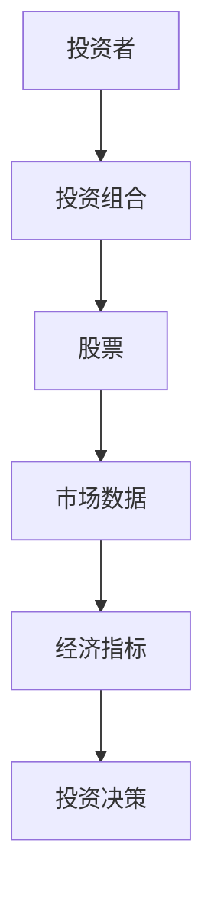
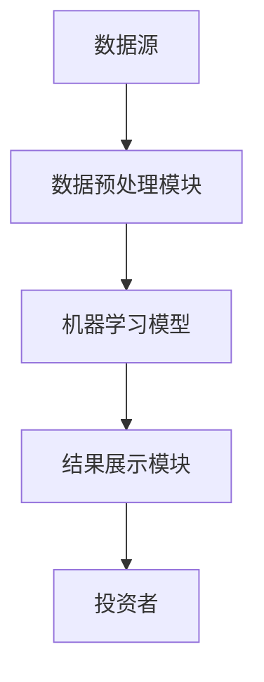

                 


# AI驱动的对冲基金策略分析

## 关键词：
- AI驱动
- 对冲基金
- 策略分析
- 机器学习
- 数据驱动

## 摘要：
AI驱动的对冲基金策略分析通过结合人工智能技术与金融投资策略，利用大数据分析和机器学习算法，优化投资决策过程。本文详细探讨了AI在对冲基金策略分析中的应用，从背景、核心概念、算法原理到系统架构、项目实战，最后总结了最佳实践，为读者提供全面的指导。

# 第一部分: AI驱动的对冲基金策略分析概述

## 第1章: AI与对冲基金的结合

### 1.1 对冲基金的基本概念
#### 1.1.1 对冲基金的定义
对冲基金是一种通过做空和做多市场来对冲风险的投资工具，旨在在各种市场条件下实现稳定的收益。

#### 1.1.2 对冲基金的主要策略
对冲基金采用多种策略，包括：
- **配对交易策略**：通过对冲同一行业的两只股票，利用其价格差异获利。
- **统计套利**：利用资产价格的短期波动进行套利。
- **因子投资**：基于特定因子（如市值、价值、动量）选择投资标的。

#### 1.1.3 对冲基金的风险与收益特征
对冲基金通常追求绝对收益，通过多样化策略和杠杆操作降低风险，同时可能提供较高的回报。

### 1.2 AI在金融领域的应用
#### 1.2.1 AI在金融分析中的应用
AI技术在金融领域的应用包括：
- **预测市场趋势**：利用机器学习模型预测股票价格走势。
- **风险评估**：通过算法分析投资组合的风险。
- **异常检测**：识别市场中的异常交易行为。

#### 1.2.2 AI在投资决策中的作用
AI在投资决策中的作用包括：
- **数据处理**：处理海量金融数据，提取有用信息。
- **模式识别**：识别市场中的潜在模式和趋势。
- **决策支持**：为投资决策提供数据支持和建议。

#### 1.2.3 AI对对冲基金策略的影响
AI对对冲基金策略的影响主要体现在：
- **提高交易效率**：通过算法交易快速捕捉市场机会。
- **优化投资组合**：利用机器学习优化资产配置。
- **降低人为错误**：通过自动化决策减少人为情绪对投资的影响。

### 1.3 AI驱动的对冲基金策略分析的核心概念
#### 1.3.1 数据驱动的投资决策
数据驱动的投资决策强调利用大数据分析和机器学习模型来指导投资决策，而不是依赖传统的经验判断。

#### 1.3.2 机器学习模型在金融中的应用
机器学习模型在金融中的应用包括：
- **预测模型**：用于预测股票价格和市场趋势。
- **分类模型**：用于识别市场中的异常交易和风险。
- **聚类模型**：用于发现市场中的潜在投资机会。

#### 1.3.3 特征工程与模型优化
特征工程是将原始数据转化为适合机器学习模型的特征，模型优化则是通过调整模型参数和结构来提高模型的预测能力。

# 第二部分: AI驱动对冲基金策略分析的核心概念与联系

## 第2章: 对冲基金策略分析的背景与问题

### 2.1 对冲基金策略分析的背景
#### 2.1.1 传统对冲基金策略的局限性
传统对冲基金策略的局限性包括：
- **数据依赖性**：过于依赖历史数据，可能无法捕捉到新的市场趋势。
- **人为因素**：投资决策受主观判断影响，可能导致错误决策。
- **计算能力限制**：传统方法在处理海量数据时效率较低。

#### 2.1.2 AI技术的快速发展
AI技术的快速发展为对冲基金策略分析提供了新的工具和方法，特别是在数据处理和模式识别方面。

#### 2.1.3 数据量的爆炸式增长
随着金融市场数据的快速增长，传统的分析方法难以处理如此庞大的数据量，需要借助AI技术进行高效分析。

### 2.2 问题背景与描述
#### 2.2.1 数据驱动的对冲基金策略分析的必要性
随着金融市场的复杂化，传统的投资策略难以应对日益复杂的市场环境，数据驱动的方法成为必要。

#### 2.2.2 传统策略分析的不足
传统策略分析的不足包括：
- **数据处理能力有限**：传统方法难以处理海量数据。
- **决策效率低下**：依赖人工分析，效率较低。
- **难以捕捉短期趋势**：传统方法难以捕捉市场的短期波动。

#### 2.2.3 AI驱动策略分析的优势
AI驱动策略分析的优势包括：
- **高效数据处理**：AI能够快速处理大量数据，提取有用信息。
- **自动化决策**：AI可以通过算法自动进行投资决策，提高效率。
- **捕捉市场趋势**：AI能够识别市场中的潜在趋势和模式，帮助投资者提前布局。

### 2.3 问题解决与边界
#### 2.3.1 AI如何解决传统策略分析的痛点
AI通过自动化数据处理和模式识别，解决了传统方法效率低、数据处理能力有限的问题。

#### 2.3.2 AI驱动策略分析的边界与限制
AI驱动策略分析的边界与限制包括：
- **数据质量**：依赖高质量的数据，数据不足或噪声大可能影响模型性能。
- **模型过拟合**：复杂的模型可能导致过拟合，影响预测准确性。
- **市场变化**：市场环境的快速变化可能影响模型的有效性。

#### 2.3.3 对冲基金策略分析的未来趋势
未来，对冲基金策略分析将更加依赖AI技术，特别是在大数据处理和自动化决策方面。

### 2.4 核心概念与联系
#### 2.4.1 核心概念原理
- **数据驱动**：通过对海量数据的分析，驱动投资决策。
- **机器学习**：利用算法从数据中学习模式，用于预测和分类。
- **特征工程**：将原始数据转化为适合机器学习的特征，提高模型性能。

#### 2.4.2 核心概念对比表格
| 概念       | 描述                               |
|------------|------------------------------------|
| 数据驱动   | 通过分析大量数据，驱动投资决策     |
| 机器学习   | 利用算法从数据中学习模式             |
| 特征工程   | 从原始数据中提取有用的特征           |

#### 2.4.3 ER实体关系图


### 2.5 总结与展望
通过对AI驱动对冲基金策略分析的背景和问题的探讨，我们认识到AI技术在对冲基金中的应用潜力。未来，随着技术的不断发展，AI将在对冲基金策略分析中发挥越来越重要的作用。

---

# 第三部分: AI驱动对冲基金策略分析的核心概念与联系

## 第3章: AI驱动对冲基金策略分析的核心概念

### 3.1 核心概念原理
#### 3.1.1 数据驱动的投资决策
数据驱动的投资决策强调通过对海量数据的分析，寻找投资机会和风险。

#### 3.1.2 机器学习模型的构建
机器学习模型的构建包括数据预处理、特征选择、模型训练和优化等步骤。

#### 3.1.3 特征工程与模型优化
特征工程是将原始数据转化为适合机器学习的特征，模型优化则是通过调整模型参数和结构来提高模型性能。

### 3.2 核心概念对比
通过对比分析，我们发现AI驱动的对冲基金策略分析在数据处理、模型构建和特征工程方面具有显著优势。

### 3.3 ER实体关系图


## 第4章: AI驱动对冲基金策略分析的算法原理

### 4.1 线性回归算法
#### 4.1.1 线性回归的定义
线性回归是一种统计方法，用于建立两个变量之间的线性关系。

#### 4.1.2 线性回归的数学模型
$$ y = \beta_0 + \beta_1x + \epsilon $$

#### 4.1.3 线性回归的实现步骤
1. 数据预处理
2. 模型训练
3. 模型评估
4. 模型优化

#### 4.1.4 线性回归的Python实现代码
```python
import numpy as np
from sklearn.linear_model import LinearRegression

# 示例数据
X = np.array([[1], [2], [3], [4], [5]])
y = np.array([2, 4, 5, 4, 6])

# 模型训练
model = LinearRegression()
model.fit(X, y)

# 预测
print(model.predict([[6]]))
```

### 4.2 支持向量机（SVM）
#### 4.2.1 SVM的定义
SVM是一种监督学习算法，用于分类和回归问题。

#### 4.2.2 SVM的数学模型
$$ \text{max} \frac{1}{2} \|w\|^2 $$
$$ \text{subject to } y_i(w \cdot x_i + b) \geq 1, \forall i $$

#### 4.2.3 SVM的实现步骤
1. 数据预处理
2. 核函数选择
3. 模型训练
4. 模型评估
5. 模型优化

#### 4.2.4 SVM的Python实现代码
```python
from sklearn import svm

# 示例数据
X = [[1, 0], [0, 1], [0, 0]]
y = [1, 1, 0]

# 模型训练
model = svm.SVC(kernel='linear')
model.fit(X, y)

# 预测
print(model.predict([[1, 1]]))
```

### 4.3 随机森林
#### 4.3.1 随机森林的定义
随机森林是一种基于树的集成学习算法，通过构建多个决策树并进行投票或平均来提高模型的准确性和稳定性。

#### 4.3.2 随机森林的数学模型
$$ y = \text{median}(f_1(x), f_2(x), \ldots, f_n(x)) $$

#### 4.3.3 随机森林的实现步骤
1. 数据预处理
2. 树的生成
3. 集成预测
4. 模型评估
5. 模型优化

#### 4.3.4 随机森林的Python实现代码
```python
from sklearn.ensemble import RandomForestClassifier

# 示例数据
X = [[1, 2], [3, 4], [5, 6], [7, 8]]
y = [0, 1, 1, 0]

# 模型训练
model = RandomForestClassifier(n_estimators=2)
model.fit(X, y)

# 预测
print(model.predict([[9, 10]]))
```

### 4.4 神经网络
#### 4.4.1 神经网络的定义
神经网络是一种受生物神经网络启发的计算模型，用于模拟人脑的处理方式。

#### 4.4.2 神经网络的数学模型
$$ y = \sigma(wx + b) $$
其中，σ表示激活函数。

#### 4.4.3 神经网络的实现步骤
1. 数据预处理
2. 网络结构设计
3. 模型训练
4. 模型评估
5. 模型优化

#### 4.4.4 神经网络的Python实现代码
```python
import tensorflow as tf

# 示例数据
X = tf.constant([[1.0, 2.0], [3.0, 4.0]], dtype=tf.float32)
y = tf.constant([0, 1], dtype=tf.int64)

# 模型构建
model = tf.keras.Sequential([
    tf.keras.layers.Dense(2, activation='relu'),
    tf.keras.layers.Dense(1, activation='sigmoid')
])

# 模型编译
model.compile(optimizer='adam', loss='binary_crossentropy', metrics=['accuracy'])

# 模型训练
model.fit(X, y, epochs=10, batch_size=2)
```

### 4.5 算法对比与选择
通过对不同算法的对比，我们可以选择最适合当前任务的算法，从而提高模型的预测能力和投资收益。

---

# 第四部分: AI驱动对冲基金策略分析的系统架构与实现

## 第5章: AI驱动对冲基金策略分析的系统架构

### 5.1 项目背景与目标
本项目旨在通过AI技术优化对冲基金的策略分析，提高投资收益和决策效率。

### 5.2 系统功能设计
#### 5.2.1 数据获取模块
负责从金融市场获取实时数据，包括股票价格、经济指标等。

#### 5.2.2 数据预处理模块
对获取的数据进行清洗、转换和特征工程，提取有用的特征。

#### 5.2.3 策略分析模块
利用机器学习算法对数据进行分析，生成投资策略和决策建议。

#### 5.2.4 结果展示模块
将分析结果以可视化的方式展示给投资者，便于理解和决策。

### 5.3 系统架构设计
#### 5.3.1 系统架构图


#### 5.3.2 系统组件
- **数据源**：金融市场数据接口。
- **数据预处理模块**：数据清洗、特征工程。
- **机器学习模型**：各种AI算法模型。
- **结果展示模块**：数据可视化工具。

### 5.4 接口设计
系统通过API接口与外部数据源和投资者进行交互，确保数据的实时获取和结果的及时展示。

### 5.5 交互设计
#### 5.5.1 用户界面
投资者可以通过用户界面查看实时数据、分析结果和投资建议。

#### 5.5.2 系统响应
系统根据用户的输入实时响应，提供个性化的投资策略。

---

# 第五部分: AI驱动对冲基金策略分析的项目实战

## 第6章: 项目实战

### 6.1 项目背景
本项目旨在利用AI技术优化对冲基金的策略分析，提高投资收益和决策效率。

### 6.2 环境安装与配置
#### 6.2.1 安装Python环境
安装Python 3.x，推荐使用Anaconda分布。

#### 6.2.2 安装依赖库
安装所需的Python库，包括NumPy、Pandas、Scikit-learn、TensorFlow等。

### 6.3 数据获取与预处理
#### 6.3.1 数据获取
从金融数据源获取股票价格、经济指标等数据。

#### 6.3.2 数据预处理
对获取的数据进行清洗、转换和特征工程，提取有用的特征。

### 6.4 策略分析与模型实现
#### 6.4.1 策略选择
选择适合当前任务的机器学习算法，如线性回归、支持向量机、随机森林等。

#### 6.4.2 模型实现
通过Python代码实现选择的算法模型，进行训练和优化。

### 6.5 结果分析与策略优化
通过分析模型的预测结果，优化投资策略，提高投资收益。

### 6.6 项目小结
通过本项目实战，我们掌握了AI驱动对冲基金策略分析的全过程，包括数据获取、预处理、模型训练和结果分析。

---

# 第六部分: AI驱动对冲基金策略分析的最佳实践

## 第7章: 最佳实践

### 7.1 小结
通过对AI驱动对冲基金策略分析的全面探讨，我们认识到AI技术在金融投资中的巨大潜力。

### 7.2 注意事项
在实际应用中，需要注意数据质量、模型过拟合、市场变化等潜在问题。

### 7.3 拓展阅读
建议读者进一步阅读相关书籍和文献，深入理解AI在金融投资中的应用。

---

# 总结

通过本文章的详细探讨，我们全面了解了AI驱动的对冲基金策略分析，从背景、核心概念、算法原理到系统架构、项目实战，最后总结了最佳实践。希望读者能够通过本文的指导，掌握AI驱动对冲基金策略分析的全过程，为未来的投资决策提供有力支持。

