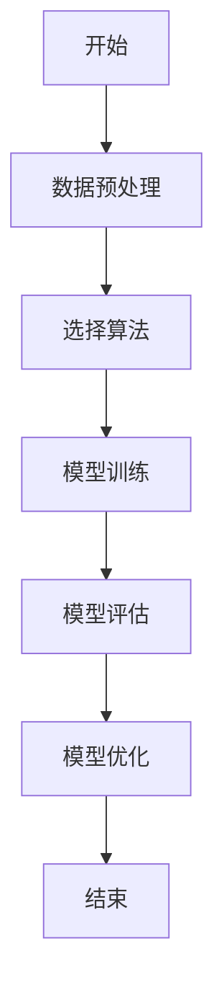
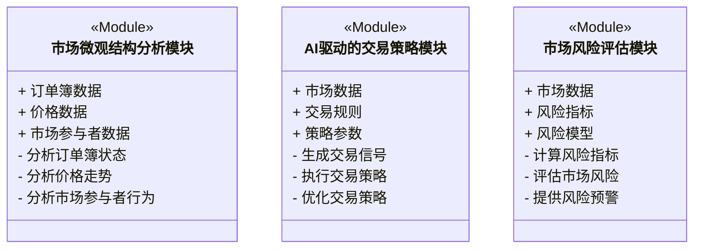
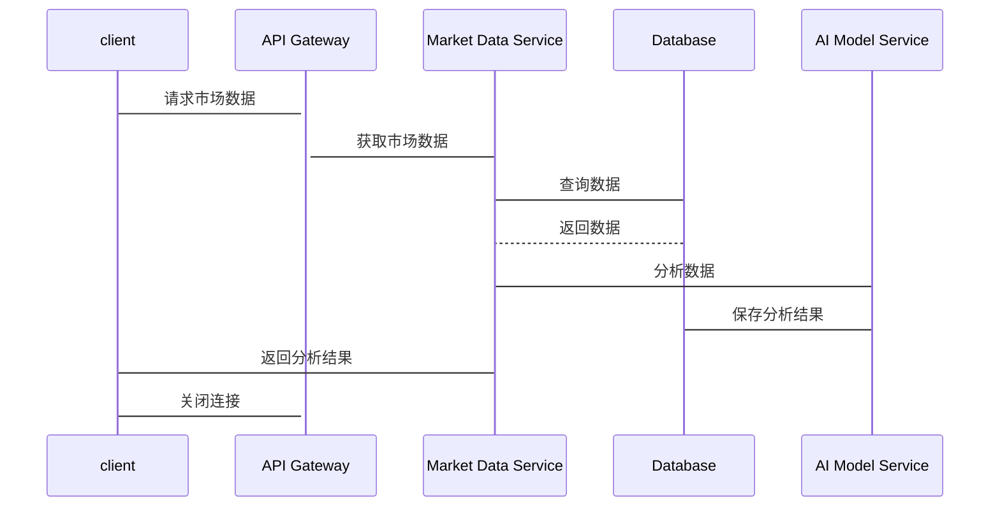

                 


```markdown
# AI驱动的市场微观结构变化影响分析

## 关键词
- 市场微观结构
- 人工智能
- 交易算法
- 订单簿模型
- 价格发现机制
- 市场参与主体

## 摘要
本文探讨AI技术如何影响金融市场中的微观结构，分析AI驱动的交易行为对市场参与者、订单簿模型和价格发现机制的影响。通过数学建模和算法实现，展示AI在优化市场微观结构中的应用，并结合实际案例和系统设计，提供全面的技术解读和实践指导。

# 第1章：背景介绍

## 1.1 问题背景
### 1.1.1 传统市场微观结构的定义与特征
- 市场微观结构的定义
- 市场参与主体：做市商、投资者、经纪商
- 交易机制：订单簿模型、撮合机制、市场深度

### 1.1.2 AI技术对金融市场的影响
- AI技术在金融领域的应用现状
- AI驱动的高频交易与算法交易
- AI在风险管理中的应用

### 1.1.3 市场微观结构变化的背景与驱动因素
- 信息技术的发展推动金融创新
- AI技术在金融市场的广泛应用
- 全球化与数字化带来的市场结构变化

## 1.2 问题描述
### 1.2.1 市场微观结构变化的具体表现
- 交易频率的增加
- 市场深度的变化
- 市场波动性增强

### 1.2.2 AI驱动的交易行为分析
- 高频交易算法的特点
- 市场微观结构中的AI交易策略
- AI对市场流动性的短期和长期影响

### 1.2.3 传统市场微观结构的局限性
- 传统订单簿模型的不足
- 交易效率的瓶颈
- 风险管理的挑战

## 1.3 问题解决
### 1.3.1 AI技术如何优化市场微观结构
- 提高交易效率
- 增强市场流动性
- 减少市场波动性

## 1.4 边界与外延
### 1.4.1 市场微观结构变化的边界条件
- 市场参与者的多样性
- 市场规则与监管框架
- 市场技术基础设施

## 1.5 概念结构与核心要素组成
### 1.5.1 核心概念术语说明
- 市场微观结构的核心要素
- AI驱动的交易算法的关键术语
- 订单簿模型的组成部分

### 1.5.2 核心概念特征对比
| 特征       | 传统市场微观结构       | AI驱动的市场微观结构       |
|------------|------------------------|-----------------------------|
| 交易速度     | 较慢                   | 极快                        |
| 流动性       | 中等                   | 高                         |
| 价格形成机制 | 主要依赖供需           | AI算法优化供需匹配          |

### 1.5.3 ER实体关系图
```mermaid
er
actor 市场参与者 {
  role 做市商
  role 投资者
  role 经纪商
}

market 微观结构 {
  has 订单簿
  has 价格形成机制
  has 交易规则
}

订单簿 实体 {
  has 买单
  has 卖单
  has 成交记录
}

价格形成机制 实体 {
  受 市场供需 影响
  受 AI算法 影响
  受 市场参与者 影响
}

交易规则 实体 {
  定义 交易时间
  定义 价格限制
  定义 市场深度
}
```

# 第2章：市场微观结构的核心概念

## 2.1 市场参与者分析
### 2.1.1 做市商的角色与功能
- 做市商的定义与职责
- 做市商在传统市场中的作用
- AI驱动下做市商的策略优化

### 2.1.2 投资者的行为模式
- 投资者的分类与行为特征
- AI如何影响投资者的决策
- 投资者在市场微观结构中的作用

### 2.1.3 经纪商的角色
- 经纪商的传统功能
- AI技术如何改变经纪商的角色
- 经纪商在AI驱动市场中的新职责

## 2.2 订单簿模型详解
### 2.2.1 订单簿模型的定义与组成部分
- 订单簿模型的基本结构
- 买单与卖单的定义
- 市场深度的计算

### 2.2.2 订单簿模型的运作机制
- 订单匹配的过程
- 成交的条件与规则
- 市场深度的动态变化

### 2.2.3 市场深度的计算公式
- 订单簿深度的计算方法
- 买价和卖价的计算
- 市场深度对交易策略的影响

## 2.3 价格发现机制
### 2.3.1 价格发现机制的定义
- 价格发现的定义与作用
- 价格发现的传统方式
- AI在价格发现中的作用

### 2.3.2 价格发现机制的类型
- 竞价交易与拍卖交易
- 连续交易与定期交易
- AI驱动的算法交易

### 2.3.3 价格发现机制的影响因素
- 市场供需关系
- 市场参与者的交易策略
- 市场规则与监管

## 2.4 AI在市场微观结构中的作用
### 2.4.1 AI优化订单簿模型
- AI如何优化订单匹配效率
- 基于机器学习的订单簿预测
- AI驱动的订单簿动态调整

### 2.4.2 AI对价格发现机制的影响
- AI驱动的高频交易策略
- 基于深度学习的价格预测模型
- AI在价格发现中的优势与挑战

### 2.4.3 AI对市场流动性的贡献
- AI如何提高市场流动性
- 基于AI的流动性管理策略
- AI在市场深度管理中的应用

## 2.5 核心概念与联系
### 2.5.1 核心概念的联系
- 订单簿模型与价格发现机制的相互作用
- 市场参与者与市场微观结构的互动
- AI技术如何整合到市场微观结构中

### 2.5.2 核心概念的对比分析
| 核心概念       | 传统市场结构         | AI驱动的市场结构         |
|----------------|----------------------|--------------------------|
| 交易效率       | 较低                 | 较高                     |
| 市场流动性       | 一般                 | 高                      |
| 价格预测精度   | 低                   | 高                      |

### 2.5.3 核心概念的ER图
```mermaid
er
market 微观结构 {
  has 订单簿
  has 价格形成机制
  has 市场参与者
}

订单簿 实体 {
  has 买单
  has 卖单
  has 成交记录
}

价格形成机制 实体 {
  受 市场供需 影响
  受 AI算法 影响
  受 市场参与者 影响
}

市场参与者 实体 {
  包括 做市商
  包括 投资者
  包括 经纪商
}
```

# 第3章：数学模型与算法原理

## 3.1 订单簿模型的数学表达
### 3.1.1 订单簿模型的数学公式
- 市场深度的计算公式
- 买价和卖价的计算
- 成交量与价格的关系

### 3.1.2 订单簿模型的动态方程
- 市场深度随时间的变化
- 价格随成交量的变化
- 订单簿状态的转移方程

### 3.1.3 订单簿模型的稳定性分析
- 模型的稳定性条件
- 模型参数对稳定性的影响
- 稳定性对交易策略的影响

## 3.2 博弈论模型在价格形成中的应用
### 3.2.1 博弈论模型的定义
- 博弈论的基本概念
- 市场参与者的博弈关系
- 博弈论在价格形成中的应用

### 3.2.2 博弈论模型的数学公式
- 纳什均衡的定义与计算
- 博弈论中的收益函数
- 竞争与合作的博弈模型

### 3.2.3 博弈论模型的稳定性分析
- 博弈模型的稳定性条件
- 市场参与者的策略调整
- 博弈模型对市场微观结构的影响

## 3.3 强化学习算法的实现
### 3.3.1 强化学习的基本原理
- 强化学习的定义与特点
- 强化学习与监督学习的区别
- 强化学习的应用场景

### 3.3.2 强化学习算法的选择
- 常用强化学习算法对比
- 算法选择的依据
- 算法实现的关键步骤

### 3.3.3 强化学习算法的实现细节
- 状态空间的定义
- 动作空间的定义
- 奖励函数的设计

## 3.4 算法原理与数学模型
### 3.4.1 算法原理的数学表达
- 算法的数学推导
- 算法的收敛性分析
- 算法的复杂度分析

### 3.4.2 算法实现的步骤
- 数据预处理
- 模型训练
- 模型优化
- 模型部署

### 3.4.3 算法实现的注意事项
- 算法参数的选择
- 数据分布的影响
- 算法的可扩展性

## 3.5 算法实现的代码解析
### 3.5.1 环境配置
- 硬件配置
- 软件环境
- 依赖库的安装

### 3.5.2 数据处理
- 数据格式转换
- 数据清洗
- 数据增强

### 3.5.3 模型训练
- 模型参数初始化
- 模型训练过程
- 模型评估与优化

### 3.5.4 模型部署
- 模型保存
- 模型加载
- 模型推理

## 3.6 算法流程图


## 3.7 算法实现的代码示例
```python
import numpy as np
import pandas as pd
from tensorflow.keras import layers, models

# 数据预处理
data = pd.read_csv('market_data.csv')
X_train = data.iloc[:, :-1].values
y_train = data.iloc[:, -1].values

# 模型构建
model = models.Sequential()
model.add(layers.Dense(64, activation='relu', input_dim=X_train.shape[1]))
model.add(layers.Dense(1, activation='sigmoid'))

# 模型训练
model.compile(optimizer='adam', loss='binary_crossentropy', metrics=['accuracy'])
model.fit(X_train, y_train, epochs=10, batch_size=32)
```

# 第4章：系统分析与架构设计

## 4.1 问题场景介绍
### 4.1.1 系统目标
- 提供实时市场微观结构分析
- 支持AI驱动的交易策略优化
- 提供市场风险评估与预警

### 4.1.2 项目介绍
- 项目背景
- 项目目标
- 项目范围

## 4.2 系统功能设计
### 4.2.1 领域模型设计
- 市场微观结构分析模块
- AI驱动的交易策略模块
- 市场风险评估模块

### 4.2.2 系统功能模块设计


## 4.3 系统架构设计
### 4.3.1 系统架构图


### 4.3.2 系统接口设计
- API接口定义
- 接口调用流程
- 接口权限管理

## 4.4 系统交互流程
### 4.4.1 系统交互流程图


## 4.5 系统架构实现细节
### 4.5.1 系统功能模块实现
- 市场数据采集模块
- 数据处理模块
- 模型训练模块
- 结果展示模块

### 4.5.2 系统实现的注意事项
- 系统性能优化
- 系统安全性保障
- 系统可扩展性设计

## 4.6 系统架构优化
### 4.6.1 系统架构的优化步骤
- 系统模块的优化
- 系统接口的优化
- 系统性能的优化

### 4.6.2 系统架构优化的注意事项
- 优化目标明确
- 优化步骤合理
- 优化效果评估

## 4.7 系统架构优化的代码实现
### 4.7.1 系统模块的优化
```python
def optimize_module(module):
    # 模块优化代码
    pass
```

### 4.7.2 系统接口的优化
```python
def optimize_interface(interface):
    # 接口优化代码
    pass
```

### 4.7.3 系统性能的优化
```python
def optimize_performance(system):
    # 性能优化代码
    pass
```

# 第5章：项目实战与案例分析

## 5.1 项目实战环境配置
### 5.1.1 硬件环境
- CPU: 多核处理器
- 内存: 至少8GB
- 存储: 足够的存储空间

### 5.1.2 软件环境
- 操作系统: Linux/Windows/MacOS
- 开发工具: Python, Jupyter Notebook
- 依赖库: TensorFlow, Keras, Pandas, NumPy

## 5.2 数据处理与特征工程
### 5.2.1 数据采集
- 数据源选择
- 数据采集方法
- 数据格式转换

### 5.2.2 数据清洗
- 数据去重
- 数据补缺
- 数据标准化

### 5.2.3 数据增强
- 数据扩增方法
- 数据特征提取
- 数据标注

## 5.3 模型训练与优化
### 5.3.1 模型选择
- 模型对比分析
- 模型选择依据
- 模型性能评估

### 5.3.2 模型训练
- 训练数据准备
- 模型参数设置
- 模型训练过程

### 5.3.3 模型优化
- 参数调优
- 模型评估
- 模型优化策略

## 5.4 模型实现与结果分析
### 5.4.1 模型实现
- 代码实现细节
- 模型训练过程
- 模型评估结果

### 5.4.2 结果分析
- 模型性能分析
- 模型预测结果解读
- 模型优化建议

## 5.5 案例分析
### 5.5.1 案例背景
- 案例选择依据
- 案例背景介绍
- 案例目标设定

### 5.5.2 案例分析过程
- 数据处理步骤
- 模型训练过程
- 模型优化过程

### 5.5.3 案例分析结果
- 分析结果展示
- 分析结果解读
- 分析结果应用

## 5.6 项目实战总结
### 5.6.1 实战经验总结
- 项目实施过程中的经验
- 项目实施中的问题及解决方案
- 项目实施的关键点

### 5.6.2 实战项目的价值
- 项目实际应用价值
- 项目对理论的验证
- 项目对未来研究的启示

### 5.6.3 实战项目的注意事项
- 项目实施中的注意事项
- 项目维护与更新
- 项目扩展的方向

# 第6章：总结与展望

## 6.1 全文总结
### 6.1.1 核心内容回顾
- 市场微观结构的核心概念
- AI技术在市场微观结构中的应用
- 系统设计与实现的关键点

### 6.1.2 本文的主要贡献
- 提供了AI驱动的市场微观结构变化的系统分析
- 展示了AI技术在优化市场微观结构中的应用
- 提供了实际的系统设计与实现方案

## 6.2 未来研究方向
### 6.2.1 研究热点
- AI在市场微观结构中的更广泛应用
- 更高级的算法研究
- 市场微观结构的动态优化

### 6.2.2 研究挑战
- 算法的可解释性问题
- 市场微观结构的复杂性
- 系统设计的可扩展性问题

### 6.2.3 研究趋势
- 结合其他新兴技术的研究
- 更多实际应用场景的研究
- 更高精度和效率的研究

## 6.3 注意事项与最佳实践
### 6.3.1 实践中的注意事项
- 系统设计的合理性
- 数据处理的准确性
- 模型训练的稳定性

### 6.3.2 最佳实践
- 结合实际业务需求进行系统设计
- 采用合理的数据处理方法
- 选择合适的模型和算法

### 6.3.3 经验分享
- 项目实施中的经验总结
- 项目维护中的注意事项
- 项目扩展中的策略

## 6.4 拓展阅读
### 6.4.1 推荐书籍
- 《金融市场的微观结构》
- 《人工智能在金融中的应用》
- 《强化学习算法与应用》

### 6.4.2 推荐文章
- AI驱动的金融创新
- 市场微观结构的动态优化
- 强化学习在金融交易中的应用

### 6.4.3 推荐博客与资源
- 专业博客推荐
- 在线课程推荐
- 技术社区推荐

# 结束语

通过本文的详细分析与系统设计，我们全面探讨了AI技术对市场微观结构变化的影响。从理论分析到实际应用，从系统设计到项目实战，本文为读者提供了全面的技术解读和实践指导。未来，随着AI技术的不断发展，市场微观结构的优化将更加依赖于先进的技术手段，本文的研究将为相关领域的研究者和实践者提供有价值的参考。
```

