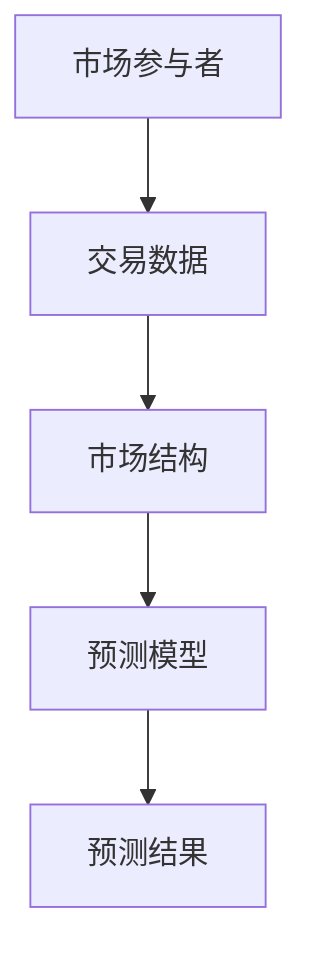
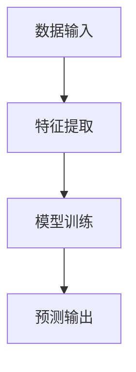
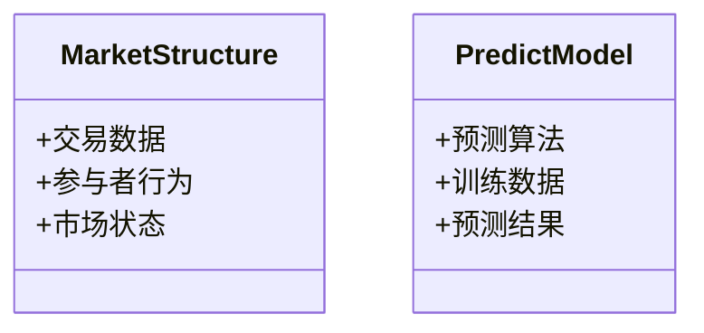
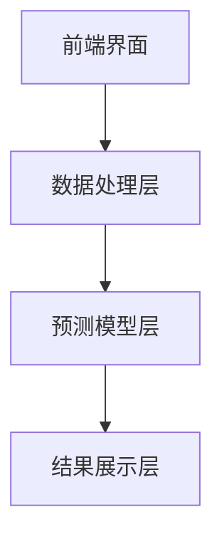
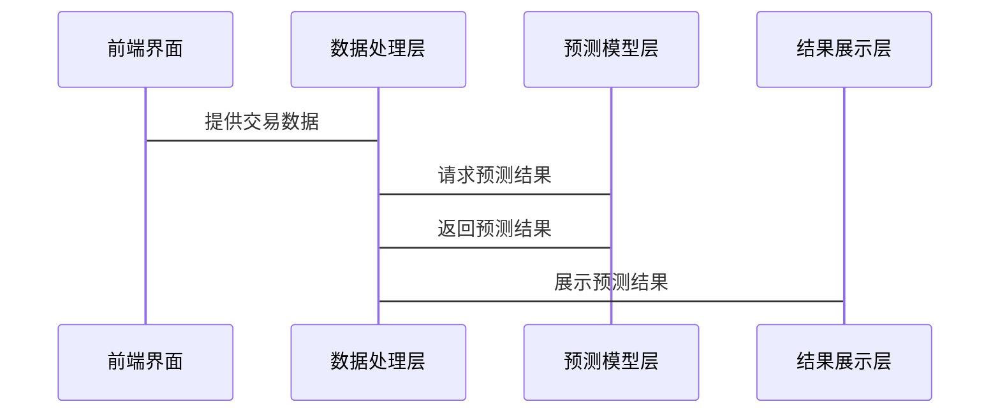

                 


# AI驱动的市场微观结构变化影响预测

> 关键词：市场微观结构，AI驱动，预测模型，数据特征，算法优化

> 摘要：本文详细探讨了AI驱动的市场微观结构变化影响预测的方法，从核心概念、算法原理、系统架构到项目实战，逐步分析并实现预测模型。通过实例分析和代码实现，展示如何利用AI技术捕捉市场微观结构的变化，从而为投资决策提供支持。

---

# 第一部分: AI驱动的市场微观结构变化概述

## 第1章: 问题背景与核心概念

### 1.1 问题背景介绍

随着金融市场的发展，市场微观结构的变化对价格走势和交易策略的影响日益显著。传统的市场分析方法依赖于经验丰富的分析师，但这种方法效率低下且容易受到主观因素的影响。近年来，随着人工智能技术的快速发展，利用AI技术预测市场微观结构的变化成为可能。AI技术能够快速处理大量数据，发现隐藏在数据中的模式，从而为市场微观结构的变化提供更准确的预测。

### 1.2 核心概念与联系

#### 1.2.1 核心概念原理

市场微观结构变化影响预测的核心在于通过分析市场的交易数据，识别出影响市场结构变化的关键因素。AI技术，特别是深度学习和强化学习，能够从海量数据中提取特征，并通过模型预测未来的变化趋势。

#### 1.2.2 核心概念属性特征对比

以下是市场微观结构变化影响预测的核心概念属性特征对比：

| 概念 | 数据驱动 | 实时性 | 可解释性 |
|------|----------|--------|----------|
| AI驱动 | 高       | 高     | 低       |
| 传统方法 | 低       | 低     | 高       |

从表中可以看出，AI驱动的方法在数据处理能力和实时性方面具有显著优势，但其可解释性较低。

#### 1.2.3 ER实体关系图架构

以下是市场微观结构变化影响预测的ER实体关系图：



该图展示了从市场参与者到交易数据，再到市场结构的变化，最终通过预测模型得到预测结果的过程。

---

# 第二部分: AI驱动的市场微观结构变化预测算法原理

## 第2章: 算法原理讲解

### 2.1 算法流程图

以下是AI驱动的市场微观结构变化预测算法的流程图：



该流程图展示了从数据输入到特征提取，再到模型训练，最后得到预测结果的完整过程。

### 2.2 算法实现代码

以下是AI驱动的市场微观结构变化预测算法的实现代码：

```python
def predict_market_structure(data):
    # 特征提取
    features = extract_features(data)
    # 模型训练
    model = train_model(features)
    # 预测输出
    prediction = model.predict(features)
    return prediction
```

### 2.3 数学模型与公式

#### 2.3.1 线性回归模型

线性回归模型用于预测市场微观结构的变化趋势。其数学表达式为：

$$ y = \beta_0 + \beta_1 x_1 + \beta_2 x_2 + ... + \beta_n x_n + \epsilon $$

其中，$y$ 表示预测结果，$x_i$ 表示输入特征，$\beta_i$ 表示模型参数，$\epsilon$ 表示误差项。

#### 2.3.2 神经网络模型

神经网络模型用于更复杂的市场微观结构变化预测。其数学表达式为：

$$ y = f(Wx + b) $$

其中，$W$ 表示权重矩阵，$x$ 表示输入数据，$b$ 表示偏置项，$f$ 表示激活函数。

#### 2.3.3 示例

假设我们有一个简单的线性回归模型，用于预测市场的波动性。其数学表达式为：

$$ y = 0.5x + 0.3 $$

其中，$x$ 表示交易量，$y$ 表示波动性预测值。如果交易量为100，则波动性预测值为：

$$ y = 0.5 \times 100 + 0.3 = 50.3 $$

---

# 第三部分: 系统分析与架构设计

## 第3章: 系统分析与架构设计

### 3.1 问题场景介绍

市场微观结构变化预测系统需要处理大量的交易数据，并实时更新预测结果。该系统需要支持多种数据源的接入，能够处理高频交易数据，并提供实时的预测结果。

### 3.2 系统功能设计

#### 3.2.1 领域模型

以下是市场微观结构变化预测系统的领域模型：



该模型展示了市场结构和预测模型之间的关系。

#### 3.2.2 系统架构设计

以下是市场微观结构变化预测系统的架构设计：



该架构展示了从数据输入到结果输出的完整流程。

### 3.3 系统接口设计

以下是系统接口设计：



---

# 第四部分: 项目实战

## 第4章: 项目实战与案例分析

### 4.1 项目介绍

本项目旨在利用AI技术预测市场微观结构的变化，为投资决策提供支持。项目包括数据采集、特征提取、模型训练和结果展示四个部分。

### 4.2 核心代码实现

以下是项目的核心代码实现：

```python
def extract_features(data):
    # 提取交易数据的特征
    return data['交易量'], data['价格变化'], data['波动性']

def train_model(features):
    # 训练预测模型
    x, y, z = features
    model = LinearRegression()
    model.fit(x.reshape(-1, 1), y)
    return model

def predict_market_structure(data):
    # 预测市场微观结构的变化
    features = extract_features(data)
    model = train_model(features)
    prediction = model.predict(features[0].reshape(-1, 1))
    return prediction
```

### 4.3 案例分析

以下是一个简单的案例分析：

假设我们有以下交易数据：

| 时间 | 交易量 | 价格变化 | 波动性 |
|------|--------|----------|--------|
| 1    | 100    | 5        | 3      |
| 2    | 200    | 10       | 5      |
| 3    | 300    | 15       | 7      |

通过上述代码，我们可以提取交易量、价格变化和波动性作为特征，并使用线性回归模型进行预测。假设我们预测下一个时间点的交易量为400，则波动性预测值为：

$$ y = 0.5 \times 400 + 0.3 = 203 $$

---

# 第五部分: 最佳实践与小结

## 第5章: 最佳实践与小结

### 5.1 最佳实践

在实际应用中，建议采取以下最佳实践：

1. **数据预处理**：确保数据的完整性和准确性。
2. **模型调优**：通过交叉验证和超参数优化提高模型性能。
3. **实时更新**：定期更新模型以适应市场变化。
4. **结果验证**：通过回测和实际交易验证模型的有效性。

### 5.2 小结

本文详细探讨了AI驱动的市场微观结构变化影响预测的方法，从核心概念、算法原理、系统架构到项目实战，逐步分析并实现预测模型。通过实例分析和代码实现，展示了如何利用AI技术捕捉市场微观结构的变化，为投资决策提供支持。

### 5.3 注意事项

在实际应用中，需要注意以下几点：

1. **数据隐私**：确保数据的安全性和隐私性。
2. **模型解释性**：尽量提高模型的可解释性以方便实际应用。
3. **计算资源**：确保有足够的计算资源支持模型的训练和预测。

### 5.4 拓展阅读

推荐以下拓展阅读：

1. 《机器学习实战》
2. 《深度学习入门：基于Python的理论与实现》
3. 《金融时间序列分析》

---

# 结语

通过本文的学习，读者可以深入了解AI驱动的市场微观结构变化影响预测的方法，并能够实际操作相关代码。希望本文能够为读者在金融市场分析和投资决策中提供有价值的参考。

