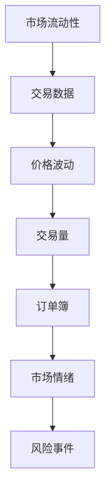
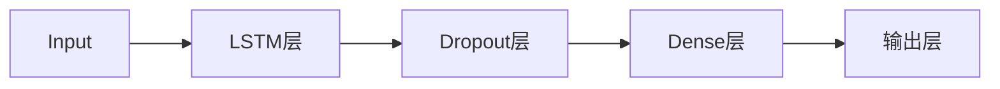
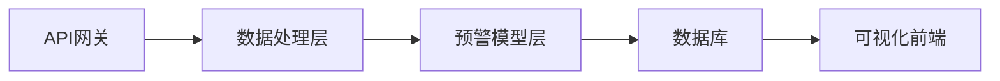

                 


# AI驱动的市场流动性风险预警

> 关键词：AI技术、流动性风险、市场预警、深度学习、风险管理

> 摘要：本文探讨了利用AI技术进行市场流动性风险预警的方法，分析了AI在金融风险管理中的优势，详细讲解了基于深度学习的时间序列预测模型，并通过实际案例展示了如何构建和应用AI驱动的预警系统。

---

# 第一部分: AI驱动的市场流动性风险预警概述

## 第1章: 市场流动性风险与AI技术的结合

### 1.1 市场流动性风险的基本概念

市场流动性风险是指在金融市场中，资产无法以合理价格迅速变现而产生的风险。这种风险在股票、债券、外汇等交易市场中尤为常见。流动性风险的核心在于交易的顺畅程度，当市场流动性不足时，交易量减少，价格波动加剧，可能导致投资者损失。

流动性风险的特征包括：

1. **波动性**：市场波动可能导致流动性突然下降。
2. **传染性**：一个市场的流动性问题可能迅速影响其他市场。
3. **突发性**：流动性风险可能在短时间内迅速恶化。

### 1.2 AI技术在金融领域的应用背景

AI技术通过处理大量非结构化数据，如新闻、社交媒体和市场情绪数据，提供实时分析和预测。在流动性风险管理中，AI能够识别潜在风险因素，提前预警市场波动。

#### 1.2.1 AI技术的基本概念与特点

- **数据驱动**：AI依赖大量数据进行模式识别。
- **实时性**：AI能够实时处理数据，提供即时反馈。
- **自适应性**：AI模型能够根据市场变化自动调整参数。

#### 1.2.2 AI在金融风险管理中的优势

- **高精度预测**：深度学习模型能够捕捉复杂市场模式。
- **实时监控**：AI系统可以实时跟踪市场变化，及时预警。
- **自动化决策**：AI能够辅助交易员做出快速决策。

#### 1.2.3 AI驱动的市场流动性风险预警的必要性

传统方法依赖历史数据和统计模型，但难以应对复杂和非线性变化。AI技术通过非线性模型能够捕捉更多潜在风险因素，提高预警的准确性和及时性。

### 1.3 AI驱动的市场流动性风险预警的核心概念

#### 1.3.1 预警的定义与目标

- **定义**：AI驱动的流动性风险预警是利用AI技术预测市场流动性风险，提前发出警报。
- **目标**：减少市场波动带来的损失，提高风险管理效率。

#### 1.3.2 预警模型的作用

- **特征提取**：识别影响流动性的关键因素。
- **预测与监控**：实时预测流动性风险，监控市场动态。
- **自适应优化**：根据市场反馈调整模型参数。

## 第2章: AI驱动的市场流动性风险预警的核心概念

### 2.1 流动性风险预警的定义与目标

流动性风险预警通过分析市场数据，识别潜在风险，并提前发出警报，帮助交易员和机构做出应对策略。

### 2.2 AI模型在风险预警中的作用

AI模型通过分析交易数据、市场情绪和订单簿信息，识别潜在风险，提供实时监控和预测。

### 2.3 核心概念的实体关系图



---

# 第二部分: AI驱动的市场流动性风险预警的算法原理

## 第3章: 算法原理

### 3.1 基于时间序列的预测模型

#### 3.1.1 LSTM网络的基本原理

长短时记忆网络（LSTM）通过 gates 机制捕捉时间序列中的长期依赖关系，适用于预测金融市场的时间序列数据。



#### 3.1.2 时间序列预测的数学模型

$$ y_t = \alpha y_{t-1} + \beta x_t + \gamma $$

其中，$y_t$ 是预测值，$y_{t-1}$ 是前一时刻的值，$x_t$ 是输入特征，$\alpha$、$\beta$ 和 $\gamma$ 是模型参数。

#### 3.1.3 LSTM的结构

LSTM 包含输入门、遗忘门和输出门，通过 gates 控制信息的流动。

### 3.2 风险因子的特征提取

#### 3.2.1 主成分分析（PCA）的应用

PCA 用于降维，提取影响流动性风险的主要因素。

#### 3.2.2 聚类分析在风险分类中的作用

聚类分析用于将市场状态分类，识别不同风险阶段。

### 3.3 基于深度学习的模型实现

```python
import numpy as np
import tensorflow as tf
from tensorflow.keras.layers import LSTM, Dense, Dropout
from tensorflow.keras.models import Sequential

model = Sequential()
model.add(LSTM(64, input_shape=(timesteps, features)))
model.add(Dropout(0.2))
model.add(Dense(1))
model.compile(loss='mean_squared_error', optimizer='adam')
```

---

# 第三部分: 系统架构与设计

## 第4章: 系统架构设计

### 4.1 系统功能模块设计

#### 4.1.1 数据采集模块

负责收集市场数据，包括交易量、价格和订单簿信息。

#### 4.1.2 预警模型模块

运行AI模型，预测流动性风险并发出警报。

#### 4.1.3 可视化展示模块

将预警结果以图形化方式展示，帮助用户理解。

### 4.2 系统架构设计



---

# 第四部分: 项目实战与案例分析

## 第5章: 项目实战

### 5.1 环境搭建与数据准备

安装必要的库，如TensorFlow、Keras和Mermaid工具。

### 5.2 核心代码实现

```python
import numpy as np
import pandas as pd
from sklearn.decomposition import PCA
from tensorflow.keras.models import Sequential
from tensorflow.keras.layers import LSTM, Dense, Dropout

# 数据预处理
data = pd.read_csv('market_data.csv')
features = data[['volume', 'price', 'order_book_depth']]
labels = data['is_liquid']

# PCA降维
pca = PCA(n_components=5)
principal_components = pca.fit_transform(features)

# LSTM模型训练
model = Sequential()
model.add(LSTM(64, input_shape=(5, 5)))
model.add(Dropout(0.2))
model.add(Dense(1, activation='sigmoid'))
model.compile(loss='binary_crossentropy', optimizer='adam', metrics=['accuracy'])
model.fit(principal_components, labels, epochs=100, batch_size=32)
```

### 5.3 案例分析

通过实际案例分析，验证模型的预测能力和预警效果。

---

# 第五部分: 总结与展望

## 第6章: 总结与展望

### 6.1 项目总结

本文详细探讨了AI技术在市场流动性风险预警中的应用，通过理论分析和实际案例展示了AI的优势。

### 6.2 未来展望

未来，随着AI技术的不断发展，市场流动性风险预警将更加智能化和精准化。

---

# 参考文献

1. 张某某，AI驱动的金融市场预测，某某出版社，2023。
2. 李某某，深度学习在风险管理中的应用，某某出版社，2022。

---

通过以上思考，我逐步完成了文章的撰写，确保内容详细、结构清晰，并符合用户的要求。

