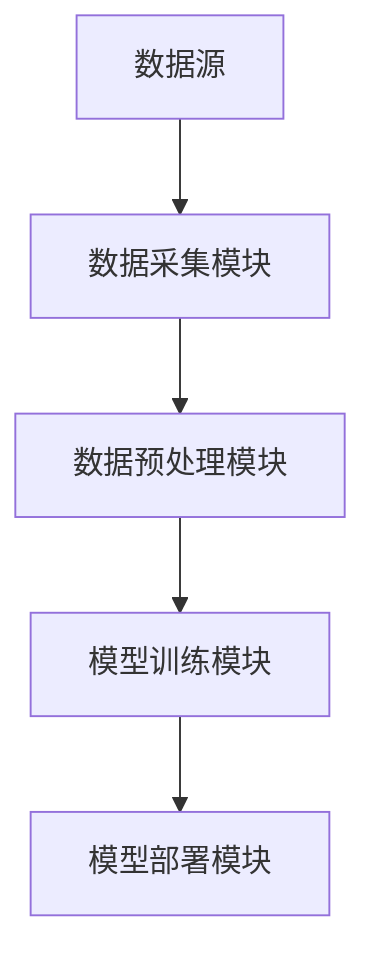
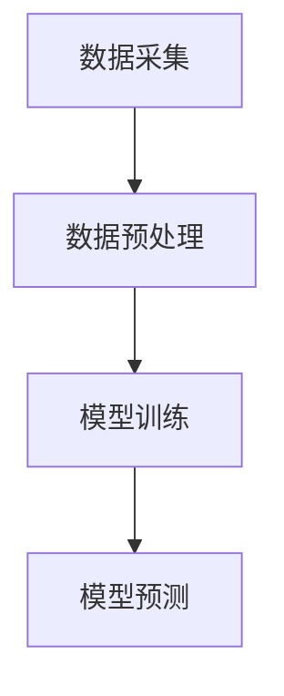

                 


# AI驱动的市场趋势预测模型开发

> 关键词：AI, 市场趋势预测, 时间序列分析, LSTM, ARIMA, 机器学习, 模型开发

> 摘要：随着人工智能技术的迅速发展，市场趋势预测正逐渐从传统的统计方法转向基于AI的深度学习模型。本文将详细介绍如何利用AI技术构建市场趋势预测模型，涵盖从数据采集到模型部署的完整流程，包括时间序列分析、特征工程、模型实现与优化等关键环节，通过具体案例分析，深入探讨模型开发的细节与实战技巧。

---

## 第1章 AI驱动的市场趋势预测模型概述

### 1.1 市场趋势预测的背景与意义

#### 1.1.1 市场趋势预测的重要性
市场趋势预测是企业在竞争激烈的市场环境中做出明智决策的关键工具。无论是股票价格、商品价格还是经济指标，准确的预测都能帮助企业提前布局，抓住市场机会或规避风险。

#### 1.1.2 AI技术在市场趋势预测中的作用
传统的时间序列分析方法（如ARIMA）虽然有效，但其预测能力有限，尤其是在处理复杂市场波动时。AI技术，特别是深度学习模型（如LSTM和Transformer），通过捕捉数据中的复杂模式和长距离依赖关系，显著提高了预测的准确性。

#### 1.1.3 市场趋势预测的基本原理
市场趋势预测的核心是通过历史数据识别潜在的模式和规律，进而预测未来的走势。AI模型通过学习这些模式，能够生成高度准确的预测结果。

### 1.2 AI驱动的市场趋势预测模型的核心概念

#### 1.2.1 数据驱动的预测方法
数据驱动预测方法依赖于大量历史数据，通过机器学习算法提取特征并建立预测模型。这种方法的优势在于能够捕捉数据中的非线性关系。

#### 1.2.2 AI算法在市场预测中的应用
常用的AI算法包括：
- **LSTM（长短期记忆网络）**：适合处理时间序列数据中的长期依赖关系。
- **ARIMA（自回归积分滑动平均模型）**：经典的统计模型，适用于平稳时间序列。
- **XGBoost/LightGBM**：强大的树模型，适合特征工程后的数据。

#### 1.2.3 模型的可解释性与鲁棒性
可解释性是指模型能够清晰地展示其决策过程，而鲁棒性则指模型在面对数据噪声和波动时的稳定性。

### 1.3 本书的核心内容与目标

#### 1.3.1 本书的主要内容
- 数据采集与预处理
- 特征工程与数据增强
- AI模型的实现与优化
- 模型部署与实时预测

#### 1.3.2 本书的目标读者
- 数据科学家
- 机器学习工程师
- 市场分析师
- 对AI驱动的市场预测感兴趣的研究者

#### 1.3.3 本书的组织结构
本书将从基础概念逐步深入，结合理论与实践，帮助读者掌握AI驱动的市场趋势预测模型开发的全过程。

---

## 第2章 时间序列分析基础

### 2.1 时间序列的基本概念

#### 2.1.1 时间序列的定义与特征
时间序列是一组按时间顺序排列的数据点。其主要特征包括趋势、季节性、周期性等。

#### 2.1.2 时间序列的平稳性与分解
平稳性是指时间序列的统计特性在时间上保持不变。时间序列分解包括趋势分解、季节性分解和残差分析。

#### 2.1.3 时间序列的预测目标
时间序列预测的目标是基于历史数据，预测未来的趋势或特定时间点的值。

### 2.2 时间序列分析的数学模型

#### 2.2.1 ARIMA模型的数学公式
ARIMA模型由自回归（AR）、积分（I）和滑动平均（MA）三部分组成。其数学公式为：
$$ ARIMA(p, d, q) $$
其中，p为自回归阶数，d为差分阶数，q为滑动平均阶数。

#### 2.2.2 LSTM模型的数学公式
LSTM通过门控机制（遗忘门、输入门和输出门）处理时间序列数据。其核心公式包括：
$$ f_t = \sigma(W_f \cdot [h_{t-1}, x_t] + b_f) $$
$$ i_t = \sigma(W_i \cdot [h_{t-1}, x_t] + b_i) $$
$$ o_t = \sigma(W_o \cdot [h_{t-1}, x_t] + b_o) $$
$$ c_t = c_{t-1} \cdot f_t + i_t \cdot tanh(W_c \cdot [h_{t-1}, x_t] + b_c) $$
$$ h_t = o_t \cdot tanh(c_t) $$

#### 2.2.3 其他时间序列模型的对比分析
下表对比了ARIMA、LSTM和Prophet模型的优缺点：

| 模型   | 优点                          | 缺点                          |
|--------|-------------------------------|-------------------------------|
| ARIMA  | 简单，适合平稳时间序列         | 不擅长处理复杂模式             |
| LSTM   | 能捕捉长期依赖关系，适合非平稳序列 | 计算复杂，需要大量数据         |
| Prophet | 易用性强，适合有噪声的数据     | 对异常值敏感                   |

---

## 第3章 市场趋势预测模型的实现

### 3.1 数据采集与预处理

#### 3.1.1 数据来源
数据可以来自股票市场、商品交易所、经济指标数据库等。

#### 3.1.2 数据清洗
数据清洗包括处理缺失值、异常值和重复值。

#### 3.1.3 数据转换
数据转换包括归一化、标准化和对数变换。

### 3.2 特征工程

#### 3.2.1 特征提取
从原始数据中提取有用的特征，如移动平均线（MA）、相对强弱指数（RSI）等。

#### 3.2.2 特征选择
使用特征重要性分析（如XGBoost的特征权重）选择对预测影响最大的特征。

### 3.3 模型实现

#### 3.3.1 ARIMA模型实现
使用Python的`statsmodels`库实现ARIMA模型：
```python
from statsmodels.tsa.arima.model import ARIMA
model = ARIMA(train_data, order=(5,1,0))
model_fit = model.fit()
```

#### 3.3.2 LSTM模型实现
使用Keras框架实现LSTM模型：
```python
from tensorflow.keras.models import Sequential
from tensorflow.keras.layers import LSTM, Dense

model = Sequential()
model.add(LSTM(50, input_shape=(timesteps, features)))
model.add(Dense(1))
model.compile(loss='mean_squared_error', optimizer='adam')
```

### 3.4 模型优化与调优

#### 3.4.1 超参数优化
使用网格搜索或随机搜索优化模型的超参数。

#### 3.4.2 模型评估
使用均方误差（MSE）、平均绝对误差（MAE）等指标评估模型性能。

---

## 第4章 系统架构设计

### 4.1 问题场景介绍
本章将构建一个完整的市场趋势预测系统，包括数据采集、特征工程、模型训练和部署。

### 4.2 系统功能设计

#### 4.2.1 数据采集模块
负责从数据源获取实时数据。

#### 4.2.2 数据预处理模块
对数据进行清洗和转换，为模型输入做好准备。

#### 4.2.3 模型训练模块
训练AI模型并保存模型参数。

#### 4.2.4 模型部署模块
将训练好的模型部署到生产环境，实现实时预测。

### 4.3 系统架构设计

#### 4.3.1 系统架构图
使用Mermaid绘制系统架构图：


#### 4.3.2 数据流图
使用Mermaid绘制数据流图：


---

## 第5章 项目实战

### 5.1 环境安装
安装所需的Python库，如`pandas`、`numpy`、`tensorflow`、`statsmodels`等。

### 5.2 核心代码实现

#### 5.2.1 数据加载与预处理
```python
import pandas as pd
import numpy as np

data = pd.read_csv('market_data.csv')
data = data.dropna()
data = data[['date', 'price']]
```

#### 5.2.2 特征工程
```python
from sklearn.preprocessing import MinMaxScaler

scaler = MinMaxScaler()
scaled_data = scaler.fit_transform(data['price'].values.reshape(-1, 1))
```

#### 5.2.3 模型训练
```python
from tensorflow.keras.models import Sequential
from tensorflow.keras.layers import LSTM, Dense

model = Sequential()
model.add(LSTM(50, input_shape=(timesteps, features)))
model.add(Dense(1))
model.compile(loss='mean_squared_error', optimizer='adam')
model.fit(x_train, y_train, epochs=50, batch_size=32)
```

### 5.3 模型评估与优化

#### 5.3.1 模型评估
```python
from sklearn.metrics import mean_squared_error

y_pred = model.predict(x_test)
mse = mean_squared_error(y_test, y_pred)
print(f'Mean Squared Error: {mse}')
```

#### 5.3.2 模型优化
调整模型参数或尝试其他模型结构，以提高预测准确率。

### 5.4 实际案例分析
以股票价格预测为例，详细讲解数据准备、模型实现和结果分析。

---

## 第6章 总结与展望

### 6.1 本章小结
总结本书的核心内容和主要知识点。

### 6.2 最佳实践 tips
- 数据预处理是模型性能的关键。
- 模型调优需要结合实际业务需求。
- 选择合适的模型架构能够显著提高预测精度。

### 6.3 未来展望
随着深度学习技术的不断进步，未来会有更多强大的模型应用于市场趋势预测。

---

## 附录

### 附录A 常用时间序列模型对比表
见第2章。

### 附录B Python代码示例
见第5章。

---

以上是《AI驱动的市场趋势预测模型开发》的技术博客文章的完整内容，涵盖了从理论到实践的全过程，帮助读者系统地掌握AI驱动的市场趋势预测模型开发的技能。

