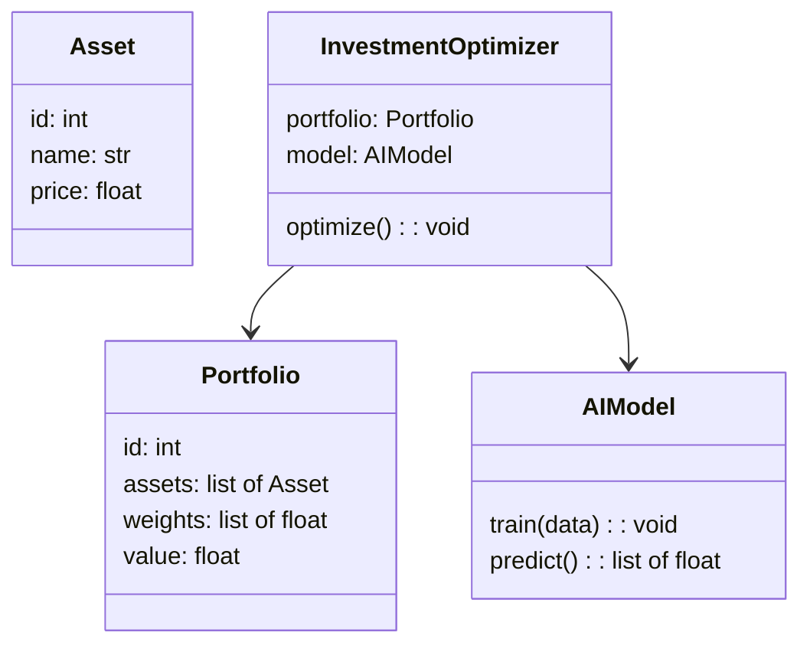
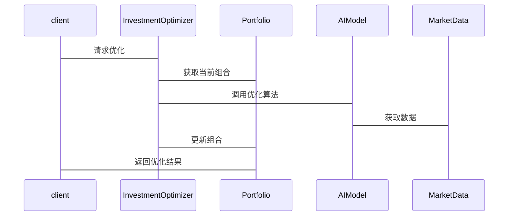

                 


# AI驱动的投资组合优化器

## 关键词：AI, 投资组合优化, 强化学习, 遗传算法, 金融投资

## 摘要：AI驱动的投资组合优化器利用人工智能技术，如强化学习和遗传算法，优化投资组合的收益与风险平衡。本文详细探讨了投资组合优化的数学模型、AI算法的应用、系统架构设计及实际案例，为读者提供全面的技术解析。

---

## 第一部分: AI驱动的投资组合优化器背景与基础

## 第1章: 投资组合优化概述

### 1.1 投资组合优化的基本概念

#### 1.1.1 投资组合的定义与目标
- **投资组合**：一组金融资产的集合，旨在通过多样化降低风险并提高收益。
- **目标**：在给定风险下最大化收益，或在给定收益下最小化风险。

#### 1.1.2 投资组合优化的必要性
- 传统投资组合优化方法的局限性：市场波动、数据稀疏性、非线性关系等。

#### 1.1.3 传统投资组合优化方法
- 均值-方差模型：Markowitz的现代投资组合理论（MPT）。
- 优化目标：最大化收益，最小化风险。

### 1.2 AI在金融投资中的应用

#### 1.2.1 AI在金融分析中的作用
- 数据分析与预测：利用机器学习模型分析市场趋势。
- 风险管理：识别潜在风险点，优化投资组合。

#### 1.2.2 AI在投资组合管理中的优势
- 高维度数据处理能力：处理大量金融数据。
- 动态优化：实时调整投资组合以应对市场变化。

#### 1.2.3 AI驱动投资组合优化的现状与趋势
- 现状：AI在量化交易中的广泛应用。
- 趋势：深度学习在投资组合优化中的应用。

### 1.3 AI驱动投资组合优化器的必要性

#### 1.3.1 传统优化方法的局限性
- 线性假设：无法捕捉复杂非线性关系。
- 计算复杂度：高维问题计算困难。

#### 1.3.2 AI技术在优化中的独特优势
- 非线性建模能力：深度学习模型可以捕捉复杂市场行为。
- 动态调整能力：实时优化投资组合。

#### 1.3.3 结合AI的投资组合优化的前景
- 提高收益：通过AI发现市场机会。
- 降低风险：通过动态调整优化风险敞口。

### 1.4 本章小结
本章介绍了投资组合优化的基本概念，分析了传统方法的局限性，并探讨了AI在投资组合优化中的优势及应用前景。

---

## 第二部分: 投资组合优化的核心概念与AI结合

## 第2章: 投资组合优化的数学模型

### 2.1 投资组合优化的基本模型

#### 2.1.1 均值-方差模型
- **定义**：以投资组合的期望收益和方差为优化目标。
- **公式**：
  - 期望收益：$\mu_p = \sum_{i=1}^n w_i \mu_i$
  - 方差：$\sigma_p^2 = \sum_{i=1}^n \sum_{j=1}^n w_i w_j \sigma_{ij}$
  - 优化目标：$\min \sigma_p^2$ 或 $\max \mu_p$，受约束于 $\sum_{i=1}^n w_i = 1$

#### 2.1.2 均值-方差模型的扩展
- 多目标优化：同时考虑收益、风险和流动性。
- 约束条件：如行业权重限制、交易成本等。

#### 2.1.3 其他优化目标
- 最大化夏普比率：$\text{夏普比率} = \frac{\mu_p - r_f}{\sigma_p}$
- 最小化最大回撤：控制投资组合的最大回撤幅度。

### 2.2 AI算法在优化中的应用

#### 2.2.1 强化学习在投资组合优化中的应用
- **定义**：通过智能体与环境交互，学习最优策略。
- **应用场景**：
  - 动态资产配置：根据市场状态调整投资比例。
  - 交易决策：在多个时间步中做出买入、卖出或持有决策。

#### 2.2.2 遗传算法在投资组合优化中的应用
- **定义**：模拟生物进化过程，通过选择、交叉和变异生成优化解。
- **应用场景**：
  - 解决复杂的组合优化问题，如组合优化中的权重分配。

#### 2.2.3 其他AI算法的潜在应用
- 离散选择：处理分类变量，如是否投资某个资产。
- 聚类分析：识别市场中的相似资产群体。

### 2.3 投资组合优化的核心概念与AI的结合

#### 2.3.1 投资组合优化的数学公式
$$ \text{目标函数：} \quad \min \sigma^2 \quad \text{或} \quad \max \mu $$

#### 2.3.2 AI算法的核心原理
- 强化学习：通过状态、动作、奖励的循环，学习最优策略。
- 遗传算法：通过迭代过程，逐步逼近最优解。

#### 2.3.3 AI算法与投资组合优化的结合点
- **动态优化**：AI能够实时调整投资组合。
- **非线性关系**：AI擅长处理复杂的非线性关系。

---

## 第三部分: 投资组合优化的数学模型与AI算法

## 第3章: 强化学习算法原理与实现

### 3.1 强化学习的基本原理

#### 3.1.1 状态空间
- 市场状态：如当前资产价格、市场趋势等。
- 投资组合状态：如当前权重分布、收益与风险指标。

#### 3.1.2 动作空间
- 买入、卖出或持有特定资产。
- 调整资产权重。

#### 3.1.3 奖励函数
- 基于投资组合的表现：如收益超过预期给予奖励，亏损给予惩罚。
- 考虑风险因素：如调整收益与风险的平衡。

### 3.2 强化学习的实现步骤

#### 3.2.1 环境与智能体的定义
- 环境：金融市场，提供市场数据和反馈。
- 智能体：投资组合优化器，根据状态选择动作。

#### 3.2.2 状态表示
- 使用向量表示当前资产价格、市场情绪等。

#### 3.2.3 动作选择
- 利用策略网络输出概率分布，选择动作。

#### 3.2.4 奖励机制
- 设计合理的奖励函数，引导智能体学习最优策略。

#### 3.2.5 智能体与环境的交互
- 在每个时间步，智能体接收状态，选择动作，获得奖励，并更新策略。

### 3.3 强化学习的Python实现

#### 3.3.1 环境类的定义
```python
class InvestmentEnvironment:
    def __init__(self, assets, data):
        self.assets = assets
        self.data = data
        # 初始化当前状态
        self.current_state = self.get_initial_state()
    
    def get_initial_state(self):
        # 返回初始状态，如资产价格的初始值
        return self.data.iloc[0]
    
    def step(self, action):
        # 执行动作，返回下一个状态、奖励、是否终止
        next_state = self.data.iloc[self.current_step + 1]
        reward = self.calculate_reward(action)
        return next_state, reward, False
```

#### 3.3.2 策略网络的定义
```python
import tensorflow as tf
from tensorflow.keras.layers import Dense, Input

class PolicyNetwork:
    def __init__(self, state_dim, action_dim):
        self.state_dim = state_dim
        self.action_dim = action_dim
        self.model = self.build_model()
    
    def build_model(self):
        input_layer = Input(shape=(self.state_dim,))
        dense_layer = Dense(64, activation='relu')(input_layer)
        output_layer = Dense(self.action_dim, activation='softmax')(dense_layer)
        model = tf.keras.Model(inputs=input_layer, outputs=output_layer)
        model.compile(optimizer='adam', loss='categorical_crossentropy')
        return model
```

#### 3.3.3 训练过程
```python
import numpy as np

# 初始化环境和策略网络
env = InvestmentEnvironment(assets, data)
policy = PolicyNetwork(state_dim, action_dim)

# 训练循环
for episode in range(num_episodes):
    state = env.reset()
    while not done:
        # 选择动作
        action_probs = policy.model.predict(np.array([state]))[0]
        action = np.random.choice(action_dim, p=action_probs)
        
        # 执行动作
        next_state, reward, done = env.step(action)
        
        # 更新策略网络
        target = np.zeros((1, action_dim))
        target[0][action] = 1.0
        policy.model.fit(np.array([state]), target, epochs=1, verbose=0)
        
        state = next_state
```

### 3.4 强化学习的优化与调优

#### 3.4.1 超参数的选择
- 学习率：如0.001。
- 网络结构：如64个神经元。
- 奖励函数的设计：平衡短期收益与长期风险。

#### 3.4.2 状态空间的设计
- 包含足够的市场信息，同时避免维度爆炸。

#### 3.4.3 动作空间的设计
- 动作粒度：如买入、卖出、持有，或更细粒度的调整。

### 3.5 本章小结
本章详细讲解了强化学习在投资组合优化中的应用，包括算法原理、实现步骤和Python代码示例。

---

## 第四部分: 投资组合优化的系统架构与实现

## 第4章: 系统分析与架构设计

### 4.1 问题场景介绍

#### 4.1.1 项目背景
- 构建一个AI驱动的投资组合优化器，用于优化客户的投资组合。

#### 4.1.2 项目目标
- 实现一个能够根据市场变化自动调整投资组合的优化器。

#### 4.1.3 项目范围
- 支持多资产类别：股票、债券、基金等。
- 提供定期优化功能：如每日、每周优化。

### 4.2 系统功能设计

#### 4.2.1 领域模型（领域模型 Mermaid 类图）


#### 4.2.2 系统架构设计（系统架构 Mermaid架构图）


#### 4.2.3 系统接口设计
- **输入接口**：接收投资组合和市场数据。
- **输出接口**：返回优化后的投资组合。

#### 4.2.4 系统交互设计（系统交互 Mermaid序列图）


### 4.3 系统实现细节

#### 4.3.1 数据流
- 输入数据：市场数据、投资组合数据。
- 输出数据：优化后的投资组合权重。

#### 4.3.2 模块划分
- **数据模块**：处理市场数据和投资组合数据。
- **优化模块**：实现投资组合优化算法。
- **接口模块**：处理与客户端的交互。

### 4.4 系统实现的Python代码示例

#### 4.4.1 数据模块
```python
class MarketData:
    def __init__(self, data):
        self.data = data
    
    def get_price(self, asset, date):
        return self.data[asset][date]
```

#### 4.4.2 优化模块
```python
class InvestmentOptimizer:
    def __init__(self, market_data):
        self.market_data = market_data
    
    def optimize_portfolio(self, current_portfolio):
        # 实现优化算法，返回优化后的权重
        pass
```

#### 4.4.3 接口模块
```python
class InvestmentOptimizerAPI:
    def __init__(self, optimizer):
        self.optimizer = optimizer
    
    def optimize(self, current_portfolio):
        return self.optimizer.optimize_portfolio(current_portfolio)
```

### 4.5 本章小结
本章通过系统架构设计和模块划分，详细描述了AI驱动的投资组合优化器的实现细节，包括领域模型、系统架构图和系统交互图。

---

## 第五部分: 项目实战

## 第5章: 投资组合优化器的实现与应用

### 5.1 项目实战环境安装

#### 5.1.1 安装必要的Python库
- **numpy**：用于数值计算。
- **pandas**：用于数据处理。
- **tensorflow**：用于深度学习模型。
- **scikit-learn**：用于机器学习算法。

安装命令：
```bash
pip install numpy pandas tensorflow scikit-learn
```

### 5.2 系统核心实现源代码

#### 5.2.1 数据预处理模块
```python
import pandas as pd
import numpy as np

def load_market_data():
    # 加载市场数据，如股票价格、指数等
    data = pd.read_csv('market_data.csv')
    return data

def preprocess_data(data):
    # 数据预处理，如归一化、缺失值处理
    normalized_data = data.apply(lambda x: (x - x.mean()) / x.std())
    return normalized_data
```

#### 5.2.2 投资组合优化器实现
```python
from tensorflow.keras.models import Model
from tensorflow.keras.layers import Dense, Input

def build_model(input_dim):
    input_layer = Input(shape=(input_dim,))
    dense_layer = Dense(64, activation='relu')(input_layer)
    output_layer = Dense(1, activation='linear')(dense_layer)
    model = Model(inputs=input_layer, outputs=output_layer)
    model.compile(optimizer='adam', loss='mean_squared_error')
    return model

def train_model(model, X_train, y_train, epochs=100):
    model.fit(X_train, y_train, epochs=epochs, batch_size=32)
    return model
```

#### 5.2.3 策略网络实现
```python
import numpy as np

class PolicyNetwork:
    def __init__(self, state_dim, action_dim):
        self.state_dim = state_dim
        self.action_dim = action_dim
        self.model = self.build_model()
    
    def build_model(self):
        input_layer = Input(shape=(self.state_dim,))
        dense_layer = Dense(64, activation='relu')(input_layer)
        output_layer = Dense(self.action_dim, activation='softmax')(dense_layer)
        model = Model(inputs=input_layer, outputs=output_layer)
        model.compile(optimizer='adam', loss='categorical_crossentropy')
        return model
```

### 5.3 代码应用解读与分析

#### 5.3.1 数据预处理模块解读
- **数据加载**：从CSV文件加载市场数据。
- **数据归一化**：对数据进行标准化处理，消除量纲影响。

#### 5.3.2 神经网络模型解读
- **输入层**：接收处理后的市场数据。
- **隐藏层**：通过relu激活函数进行非线性变换。
- **输出层**：输出优化后的投资组合权重。

#### 5.3.3 策略网络解读
- **输入层**：接收当前投资组合状态。
- **隐藏层**：通过relu激活函数进行非线性变换。
- **输出层**：输出概率分布，表示下一步动作的选择概率。

### 5.4 投资组合优化器的实际案例分析

#### 5.4.1 数据准备
```python
data = load_market_data()
normalized_data = preprocess_data(data)
```

#### 5.4.2 模型训练
```python
input_dim = normalized_data.shape[1]
model = build_model(input_dim)
model = train_model(model, normalized_data, target_values)
```

#### 5.4.3 策略网络训练
```python
state_dim = normalized_data.shape[1]
action_dim = len(assets)
policy = PolicyNetwork(state_dim, action_dim)
policy.model.fit(normalized_data, target_actions, epochs=100, batch_size=32)
```

### 5.5 本章小结
本章通过一个实际案例，详细讲解了AI驱动的投资组合优化器的实现过程，包括环境安装、代码实现和案例分析。

---

## 第六部分: 总结与展望

## 第6章: 总结与展望

### 6.1 本章总结
- **总结**：AI驱动的投资组合优化器利用强化学习和遗传算法等技术，优化投资组合的收益与风险。
- **主要收获**：理解了AI在投资组合优化中的应用，掌握了强化学习和遗传算法的实现方法。

### 6.2 未来展望
- **深度学习的应用**：探索更复杂的深度学习模型，如Transformer在时间序列预测中的应用。
- **多目标优化**：结合多个优化目标，如收益、风险、流动性等。
- **实时优化**：开发实时优化系统，应对快速变化的市场环境。

### 6.3 最佳实践 Tips
- **数据质量**：确保数据的准确性和完整性。
- **模型选择**：根据具体问题选择合适的AI算法。
- **风险控制**：建立有效的风险控制机制，避免重大损失。

### 6.4 本章小结
本章总结了全文的主要内容，并展望了未来的发展方向，为读者提供了进一步研究的思路。

---

## 附录: 参考文献与扩展阅读

### 附录A: 参考文献
- 文献1：《投资学》——作者：约翰·C·弗伦奇
- 文献2：《深度学习》——作者：伊安·古德费洛
- 文献3：《强化学习》——作者：Richard S. Sutton, Andrew G. Barto

### 附录B: 扩展阅读
- 推荐书籍：《机器学习实战》、《量化投资入门》
- 推荐博客：[机器学习博客](https://towardsdatascience.com/)、[量化投资博客](https://quant.stackexchange.com/)

---

## 结束语
通过本文的详细讲解，读者可以全面了解AI驱动的投资组合优化器的核心概念、算法实现和实际应用。希望本文能为读者在投资组合优化领域提供有价值的参考和指导。

