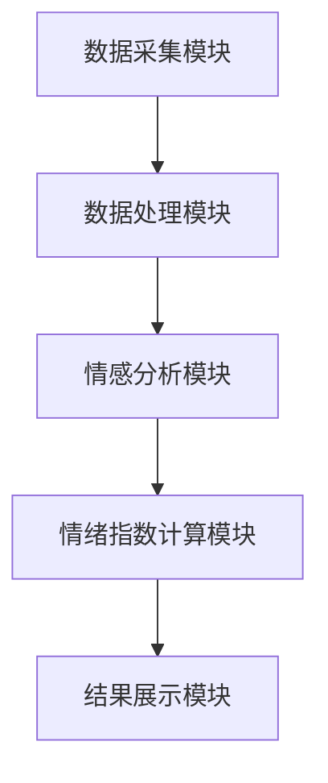
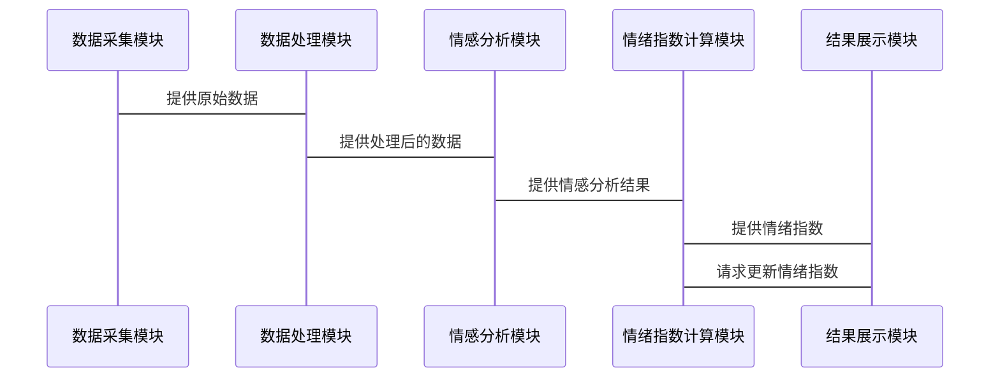

                 


# AI驱动的投资者情绪指数开发

> 关键词：AI技术，投资者情绪，情绪指数，自然语言处理，机器学习，深度学习

> 摘要：本文深入探讨了如何利用人工智能技术开发投资者情绪指数，从数据收集与预处理、情绪分析算法、系统架构设计到实际项目开发，详细讲解了每个步骤的实现方法和关键技术。文章结合理论与实践，为读者提供了一套完整的解决方案，帮助他们在金融市场中更好地理解和应用投资者情绪分析。

---

# 第一部分: AI驱动的投资者情绪指数开发背景与概念

## 第1章: 投资者情绪与AI技术的结合

### 1.1 投资者情绪的重要性

#### 1.1.1 投资者情绪的定义与作用

投资者情绪是指投资者在金融市场中的情感状态，通常表现为乐观、悲观、贪婪或恐惧等。情绪影响着投资者的决策，从而对市场价格产生显著影响。情绪分析是理解市场波动的重要工具，能够帮助投资者更好地把握市场趋势。

#### 1.1.2 情绪在金融市场中的影响

情绪在金融市场中起着至关重要的作用。例如，当投资者情绪过于乐观时，可能会导致资产价格被高估；而当情绪悲观时，可能导致资产价格被低估。情绪指数能够量化这种情绪波动，为投资者提供决策依据。

#### 1.1.3 AI技术在情绪分析中的优势

AI技术能够高效地处理大量数据，并通过机器学习算法提取情绪特征。与传统的统计方法相比，AI技术能够捕捉更复杂的情绪模式，提高情绪分析的准确性。

---

### 1.2 投资者情绪指数的定义与构建

#### 1.2.1 情绪指数的定义

情绪指数是对投资者情绪的量化指标，通常基于自然语言处理（NLP）和机器学习技术构建。情绪指数能够反映市场参与者的整体情绪状态，为投资决策提供参考。

#### 1.2.2 情绪指数的构建方法

情绪指数的构建方法包括数据采集、特征提取、模型训练和结果计算等步骤。数据采集主要来自新闻、社交媒体、机构报告等渠道，特征提取则利用NLP技术提取文本中的情绪特征。

#### 1.2.3 情绪指数的应用场景

情绪指数广泛应用于金融市场的风险管理和投资决策。例如，情绪指数可以帮助投资者预测市场波动，优化投资组合，以及识别市场拐点。

---

### 1.3 AI驱动情绪指数开发的核心概念

#### 1.3.1 数据驱动与模型驱动的结合

AI情绪指数开发需要结合数据驱动和模型驱动的方法。数据驱动方法依赖大量历史数据，而模型驱动方法则依赖于对情绪生成机制的理解。

#### 1.3.2 情感分析与情绪预测的关系

情感分析是情绪预测的基础。情感分析关注的是对文本的情感倾向，而情绪预测则是对整体市场情绪的量化。

#### 1.3.3 情绪指数的量化与评估

情绪指数的量化需要将情绪特征转化为可量化的指标。评估情绪指数的准确性需要结合历史数据和市场表现进行验证。

---

### 1.4 本章小结

本章介绍了投资者情绪的重要性及其在金融市场中的影响，探讨了AI技术在情绪分析中的优势，以及情绪指数的定义与构建方法。接下来的章节将详细讲解数据收集与预处理、情绪分析算法、系统架构设计等内容。

---

# 第二部分: 数据收集与预处理

## 第2章: 数据来源与收集方法

### 2.1 市场数据的来源

#### 2.1.1 金融新闻与社交媒体数据

金融新闻和社交媒体是情绪数据的重要来源。新闻标题和社交媒体帖子通常反映了市场参与者的观点和情绪。

#### 2.1.2 机构投资者报告与交易数据

机构投资者的报告和交易数据也包含大量情绪信息。例如，机构的投资决策往往受到情绪影响。

#### 2.1.3 其他辅助数据（如经济指标）

其他辅助数据，如经济指标和市场数据，可以用于验证情绪指数的有效性。

---

### 2.2 数据收集的挑战

#### 2.2.1 数据量与数据质量的问题

数据量不足或数据质量低劣会影响情绪分析的效果。因此，数据清洗和特征提取是至关重要的步骤。

#### 2.2.2 数据清洗与去噪的方法

数据清洗包括去除噪声、填补缺失值和标准化处理。去噪方法可以基于统计学或机器学习技术。

#### 2.2.3 数据特征提取的策略

特征提取是将文本数据转化为数值特征的关键步骤。常用的特征包括词袋模型和TF-IDF特征。

---

### 2.3 数据预处理的实现

#### 2.3.1 文本清洗与分词

文本清洗包括去除标点符号、停用词和特殊字符。分词是将文本分割成单个词语或短语的过程。

#### 2.3.2 文本向量化

文本向量化是将文本转化为数值向量的过程。常用的方法包括词袋模型、TF-IDF和词嵌入（如Word2Vec）。

#### 2.3.3 数据增强与平衡

数据增强可以提高模型的泛化能力，数据平衡可以避免类别不平衡问题。

---

### 2.4 本章小结

本章详细讲解了数据收集与预处理的步骤，包括数据来源、清洗、特征提取和向量化方法。接下来的章节将探讨如何利用这些数据构建情绪分析模型。

---

# 第三部分: 情绪分析算法

## 第3章: 情感分析算法

### 3.1 情感分析的核心算法

#### 3.1.1 基于规则的情感分析

基于规则的情感分析依赖于预定义的规则和情感词典。这种方法简单但灵活性较差。

#### 3.1.2 统计模型情感分析

统计模型（如Naive Bayes）通过统计特征和概率模型进行情感分类。这种方法在数据充足的情况下表现良好。

#### 3.1.3 机器学习情感分析

机器学习方法（如支持向量机和随机森林）能够处理高维特征，具有较强的泛化能力。

#### 3.1.4 深度学习情感分析

深度学习方法（如LSTM和Transformer）能够捕捉文本中的长距离依赖关系，提高情感分析的准确性。

---

### 3.2 情感分析模型的优化

#### 3.2.1 模型调优与参数优化

模型调优包括选择合适的算法和优化参数。常用的参数优化方法包括网格搜索和随机搜索。

#### 3.2.2 特征工程与模型融合

特征工程是通过选择和创建特征来提高模型性能。模型融合方法（如投票和加权融合）可以进一步提高预测准确率。

---

### 3.3 情感分析的实现步骤

#### 3.3.1 数据集划分与模型训练

将数据划分为训练集、验证集和测试集，进行模型训练和评估。

#### 3.3.2 模型评估与结果分析

通过准确率、召回率和F1分数等指标评估模型性能。

#### 3.3.3 情感分析的代码实现

以下是情感分析的Python代码示例：

```python
from sklearn.feature_extraction.text import TfidfVectorizer
from sklearn.svm import SVC
from sklearn.metrics import accuracy_score

# 数据预处理
texts = [...]  # 文本数据
labels = [...]  # 标签

# 特征提取
vectorizer = TfidfVectorizer()
X = vectorizer.fit_transform(texts)

# 模型训练
model = SVC()
model.fit(X, labels)

# 模型预测
test_texts = [...]  # 测试文本
test_X = vectorizer.transform(test_texts)
test_labels = model.predict(test_X)

# 结果评估
print(accuracy_score(test_labels, predicted_labels))
```

---

### 3.4 本章小结

本章详细讲解了情感分析的核心算法和优化方法，包括基于规则、统计、机器学习和深度学习的多种方法。接下来的章节将探讨如何将这些算法应用于情绪指数的开发。

---

# 第四部分: 系统架构与实现

## 第4章: 系统架构设计

### 4.1 系统功能设计

#### 4.1.1 数据采集模块

数据采集模块负责从新闻、社交媒体等渠道获取数据。

#### 4.1.2 数据处理模块

数据处理模块包括文本清洗、分词和向量化。

#### 4.1.3 情感分析模块

情感分析模块利用机器学习或深度学习模型进行情绪预测。

#### 4.1.4 情绪指数计算模块

情绪指数计算模块基于情感分析结果计算投资者情绪指数。

#### 4.1.5 结果展示模块

结果展示模块以可视化的方式呈现情绪指数和市场数据。

---

### 4.2 系统架构图



---

### 4.3 系统交互流程



---

### 4.4 系统实现

#### 4.4.1 数据采集模块的实现

以下是数据采集模块的Python代码示例：

```python
import requests
from bs4 import BeautifulSoup

def fetch_news(url):
    response = requests.get(url)
    soup = BeautifulSoup(response.text, 'html.parser')
    articles = soup.find_all('div', class_='article')
    texts = [article.text for article in articles]
    return texts

news_texts = fetch_news('http://example.com/news')
```

---

#### 4.4.2 情感分析模块的实现

以下是情感分析模块的代码示例：

```python
from sklearn.pipeline import Pipeline

pipeline = Pipeline([
    ('tfidf', TfidfVectorizer()),
    ('model', SVC())
])

pipeline.fit(train_texts, train_labels)
predicted_labels = pipeline.predict(test_texts)
```

---

### 4.5 本章小结

本章详细讲解了系统架构设计和实现，包括数据采集、处理、情感分析和结果展示模块。接下来的章节将通过实际案例展示如何开发投资者情绪指数。

---

# 第五部分: 项目实战

## 第5章: 投资者情绪指数开发实战

### 5.1 环境配置

#### 5.1.1 安装必要的库

安装Python和相关库：

```bash
pip install numpy pandas scikit-learn nltk requests beautifulsoup4
```

---

### 5.2 数据采集与预处理

#### 5.2.1 采集金融新闻数据

从新闻网站获取金融新闻数据：

```python
import requests
from bs4 import BeautifulSoup

def fetch_financial_news(url):
    response = requests.get(url)
    soup = BeautifulSoup(response.text, 'html.parser')
    articles = soup.find_all('div', class_='news-item')
    texts = [article.text for article in articles]
    return texts

news_texts = fetch_financial_news('https://finance.yahoo.com/')
```

---

#### 5.2.2 数据清洗与分词

对文本进行清洗和分词：

```python
from nltk.corpus import stopwords
from nltk.tokenize import word_tokenize

def preprocess(texts):
    cleaned_texts = []
    for text in texts:
        words = word_tokenize(text.lower())
        cleaned_words = [word for word in words if word not in stopwords.words('english')]
        cleaned_texts.append(' '.join(cleaned_words))
    return cleaned_texts

processed_texts = preprocess(news_texts)
```

---

### 5.3 情感分析模型训练

#### 5.3.1 特征提取与模型训练

使用TF-IDF进行特征提取，并训练情感分析模型：

```python
from sklearn.feature_extraction.text import TfidfVectorizer
from sklearn.svm import SVC

vectorizer = TfidfVectorizer()
X = vectorizer.fit_transform(processed_texts)

model = SVC()
model.fit(X, labels)
```

---

### 5.4 情绪指数计算

基于情感分析结果计算情绪指数：

```python
import numpy as np

def calculate_emotion_index(predicted_labels):
    positive_score = np.mean(predicted_labels == 'positive')
    negative_score = np.mean(predicted_labels == 'negative')
    emotion_index = (positive_score - negative_score) * 100
    return emotion_index

emotion_index = calculate_emotion_index(predicted_labels)
```

---

### 5.5 结果展示

将情绪指数和市场数据进行可视化展示：

```python
import matplotlib.pyplot as plt

plt.figure(figsize=(10, 6))
plt.plot(range(len(emotion_index)), emotion_index, label='Emotion Index')
plt.xlabel('Time')
plt.ylabel('Emotion Index')
plt.legend()
plt.show()
```

---

### 5.6 本章小结

本章通过实际案例展示了投资者情绪指数的开发过程，包括数据采集、预处理、模型训练和结果展示。通过这些步骤，读者可以掌握情绪指数开发的核心方法。

---

# 第六部分: 结论与展望

## 第6章: 结论与展望

### 6.1 全文总结

本文详细讲解了AI驱动的投资者情绪指数开发的背景、数据收集与预处理、情感分析算法、系统架构设计和项目实战。通过理论与实践的结合，为读者提供了一套完整的解决方案。

### 6.2 未来研究方向

未来的研究可以进一步优化情感分析模型，引入更先进的深度学习技术（如Transformer）。此外，还可以结合其他市场数据，提高情绪指数的预测能力。

### 6.3 应用前景

投资者情绪指数在金融市场的应用前景广阔，可以帮助投资者更好地理解市场情绪，优化投资决策，降低市场风险。

---

# 附录: 常用工具与库

- Python库：scikit-learn、nltk、requests、beautifulsoup4、pandas
- 深度学习框架：TensorFlow、PyTorch
- 可视化工具：Matplotlib、Seaborn

---

通过以上内容，读者可以系统地学习AI驱动的投资者情绪指数开发的全过程，从理论到实践，全面掌握相关技术和方法。

