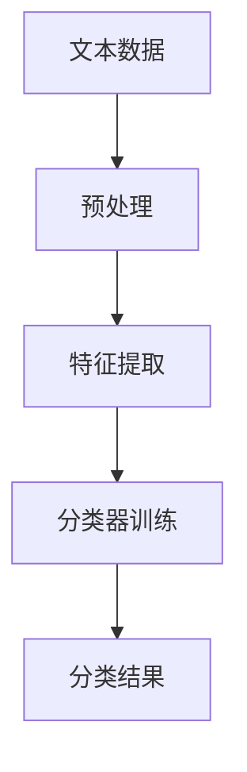
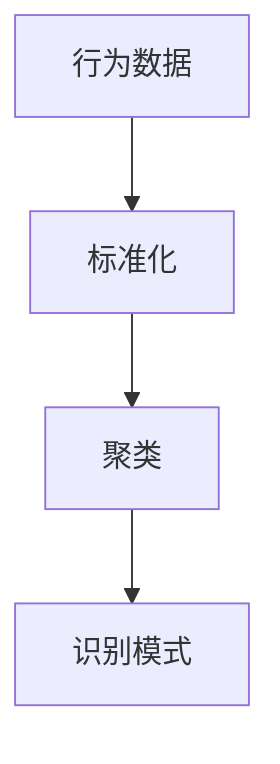
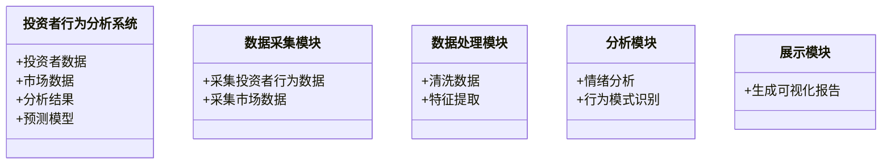
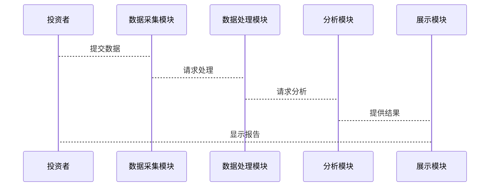

                 


# AI驱动的投资者行为分析平台

## 关键词：AI，投资者行为分析，机器学习，深度学习，自然语言处理，数据分析

## 摘要：AI驱动的投资者行为分析平台通过整合先进的机器学习和自然语言处理技术，实现对投资者行为的精准预测和分析。本文将详细介绍该平台的背景、核心概念、算法原理、系统架构、项目实战及未来发展。

---

## 第1章：背景与核心概念

### 1.1 投资者行为分析的背景与意义
投资者行为分析是金融领域的重要研究方向，旨在通过分析投资者的决策模式和行为特征，帮助机构和个人做出更明智的投资决策。传统的分析方法依赖于经验丰富的分析师，但随着数据量的爆炸式增长和市场复杂性的增加，这种方法已难以满足需求。AI技术的引入，为投资者行为分析带来了新的可能性。

#### 1.1.1 投资者行为分析的核心目标
- 描述投资者的行为特征。
- 预测投资者的决策模式。
- 提供基于数据的决策支持。

#### 1.1.2 AI技术在投资者行为分析中的作用
- 处理海量数据，提取有价值的信息。
- 自动化识别复杂的行为模式。
- 提供实时分析和动态反馈。

#### 1.1.3 当前市场对AI驱动分析的需求
- 数据量大、类型多样。
- 市场波动快，需要实时分析。
- 个性化投资需求增加。

### 1.2 投资者行为分析的挑战
#### 1.2.1 数据多样性与复杂性
投资者行为数据包括交易记录、市场情绪、新闻数据等，类型多样，处理难度大。

#### 1.2.2 行为模式的动态变化
市场环境不断变化，投资者行为模式也随之调整，增加了分析的难度。

#### 1.2.3 数据隐私与安全问题
投资者数据涉及个人隐私，如何确保数据安全是一个重要挑战。

### 1.3 AI驱动分析的优势
#### 1.3.1 高效的数据处理能力
AI技术能够快速处理海量数据，提取关键特征。

#### 1.3.2 精准的行为预测能力
通过机器学习模型，可以准确预测投资者的行为模式。

#### 1.3.3 实时分析与决策支持
AI系统能够实时监控市场动态，提供及时的决策支持。

---

## 第2章：投资者行为分析的核心概念

### 2.1 投资者行为分析的关键要素
#### 2.1.1 行为数据的分类
- 交易数据：包括买卖时间、价格、数量等。
- 市场情绪数据：包括新闻、社交媒体评论等。
- 个人特征数据：包括投资者的年龄、性别、投资经验等。

#### 2.1.2 影响投资者决策的因素
- 市场环境：如经济指标、政策变化。
- 个人因素：如风险偏好、认知偏差。
- 社会因素：如羊群效应、从众心理。

#### 2.1.3 行为模式的识别方法
- 时间序列分析。
- 聚类分析。
- 分类分析。

### 2.2 核心概念的ER实体关系图
```mermaid
er
    actor:投资者
    action:投资行为
    attribute:行为特征
    relation:投资者-投资行为
    relation:投资行为-行为特征
```

---

## 第3章：投资者情绪分析算法

### 3.1 情绪分析的基本原理
#### 3.1.1 文本预处理
- 数据清洗：去除噪声，如特殊字符、停用词。
- 分词：将文本分割成词语或短语。
- 词干提取：将词语还原为基本形式。

#### 3.1.2 情感特征提取
- 使用TF-IDF提取关键词。
- 利用词嵌入模型（如Word2Vec）生成词向量。

#### 3.1.3 情感分类算法
- 使用逻辑回归、支持向量机（SVM）等分类算法。

### 3.2 基于机器学习的情绪分类


#### 3.2.1 逻辑回归模型
$$ P(y=1|x) = \frac{1}{1 + e^{-\beta x}} $$

#### 3.2.2 支持向量机（SVM）
$$ \text{最大化} \ \ \gamma \geq 1 - y_i(w \cdot x_i + b) $$

### 3.3 情绪分类的Python实现
```python
from sklearn.feature_extraction.text import TfidfVectorizer
from sklearn.linear_model import LogisticRegression

# 数据预处理
X = corpus
y = labels

# 特征提取
tfidf = TfidfVectorizer()
X_tfidf = tfidf.fit_transform(X)

# 模型训练
model = LogisticRegression()
model.fit(X_tfidf, y)
```

---

## 第4章：行为模式识别算法

### 4.1 基于聚类的行为模式识别
#### 4.1.1 K-means聚类
- 将投资者行为数据分成不同的群体，识别典型的行为模式。

#### 4.1.2 DBSCAN聚类
- 基于密度的聚类方法，适用于数据分布不均匀的情况。

### 4.2 基于聚类的行为模式识别


### 4.3 聚类算法的Python实现
```python
from sklearn.cluster import KMeans
from sklearn.preprocessing import StandardScaler

# 数据标准化
scaler = StandardScaler()
X_scaled = scaler.fit_transform(X)

# 模型训练
model = KMeans(n_clusters=3)
model.fit(X_scaled)
```

---

## 第5章：系统分析与架构设计

### 5.1 系统功能设计
#### 5.1.1 领域模型


### 5.2 系统架构设计


### 5.3 系统接口设计
- 用户接口：接收投资者数据和市场数据。
- API接口：提供情绪分析和行为模式识别的结果。

### 5.4 系统交互流程


---

## 第6章：项目实战

### 6.1 环境安装
- 安装Python和相关库：`scikit-learn`, `nltk`, `pandas`.

### 6.2 核心代码实现
```python
# 数据预处理
def preprocess(text):
    # 分词和去停用词
    pass

# 情绪分析
def sentiment_analyzer(text):
    # 使用预训练模型进行分析
    pass

# 行为模式识别
def behavior_classifier(data):
    # 使用聚类算法识别模式
    pass
```

### 6.3 实际案例分析
- 数据来源：股票交易数据和社交媒体评论。
- 分析流程：数据预处理、特征提取、模型训练、结果展示。

---

## 第7章：总结与展望

### 7.1 总结
本文详细介绍了AI驱动的投资者行为分析平台的背景、核心概念、算法原理、系统架构和项目实战。通过结合机器学习和自然语言处理技术，该平台能够高效地分析投资者行为，提供有价值的决策支持。

### 7.2 未来展望
- 更加复杂的模型：如深度学习和强化学习。
- 更多数据源的整合：如社交媒体、新闻数据。
- 实时分析能力的提升。

### 7.3 最佳实践
- 数据隐私保护：确保投资者数据的安全。
- 模型优化：定期更新模型，提高准确性。
- 用户教育：帮助用户理解分析结果。

---

通过本文的讲解，读者可以深入了解AI在投资者行为分析中的应用，并能够实际操作搭建一个简单的分析平台。未来，随着技术的不断发展，AI在金融领域的应用将更加广泛和深入。

