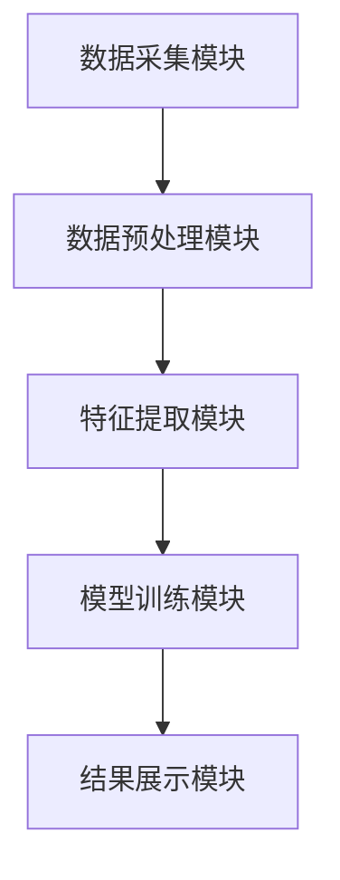
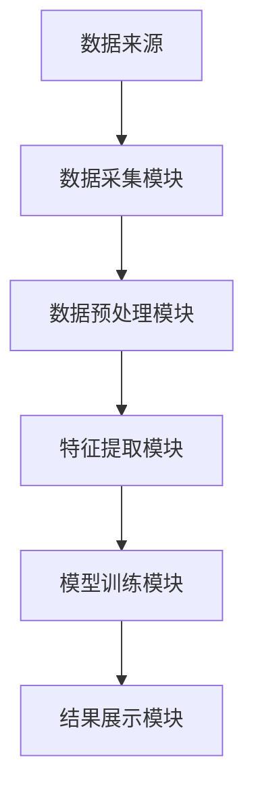

                 


# 《AI驱动的投资者行为模式识别》

## 关键词：投资者行为模式识别, 人工智能, 机器学习, 深度学习, 自然语言处理, 投资决策

## 摘要：  
本文章系统地探讨了AI技术在投资者行为模式识别中的应用，涵盖了从数据采集到系统实现的全过程。文章首先介绍了投资者行为模式识别的背景与挑战，然后详细讲解了AI驱动的核心技术，包括机器学习、深度学习和自然语言处理。接着，文章深入分析了投资者行为数据的采集与预处理方法，探讨了模式识别的具体算法及其数学原理。通过构建系统架构并提供实际案例，文章展示了AI技术在投资决策中的实际应用。最后，文章总结了当前研究的成果，并展望了未来的发展方向。

---

## 第1章: 投资者行为模式识别的背景与挑战

### 1.1 投资者行为模式识别的背景

#### 1.1.1 传统投资分析方法的局限性
- 传统分析方法依赖于市场数据和基本面分析，难以捕捉投资者心理和行为特征。
- 个体投资者和机构投资者的行为差异显著，传统方法难以统一建模。

#### 1.1.2 AI技术在投资分析中的应用前景
- AI技术能够处理海量数据，识别复杂模式，为投资决策提供新视角。
- 自然语言处理技术可以分析新闻、社交媒体等非结构化数据，捕捉市场情绪。

#### 1.1.3 行为金融学与投资者决策模式的结合
- 行为金融学揭示了投资者决策中的心理偏差，AI技术能够量化这些行为特征。
- 通过结合行为金融学理论，AI技术能够更准确地预测投资者行为。

### 1.2 投资者行为模式识别的核心问题

#### 1.2.1 问题背景与问题描述
- 投资者行为模式识别旨在通过数据分析，挖掘投资者的决策模式和行为特征。
- 问题解决的关键在于构建能够捕捉投资者行为特征的数学模型。

#### 1.2.2 问题解决的关键技术
- 数据采集与处理技术：如何高效采集和预处理投资者行为数据。
- 模式识别算法：选择合适的机器学习或深度学习算法进行模式识别。
- 可解释性与鲁棒性：确保模型的可解释性和在实际应用中的稳定性。

#### 1.2.3 边界与外延
- 本研究的边界：关注投资者的交易行为和市场反应，不涉及具体投资策略。
- 外延：技术可扩展至其他领域，如消费者行为分析和信用评估。

#### 1.2.4 核心要素组成与概念结构
- 核心要素：投资者行为数据、AI算法、模式识别模型。
- 概念结构：从数据到模型，再到实际应用的闭环流程。

---

## 第2章: AI驱动的核心技术与方法

### 2.1 机器学习在投资者行为分析中的应用

#### 2.1.1 机器学习的基本原理
- 机器学习通过数据训练模型，识别数据中的模式和特征。
- 常见算法：决策树、随机森林、支持向量机（SVM）等。

#### 2.1.2 常见算法及其特点
- **决策树**：易于解释，适合分类问题。
- **随机森林**：通过多棵树的集成，提高准确性和鲁棒性。
- **支持向量机（SVM）**：适合小规模数据，能够处理非线性分类问题。

#### 2.1.3 在投资者行为分析中的应用案例
- 使用决策树分析投资者的交易频率和收益目标。
- 通过随机森林预测投资者的交易决策。

### 2.2 深度学习与自然语言处理技术

#### 2.2.1 深度学习的基本原理
- 深度学习通过多层神经网络提取数据的高层次特征。
- 常见模型：卷积神经网络（CNN）、循环神经网络（RNN）等。

#### 2.2.2 自然语言处理技术在文本分析中的应用
- **情感分析**：通过分析新闻和社交媒体文本，捕捉市场情绪。
- **文本挖掘**：提取关键词和主题，识别投资者关注的热点。

#### 2.2.3 在投资者行为模式识别中的具体应用
- 使用RNN分析投资者的交易日志，识别交易模式。
- 通过BERT模型分析投资者评论，预测市场走势。

---

## 第3章: 投资者行为数据的采集与预处理

### 3.1 数据来源与采集方法

#### 3.1.1 市场交易数据的采集
- 数据来源：股票交易数据、期货市场数据、外汇市场数据。
- 数据格式：时间序列数据，包括开盘价、收盘价、最高价、最低价等。

#### 3.1.2 投资者行为数据的获取渠道
- 数据来源：投资者交易记录、社交媒体数据、新闻媒体数据。
- 数据采集工具：API接口、网络爬虫等。

#### 3.1.3 数据清洗与预处理
- 数据清洗：去除重复数据、处理缺失值、纠正异常值。
- 数据标准化：统一数据格式，确保数据一致性。

### 3.2 数据特征提取与工程

#### 3.2.1 常见特征提取方法
- **技术指标**：如移动平均线（MA）、相对强弱指数（RSI）等。
- **市场情绪指标**：如市场恐慌指数、投资者信心指数等。

#### 3.2.2 特征工程在投资者行为分析中的应用
- 通过主成分分析（PCA）减少特征维度。
- 构建复合特征，如投资者交易活跃度指数。

#### 3.2.3 数据标准化与归一化处理
- 标准化：使用Z-score方法将数据标准化。
- 归一化：将数据缩放到0-1范围，便于模型训练。

---

## 第4章: 投资者行为模式识别的算法原理

### 4.1 监督学习算法

#### 4.1.1 分类算法（如决策树、随机森）
- **决策树**：构建决策树模型，预测投资者的交易决策。
- **随机森林**：通过集成多棵决策树，提高模型的准确性和鲁棒性。

#### 4.1.2 回归算法（如线性回归、支持向量回归）
- 线性回归：预测投资者的收益目标。
- 支持向量回归：处理非线性关系，预测投资者的交易行为。

### 4.2 深度学习算法

#### 4.2.1 卷积神经网络（CNN）
- 应用于图像识别，提取交易数据的时空特征。

#### 4.2.2 循环神经网络（RNN）
- 应用于时间序列分析，预测投资者的交易行为。

### 4.3 算法比较与选择

#### 4.3.1 算法比较
- 监督学习：适合有标签的数据，如投资者的交易决策。
- 非监督学习：适合无标签的数据，如市场情绪分析。
- 强化学习：适合动态环境中的决策问题，如实时交易策略。

#### 4.3.2 算法选择策略
- 根据数据类型选择合适算法：结构化数据适合机器学习，非结构化数据适合深度学习。
- 根据问题类型选择算法：分类问题选择决策树或随机森林，回归问题选择线性回归或支持向量回归。

---

## 第5章: 投资者行为模式识别的系统架构与实现

### 5.1 系统架构设计

#### 5.1.1 系统功能设计
- 数据采集模块：负责数据的采集和预处理。
- 特征提取模块：提取投资者行为特征。
- 模型训练模块：训练机器学习或深度学习模型。
- 结果展示模块：可视化分析结果。

#### 5.1.2 系统架构图


### 5.2 系统实现细节

#### 5.2.1 数据流分析


#### 5.2.2 核心模块实现
- 数据采集模块：使用Python的pandas库进行数据清洗。
- 特征提取模块：使用scikit-learn库进行特征选择。
- 模型训练模块：使用TensorFlow或Keras框架训练深度学习模型。

---

## 第6章: 项目实战——投资者行为模式识别系统开发

### 6.1 项目介绍

#### 6.1.1 项目背景
- 开发一个投资者行为模式识别系统，帮助投资者更好地理解市场动态。

#### 6.1.2 项目目标
- 实现投资者行为数据的采集与分析。
- 构建投资者行为模式识别模型，预测市场走势。

### 6.2 系统核心实现

#### 6.2.1 环境配置
- 安装Python、TensorFlow、Keras、pandas、numpy等库。

#### 6.2.2 核心代码实现
```python
import pandas as pd
import numpy as np
from sklearn.ensemble import RandomForestClassifier
from tensorflow.keras.models import Sequential
from tensorflow.keras.layers import Dense

# 数据预处理
data = pd.read_csv('investor_behavior.csv')
data = data.dropna()
data = data.iloc[:100]

# 特征提取
features = data.drop(columns=['label'])
label = data['label']

# 模型训练
model = RandomForestClassifier()
model.fit(features, label)

# 深度学习模型
model_dl = Sequential()
model_dl.add(Dense(64, activation='relu', input_dim=features.shape[1]))
model_dl.add(Dense(1, activation='sigmoid'))
model_dl.compile(optimizer='adam', loss='binary_crossentropy')
model_dl.fit(features, label, epochs=10)
```

#### 6.2.3 代码应用解读与分析
- 使用随机森林进行分类，预测投资者的交易决策。
- 使用深度学习模型进行回归，预测投资者的收益目标。

### 6.3 实际案例分析

#### 6.3.1 案例背景
- 分析某段时间内投资者的交易行为，预测市场走势。

#### 6.3.2 数据分析与结果展示
- 使用Matplotlib绘制交易数据的可视化图表。
- 展示模型预测结果与实际数据的对比。

### 6.4 项目小结
- 通过实际案例分析，验证了模型的有效性。
- 提出了改进建议，如引入更多的特征或优化模型结构。

---

## 第7章: 总结与展望

### 7.1 全文总结
- 介绍了AI技术在投资者行为模式识别中的应用，涵盖了数据采集、特征提取、模型训练和结果展示的全过程。
- 展示了机器学习和深度学习算法在投资者行为分析中的具体应用。

### 7.2 未来展望
- 结合更多的数据源，如社交媒体数据和新闻数据，进行多模态分析。
- 引入强化学习算法，优化投资者的交易策略。
- 研究模型的可解释性，提升投资者对AI决策的信任度。

---

## 参考文献
- Breiman, L. (2001). Random forests. Machine Learning, 45(1), 5-32.
- LeCun, Y., Bengio, Y., & Hinton, G. (2015). Deep learning. Nature, 521(7555), 436-444.
- Hochreiter, S., & Schmidhuber, J. (1997). Long short-term memory. Neural computation, 9(8), 1735-1780.

---

## 致谢
感谢读者的支持与关注，感谢同行的建议与指导。

