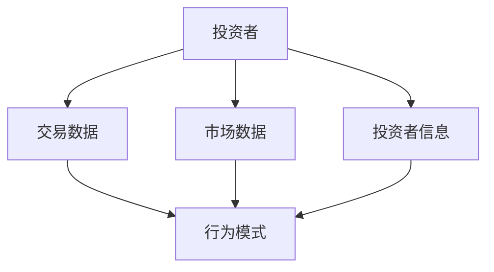
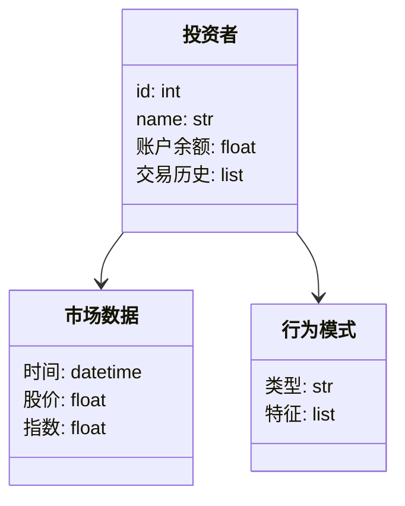
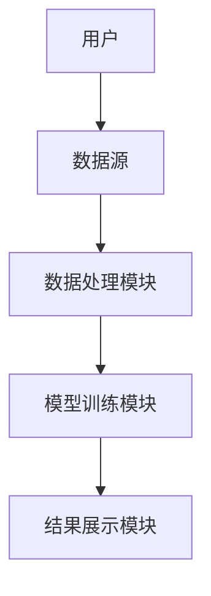
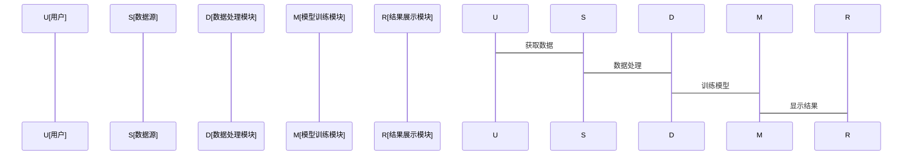

                 


# AI驱动的投资者行为模式识别与预测

> 关键词：投资者行为分析，人工智能，机器学习，模式识别，时间序列分析，深度学习

> 摘要：本文探讨了如何利用人工智能技术识别和预测投资者行为模式。通过分析投资者的交易数据和市场信息，结合机器学习算法，构建投资者行为分析模型，实现对投资者决策模式的识别与预测。文章从理论基础到算法实现，从系统设计到项目实战，全面阐述了AI驱动的投资者行为模式识别与预测的核心方法和应用。

---

# 第一部分: AI驱动的投资者行为模式识别与预测基础

# 第1章: 投资者行为模式识别与预测的背景介绍

## 1.1 投资者行为分析的背景与意义
### 1.1.1 投资者行为分析的定义与重要性
投资者行为分析是研究投资者在金融市场中的决策过程和交易行为的科学。通过对投资者行为的分析，可以揭示投资者的心理、情绪和决策模式，从而为投资策略的优化、风险控制和市场预测提供依据。

### 1.1.2 AI技术在投资者行为分析中的应用前景
随着人工智能技术的快速发展，AI在投资者行为分析中的应用前景广阔。通过自然语言处理、机器学习和深度学习等技术，可以从海量的市场数据和投资者行为数据中提取有用的信息，帮助投资者做出更明智的决策。

### 1.1.3 当前市场中的主要问题与挑战
当前市场中，投资者行为分析面临的主要问题包括数据的复杂性、投资者行为的多样性以及市场的不确定性。传统的统计方法在处理这些问题时显得力不从心，而AI技术的引入为解决这些问题提供了新的可能性。

## 1.2 AI驱动的投资者行为模式识别与预测的核心概念
### 1.2.1 问题背景与问题描述
投资者行为模式识别与预测的核心问题是：如何从投资者的历史交易数据和市场数据中，识别出投资者的行为模式，并预测未来的投资行为。

### 1.2.2 问题解决的思路与方法
AI驱动的投资者行为模式识别与预测主要通过以下思路进行：
1. 数据收集：收集投资者的历史交易数据、市场数据和投资者的个人信息。
2. 数据预处理：对数据进行清洗、特征提取和标准化处理。
3. 模型训练：利用机器学习和深度学习算法，训练投资者行为识别与预测模型。
4. 模型评估：通过回测和验证，评估模型的准确性和稳定性。

### 1.2.3 核心概念的边界与外延
投资者行为模式识别与预测的核心概念包括：
- **投资者行为模式**：投资者在不同市场条件下的交易策略和决策模式。
- **行为预测**：基于历史数据和模型，预测投资者未来的交易行为。

### 1.2.4 核心要素组成与概念结构
投资者行为模式识别与预测的核心要素包括：
- **数据来源**：交易数据、市场数据、投资者信息。
- **算法选择**：聚类、分类、时间序列分析。
- **模型构建**：机器学习模型、深度学习模型。
- **结果评估**：准确率、召回率、F1分数。

---

# 第2章: 投资者行为模式识别与预测的核心概念与联系

## 2.1 核心概念原理
### 2.1.1 投资者行为模式的定义与分类
投资者行为模式可以根据不同的标准进行分类，常见的分类方式包括：
- **按投资者类型**：机构投资者、个人投资者、散户。
- **按交易策略**：价值投资、趋势投资、短期交易。
- **按市场条件**：牛市、熊市、震荡市。

### 2.1.2 AI技术在行为模式识别中的应用原理
AI技术通过以下步骤实现投资者行为模式的识别：
1. 数据预处理：清洗和特征提取。
2. 特征工程：构建投资者行为的特征向量。
3. 模型训练：训练分类或聚类模型。
4. 模型部署：实时监控和预测。

### 2.1.3 数据驱动与模型驱动的结合
数据驱动方法依赖于大量历史数据，通过统计学习和机器学习算法提取特征；模型驱动方法基于金融理论构建数学模型，结合AI技术进行优化。

## 2.2 核心概念属性特征对比表
以下是对不同投资者行为模式的特征对比：

| 特征                | 机构投资者        | 个人投资者        | 散户投资者        |
|---------------------|-----------------|-----------------|-----------------|
| 交易频率            | 较低            | 中等            | 高              |
| 交易策略            | 长期价值投资     | 短期交易        | 随机交易        |
| 风险承受能力        | 较高            | 中等            | 较低            |
| 数据依赖性          | 高              | 中等            | 低              |

## 2.3 ER实体关系图架构
以下是一个简化的投资者行为模式识别的实体关系图：



## 2.4 本章小结
本章介绍了投资者行为模式识别与预测的核心概念，包括定义、分类、原理和数据驱动与模型驱动的结合。通过对比不同投资者类型的行为特征，帮助读者更好地理解投资者行为模式的复杂性。

---

# 第3章: 投资者行为模式识别与预测的算法原理

## 3.1 基于聚类的投资者行为模式识别
### 3.1.1 聚类算法的基本原理
聚类算法通过将相似的数据点分组，识别出具有相似行为模式的投资者群体。

### 3.1.2 K-means算法在行为模式识别中的应用
K-means算法是一种常用的聚类算法，适用于将投资者分成不同的群体。例如，可以将投资者分为“保守型”、“激进型”和“平衡型”三类。

### 3.1.3 层次聚类算法的实现与优缺点
层次聚类算法通过构建树状结构，逐步合并相似的投资者群体。优点是易于解释，缺点是计算复杂度较高。

## 3.2 基于分类的投资者行为预测
### 3.2.1 分类算法的基本原理
分类算法通过训练模型，将投资者的行为模式分为不同的类别，例如“买入”、“卖出”和“观望”。

### 3.2.2 支持向量机（SVM）在行为预测中的应用
SVM算法适用于高维数据的分类问题，可以用于预测投资者的交易行为。

### 3.2.3 随机森林算法的实现与优缺点
随机森林算法是一种基于树的集成算法，具有高准确性和鲁棒性，适用于投资者行为的分类任务。

## 3.3 基于序列模型的投资者行为预测
### 3.3.1 RNN与LSTM的基本原理
RNN和LSTM适用于时间序列数据的预测问题，可以用于预测投资者的交易行为序列。

### 3.3.2 LSTM在时间序列预测中的应用
LSTM通过记忆单元（Memory Cell）捕捉长期依赖关系，适用于预测投资者的长期行为模式。

### 3.3.3 Transformer模型的最新进展
Transformer模型在自然语言处理领域表现出色，也可以用于投资者行为的序列预测任务。

## 3.4 算法实现的Python代码示例
以下是一个基于K-means算法的投资者行为模式识别的代码示例：

```python
from sklearn.cluster import KMeans
import pandas as pd

# 数据加载
data = pd.read_csv('investor_data.csv')

# 数据预处理
X = data[['交易频率', '风险承受能力', '平均收益']]

# K-means聚类
model = KMeans(n_clusters=3)
model.fit(X)

# 获取聚类结果
clusters = model.predict(X)
print(clusters)
```

## 3.5 数学模型与公式
### 3.5.1 聚类算法的距离度量公式
K-means算法中的距离度量通常使用欧氏距离：

$$ d(x, y) = \sqrt{(x_1 - y_1)^2 + (x_2 - y_2)^2} $$

### 3.5.2 分类算法的损失函数
SVM的损失函数可以表示为：

$$ L = -\sum_{i=1}^{n} y_i \cdot \text{sign}(w \cdot x_i + b) $$

---

# 第4章: 投资者行为模式识别与预测的系统分析与架构设计

## 4.1 问题场景介绍
投资者行为模式识别与预测系统需要处理大量的市场数据和交易数据，对投资者的行为模式进行实时监控和预测。

## 4.2 项目介绍
本项目旨在构建一个基于AI的投资者行为分析系统，实现对投资者行为模式的识别与预测。

## 4.3 系统功能设计
### 4.3.1 领域模型设计
以下是一个投资者行为分析系统的领域模型：



### 4.3.2 系统架构设计
以下是一个投资者行为分析系统的架构图：



### 4.3.3 系统接口设计
投资者行为分析系统需要以下接口：
- 数据接口：从数据库中读取交易数据和市场数据。
- 模型接口：调用机器学习模型进行预测。
- 展示接口：将预测结果展示给用户。

### 4.3.4 系统交互设计
以下是一个投资者行为分析系统的交互图：



## 4.4 本章小结
本章从系统设计的角度，介绍了投资者行为模式识别与预测的系统架构和功能设计，为后续的项目实现奠定了基础。

---

# 第5章: 投资者行为模式识别与预测的项目实战

## 5.1 环境安装与数据准备
### 5.1.1 环境安装
安装必要的Python库，例如Pandas、Scikit-learn、TensorFlow等。

### 5.1.2 数据准备
从数据库中读取交易数据和市场数据，进行数据清洗和特征提取。

## 5.2 系统核心实现
### 5.2.1 数据预处理
对数据进行标准化处理，构建投资者行为的特征向量。

### 5.2.2 模型训练
训练机器学习模型，例如K-means和随机森林，进行投资者行为模式识别。

### 5.2.3 模型验证
通过回测和验证，评估模型的准确性和稳定性。

## 5.3 实际案例分析
以某机构投资者为例，分析其交易行为模式，并预测其未来的交易行为。

## 5.4 项目总结与优化
总结项目的实现过程，提出优化建议，例如引入深度学习模型和实时数据流处理。

---

# 第6章: AI驱动的投资者行为模式识别与预测的高级主题与最佳实践

## 6.1 高级主题
### 6.1.1 实时预测与动态调整
基于实时数据流的投资者行为预测，实现动态调整投资策略。

### 6.1.2 模型优化与调参技巧
通过超参数优化和模型融合，提高投资者行为预测的准确率。

### 6.1.3 伦理与风险管理
投资者行为预测的伦理问题和风险管理策略。

## 6.2 最佳实践 tips
- 数据是关键，确保数据的完整性和准确性。
- 选择合适的算法，根据问题特点进行模型优化。
- 定期更新模型，适应市场的变化。

## 6.3 小结
本章总结了AI驱动的投资者行为模式识别与预测的高级主题和最佳实践，为读者提供了进一步研究的方向和实际应用的建议。

---

# 附录: AI驱动的投资者行为模式识别与预测的参考文献与拓展阅读

---

通过本文的系统阐述，读者可以全面了解AI驱动的投资者行为模式识别与预测的核心方法和应用。从理论到实践，从基础到高级，本文为投资者行为分析领域的研究和实践提供了有价值的参考。

