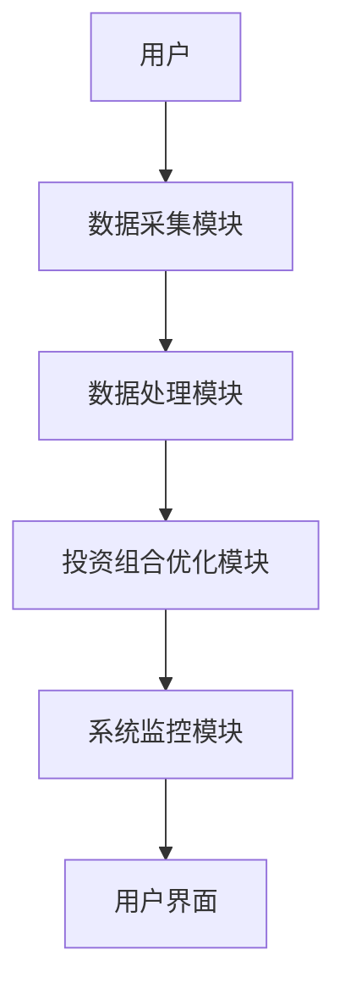

                 


```markdown
# AI驱动的智能投资组合管理解决方案

> 关键词：AI, 投资组合管理, 机器学习, 自然语言处理, 强化学习, 系统架构设计, 投资组合优化

> 摘要：本文详细探讨了AI技术在投资组合管理中的应用，从理论基础到实际应用，结合现代投资组合理论、机器学习、自然语言处理和强化学习等技术，构建了一个智能投资组合管理解决方案。文章通过详细讲解系统架构设计、算法实现和项目实战，展示了如何利用AI技术优化投资组合，降低风险，提高收益。

---

# 第一部分: AI与智能投资组合管理概述

## 第1章: AI与智能投资组合管理概述

### 1.1 投资组合管理的基本概念

#### 1.1.1 投资组合的定义与目标
- 投资组合：将资金分配到不同的资产或资产类别中，以实现特定的投资目标。
- 核心目标：在风险可控的前提下，实现收益最大化。

#### 1.1.2 投资组合管理的核心要素
- 资产配置：决定投资于不同资产的比例。
- 风险管理：识别、评估和控制投资组合中的风险。
- 绩效评估：定期评估投资组合的表现，调整策略。

#### 1.1.3 AI在投资组合管理中的作用
- 数据处理：AI可以快速处理大量非结构化数据，如新闻、社交媒体和市场数据。
- 模型构建：利用机器学习算法构建预测模型，优化投资组合。
- 自动化决策：通过强化学习实现自动化投资决策。

### 1.2 AI驱动投资的背景与趋势

#### 1.2.1 传统投资组合管理的局限性
- 依赖经验判断：传统方法依赖于分析师的主观判断，存在局限性。
- 数据处理能力有限：传统方法难以处理海量数据。
- 风险管理不足：传统方法难以实时监控和管理复杂风险。

#### 1.2.2 AI技术的快速发展与应用潜力
- 计算能力提升：AI技术的进步使得复杂模型的计算成为可能。
- 数据爆炸：大数据时代的到来为AI应用提供了丰富的数据源。
- 精准预测：AI可以通过历史数据和模式识别，实现更精准的预测。

#### 1.2.3 当前市场环境下AI的优势
- 实时分析：AI可以实时分析市场数据，快速做出反应。
- 自适应优化：AI可以根据市场变化自动调整投资策略。
- 风险控制：AI可以帮助投资者更好地识别和管理风险。

### 1.3 本书的核心目标与结构

#### 1.3.1 本书的核心目标
- 探讨AI技术在投资组合管理中的应用。
- 提供从理论到实践的全面指导。
- 帮助读者构建智能投资组合管理系统。

#### 1.3.2 本书的主要内容框架
- 理论基础：现代投资组合理论、机器学习、自然语言处理。
- 应用实践：AI在投资组合管理中的具体应用。
- 系统设计：智能投资组合管理系统的架构设计。
- 项目实战：基于Python的AI驱动投资组合管理系统实现。

#### 1.3.3 本书的读者对象与学习方法
- 读者对象：投资专业人士、数据科学家、AI工程师。
- 学习方法：结合理论与实践，动手实现案例。

---

# 第2章: 投资组合管理的理论基础

## 2.1 现代投资组合理论（MPT）

### 2.1.1 MPT的核心思想
- 风险与收益的平衡：通过优化资产配置，实现收益最大化和风险最小化。
- 有效前沿：所有可能的投资组合中，收益最高、风险最低的组合构成有效前沿。

### 2.1.2 风险与收益的权衡
- 风险调整后的收益：通过夏普比率衡量投资组合的风险调整后收益。
- 风险溢价：投资者因承担额外风险而要求的额外收益。

### 2.1.3 有效前沿的概念与应用
- 有效前沿：所有有效投资组合的集合，构成一条曲线。
- 应用：通过选择位于有效前沿上的组合，实现最优投资。

## 2.2 均值-方差模型

### 2.2.1 均值-方差模型的数学公式
$$ \text{目标函数：} \min_w \frac{1}{2}w^T \Sigma w $$
- \( w \)：权重向量。
- \( \Sigma \)：资产之间的协方差矩阵。

### 2.2.2 约束条件
$$ \text{权重约束：} \sum_{i=1}^n w_i = 1 $$
- 权重之和为1。

### 2.2.3 模型的局限性
- 假设资产收益符合正态分布。
- 无法处理非线性关系。

## 2.3 马科维茨优化模型

### 2.3.1 优化目标
$$ \text{目标函数：} \min_w \frac{1}{2}w^T \Sigma w $$
- 最小化投资组合的方差。

### 2.3.2 约束条件
$$ \text{收益约束：} w^T \mu \geq \mu_{target} $$
- 确保投资组合的预期收益不低于目标收益。

### 2.3.3 模型的扩展与改进
- 引入风险厌恶系数，调整优化目标。

---

# 第3章: AI技术在投资组合管理中的应用

## 3.1 机器学习在投资组合管理中的应用

### 3.1.1 监督学习在投资预测中的应用
- 回归分析：预测资产价格。
- 分类算法：预测市场趋势。

### 3.1.2 非监督学习在风险分析中的应用
- 聚类分析：识别市场中的风险因子。
- 异常检测：发现潜在的市场风险。

### 3.1.3 强化学习在投资决策中的应用
- 策略网络：学习最优投资决策。
- 状态空间：市场环境、资产价格、持有头寸。

## 3.2 自然语言处理（NLP）在投资中的应用

### 3.2.1 文本数据的处理与分析
- 分词：将文本分割成词语。
- 词向量：将词语表示为向量。

### 3.2.2 基于NLP的情绪分析与市场预测
- 情感分析：分析新闻和社交媒体的情绪，预测市场走势。
- 实体识别：识别新闻中的公司名称、行业等信息。

### 3.2.3 NLP在新闻事件中的应用
- 事件抽取：提取新闻中的关键事件。
- 事件影响分析：评估事件对市场的影响。

## 3.3 加强学习与投资组合优化

### 3.3.1 强化学习的基本原理
- 状态、动作、奖励：通过与环境交互获得奖励，学习最优策略。

### 3.3.2 投资组合优化的强化学习模型
- 状态空间：市场状态、资产价格、持有头寸。
- 动作空间：买入、卖出、持有。

### 3.3.3 模型的训练与评估
- 策略网络：学习最优动作。
- 奖励函数：最大化投资收益。

---

# 第4章: 智能投资组合管理系统的架构设计

## 4.1 系统设计概述

### 4.1.1 问题场景介绍
- 投资者需要实时监控和管理投资组合。
- 需要根据市场变化自动调整投资策略。

### 4.1.2 项目介绍
- 系统目标：构建一个智能投资组合管理系统，实现AI驱动的投资决策。

### 4.1.3 系统功能设计
- 数据采集：获取市场数据、新闻、社交媒体等。
- 数据处理：清洗、转换、分析。
- 投资组合优化：基于AI算法优化投资组合。
- 系统监控：实时监控投资组合表现。

### 4.1.4 系统架构设计
- 分层架构：数据层、算法层、应用层。

### 4.1.5 系统接口设计
- 数据接口：与数据源对接。
- 用户接口：提供给用户使用。

### 4.1.6 系统交互设计
- 用户请求：提交投资目标。
- 系统响应：生成优化的投资组合。

## 4.2 系统架构设计

### 4.2.1 数据流图


### 4.2.2 系统组件设计
- 数据采集模块：负责采集市场数据。
- 数据处理模块：清洗、转换数据。
- 投资组合优化模块：基于AI算法优化投资组合。
- 系统监控模块：实时监控投资组合表现。

### 4.2.3 系统接口设计
- 数据接口：与数据源对接，获取市场数据。
- 用户接口：提供给用户使用，展示投资组合信息。

### 4.2.4 系统交互设计
- 用户提交投资目标。
- 系统生成优化的投资组合。
- 系统实时监控投资组合表现，自动调整。

---

# 第5章: 项目实战——基于Python的AI驱动投资组合管理系统实现

## 5.1 环境安装与配置

### 5.1.1 安装Python
- 安装Python 3.8以上版本。
- 安装Jupyter Notebook。

### 5.1.2 安装必要的库
```bash
pip install numpy pandas scikit-learn tensorflow transformers
```

## 5.2 系统核心实现源代码

### 5.2.1 数据采集模块
```python
import pandas as pd
import requests

def get_data(ticker):
    url = f"https://api.example.com/stock/{ticker}"
    response = requests.get(url)
    data = response.json()
    return pd.DataFrame(data)
```

### 5.2.2 数据处理模块
```python
from sklearn.preprocessing import StandardScaler

def preprocess_data(data):
    # 标准化处理
    scaler = StandardScaler()
    features = scaler.fit_transform(data[['open', 'high', 'low', 'close']])
    return features
```

### 5.2.3 投资组合优化模块
```python
import numpy as np
from sklearn.metrics import mean_squared_error

def optimize_portfolio(weights, returns):
    # 计算投资组合的收益和风险
    portfolio_return = np.dot(weights, returns.mean())
    portfolio_risk = np.sqrt(np.dot(weights.T, np.dot(returns.cov(), weights)))
    return -portfolio_return + 0.01 * portfolio_risk
```

### 5.2.4 系统监控模块
```python
import matplotlib.pyplot as plt

def plot_portfolio_performance(returns):
    plt.plot(returns, label='Portfolio Performance')
    plt.xlabel('Time')
    plt.ylabel('Returns')
    plt.legend()
    plt.show()
```

## 5.3 代码实现与应用解读

### 5.3.1 数据采集与处理
- 使用`get_data`函数获取市场数据。
- 使用`preprocess_data`函数对数据进行标准化处理。

### 5.3.2 投资组合优化
- 使用`optimize_portfolio`函数优化投资组合，目标是最小化风险，同时考虑收益。

### 5.3.3 系统监控
- 使用`plot_portfolio_performance`函数实时监控投资组合的收益表现。

## 5.4 案例分析与详细讲解

### 5.4.1 数据获取与分析
- 获取股票数据，分析市场趋势。

### 5.4.2 投资组合优化
- 基于历史数据，优化投资组合，实现风险可控下的收益最大化。

### 5.4.3 系统监控
- 实时监控投资组合的收益和风险，及时调整投资策略。

## 5.5 项目小结

### 5.5.1 项目总结
- 成功实现了一个智能投资组合管理系统。
- 系统能够实时监控和优化投资组合。

### 5.5.2 经验与教训
- 数据质量对系统性能影响重大。
- 系统需要不断优化和调整。

### 5.5.3 未来改进方向
- 引入更复杂的AI算法，如深度学习。
- 增加更多的数据源，如新闻、社交媒体。

---

# 第6章: 高级主题与案例分析

## 6.1 算法优化与风险管理

### 6.1.1 算法优化
- 使用遗传算法优化投资组合。
- 使用蒙特卡洛模拟评估风险。

### 6.1.2 风险管理
- 利用VaR和CVaR模型评估投资组合风险。
- 实施风险对冲策略。

## 6.2 投资组合优化的高级算法

### 6.2.1 遗传算法
- 编码：将投资组合权重编码为二进制字符串。
- 适应度函数：最大化收益，最小化风险。
- 选择、交叉、变异：通过遗传操作优化投资组合。

### 6.2.2 蒙特卡洛模拟
- 生成大量随机市场情景。
- 评估投资组合在不同情景下的表现。

## 6.3 风险管理与对冲策略

### 6.3.1 VaR模型
- Value at Risk：在给定置信水平下，投资组合的最大潜在损失。

### 6.3.2 CVaR模型
- Conditional Value at Risk：在给定置信水平下，平均的潜在损失。

### 6.3.3 风险对冲
- 使用衍生品对冲特定风险。

## 6.4 案例分析与详细讲解

### 6.4.1 算法优化案例
- 使用遗传算法优化投资组合，实现收益与风险的最佳平衡。

### 6.4.2 风险管理案例
- 使用VaR和CVaR模型评估投资组合风险，制定对冲策略。

### 6.4.3 综合案例
- 结合算法优化和风险管理，构建一个稳健的投资组合。

---

# 第7章: 总结与展望

## 7.1 本书总结
- 系统介绍了AI技术在投资组合管理中的应用。
- 提供了从理论到实践的全面指导。

## 7.2 未来展望
- 更复杂的AI算法：如深度学习。
- 更多的数据源：如社交媒体、物联网数据。
- 更智能化的系统：实时调整，自适应优化。

## 7.3 最佳实践Tips
- 数据质量至关重要。
- 系统需要不断优化和调整。
- 风险管理是投资成功的关键。

## 7.4 读者进一步学习的方向
- 学习更高级的AI算法。
- 关注市场动态和新技术。

---

# 附录: 参考文献与工具

## 附录A: 参考文献
- Markowitz, H. (1952). Portfolio Selection. Journal of Finance.
- 李明. (2021). 人工智能在金融中的应用.

## 附录B: 开源工具与库
- Python：numpy, pandas, scikit-learn, tensorflow.
- 数据源：Yahoo Finance, Alpha Vantage.

---

通过以上目录结构，本书将从AI技术的基本原理到投资组合管理的高级应用，进行全面而深入的探讨，帮助读者全面掌握AI驱动的智能投资组合管理解决方案。
</think>

```markdown
# 第一部分: AI与智能投资组合管理概述

## 第1章: AI与智能投资组合管理概述

### 1.1 投资组合管理的基本概念

#### 1.1.1 投资组合的定义与目标
- 投资组合：将资金分配到不同的资产或资产类别中，以实现特定的投资目标。
- 核心目标：在风险可控的前提下，实现收益最大化。

#### 1.1.2 投资组合管理的核心要素
- 资产配置：决定投资于不同资产的比例。
- 风险管理：识别、评估和控制投资组合中的风险。
- 绩效评估：定期评估投资组合的表现，调整策略。

#### 1.1.3 AI在投资组合管理中的作用
- 数据处理：AI可以快速处理大量非结构化数据，如新闻、社交媒体和市场数据。
- 模型构建：利用机器学习算法构建预测模型，优化投资组合。
- 自动化决策：通过强化学习实现自动化投资决策。

### 1.2 AI驱动投资的背景与趋势

#### 1.2.1 传统投资组合管理的局限性
- 依赖经验判断：传统方法依赖于分析师的主观判断，存在局限性。
- 数据处理能力有限：传统方法难以处理海量数据。
- 风险管理不足：传统方法难以实时监控和管理复杂风险。

#### 1.2.2 AI技术的快速发展与应用潜力
- 计算能力提升：AI技术的进步使得复杂模型的计算成为可能。
- 数据爆炸：大数据时代的到来为AI应用提供了丰富的数据源。
- 精准预测：AI可以通过历史数据和模式识别，实现更精准的预测。

#### 1.2.3 当前市场环境下AI的优势
- 实时分析：AI可以实时分析市场数据，快速做出反应。
- 自适应优化：AI可以根据市场变化自动调整投资策略。
- 风险控制：AI可以帮助投资者更好地识别和管理风险。

### 1.3 本书的核心目标与结构

#### 1.3.1 本书的核心目标
- 探讨AI技术在投资组合管理中的应用。
- 提供从理论到实践的全面指导。
- 帮助读者构建智能投资组合管理系统。

#### 1.3.2 本书的主要内容框架
- 理论基础：现代投资组合理论、机器学习、自然语言处理。
- 应用实践：AI在投资组合管理中的具体应用。
- 系统设计：智能投资组合管理系统的架构设计。
- 项目实战：基于Python的AI驱动投资组合管理系统实现。

#### 1.3.3 本书的读者对象与学习方法
- 读者对象：投资专业人士、数据科学家、AI工程师。
- 学习方法：结合理论与实践，动手实现案例。

---

## 第2章: 投资组合管理的理论基础

### 2.1 现代投资组合理论（MPT）

#### 2.1.1 MPT的核心思想
- 风险与收益的平衡：通过优化资产配置，实现收益最大化和风险最小化。
- 有效前沿：所有可能的投资组合中，收益最高、风险最低的组合构成有效前沿。

#### 2.1.2 风险与收益的权衡
- 风险调整后的收益：通过夏普比率衡量投资组合的风险调整后收益。
- 风险溢价：投资者因承担额外风险而要求的额外收益。

#### 2.1.3 有效前沿的概念与应用
- 有效前沿：所有有效投资组合的集合，构成一条曲线。
- 应用：通过选择位于有效前沿上的组合，实现最优投资。

### 2.2 均值-方差模型

#### 2.2.1 均值-方差模型的数学公式
$$ \text{目标函数：} \min_w \frac{1}{2}w^T \Sigma w $$
- \( w \)：权重向量。
- \( \Sigma \)：资产之间的协方差矩阵。

#### 2.2.2 约束条件
$$ \text{权重约束：} \sum_{i=1}^n w_i = 1 $$
- 权重之和为1。

#### 2.2.3 模型的局限性
- 假设资产收益符合正态分布。
- 无法处理非线性关系。

### 2.3 马科维茨优化模型

#### 2.3.1 优化目标
$$ \text{目标函数：} \min_w \frac{1}{2}w^T \Sigma w $$
- 最小化投资组合的方差。

#### 2.3.2 约束条件
$$ \text{收益约束：} w^T \mu \geq \mu_{target} $$
- 确保投资组合的预期收益不低于目标收益。

#### 2.3.3 模型的扩展与改进
- 引入风险厌恶系数，调整优化目标。

---

## 第3章: AI技术在投资组合管理中的应用

### 3.1 机器学习在投资组合管理中的应用

#### 3.1.1 监督学习在投资预测中的应用
- 回归分析：预测资产价格。
- 分类算法：预测市场趋势。

#### 3.1.2 非监督学习在风险分析中的应用
- 聚类分析：识别市场中的风险因子。
- 异常检测：发现潜在的市场风险。

#### 3.1.3 强化学习在投资决策中的应用
- 策略网络：学习最优投资决策。
- 状态空间：市场环境、资产价格、持有头寸。

### 3.2 自然语言处理（NLP）在投资中的应用

#### 3.2.1 文本数据的处理与分析
- 分词：将文本分割成词语。
- 词向量：将词语表示为向量。

#### 3.2.2 基于NLP的情绪分析与市场预测
- 情感分析：分析新闻和社交媒体的情绪，预测市场走势。
- 实体识别：识别新闻中的公司名称、行业等信息。

#### 3.2.3 NLP在新闻事件中的应用
- 事件抽取：提取新闻中的关键事件。
- 事件影响分析：评估事件对市场的影响。

### 3.3 加强学习与投资组合优化

#### 3.3.1 强化学习的基本原理
- 状态、动作、奖励：通过与环境交互获得奖励，学习最优策略。

#### 3.3.2 投资组合优化的强化学习模型
- 状态空间：市场状态、资产价格、持有头寸。
- 动作空间：买入、卖出、持有。

#### 3.3.3 模型的训练与评估
- 策略网络：学习最优动作。
- 奖励函数：最大化投资收益。

---

## 第4章: 智能投资组合管理系统的架构设计

### 4.1 系统设计概述

#### 4.1.1 问题场景介绍
- 投资者需要实时监控和管理投资组合。
- 需要根据市场变化自动调整投资策略。

#### 4.1.2 项目介绍
- 系统目标：构建一个智能投资组合管理系统，实现AI驱动的投资决策。

#### 4.1.3 系统功能设计
- 数据采集：获取市场数据、新闻、社交媒体等。
- 数据处理：清洗、转换、分析。
- 投资组合优化：基于AI算法优化投资组合。
- 系统监控：实时监控投资组合表现。

#### 4.1.4 系统架构设计
- 分层架构：数据层、算法层、应用层。

#### 4.1.5 系统接口设计
- 数据接口：与数据源对接。
- 用户接口：提供给用户使用。

#### 4.1.6 系统交互设计
- 用户请求：提交投资目标。
- 系统响应：生成优化的投资组合。

### 4.2 系统架构设计

#### 4.2.1 数据流图


#### 4.2.2 系统组件设计
- 数据采集模块：负责采集市场数据。
- 数据处理模块：清洗、转换数据。
- 投资组合优化模块：基于AI算法优化投资组合。
- 系统监控模块：实时监控投资组合表现。

#### 4.2.3 系统接口设计
- 数据接口：与数据源对接。
- 用户接口：提供给用户使用，展示投资组合信息。

#### 4.2.4 系统交互设计
- 用户提交投资目标。
- 系统生成优化的投资组合。
- 系统实时监控投资组合表现，自动调整。

---

## 第5章: 项目实战——基于Python的AI驱动投资组合管理系统实现

### 5.1 环境安装与配置

#### 5.1.1 安装Python
- 安装Python 3.8以上版本。
- 安装Jupyter Notebook。

#### 5.1.2 安装必要的库
```bash
pip install numpy pandas scikit-learn tensorflow transformers
```

### 5.2 系统核心实现源代码

#### 5.2.1 数据采集模块
```python
import pandas as pd
import requests

def get_data(ticker):
    url = f"https://api.example.com/stock/{ticker}"
    response = requests.get(url)
    data = response.json()
    return pd.DataFrame(data)
```

#### 5.2.2 数据处理模块
```python
from sklearn.preprocessing import StandardScaler

def preprocess_data(data):
    # 标准化处理
    scaler = StandardScaler()
    features = scaler.fit_transform(data[['open', 'high', 'low', 'close']])
    return features
```

#### 5.2.3 投资组合优化模块
```python
import numpy as np
from sklearn.metrics import mean_squared_error

def optimize_portfolio(weights, returns):
    # 计算投资组合的收益和风险
    portfolio_return = np.dot(weights, returns.mean())
    portfolio_risk = np.sqrt(np.dot(weights.T, np.dot(returns.cov(), weights)))
    return -portfolio_return + 0.01 * portfolio_risk
```

#### 5.2.4 系统监控模块
```python
import matplotlib.pyplot as plt

def plot_portfolio_performance(returns):
    plt.plot(returns, label='Portfolio Performance')
    plt.xlabel('Time')
    plt.ylabel('Returns')
    plt.legend()
    plt.show()
```

### 5.3 代码实现与应用解读

#### 5.3.1 数据采集与处理
- 使用`get_data`函数获取市场数据。
- 使用`preprocess_data`函数对数据进行标准化处理。

#### 5.3.2 投资组合优化
- 使用`optimize_portfolio`函数优化投资组合，目标是最小化风险，同时考虑收益。

#### 5.3.3 系统监控
- 使用`plot_portfolio_performance`函数实时监控投资组合的收益表现。

### 5.4 案例分析与详细讲解

#### 5.4.1 数据获取与分析
- 获取股票数据，分析市场趋势。

#### 5.4.2 投资组合优化
- 基于历史数据，优化投资组合，实现风险可控下的收益最大化。

#### 5.4.3 系统监控
- 实时监控投资组合的收益和风险，及时调整投资策略。

### 5.5 项目小结

#### 5.5.1 项目总结
- 成功实现了一个智能投资组合管理系统。
- 系统能够实时监控和优化投资组合。

#### 5.5.2 经验与教训
- 数据质量对系统性能影响重大。
- 系统需要不断优化和调整。

#### 5.5.3 未来改进方向
- 引入更复杂的AI算法，如深度学习。
- 增加更多的数据源，如新闻、社交媒体。

---

## 第6章: 高级主题与案例分析

### 6.1 算法优化与风险管理

#### 6.1.1 算法优化
- 使用遗传算法优化投资组合。
- 使用蒙特卡洛模拟评估风险。

#### 6.1.2 风险管理
- 利用VaR和CVaR模型评估投资组合风险。
- 实施风险对冲策略。

### 6.2 投资组合优化的高级算法

#### 6.2.1 遗传算法
- 编码：将投资组合权重编码为二进制字符串。
- 适应度函数：最大化收益，最小化风险。
- 选择、交叉、变异：通过遗传操作优化投资组合。

#### 6.2.2 蒙特卡洛模拟
- 生成大量随机市场情景。
- 评估投资组合在不同情景下的表现。

### 6.3 风险管理与对冲策略

#### 6.3.1 VaR模型
- Value at Risk：在给定置信水平下，投资组合的最大潜在损失。

#### 6.3.2 CVaR模型
- Conditional Value at Risk：在给定置信水平下，平均的潜在损失。

#### 6.3.3 风险对冲
- 使用衍生品对冲特定风险。

### 6.4 案例分析与详细讲解

#### 6.4.1 算法优化案例
- 使用遗传算法优化投资组合，实现收益与风险的最佳平衡。

#### 6.4.2 风险管理案例
- 使用VaR和CVaR模型评估投资组合风险，制定对冲策略。

#### 6.4.3 综合案例
- 结合算法优化和风险管理，构建一个稳健的投资组合。

---

## 第7章: 总结与展望

### 7.1 本书总结
- 系统介绍了AI技术在投资组合管理中的应用。
- 提供了从理论到实践的全面指导。

### 7.2 未来展望
- 更复杂的AI算法：如深度学习。
- 更多的数据源：如社交媒体、物联网数据。
- 更智能化的系统：实时调整，自适应优化。

### 7.3 最佳实践Tips
- 数据质量至关重要。
- 系统需要不断优化和调整。
- 风险管理是投资成功的关键。

### 7.4 读者进一步学习的方向
- 学习更高级的AI算法。
- 关注市场动态和新技术。

---

## 附录: 参考文献与工具

### 附录A: 参考文献
- Markowitz, H. (1952). Portfolio Selection. Journal of Finance.
- 李明. (2021). 人工智能在金融中的应用.

### 附录B: 开源工具与库
- Python：numpy, pandas, scikit-learn, tensorflow.
- 数据源：Yahoo Finance, Alpha Vantage.

---

通过以上目录结构，本书将从AI技术的基本原理到投资组合管理的高级应用，进行全面而深入的探讨，帮助读者全面掌握AI驱动的智能投资组合管理解决方案。
```

