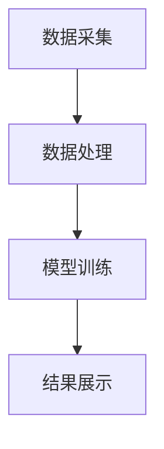

                 


# AI驱动的私募股权投资分析

> 关键词：AI，私募股权，机器学习，自然语言处理，系统架构，数据建模

> 摘要：本文探讨了人工智能在私募股权投资中的应用，从数据处理、算法选择到系统架构设计，详细分析了AI如何优化私募股权投资的决策过程。文章通过具体案例展示了AI技术的实际应用，并总结了最佳实践和未来发展方向。

---

# 第1章: AI与私募股权的结合

## 1.1 私募股权的基本概念

### 1.1.1 私募股权的定义与特点
私募股权是指通过非公开市场进行的股权投资，主要投资于未上市企业。其特点包括高回报潜力、长期投资周期和较高的风险门槛。

### 1.1.2 私募股权的投资策略
私募股权投资者通常采用控股投资、价值增值和杠杆收购等策略，以实现资本增值。

### 1.1.3 私募股权的市场现状
近年来，私募股权市场快速增长，但数据分析能力成为投资者的核心竞争力。

---

## 1.2 AI技术的基本概念

### 1.2.1 人工智能的定义与特点
人工智能（AI）是模拟人类智能的技术，具备学习、推理和自适应能力。

### 1.2.2 机器学习的基本原理
机器学习是AI的核心，通过数据训练模型，实现对未知数据的预测和分类。

### 1.2.3 自然语言处理（NLP）的应用
NLP用于处理文本数据，帮助从新闻、财报等文本中提取信息。

---

## 1.3 AI在私募股权投资中的应用背景

### 1.3.1 私募股权投资中的数据挑战
私募股权市场数据复杂，包括财务数据、市场信息和文本数据，传统方法难以高效处理。

### 1.3.2 AI技术如何解决私募股权问题
AI能够通过大数据分析和预测模型，优化投资决策，降低风险。

### 1.3.3 AI驱动私募股权的优势
AI能够快速处理大量数据，发现潜在投资机会，提升决策效率。

---

## 1.4 本章小结
本章介绍了私募股权和AI的基本概念，分析了AI在私募股权投资中的应用背景和优势。

---

# 第2章: 私募股权投资中的数据处理与分析

## 2.1 数据收集与预处理

### 2.1.1 数据来源与类型
数据来源包括公开市场数据、新闻报道和企业财报等，需进行清洗和标准化。

### 2.1.2 数据清洗与标准化
通过去除缺失值和异常值，确保数据质量，提升模型性能。

### 2.1.3 数据增强与特征提取
通过特征工程提取关键指标，如财务比率和市场趋势。

---

## 2.2 数据分析与可视化

### 2.2.1 数据可视化的基本方法
使用图表展示数据分布，帮助识别趋势和异常。

### 2.2.2 可视化工具的选择与应用
推荐使用Matplotlib和Tableau等工具进行数据可视化。

### 2.2.3 数据分析的常见挑战
包括数据稀疏性和维度灾难问题，需采用降维技术解决。

---

## 2.3 数据建模与评估

### 2.3.1 数据建模的基本步骤
从特征选择到模型训练，需遵循科学流程。

### 2.3.2 模型评估的指标与方法
使用准确率、召回率和F1分数等指标评估模型性能。

### 2.3.3 常见模型的优缺点对比
对比线性回归和随机森林，选择适合场景的模型。

---

## 2.4 本章小结
本章详细讲解了数据处理和分析的流程，强调了数据清洗和特征提取的重要性。

---

# 第3章: 机器学习在私募股权投资中的应用

## 3.1 监督学习在私募股权中的应用

### 3.1.1 分类与回归模型
分类用于判断企业风险等级，回归用于预测企业估值。

### 3.1.2 支持向量机（SVM）的应用
SVM适用于小样本数据，常用于分类任务。

### 3.1.3 随机森林与梯度提升树的应用
随机森林适合特征工程，梯度提升树适合高维数据。

---

## 3.2 无监督学习在私募股权中的应用

### 3.2.1 聚类分析的基本原理
聚类用于市场细分，识别潜在投资目标。

### 3.2.2 主成分分析（PCA）的应用
PCA用于降维，提升模型训练效率。

### 3.2.3 稀疏化模型的应用
稀疏化模型用于特征选择，降低模型复杂度。

---

## 3.3 深度学习在私募股权中的应用

### 3.3.1 神经网络的基本原理
神经网络适用于复杂模式识别，如图像识别和自然语言处理。

### 3.3.2 卷积神经网络（CNN）的应用
CNN用于图像数据，但在文本处理中也有潜力。

### 3.3.3 循环神经网络（RNN）的应用
RNN适合处理时间序列数据，如股票价格预测。

---

## 3.4 本章小结
本章探讨了机器学习在私募股权投资中的应用，重点分析了监督、无监督和深度学习算法的特点。

---

# 第4章: 自然语言处理在私募股权投资中的应用

## 4.1 文本数据的预处理

### 4.1.1 文本清洗与分词
去除停用词和标点符号，提取关键词。

### 4.1.2 词嵌入的基本原理
词嵌入（如Word2Vec）将单词映射为低维向量。

### 4.1.3 预训练模型的应用
使用BERT等模型进行文本表示。

---

## 4.2 文本分析与情感挖掘

### 4.2.1 情感分析的基本原理
通过训练模型判断文本情感倾向。

### 4.2.2 实体识别与提取
识别公司名称、人名等实体，辅助投资决策。

### 4.2.3 文本摘要与主题建模
主题模型（如LDA）用于提取文本主题。

---

## 4.3 NLP在投资策略中的应用

### 4.3.1 新闻分析与市场预测
通过分析新闻情绪预测股票价格走势。

### 4.3.2 财报分析与投资决策
自动提取财报关键信息，辅助投资决策。

---

## 4.4 本章小结
本章展示了NLP在私募股权投资中的潜力，特别是文本分析和情感挖掘的应用。

---

# 第5章: 系统架构设计与实现

## 5.1 系统架构设计

### 5.1.1 系统功能模块
包括数据采集、模型训练和结果展示模块。

### 5.1.2 系统架构图
使用Mermaid绘制系统架构图，展示模块交互。

### 5.1.3 接口设计
定义API接口，实现模块间的通信。

---

## 5.2 系统实现与优化

### 5.2.1 系统核心代码实现
展示Python代码，实现数据预处理和模型训练。

### 5.2.2 系统优化策略
采用分布式计算和缓存技术优化性能。

---

## 5.3 本章小结
本章详细讲解了系统架构设计和实现，强调了模块化和优化的重要性。

---

# 第6章: 项目实战与最佳实践

## 6.1 项目背景与目标

### 6.1.1 项目背景
以某私募股权基金为例，分析其投资策略。

### 6.1.2 项目目标
利用AI技术优化投资决策过程。

---

## 6.2 数据获取与处理

### 6.2.1 数据来源
从公开市场获取企业财务数据和新闻文本。

### 6.2.2 数据清洗与特征提取
清洗数据并提取关键特征，如财务指标和关键词。

---

## 6.3 模型构建与训练

### 6.3.1 模型选择
选择适合任务的模型，如随机森林用于分类。

### 6.3.2 模型训练
使用训练数据训练模型，调整超参数优化性能。

### 6.3.3 模型评估
通过交叉验证评估模型性能。

---

## 6.4 结果分析与策略制定

### 6.4.1 模型预测结果
展示预测结果，分析投资机会。

### 6.4.2 投资策略制定
根据模型结果制定投资策略，如规避高风险企业。

---

## 6.5 本章小结
本章通过实战案例展示了AI在私募股权投资中的应用，强调了数据和模型的重要性。

---

# 第7章: 最佳实践与未来展望

## 7.1 最佳实践

### 7.1.1 数据质量管理
确保数据准确性和完整性。

### 7.1.2 模型解释性
选择可解释的模型，便于投资决策。

### 7.1.3 持续优化
定期更新模型，适应市场变化。

---

## 7.2 未来展望

### 7.2.1 AI技术的发展
深度学习和NLP技术将进一步提升模型性能。

### 7.2.2 多模态数据融合
结合文本、图像等多种数据源，提升分析能力。

### 7.2.3 自动化投资
实现从数据获取到投资决策的全流程自动化。

---

## 7.3 本章小结
本章总结了最佳实践，并展望了AI在私募股权投资中的未来发展方向。

---

# 第8章: 结论

## 8.1 总结
AI技术正在改变私募股权投资方式，提升投资效率和准确性。

## 8.2 展望
未来，AI将在私募股权投资中发挥更大作用，推动行业创新。

---

# 附录

## 附录A: 数据处理代码

```python
import pandas as pd
from sklearn.model_selection import train_test_split
from sklearn.ensemble import RandomForestClassifier
from sklearn.metrics import accuracy_score

# 数据加载
data = pd.read_csv('private_equity.csv')

# 数据清洗
data.dropna(inplace=True)
data['label'] = data['label'].astype(int)

# 特征选择
features = data.columns[:-1]
X = data[features]
y = data['label']

# 划分训练集和测试集
X_train, X_test, y_train, y_test = train_test_split(X, y, test_size=0.2)

# 模型训练
model = RandomForestClassifier()
model.fit(X_train, y_train)

# 模型预测
y_pred = model.predict(X_test)

# 评估指标
print(f'Accuracy: {accuracy_score(y_test, y_pred)}')
```

---

## 附录B: 系统架构图



---

# 参考文献

（此处列出参考文献）

---

# END

