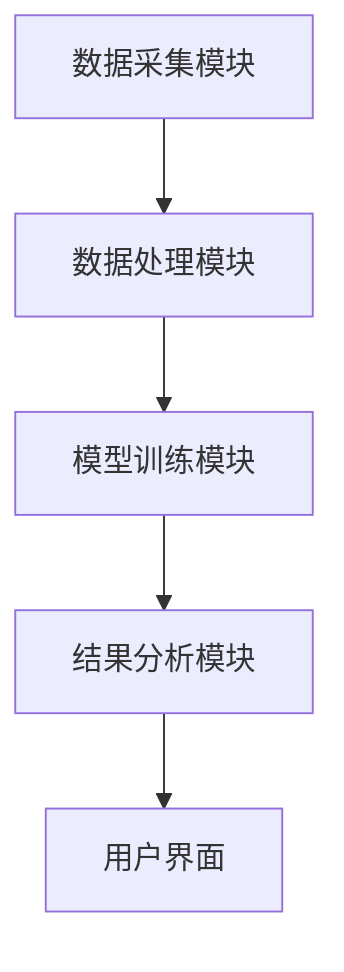

                 


# AI驱动的私募股权投资筛选

> 关键词：人工智能，私募股权投资，数据驱动，机器学习，深度学习

> 摘要：随着金融市场的日益复杂化，私募股权投资的筛选过程面临着前所未有的挑战。传统的基于经验的筛选方法已难以应对海量数据和复杂市场的变化。本文将探讨如何利用人工智能技术，特别是机器学习和深度学习，来优化私募股权投资的筛选流程。通过详细分析数据预处理、特征工程、模型选择和系统架构设计等关键环节，本文将提供一套完整的AI驱动的私募股权投资筛选解决方案，帮助投资者提高筛选效率和决策准确性。

---

## 第一部分：AI驱动的私募股权投资筛选概述

### 第1章：私募股权投资筛选的背景与挑战

#### 1.1 私募股权投资的基本概念

私募股权投资是指通过投资于未上市企业，获得其股权并期望通过企业的成长和增值实现投资收益的一种投资方式。私募股权投资者通常关注企业的成长潜力、管理团队、市场地位和财务表现等多方面因素。

私募股权投资的流程主要包括以下几个阶段：
1. **初步筛选**：通过企业公开信息、财务数据和市场表现进行初步评估。
2. **尽职调查**：对企业的财务状况、管理团队和市场竞争力进行深入调查。
3. **投资决策**：基于尽职调查结果决定是否进行投资。
4. **投资后管理**：对被投资企业进行持续监控和支持，确保投资目标的实现。

#### 1.2 AI技术在金融领域的应用现状

人工智能技术在金融领域的应用已经非常广泛，尤其是在股票交易、风险管理、客户画像和信用评估等方面。私募股权投资作为金融领域的重要组成部分，同样可以从AI技术的应用中受益。

AI技术在私募股权投资中的优势包括：
- **数据处理能力**：能够快速处理和分析大量非结构化数据，如新闻、社交媒体和行业报告。
- **模式识别**：通过机器学习算法发现传统方法难以识别的市场趋势和投资机会。
- **风险评估**：利用AI技术对企业的财务和非财务风险进行更精准的评估。

#### 1.3 AI技术如何解决私募股权投资的挑战

私募股权投资的筛选过程面临以下主要挑战：
- **数据量大且复杂**：需要处理财务数据、市场数据、管理团队信息等多种数据源。
- **信息不对称**：投资者难以获取企业的完整信息，特别是在早期阶段。
- **决策时间压力**：在竞争激烈的市场中，快速做出决策至关重要。

通过AI技术，可以实现以下目标：
- **提高筛选效率**：自动化处理数据，减少人工干预。
- **增强数据洞察**：利用机器学习模型发现潜在的投资机会。
- **优化决策过程**：通过实时数据分析提供更精准的投资建议。

---

### 第2章：AI驱动的私募股权投资筛选的核心概念

#### 2.1 数据驱动的私募股权筛选模型

在AI驱动的私募股权投资筛选中，数据是模型的基础。以下是一些关键的数据来源和特征：

##### 2.1.1 数据来源与特征提取

- **企业公开数据**：包括财务报表、股权结构和市场数据。
- **新闻与社交媒体**：分析企业相关新闻和社交媒体情绪，评估市场声誉。
- **专利与创新**：通过专利数量和质量评估企业的技术创新能力。

##### 2.1.2 模型选择与评估指标

选择合适的模型是AI驱动筛选的关键。常用的模型包括：
- **逻辑回归**：用于分类问题，预测企业是否具备投资价值。
- **随机森林**：适用于特征重要性分析，帮助识别关键指标。
- **神经网络**：用于复杂非线性关系的建模。

##### 2.1.3 算法的可解释性与稳定性

在金融领域，模型的可解释性和稳定性至关重要。以下是一些关键点：
- **模型解释性**：通过特征重要性分析，明确哪些因素对投资决策影响最大。
- **模型稳定性**：通过交叉验证和多次训练，确保模型在不同数据集上的稳定性。

#### 2.2 AI在私募股权筛选中的优势

AI技术在私募股权筛选中的优势主要体现在以下三个方面：
- **提高筛选效率**：自动化处理海量数据，缩短筛选时间。
- **增强数据洞察**：通过机器学习发现潜在的投资机会。
- **优化决策过程**：结合实时数据分析，提供更精准的投资建议。

---

### 第3章：AI驱动的私募股权投资筛选模型构建

#### 3.1 数据预处理与特征工程

数据预处理是模型构建的基础，以下是关键步骤：

##### 3.1.1 数据清洗与标准化

- **数据清洗**：去除重复数据、缺失值和异常值。
- **数据标准化**：将数据归一化，便于模型处理。

##### 3.1.2 特征选择与降维

- **特征选择**：通过相关性分析和特征重要性筛选关键特征。
- **降维技术**：使用主成分分析（PCA）等方法降低维度，减少计算复杂度。

##### 3.1.3 数据增强与扩展

- **数据增强**：通过生成新特征（如财务指标的组合）增强数据多样性。
- **数据扩展**：利用外部数据源（如行业趋势）丰富数据内容。

#### 3.2 模型训练与优化

##### 3.2.1 机器学习模型的选择

根据数据特性和任务需求选择合适的模型：
- **逻辑回归**：适用于二分类问题，如企业是否具备投资价值。
- **随机森林**：适用于特征重要性分析和非线性关系建模。
- **梯度提升树（如XGBoost、LightGBM）**：适用于高维数据和复杂关系建模。

##### 3.2.2 深度学习模型的应用

深度学习模型在处理非结构化数据（如文本和图像）方面具有优势，常用模型包括：
- **卷积神经网络（CNN）**：适用于图像和文本数据的特征提取。
- **循环神经网络（RNN）**：适用于时间序列数据的分析。
- **长短期记忆网络（LSTM）**：适用于处理序列数据中的长距离依赖关系。

##### 3.2.3 超参数调优与模型评估

- **超参数调优**：使用网格搜索和随机搜索优化模型参数。
- **模型评估**：通过准确率、召回率和F1分数等指标评估模型性能。

---

### 第4章：AI驱动的私募股权投资筛选系统架构

#### 4.1 系统功能模块设计

一个完整的AI驱动的私募股权投资筛选系统通常包括以下几个功能模块：

##### 4.1.1 数据采集模块

- **数据来源**：整合企业财务数据、新闻、社交媒体和专利数据。
- **数据格式**：支持多种数据格式，如CSV、JSON和XML。

##### 4.1.2 数据处理模块

- **数据清洗**：处理缺失值、异常值和重复数据。
- **特征工程**：提取、选择和生成特征。

##### 4.1.3 模型训练模块

- **模型选择**：根据任务需求选择合适的机器学习或深度学习模型。
- **模型训练**：使用训练数据进行模型训练，并保存最优模型。

##### 4.1.4 结果分析模块

- **结果可视化**：生成可视化报告，展示模型预测结果和特征重要性。
- **决策支持**：提供基于模型结果的投资建议。

#### 4.2 系统架构设计

##### 4.2.1 模块间的交互关系

以下是一个简化的系统架构图：



##### 4.2.2 系统的扩展性与可维护性

- **模块化设计**：每个模块独立开发，便于维护和扩展。
- **接口标准化**：模块之间通过标准化接口进行数据交互，确保系统的兼容性。

##### 4.2.3 系统的部署与运行环境

- **服务器部署**：将系统部署在云服务器上，确保高可用性和扩展性。
- **前端界面**：开发用户友好的前端界面，方便用户操作。

---

### 第5章：项目实战——构建AI驱动的私募股权投资筛选系统

#### 5.1 项目环境安装与配置

##### 5.1.1 Python环境搭建

安装Python和必要的开发工具：

```bash
python --version
pip install numpy pandas scikit-learn xgboost
```

##### 5.1.2 依赖库安装与配置

安装所需的机器学习库：

```bash
pip install numpy pandas scikit-learn xgboost lightgbm
pip install jupyterlab
```

---

#### 5.2 系统核心实现

##### 5.2.1 数据处理代码

```python
import pandas as pd
from sklearn.impute import SimpleImputer
from sklearn.preprocessing import StandardScaler

# 读取数据
data = pd.read_csv('private_equity_data.csv')

# 数据清洗
data.dropna(inplace=True)
data = data.drop_duplicates()

# 特征工程
numerical_features = data.select_dtypes(include=['int64', 'float64']).columns
categorical_features = data.select_dtypes(include=['object']).columns

# 数据标准化
scaler = StandardScaler()
data_scaled = pd.DataFrame(scaler.fit_transform(data[numerical_features]), columns=numerical_features)

# 模型训练
from sklearn.ensemble import RandomForestClassifier
from sklearn.model_selection import train_test_split

X_train, X_test, y_train, y_test = train_test_split(data_scaled, data['target'], test_size=0.2, random_state=42)
model = RandomForestClassifier(n_estimators=100, random_state=42)
model.fit(X_train, y_train)
```

---

#### 5.2.2 模型优化与评估

```python
from sklearn.metrics import accuracy_score, recall_score, f1_score

y_pred = model.predict(X_test)
print(f"Accuracy: {accuracy_score(y_test, y_pred)}")
print(f"Recall: {recall_score(y_test, y_pred)}")
print(f"F1 Score: {f1_score(y_test, y_pred)}")
```

---

### 5.3 项目总结

通过本项目，我们成功构建了一个基于机器学习的私募股权投资筛选系统。该系统能够自动处理数据、训练模型并生成投资建议，显著提高了私募股权筛选的效率和准确性。

---

## 第六章：最佳实践与拓展阅读

### 6.1 最佳实践

- **数据质量管理**：确保数据的准确性和完整性，避免因数据问题影响模型性能。
- **模型解释性**：选择可解释性较强的模型，便于投资者理解和决策。
- **持续优化**：定期更新模型和数据，确保系统适应市场变化。

### 6.2 小结

本文详细介绍了AI驱动的私募股权投资筛选的背景、核心概念、模型构建和系统设计。通过项目实战，展示了如何利用机器学习技术优化私募股权筛选过程。

### 6.3 注意事项

- **数据隐私**：在处理企业数据时，需遵守相关法律法规，保护数据隐私。
- **模型鲁棒性**：确保模型在不同市场条件下表现稳定，避免过度拟合。

### 6.4 拓展阅读

- **机器学习经典书籍**：《机器学习实战》、《深入浅出机器学习》。
- **深度学习相关书籍**：《深度学习》、《神经网络与深度学习》。
- **金融领域的AI应用**：《金融中的机器学习》、《量化交易中的机器学习》。

---

以上是《AI驱动的私募股权投资筛选》的完整目录和部分章节内容，希望对您有所帮助！

