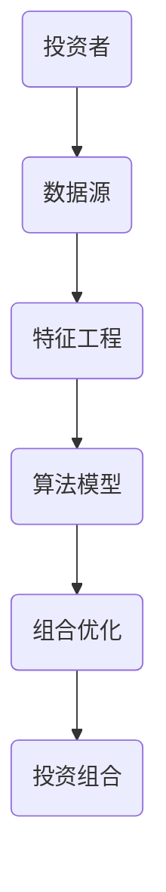
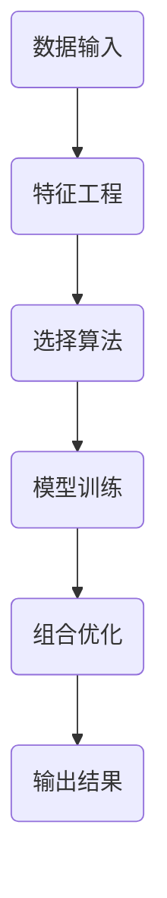
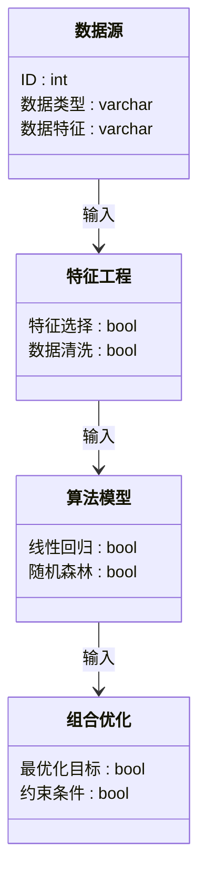
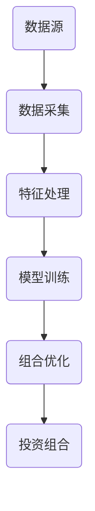
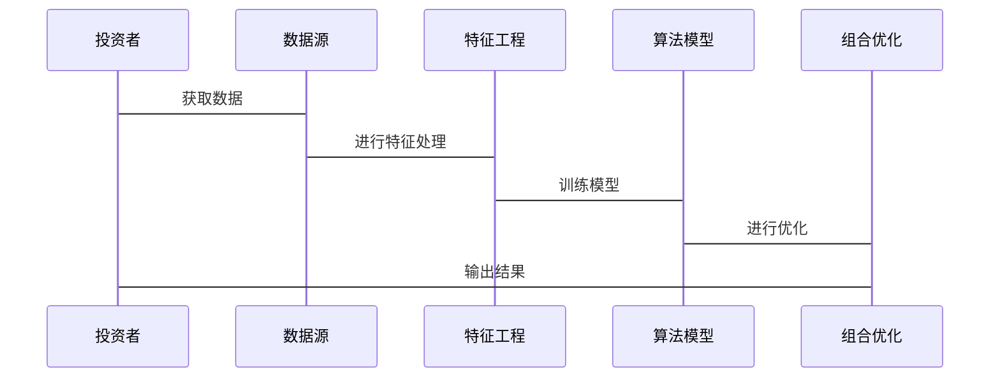

                 


# AI驱动的私募股权投资组合构建与管理

## 关键词：
AI, 私募股权投资, 组合管理, 机器学习, 数据驱动

## 摘要：
本文详细探讨了AI技术如何驱动私募股权投资组合的构建与管理，从基础概念到高级算法，再到系统设计和实战案例，全面解析了AI在这一领域的应用。文章首先介绍了私募股权投资的基本概念和AI驱动的必要性，然后深入分析了AI算法的核心原理，包括数据特征工程、数学优化模型等。接着，通过系统架构设计展示了如何将AI模型整合到金融系统中，最后通过实战案例和高级主题探讨了AI在私募股权投资中的实际应用和未来趋势。

---

# 第一部分: AI驱动的私募股权投资组合构建与管理基础

# 第1章: 私募股权投资与AI驱动的概述

## 1.1 私募股权投资的基本概念
### 1.1.1 私募股权的定义与特点
私募股权是一种通过投资于未上市公司的股权来获取长期收益的投资方式，具有高风险、高回报的特点。其核心在于通过专业的投资策略和管理，实现资产的增值。

### 1.1.2 私募股权投资的流程与阶段
私募股权投资通常包括以下几个阶段：目标筛选、尽职调查、投资决策、投资后管理和退出策略。每个阶段都需要大量数据支持和专业判断。

### 1.1.3 私募股权投资的市场现状与发展趋势
近年来，随着金融市场的复杂化和数据量的爆炸式增长，传统的人工决策方式已难以满足高效、精准的需求，AI技术的应用成为必然趋势。

## 1.2 AI驱动的私募股权投资的背景与必要性
### 1.2.1 传统私募股权投资的局限性
传统私募股权投资依赖于经验丰富的投资经理的主观判断，存在决策周期长、风险控制不足等问题。

### 1.2.2 AI技术在金融领域的应用现状
AI技术在金融领域的应用日益广泛，从股票预测到风险评估，再到投资组合优化，AI正在改变传统金融行业的运作方式。

### 1.2.3 AI驱动私募股权投资的核心优势
AI可以通过大数据分析和机器学习算法，帮助投资者快速识别优质标的、优化投资组合、降低风险，显著提高投资效率。

## 1.3 AI驱动私募股权投资的变革与创新
### 1.3.1 数据驱动的投资决策新范式
AI驱动的投资决策以数据为基础，通过算法模型进行分析和预测，打破了传统依赖经验的模式。

### 1.3.2 AI算法在组合管理中的应用
AI算法可以帮助投资者在复杂的市场环境中找到最优的投资组合，实现收益与风险的最佳平衡。

### 1.3.3 私募股权投资的智能化转型
AI技术的应用推动了私募股权投资的智能化转型，从人工决策向智能决策转变。

## 1.4 本章小结
本章从私募股权投资的基本概念出发，分析了AI驱动的必要性和优势，为后续章节的深入探讨奠定了基础。

---

# 第2章: AI驱动私募股权投资的核心概念与联系

## 2.1 AI驱动私募股权投资的核心概念
### 2.1.1 数据驱动的特征分析
AI驱动的投资决策依赖于对大量数据的特征分析，包括财务数据、市场数据、新闻数据等。

### 2.1.2 AI算法的决策支持
通过机器学习算法，AI能够从数据中提取有价值的信息，为投资决策提供支持。

### 2.1.3 组合优化的数学模型
组合优化是AI驱动私募股权投资的核心，通过数学模型和算法实现投资组合的最优配置。

## 2.2 核心概念的属性特征对比
### 2.2.1 数据类型与特征工程
不同的数据类型（如数值型、文本型）需要不同的特征工程方法，以提取有用的特征。

### 2.2.2 算法模型的分类与选择
根据具体问题和数据特点，选择合适的算法模型，如线性回归、随机森林、神经网络等。

### 2.2.3 组合优化的目标与约束
组合优化的目标是最大化收益或最小化风险，同时需要考虑流动性、风险分散等约束条件。

## 2.3 ER实体关系图与系统架构
### 2.3.1 ER实体关系图
```mermaid
erDiagram
   投资者 --> 投资组合 : 优化
   投资组合 --> 股票 : 持股
   股票 --> 市场 : 影响
   市场 --> 经济指标 : 相关
```

### 2.3.2 系统架构图


## 2.4 本章小结
本章通过对比分析和系统架构图，详细阐述了AI驱动私募股权投资的核心概念及其之间的联系。

---

# 第3章: AI驱动私募股权投资的算法原理

## 3.1 数据特征工程
### 3.1.1 数据预处理
包括数据清洗、缺失值处理、标准化/归一化等步骤，确保数据质量。

### 3.1.2 特征选择与提取
通过主成分分析（PCA）等方法提取关键特征，降低维度。

## 3.2 机器学习算法
### 3.2.1 线性回归
用于预测资产回报率，公式为：$$y = \beta_0 + \beta_1x + \epsilon$$

### 3.2.2 支持向量机（SVM）
用于分类问题，通过构建超平面实现数据分隔。

### 3.2.3 随机森林
用于特征重要性分析和回归预测，基于决策树的集成方法。

## 3.3 组合优化
### 3.3.1 最优化目标函数
最大化收益或最小化风险，公式为：$$\max \mu - \lambda \sigma$$

### 3.3.2 约束条件
如权重之和为1，非负性约束，公式为：$$\sum_{i=1}^n w_i = 1$$

## 3.4 算法流程图


## 3.5 Python代码示例
```python
import numpy as np
from sklearn.ensemble import RandomForestRegressor
from sklearn.model_selection import train_test_split

# 数据预处理
data = np.array([[1, 2], [3, 4], [5, 6]])
X = data[:, :-1]
y = data[:, -1]

# 特征选择与提取
rf = RandomForestRegressor(n_estimators=100)
rf.fit(X, y)
feature_importance = rf.feature_importances_
```

## 3.6 本章小结
本章详细讲解了AI驱动私募股权投资中常用的算法及其原理，为后续的系统设计和实战应用奠定了基础。

---

# 第4章: 系统分析与架构设计

## 4.1 问题场景介绍
私募股权管理系统的AI驱动优化，需要解决数据获取、特征工程、模型训练和组合优化等问题。

## 4.2 系统功能设计
### 4.2.1 领域模型


## 4.3 系统架构设计
### 4.3.1 模块划分
- 数据采集模块
- 特征处理模块
- 模型训练模块
- 组合优化模块

### 4.3.2 系统架构图


## 4.4 接口设计与交互
### 4.4.1 接口设计
- 数据接口：提供数据读取和写入的功能。
- 模型接口：提供算法模型的训练和预测功能。

### 4.4.2 交互序列图


## 4.5 本章小结
本章通过系统分析和架构设计，展示了如何将AI算法应用于私募股权投资组合管理中。

---

# 第5章: 项目实战——AI驱动私募股权投资系统实现

## 5.1 环境安装
- 安装Python、NumPy、Scikit-learn、Plotly等库。

## 5.2 核心功能实现
### 5.2.1 数据预处理
```python
import pandas as pd

# 读取数据
data = pd.read_csv('equity_data.csv')

# 数据清洗
data.dropna(inplace=True)
```

### 5.2.2 特征工程
```python
from sklearn.preprocessing import StandardScaler

# 标准化处理
scaler = StandardScaler()
X_scaled = scaler.fit_transform(X)
```

### 5.2.3 模型训练
```python
from sklearn.ensemble import RandomForestRegressor

# 训练模型
model = RandomForestRegressor(n_estimators=100)
model.fit(X_scaled, y)
```

### 5.2.4 组合优化
```python
from scipy.optimize import minimize

# 定义目标函数
def objective(x):
    return -x.dot(model.predict(x))

# 约束条件
constraints = ({'type': 'eq', 'fun': lambda x: sum(x) - 1})

# 优化
result = minimize(objective, x0=np.ones(n)/n, constraints=constraints)
```

## 5.3 案例分析
以某私募基金为例，展示如何利用AI算法优化投资组合，实现收益与风险的最佳平衡。

## 5.4 本章小结
本章通过实际项目实现，展示了AI驱动私募股权投资系统的具体操作和应用。

---

# 第6章: 高级主题与未来展望

## 6.1 多目标优化
### 6.1.1 多目标优化的定义与应用
在私募股权投资中，需要同时考虑收益、风险、流动性等多个目标。

### 6.1.2 帕累托前沿分析
通过帕累托前沿分析，找到最优的投资组合。

## 6.2 风险管理与控制
### 6.2.1 风险度量方法
包括VaR、CVaR等风险度量方法。

### 6.2.2 风险模型的优化
通过AI算法优化风险模型，提高风险控制能力。

## 6.3 结合NLP与强化学习
### 6.3.1 NLP在金融新闻中的应用
通过自然语言处理技术分析新闻数据，提取情感指标影响投资决策。

### 6.3.2 强化学习在投资策略中的应用
通过强化学习算法优化投资策略，实现动态调整。

## 6.4 本章小结
本章探讨了AI驱动私募股权投资的高级主题，展望了未来的发展方向。

---

# 第7章: 总结与展望

## 7.1 全文总结
AI技术正在深刻改变私募股权投资的模式，从数据处理、算法优化到系统设计，AI为投资者提供了更高效、更精准的工具。

## 7.2 当前挑战与未来展望
当前仍面临数据质量、模型解释性、风险管理等挑战，未来需要进一步研究和实践。

## 7.3 读者小结与注意事项
读者在实际应用中需要注意数据的充分性、模型的可解释性以及风险的可控性。

## 7.4 深入学习与拓展阅读
推荐相关书籍、论文和工具，鼓励读者进一步探索AI在金融领域的应用。

---

# 参考文献

（此处列出相关参考文献）

---

# 附录

（此处可放置代码示例、数据表格等补充材料）

---

通过以上目录大纲，文章系统地介绍了AI驱动私募股权投资的各个方面，从基础概念到高级算法，再到系统设计和实战应用，为读者提供了一个全面的学习路径。

