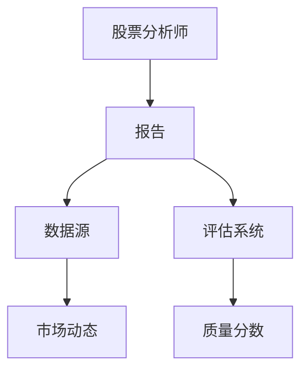
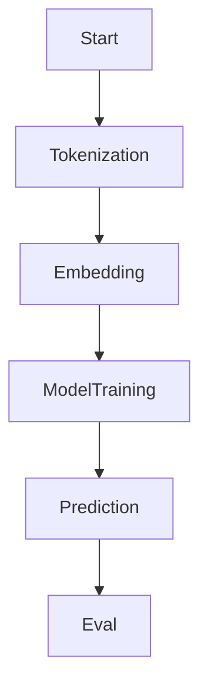
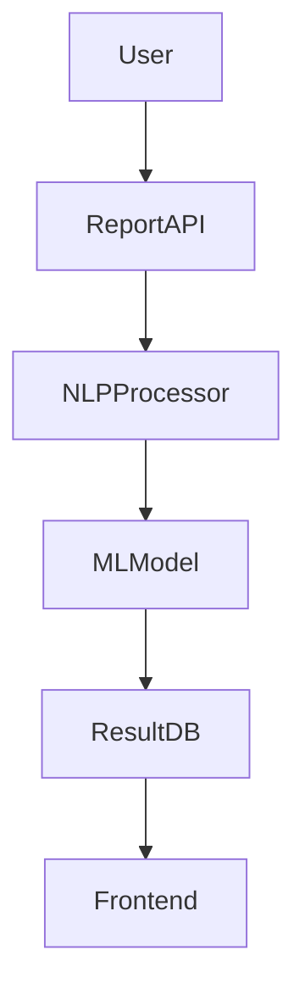

                 


# AI驱动的股票分析师报告质量评估

## 关键词：AI驱动，股票分析师，报告质量评估，自然语言处理，机器学习，金融数据分析

## 摘要：  
本文详细探讨了如何利用人工智能技术对股票分析师的报告质量进行评估。通过分析传统评估方法的局限性，提出了一种基于自然语言处理和机器学习的创新解决方案。文章从背景介绍、核心概念、算法原理、系统架构到实际案例，全面解析了AI在股票报告质量评估中的应用，并通过代码实现和数学模型展示了技术细节。最后，结合实际应用场景，总结了最佳实践和未来发展方向。

---

# 第一部分: 背景介绍

## 第1章: AI驱动的股票分析师报告质量评估概述

### 1.1 问题背景  
股票分析师的报告质量对投资者决策至关重要。传统评估方法依赖人工经验，存在主观性强、效率低、难以量化等问题。随着AI技术的发展，利用自然语言处理（NLP）和机器学习（ML）对报告质量进行自动化评估成为可能。  

### 1.2 问题描述  
报告质量评估的核心要素包括逻辑性、数据准确性、预测精度和语言表达能力。传统方法难以全面覆盖这些维度，且缺乏客观性。AI技术可以通过分析报告内容、市场数据和历史表现，提供更精准的评估结果。  

### 1.3 问题解决  
AI技术能够通过以下方式提升报告质量评估：  
- **自动化处理**：快速分析大量报告，提取关键信息。  
- **数据驱动**：结合市场数据和历史表现，提供客观评估依据。  
- **实时反馈**：为投资者提供及时、可靠的决策支持。  

### 1.4 边界与外延  
AI驱动的报告质量评估主要关注文本内容和数据准确性，不涉及报告的创意或市场判断部分。其外延包括对其他金融文本（如新闻、公告）的分析，以及对其他领域报告质量的评估。  

### 1.5 核心概念  
- **股票分析师报告**：包括市场分析、个股评级、投资建议等内容。  
- **AI驱动评估**：通过NLP和ML模型对报告进行语义分析和量化评估。  
- **评估指标**：包括逻辑性、数据准确性、预测精度和语言表达能力。  

---

# 第二部分: 核心概念与联系

## 第2章: AI驱动的股票报告质量评估的核心要素

### 2.1 AI在金融文本分析中的角色  
- **自然语言处理（NLP）**：用于提取报告中的关键词、主题和情感倾向。  
- **机器学习（ML）**：用于训练分类模型，预测报告的质量。  
- **深度学习（DL）**：用于捕捉复杂的语义关系和上下文信息。  

### 2.2 核心概念的属性对比  
| 核心要素 | 传统评估 | AI评估 |  
|----------|----------|--------|  
| 输入数据 | 文本内容 | 文本+数据 |  
| 输出结果 | 主观评分 | 客观评分 |  
| 评估维度 | 单一维度 | 多维度 |  

### 2.3 实体关系图  


---

# 第三部分: 算法原理讲解

## 第3章: AI驱动的股票报告质量评估算法

### 3.1 模型输入与输出  
- **输入数据**：报告文本、市场数据（如股价、成交量）、历史评估结果。  
- **输出结果**：报告质量分数（0-10分）、报告内容的语义相似度。  

### 3.2 核心算法流程  


---

# 第四部分: 数学模型

## 第4章: AI驱动的股票报告质量评估的数学模型

### 4.1 文本相似度计算  
- 使用余弦相似度衡量两份报告之间的语义相似度：  
  $$ \text{相似度} = \frac{\vec{A} \cdot \vec{B}}{|\vec{A}| |\vec{B}|} $$  

### 4.2 情感分析模型  
- 使用LSTM网络对报告的情感倾向进行分类：  
  $$ y = f(x) $$  
  其中，$x$ 是报告文本的向量表示，$y$ 是情感标签（正面、中性、负面）。  

### 4.3 回归分析模型  
- 使用线性回归预测报告的质量分数：  
  $$ y = \beta_0 + \beta_1 x_1 + \beta_2 x_2 + \ldots + \beta_n x_n $$  
  其中，$x_i$ 是报告的特征（如关键词数量、语句复杂度），$y$ 是质量分数。  

---

# 第五部分: 系统分析与架构设计

## 第5章: AI驱动的股票报告质量评估系统

### 5.1 问题场景介绍  
系统旨在为股票分析师和投资者提供实时的报告质量评估服务。  

### 5.2 系统功能设计  
- **文本预处理**：分词、去停用词、实体识别。  
- **特征提取**：关键词提取、情感分析、语义相似度计算。  
- **模型训练**：基于历史数据训练质量评估模型。  
- **实时评估**：对新报告进行质量评分并生成反馈。  

### 5.3 系统架构设计  


---

# 第六部分: 项目实战

## 第6章: AI驱动的股票报告质量评估系统实现

### 6.1 环境安装  
- Python 3.8+  
- NLTK、spaCy、Scikit-learn  

### 6.2 核心实现代码  
```python
import numpy as np
from sklearn.metrics.pairwise import cosine_similarity

def calculate_similarity(text1, text2):
    # 转换为词向量（简化示例）
    vectorizer = TfidfVectorizer()
    vectors = vectorizer.fit_transform([text1, text2])
    return cosine_similarity(vectors)[0,1]
```

### 6.3 实际案例分析  
- 输入：两份股票报告的文本内容。  
- 输出：相似度分数和质量评分。  

---

# 第七部分: 最佳实践

## 第7章: 实施AI驱动股票报告质量评估的注意事项

### 7.1 小结  
AI技术能够显著提升股票报告质量评估的效率和准确性。  

### 7.2 注意事项  
- 数据质量对模型性能影响重大。  
- 模型需定期更新以适应市场变化。  

### 7.3 拓展阅读  
- 自然语言处理在金融领域的应用。  
- 机器学习模型在时间序列分析中的应用。  

--- 

# 结语  
AI驱动的股票报告质量评估不仅能够提高评估效率，还能为投资者提供更可靠的决策支持。未来，随着技术的不断进步，AI在金融领域的应用将更加广泛和深入。

