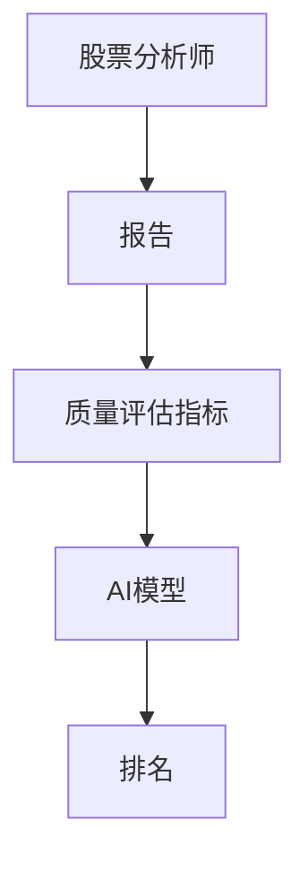
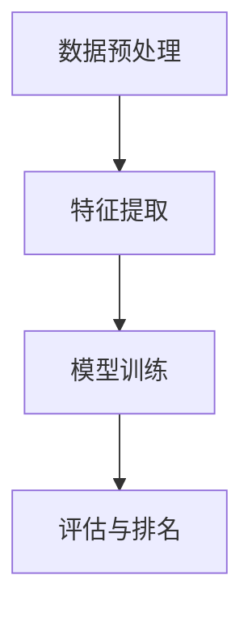
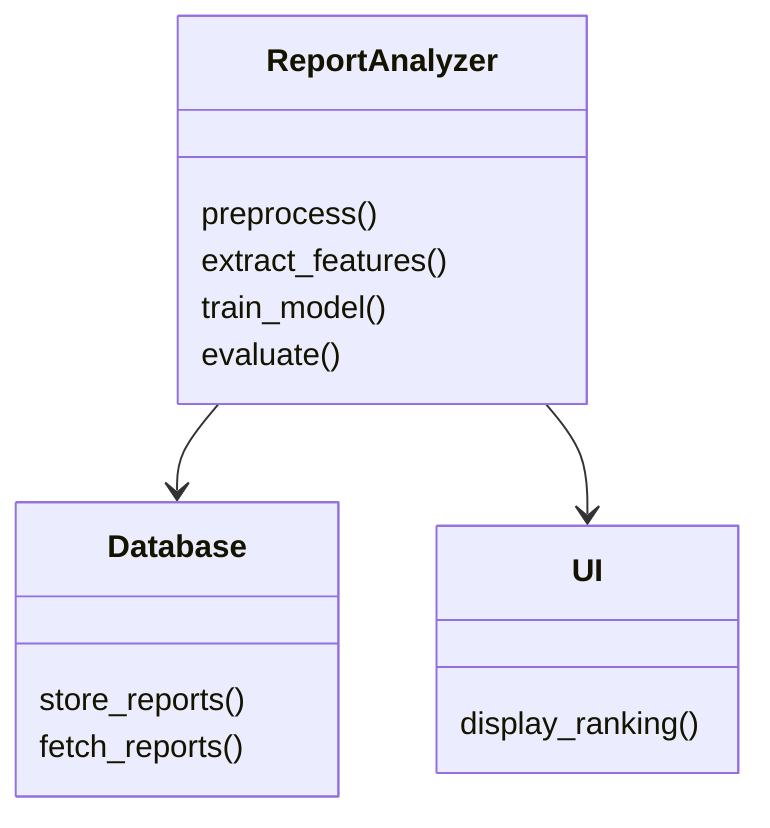
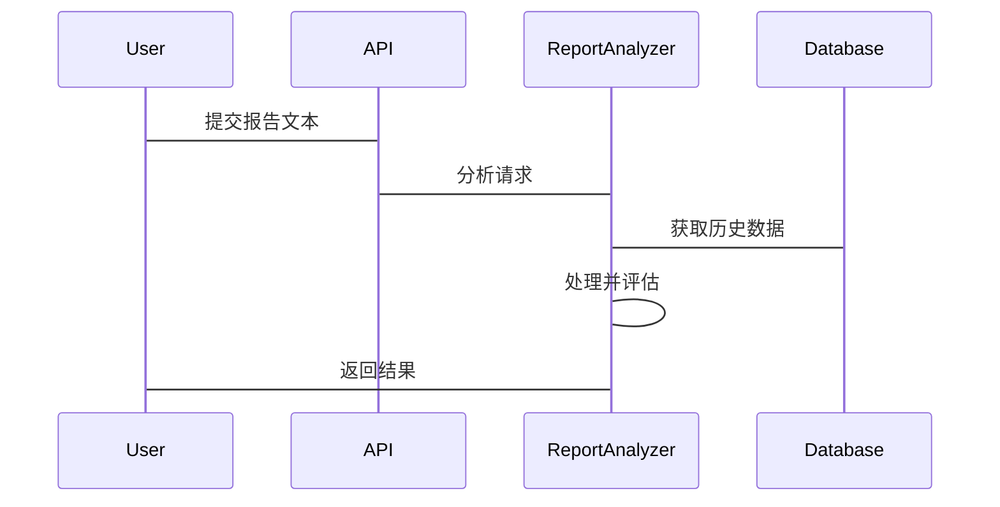

                 


# AI驱动的股票分析师报告质量评估与排名

**关键词：** AI, 股票分析, 质量评估, 报告排名, 自然语言处理, 机器学习

**摘要：** 本文探讨如何利用AI技术评估和排名股票分析师的报告质量。通过自然语言处理和机器学习，分析报告内容、语言风格和市场表现，构建评估模型，并提供实际案例分析和系统设计。

---

## 第一章：背景介绍

### 1.1 问题背景
股票分析师报告对投资决策至关重要，但传统评估方法主观性强，效率低下。AI技术的应用可提升评估的客观性和效率。

### 1.2 核心概念
报告质量评估涉及内容准确性、逻辑性和可读性。AI驱动的方法利用NLP和机器学习，自动分析这些方面。

### 1.3 问题描述
传统评估方法依赖人工，耗时且受主观因素影响。AI技术可量化分析，提供数据支持。

### 1.4 核心要素
包括数据来源、模型构建、评估指标等。数据预处理、特征提取和模型训练是关键步骤。

---

## 第二章：核心概念与联系

### 2.1 AI与NLP在股票分析中的应用
NLP技术用于文本分析，AI提供数据处理和模式识别能力。两者结合可自动化评估报告质量。

### 2.2 核心概念对比
| 比较维度 | 传统方法 | AI驱动方法 |
|----------|----------|------------|
| 评估效率 | 低效 | 高效 |
| 主观性   | 高 | 低 |
| 可扩展性 | 低 | 高 |

### 2.3 ER实体关系图


---

## 第三章：算法原理讲解

### 3.1 算法流程


### 3.2 算法实现
```python
def preprocess(text):
    # 假设text是报告文本
    return text.lower()

def extract_features(text):
    from sklearn.feature_extraction.text import TfidfVectorizer
    vectorizer = TfidfVectorizer(max_features=500)
    return vectorizer.fit_transform([text])
```

### 3.3 数学模型
评估模型可采用逻辑回归，损失函数为交叉熵：
$$ L = -\frac{1}{m}\sum_{i=1}^{m} [y_i \cdot \ln(p_i) + (1-y_i)\ln(1-p_i)] $$

---

## 第四章：系统分析与架构设计

### 4.1 项目介绍
构建一个AI驱动的报告评估系统，帮助投资者快速获取高质量报告。

### 4.2 系统功能设计


### 4.3 系统接口设计
- API：接收报告文本，返回评估结果和排名。
- 数据格式：JSON格式传输。

### 4.4 系统交互流程


---

## 第五章：项目实战

### 5.1 环境安装
安装Python和相关库：
```bash
pip install numpy scikit-learn tensorflow
```

### 5.2 核心代码实现
```python
import numpy as np
from sklearn.model_selection import train_test_split
from sklearn.metrics import accuracy_score

def load_data():
    # 加载报告数据
    pass

def train_model(X, y):
    # 训练模型
    pass

def evaluate_model(model, X_test, y_test):
    y_pred = model.predict(X_test)
    print(f'Accuracy: {accuracy_score(y_test, y_pred)}')
```

### 5.3 案例分析
分析一份报告，展示预处理、特征提取和模型评估过程，解释每一步的作用。

### 5.4 项目小结
总结项目实现的关键点和遇到的问题，提出改进建议。

---

## 第六章：总结与展望

### 6.1 最佳实践
- 数据清洗要彻底
- 特征选择要合理
- 模型调优要细致

### 6.2 小结
AI技术有效提升报告评估的效率和准确性，但需注意数据质量和模型泛化能力。

### 6.3 注意事项
- 数据泄露问题
- 模型解释性问题
- 实际应用中的伦理问题

### 6.4 拓展阅读
推荐相关书籍和论文，供读者深入学习。

---

**结论：** AI驱动的股票分析师报告评估与排名系统通过自动化处理和数据驱动的方法，显著提升了评估效率和准确性，为投资者提供了有力工具。未来，随着技术进步，系统将更加智能化和个性化。

