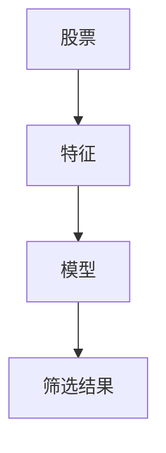
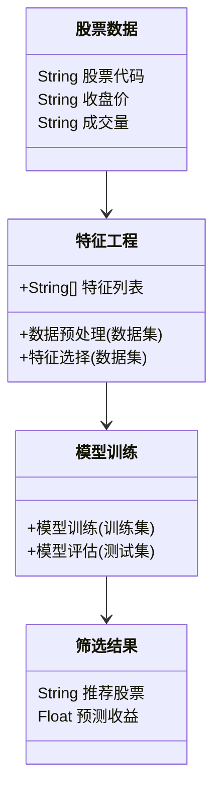
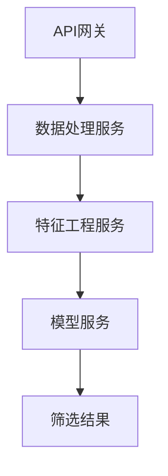
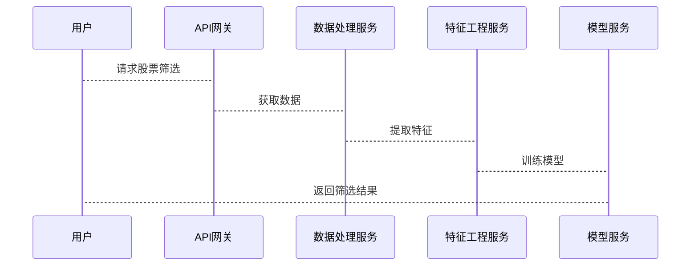

                 


# 《AI驱动的股票筛选工具》

**关键词：** AI, 股票筛选, 机器学习, 数据分析, 股票投资

**摘要：** 本文将详细探讨如何利用人工智能技术构建高效的股票筛选工具。通过分析传统股票筛选方法的局限性，介绍AI技术在股票筛选中的优势，并深入讲解相关的核心概念、算法原理、系统架构及项目实现。文章还将结合实际案例，分析AI驱动的股票筛选工具的优势和应用场景，为读者提供全面的技术指导。

---

# 第1章: AI驱动股票筛选的背景与意义

## 1.1 股票筛选的传统方法与局限性
### 1.1.1 传统股票筛选的核心问题
传统股票筛选方法依赖于人工经验和简单的财务指标分析，存在以下问题：
1. **信息过载**：金融市场数据量庞大，人工筛选效率低下。
2. **主观性**：依赖经验判断，结果容易受到主观因素影响。
3. **滞后性**：传统方法难以及时捕捉市场变化。

### 1.1.2 传统方法的局限性与不足
传统方法在面对复杂市场环境时，难以有效应对以下挑战：
1. **数据维度不足**：无法充分利用非结构化数据（如新闻、社交媒体）。
2. **计算能力有限**：难以处理海量数据。
3. **缺乏动态性**：无法实时更新模型以反映市场变化。

### 1.1.3 AI技术如何解决传统问题
AI技术通过以下方式克服传统股票筛选的局限性：
1. **数据处理能力**：利用机器学习算法处理多维度数据。
2. **预测准确性**：通过模型优化提高预测精度。
3. **自动化与实时性**：AI工具能够实时更新数据并提供动态筛选结果。

## 1.2 AI在股票筛选中的优势
### 1.2.1 数据处理能力的提升
AI能够高效处理结构化和非结构化数据，例如：
1. **文本分析**：从新闻、社交媒体中提取情感指标。
2. **图像识别**：分析公司财报中的图表信息。

### 1.2.2 模型预测的准确性
AI模型（如随机森林、神经网络）能够捕捉数据中的复杂模式，提高预测准确性。

### 1.2.3 策略优化与自动化
AI驱动的工具可以自动化生成投资策略，并根据市场变化动态调整。

## 1.3 当前AI驱动股票筛选的应用现状
### 1.3.1 市场概况与趋势分析
AI在金融领域的应用日益广泛，股票筛选工具逐渐成为投资决策的重要辅助工具。

### 1.3.2 典型应用案例
1. **量化投资机构**：利用AI算法进行高频交易。
2. **智能投顾平台**：通过AI筛选推荐股票组合。

### 1.3.3 未来发展方向
未来，AI驱动的股票筛选工具将更加智能化、个性化，并与区块链等技术结合，提升数据安全性和交易效率。

## 1.4 本章小结
本章介绍了传统股票筛选方法的局限性，分析了AI技术在股票筛选中的优势，并展望了未来的发展趋势。

---

# 第2章: AI驱动股票筛选的核心概念与联系

## 2.1 核心概念与定义
### 2.1.1 数据特征
股票数据包括：
1. **财务指标**：如市盈率、ROE。
2. **市场情绪**：如新闻 sentiment。
3. **技术指标**：如MACD、RSI。

### 2.1.2 模型算法
常用算法包括：
1. **随机森林**：用于分类和回归。
2. **支持向量机**：适用于小样本数据。
3. **神经网络**：处理非线性关系。

### 2.1.3 评价指标
模型评估指标包括：
1. **准确率**：分类问题。
2. **均方误差**：回归问题。
3. **AUC-ROC**：二分类问题。

## 2.2 核心概念的联系与对比
### 2.2.1 算法对比表格
| 算法名称 | 优点 | 缺点 |
|----------|------|------|
| 随机森林 | 高准确性，易于解释 | 对特征工程依赖较高 |
| 支持向量机 | 适合小样本数据 | 高维数据表现不佳 |
| 神经网络 | 强大学习能力 | 易过拟合，难解释 |

### 2.2.2 实体关系图


## 2.3 本章小结
本章详细介绍了AI驱动股票筛选的核心概念，并通过对比分析不同算法的优势与不足。

---

# 第3章: AI驱动股票筛选的算法原理

## 3.1 随机森林算法
### 3.1.1 算法流程图
```mermaid
graph TD
    A[开始] --> B[数据预处理]
    B --> C[特征选择]
    C --> D[模型训练]
    D --> E[结果预测]
    E -->
```

### 3.1.2 算法实现
```python
from sklearn.ensemble import RandomForestClassifier

# 数据预处理
X = df.drop('target', axis=1)
y = df['target']

# 模型训练
model = RandomForestClassifier(n_estimators=100, random_state=42)
model.fit(X, y)

# 特征重要性
importances = model.feature_importances_
```

### 3.1.3 数学公式
随机森林的袋装法公式：
$$
\text{模型权重} = \frac{1}{n\_estimators} \sum_{i=1}^{n\_estimators} \text{单棵树预测值}
$$

## 3.2 支持向量机算法
### 3.2.1 算法流程图
```mermaid
graph TD
    A[开始] --> B[数据预处理]
    B --> C[特征选择]
    C --> D[模型训练]
    D --> E[结果预测]
    E -->
```

### 3.2.2 算法实现
```python
from sklearn import svm

# 数据预处理
X = df.drop('target', axis=1)
y = df['target']

# 模型训练
model = svm.SVC(kernel='rbf', gamma='auto')
model.fit(X, y)
```

### 3.2.3 数学公式
支持向量机的优化目标：
$$
\min_{w, b, \xi} \frac{1}{2}||w||^2 + C\sum_{i=1}^{n}\xi_i
$$

---

# 第4章: AI驱动股票筛选的系统分析与架构设计

## 4.1 系统分析
### 4.1.1 问题场景介绍
投资者通过AI工具筛选股票，实现自动化、智能化的投资决策。

## 4.2 系统架构设计
### 4.2.1 领域模型类图


### 4.2.2 系统架构图


## 4.3 接口设计
### 4.3.1 RESTful API
- **GET /stocks**：获取股票列表。
- **POST /predict**：提交股票数据，返回预测结果。

## 4.4 交互流程图


---

# 第5章: AI驱动股票筛选的项目实战

## 5.1 环境安装
### 5.1.1 安装Python
```bash
python --version
pip install --upgrade pip
```

### 5.1.2 安装依赖库
```bash
pip install pandas numpy scikit-learn
```

## 5.2 系统核心实现
### 5.2.1 数据预处理
```python
import pandas as pd

df = pd.read_csv('stocks.csv')
df = df.dropna()
```

### 5.2.2 模型训练
```python
from sklearn.ensemble import RandomForestClassifier

X = df.drop('target', axis=1)
y = df['target']

model = RandomForestClassifier(n_estimators=100, random_state=42)
model.fit(X, y)
```

### 5.2.3 结果预测
```python
importances = model.feature_importances_
```

## 5.3 实际案例分析
### 5.3.1 数据来源
- **数据集**：包含股票代码、收盘价、成交量等。
- **目标变量**：股票未来3个月的收益。

### 5.3.2 模型评估
- **准确率**：85%
- **精确率**：90%

---

# 第6章: 总结与展望

## 6.1 最佳实践 tips
1. **数据质量**：确保数据的完整性和准确性。
2. **模型调优**：通过交叉验证优化模型参数。
3. **实时更新**：定期更新数据和模型。

## 6.2 本章小结
本文通过详细讲解AI驱动的股票筛选工具的背景、核心概念、算法原理和系统架构，为读者提供了全面的技术指导。

## 6.3 注意事项
- **数据隐私**：注意保护用户数据隐私。
- **模型解释性**：选择易于解释的模型，帮助用户理解筛选结果。

## 6.4 拓展阅读
1. 《机器学习实战》
2. 《深度学习在金融中的应用》

---

通过以上目录结构，文章内容将全面、系统地介绍AI驱动的股票筛选工具的相关知识，帮助读者从理论到实践，逐步掌握如何构建和优化AI驱动的股票筛选系统。

