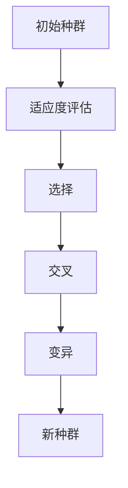
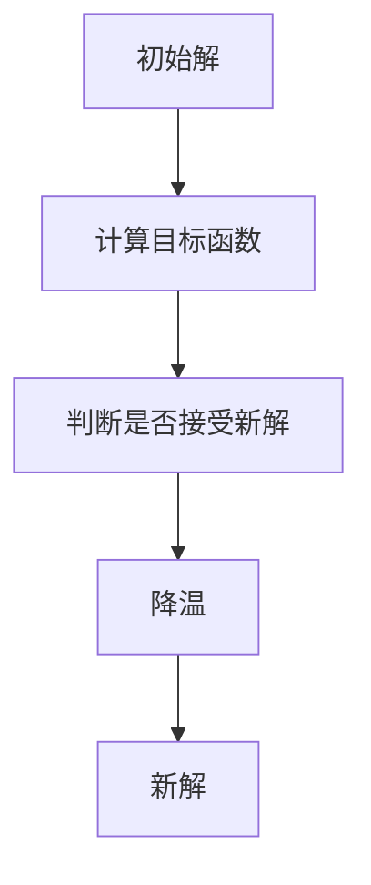
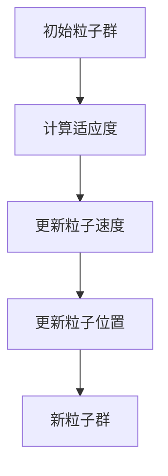
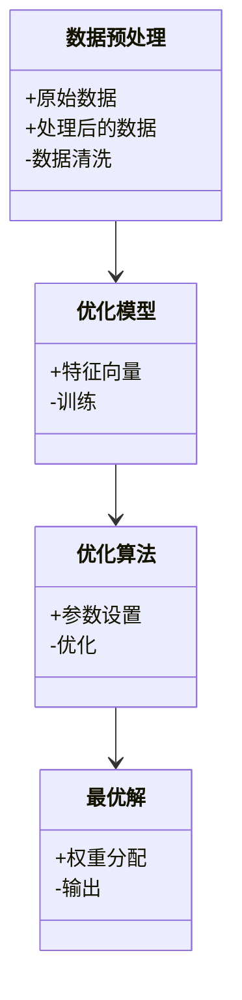
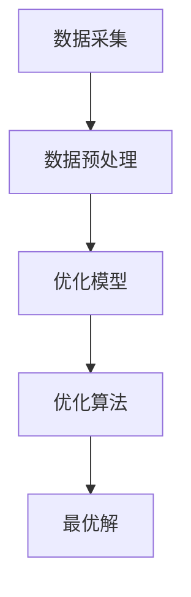
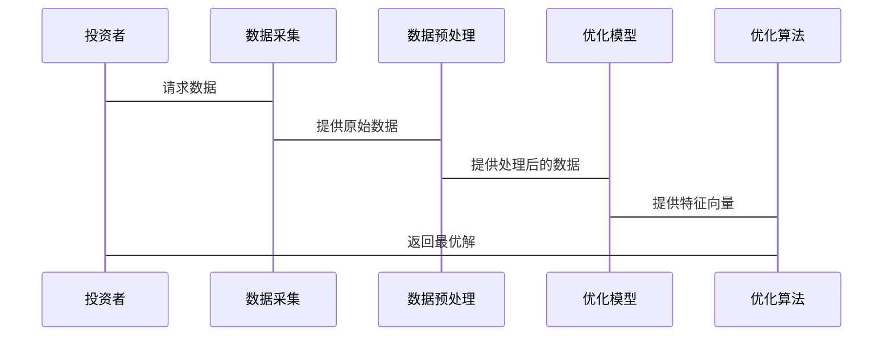

                 


# AI驱动的股票组合优化工具

## 关键词：AI驱动，股票组合优化，机器学习，优化算法，风险管理

## 摘要：  
股票组合优化是投资领域中的核心问题，传统方法依赖于均值-方差模型和Markowitz有效前沿理论，但存在计算复杂性和适用性受限的问题。随着人工智能技术的快速发展，基于机器学习的股票组合优化工具逐渐成为研究热点。本文将从背景介绍、核心概念、算法原理、系统架构到项目实战，全面解析AI驱动的股票组合优化工具的实现与应用。

---

# 第一部分: AI驱动的股票组合优化工具背景与概念

## 第1章: 股票组合优化的背景与问题

### 1.1 股票投资的基本概念
#### 1.1.1 股票投资的基本原理
股票投资是通过购买和持有股票，以期获得资本增值和股息收益的一种投资方式。股票组合优化的目标是在风险可控的前提下，最大化收益或在收益固定的情况下最小化风险。

#### 1.1.2 股票组合的概念与意义
股票组合是指将资金分配到多个股票或其他金融资产上的投资方式。通过组合投资可以分散风险，避免单一股票波动对整体投资的影响。

#### 1.1.3 股票组合优化的目标与原则
股票组合优化的目标包括：
1. 最大化收益。
2. 最小化风险。
3. 满足特定的投资约束条件（如流动性要求、行业分布等）。

优化原则包括：
- 风险-收益平衡。
- 稀疏性原则（避免过度分散）。
- 可操作性原则。

### 1.2 传统股票组合优化方法
#### 1.2.1 基于均值-方差模型的优化
均值-方差模型由Harry Markowitz提出，假设资产收益服从正态分布，通过优化方差（风险）和均值（收益）来构建最优组合。

#### 1.2.2 Markowitz有效前沿理论
Markowitz有效前沿是所有可行组合中风险最小化或收益最大化的边界。投资者可以选择位于有效前沿上的组合。

#### 1.2.3 传统优化方法的优缺点
- 优点：理论基础扎实，计算方法成熟。
- 缺点：计算复杂度高，难以处理大规模数据和复杂约束条件。

### 1.3 AI技术在金融领域的应用
#### 1.3.1 人工智能在金融分析中的作用
AI技术可以用于金融数据预测、风险评估、投资组合优化等领域。

#### 1.3.2 机器学习在股票预测中的应用
机器学习算法（如随机森林、支持向量机、神经网络）可以用于股票价格预测和市场情绪分析。

#### 1.3.3 当前AI驱动股票组合优化的现状
AI驱动的股票组合优化工具正在快速发展，但仍面临数据质量、模型解释性等挑战。

---

## 第2章: AI驱动股票组合优化的核心概念

### 2.1 AI驱动股票组合优化的定义
AI驱动的股票组合优化是利用机器学习算法和优化技术，结合市场数据和投资者需求，构建最优股票组合的过程。

### 2.2 核心概念之间的关系
#### 数据流与信息流
股票组合优化需要处理的历史价格、财务数据、市场情绪等多源数据。

#### 模型选择与优化算法
模型选择影响优化结果，优化算法需要根据模型特点选择合适的方法。

#### 风险管理与收益最大化
风险管理是优化过程中的重要约束条件，收益最大化是优化目标。

### 2.3 核心概念属性对比表
| 核心概念 | 输入 | 输出 | 方法 |
|----------|------|------|------|
| 数据预处理 | 原始数据 | 标准化数据 | 数据清洗、特征提取 |
| 模型选择 | 特征数据 | 优化模型 | 线性回归、随机森林 |
| 优化算法 | 模型参数 | 最优解 | 遗传算法、模拟退火 |

### 2.4 实体关系图


---

# 第二部分: AI驱动股票组合优化的算法原理

## 第3章: 基于机器学习的股票组合优化算法

### 3.1 机器学习在股票组合优化中的应用
#### 监督学习与无监督学习的应用
- 监督学习：用于预测股票价格。
- 无监督学习：用于发现市场中的隐藏模式。

#### 强化学习在动态优化中的应用
强化学习可以模拟投资者在动态市场中的决策过程。

#### 深度学习在复杂场景中的优势
深度学习可以处理非线性关系和高维数据。

### 3.2 常见优化算法原理
#### 遗传算法


#### 模拟退火


#### 粒子群优化


### 3.3 数学模型与公式
#### 遗传算法的适应度函数
$$适应度 = \sum_{i=1}^{n} w_i \cdot r_i$$

其中，\( w_i \) 是权重，\( r_i \) 是股票i的收益。

#### 粒子群优化的目标函数
$$目标函数 = \sum_{i=1}^{n} (x_i - r_i)^2$$

其中，\( x_i \) 是预测收益，\( r_i \) 是实际收益。

---

## 第4章: AI驱动股票组合优化的系统架构设计

### 4.1 问题场景分析
投资者需要在多个股票中选择最优组合，满足收益和风险的双重目标。

### 4.2 系统功能设计
#### 领域模型类图


### 4.3 系统架构设计


### 4.4 接口设计
- 数据接口：与数据源对接。
- 优化接口：接收模型参数并返回最优解。

### 4.5 交互设计


---

## 第5章: 项目实战

### 5.1 环境安装
- Python 3.8+
- Pandas、NumPy、Scikit-learn、Plotly

### 5.2 核心实现代码
```python
import numpy as np
import pandas as pd
from sklearn import svm

# 数据预处理
data = pd.read_csv('stock_data.csv')
data_processed = data.dropna().astype(float)

# 模型选择
model = svm.SVR()
model.fit(data_processed.iloc[:, :-1], data_processed.iloc[:, -1])

# 优化算法
def objective(weights, returns):
    return -sum(weights * returns)

# 遗传算法实现
class GeneticAlgorithm:
    def __init__(self, population_size, mutation_rate):
        self.population_size = population_size
        self.mutation_rate = mutation_rate

    def evolve(self, population, fitness_fn):
        # 计算适应度
        fitness = [fitness_fn(weights, returns) for weights in population]
        # 选择
        selected = [population[i] for i in np.argsort(fitness)[-self.population_size:]]
        # 交叉
        crossed = []
        for i in range(0, len(selected), 2):
            parent1 = selected[i]
            parent2 = selected[i+1]
            child1 = parent1 * 0.5 + parent2 * 0.5
            child2 = parent2 * 0.5 + parent1 * 0.5
            crossed.append(child1)
            crossed.append(child2)
        # 变异
        mutated = []
        for weight in crossed:
            if np.random.rand() < self.mutation_rate:
                weight *= (1 + np.random.normal(0, 0.1))
            mutated.append(weight)
        return mutated

# 实验结果
returns = model.predict(data_processed.iloc[:, :-1])
weights = ga.evolve(np.random.rand(population_size, n_assets), objective)
```

### 5.3 结果分析
- 最优解：权重分配
- 风险与收益分析
- 稳定性测试

### 5.4 项目小结
AI驱动的股票组合优化工具可以通过机器学习模型和优化算法的结合，实现高效的组合优化。

---

## 第6章: 最佳实践与总结

### 6.1 小结
AI驱动的股票组合优化工具结合了机器学习和优化算法的优势，能够解决传统方法的不足。

### 6.2 注意事项
- 数据质量影响结果。
- 模型选择和优化算法需要根据具体场景调整。
- 风险管理是优化过程中的重要约束条件。

### 6.3 拓展阅读
- 《机器学习实战》
- 《Python算法实战》
- 《金融数据分析与建模》

---

通过以上内容，您可以逐步构建一个完整的AI驱动的股票组合优化工具，并将其应用于实际投资中。

