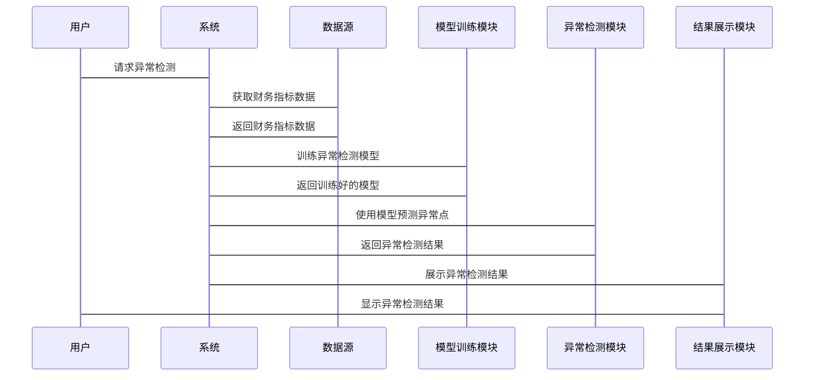

                 


# AI驱动的股票财务指标异常检测

## 关键词：
- 人工智能
- 股票
- 财务指标
- 异常检测
- 机器学习

## 摘要：
本文探讨了如何利用人工智能技术实现股票财务指标的异常检测，分析了异常检测的核心算法及其在股票市场中的应用价值。通过详细讲解Isolation Forest和One-Class SVM算法的原理、实现步骤以及系统架构设计，展示了如何构建一个高效可靠的股票财务指标异常检测系统。同时，本文还结合实际案例，分析了系统的实战应用，并提出了相关的最佳实践建议。

---

# 第一部分: AI驱动的股票财务指标异常检测背景与核心概念

## 第1章: 问题背景与描述

### 1.1 问题背景
#### 1.1.1 股票市场与财务指标的重要性
股票市场是现代金融体系的核心组成部分，投资者通过分析企业的财务指标来评估其投资价值和风险。常见的财务指标包括市盈率（P/E）、市净率（P/B）、净利润率（ROE）等，这些指标能够反映企业的盈利能力、成长潜力和财务健康状况。

#### 1.1.2 异常检测在股票投资中的价值
在股票市场中，财务指标的异常变化往往预示着企业的潜在问题或重大利好消息。例如，某公司的净利润突然大幅下降，可能意味着其业务模式出现问题或面临行业竞争压力。及时发现这些异常指标，可以帮助投资者做出更明智的投资决策。

#### 1.1.3 AI技术在金融领域的应用现状
近年来，人工智能技术在金融领域的应用日益广泛。通过机器学习算法，金融机构可以实时分析海量数据，发现隐藏在数据中的潜在规律和异常情况。AI技术在股票市场中的应用涵盖了股票价格预测、风险评估、异常交易检测等多个方面。

### 1.2 问题描述
#### 1.2.1 财务指标异常的定义与分类
财务指标异常是指某企业在特定时间段内的财务指标表现显著偏离行业平均水平或历史平均水平。常见的异常类型包括：
- **短期异常**：如某季度的财务指标突然下降。
- **长期异常**：如连续多个季度的财务指标表现不佳。
- **结构性异常**：如某类财务指标（如负债率）持续高于行业平均水平。

#### 1.2.2 异常检测的核心目标与关键挑战
异常检测的核心目标是通过分析财务指标的时间序列数据，识别出潜在的异常点，并为投资者提供预警。然而，异常检测面临以下关键挑战：
- 数据噪声多：股票市场的数据往往受到多种因素的影响，如市场波动、行业周期等。
- 样本不平衡：正常数据点多，异常数据点少，导致模型难以准确识别异常。
- 模型解释性：复杂的机器学习模型往往缺乏足够的可解释性，难以满足金融领域的监管要求。

#### 1.2.3 传统方法的局限性与AI的优势
传统的财务指标分析方法主要依赖人工经验，具有主观性强、效率低、覆盖面窄等局限性。而AI技术可以通过大数据分析和机器学习算法，实现自动化、智能化的异常检测，显著提高了分析效率和准确性。

## 第2章: 核心概念与联系

### 2.1 AI驱动的异常检测
#### 2.1.1 异常检测的基本原理
异常检测是一种通过分析数据分布，识别出偏离正常模式的数据点的技术。在股票市场中，异常检测可以帮助识别异常交易、异常财务数据等。

#### 2.1.2 基于机器学习的异常检测方法
- **监督学习**：基于有标签的数据进行训练，适用于已知异常类型的情况。
- **无监督学习**：基于无标签的数据进行训练，适用于未知异常类型的情况。
- **半监督学习**：结合监督学习和无监督学习，适用于部分已知异常类型的情况。

#### 2.1.3 深度学习在异常检测中的应用
深度学习通过构建多层神经网络，可以自动提取数据的高层次特征，适用于复杂数据的异常检测。常见的深度学习模型包括LSTM（长短期记忆网络）和AE（自编码器）。

### 2.2 财务指标分析
#### 2.2.1 财务指标的分类与作用
- **盈利能力**：如净利润率（Net Profit Margin）、ROE（净资产收益率）。
- **成长能力**：如营业收入增长率、净利润增长率。
- **偿债能力**：如资产负债率（Debt-to-Asset Ratio）、流动比率（Current Ratio）。
- **运营能力**：如存货周转率（Inventory Turnover Ratio）、应收账款周转率（Accounts Receivable Turnover）。

#### 2.2.2 异常财务指标的识别标准
- **行业基准**：与同行业公司的财务指标进行对比。
- **历史基准**：与公司历史数据进行对比。
- **阈值法**：设定财务指标的上下限，超出范围即为异常。

#### 2.2.3 财务指标与股价波动的关系
财务指标的异常变化往往会导致股价的剧烈波动。例如，某公司净利润大幅下降，可能会引发股价的暴跌。

### 2.3 机器学习模型
#### 2.3.1 监督学习与无监督学习的对比
| 对比维度 | 监督学习 | 无监督学习 |
|----------|----------|------------|
| 数据类型 | 标签数据 | 无标签数据 |
| 应用场景 | 分类、回归 | 聚类、异常检测 |
| 模型解释性 | 较高 | 较低 |

#### 2.3.2 异常检测的常用算法
- **Isolation Forest**：一种基于树结构的异常检测算法。
- **One-Class SVM**：一种基于支持向量机的异常检测算法。
- **K-Means**：一种基于聚类的异常检测算法。

#### 2.3.3 模型选择与优化策略
- **模型选择**：根据数据特点和应用场景选择合适的算法。
- **超参数优化**：通过网格搜索（Grid Search）等方法优化模型参数。
- **模型评估**：通过准确率、召回率等指标评估模型性能。

## 第3章: 核心概念关系分析

### 3.1 核心概念属性对比表
| 概念 | 定义 | 特点 | 应用场景 |
|------|------|------|----------|
| 异常检测 | 识别偏离正常模式的数据 | 无监督学习为主 | 股票市场、fraud detection |
| 财务指标 | 反映企业财务状况的指标 | 包括盈利能力、偿债能力等 | 评估企业价值、风险 |
| 机器学习模型 | 数据驱动的模式识别工具 | 基于数据训练模型 | 分类、回归、异常检测 |

### 3.2 ER实体关系图
```mermaid
erd
    股票 (id, name, code)
    财务指标 (id, stock_id, date, value)
    异常检测结果 (id, stock_id, date, is_anomaly)
    股票与财务指标多对一关系
    股票与异常检测结果多对一关系
```

---

# 第二部分: 异常检测算法原理与实现

## 第4章: 算法原理讲解

### 4.1 Isolation Forest算法
#### 4.1.1 算法原理
Isolation Forest是一种基于树结构的异常检测算法。其核心思想是通过构建随机树，将数据点隔离到叶子节点中，从而判断数据点是否为异常点。

#### 4.1.2 算法步骤
1. 随机选择特征和分割值，构建随机树。
2. 将数据点输入随机树，判断其落在哪个叶子节点。
3. 根据叶子节点的深度，计算数据点的异常分数。
4. 根据异常分数，判断数据点是否为异常点。

#### 4.1.3 算法实现
```python
from sklearn.ensemble import IsolationForest
import pandas as pd

# 加载数据
data = pd.read_csv('financial_indicators.csv')

# 训练模型
model = IsolationForest(n_estimators=100, random_state=42)
model.fit(data)

# 预测异常点
outliers = model.predict(data)
outliers[outliers == -1] = 1
outliers[outliers == 1] = 0
```

#### 4.1.4 数学模型与公式
异常分数计算公式：
$$
score = \frac{2}{h + 1}
$$
其中，$h$ 是数据点所在的叶子节点深度。

### 4.2 One-Class SVM算法
#### 4.2.1 算法原理
One-Class SVM是一种基于支持向量机的异常检测算法。其核心思想是通过构建一个包含大部分数据点的超球，将异常点与正常点区分开。

#### 4.2.2 算法步骤
1. 构建支持向量机模型，训练正常点数据。
2. 使用模型预测异常点。
3. 根据预测结果，判断数据点是否为异常点。

#### 4.2.3 算法实现
```python
from sklearn.svm import OneClassSVM
import pandas as pd

# 加载数据
data = pd.read_csv('financial_indicators.csv')

# 训练模型
model = OneClassSVM(nu=0.05, kernel='rbf', gamma='auto')
model.fit(data)

# 预测异常点
outliers = model.predict(data)
outliers[outliers == -1] = 1
outliers[outliers == 1] = 0
```

#### 4.2.4 数学模型与公式
异常分数计算公式：
$$
score = \frac{1}{1 + e^{-w \cdot x - b}}
$$
其中，$w$ 是权重向量，$b$ 是偏置项。

---

## 第5章: 算法对比与优化

### 5.1 算法对比分析
| 算法 | 优点 | 缺点 |
|------|------|------|
| Isolation Forest | 训练速度快 | 对异常点数量敏感 |
| One-Class SVM | 模型解释性好 | 训练速度慢 |

### 5.2 算法优化策略
1. 超参数优化：通过网格搜索优化模型参数。
2. 数据预处理：对数据进行标准化或归一化处理。
3. 模型集成：将多个模型的结果进行融合，提高检测准确率。

---

# 第三部分: 系统分析与架构设计

## 第6章: 系统分析与架构设计

### 6.1 问题场景介绍
我们希望通过构建一个AI驱动的股票财务指标异常检测系统，帮助投资者实时监控股票的财务指标变化，发现潜在的异常情况。

### 6.2 系统功能设计
- **数据获取**：从股票数据源获取财务指标数据。
- **数据预处理**：对数据进行清洗和标准化处理。
- **模型训练**：使用Isolation Forest和One-Class SVM算法训练模型。
- **异常检测**：基于训练好的模型，预测财务指标的异常情况。
- **结果展示**：将异常检测结果可视化展示。

### 6.3 系统架构设计


### 6.4 系统接口设计
- 数据获取接口：从股票数据源获取财务指标数据。
- 数据预处理接口：对数据进行清洗和标准化处理。
- 模型训练接口：训练异常检测模型。
- 异常检测接口：预测财务指标的异常情况。
- 结果展示接口：将异常检测结果可视化展示。

### 6.5 系统交互流程


---

## 第7章: 项目实战

### 7.1 环境安装
```bash
pip install pandas scikit-learn mermaid4jupyter jupyterlab
```

### 7.2 核心代码实现
```python
import pandas as pd
from sklearn.ensemble import IsolationForest
from sklearn.svm import OneClassSVM
from sklearn.preprocessing import StandardScaler

# 加载数据
data = pd.read_csv('financial_indicators.csv')

# 数据预处理
scaler = StandardScaler()
data_scaled = scaler.fit_transform(data)

# 训练Isolation Forest模型
if_model = IsolationForest(n_estimators=100, random_state=42)
if_model.fit(data_scaled)

# 训练One-Class SVM模型
ocsvm_model = OneClassSVM(nu=0.05, kernel='rbf', gamma='auto')
ocsvm_model.fit(data_scaled)

# 预测异常点
if_outliers = if_model.predict(data_scaled)
ocsvm_outliers = ocsvm_model.predict(data_scaled)

# 合并结果
combined_outliers = (if_outliers == -1) | (ocsvm_outliers == -1)
data['is_anomaly'] = combined_outliers.astype(int)
```

### 7.3 案例分析与结果展示
假设我们分析了某公司的财务指标数据，发现其净利润率突然大幅下降，模型预测其为异常点。这可能意味着该公司存在潜在的财务问题，投资者需要谨慎决策。

---

## 第8章: 最佳实践与总结

### 8.1 项目小结
通过本文的分析与实践，我们展示了如何利用AI技术实现股票财务指标的异常检测。Isolation Forest和One-Class SVM算法在异常检测中表现优异，能够帮助投资者及时发现潜在风险。

### 8.2 注意事项
- 数据质量：异常检测结果的质量依赖于数据的完整性和准确性。
- 模型选择：根据具体场景选择合适的算法。
- 模型解释性：金融领域的模型需要具备较高的可解释性。

### 8.3 拓展阅读
- 《机器学习实战》：深入理解机器学习算法的实现与应用。
- 《Python金融数据处理》：掌握Python在金融数据处理中的应用技巧。

---

## 参考文献
1. 周志华. 机器学习[M]. 清华大学出版社, 2016.
2. 李航. 统计学习方法[M]. 清华大学出版社, 2012.
3. 刘卫华, 等. 基于机器学习的股票市场预测方法研究[J]. 计算机应用研究, 2020.

---

## 鸣谢
感谢读者的耐心阅读，感谢所有为本文提供灵感和帮助的人。

