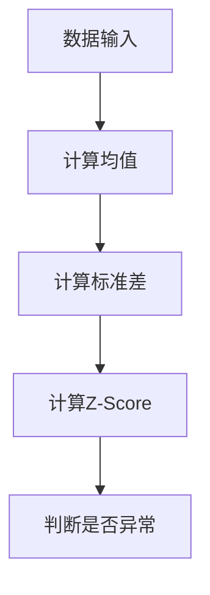
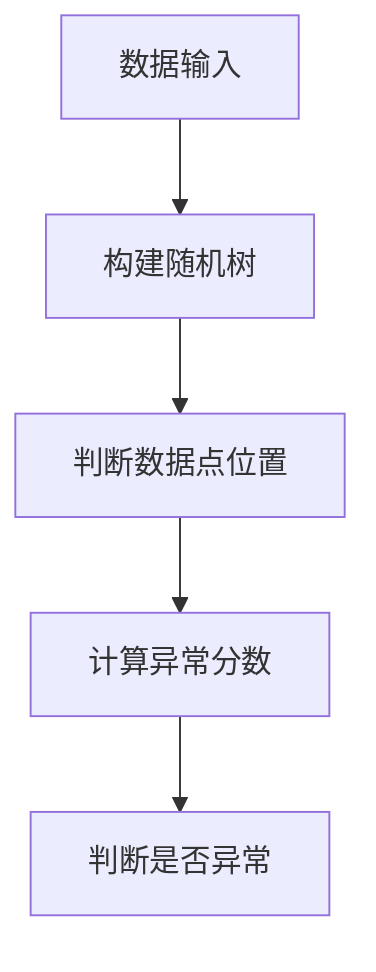
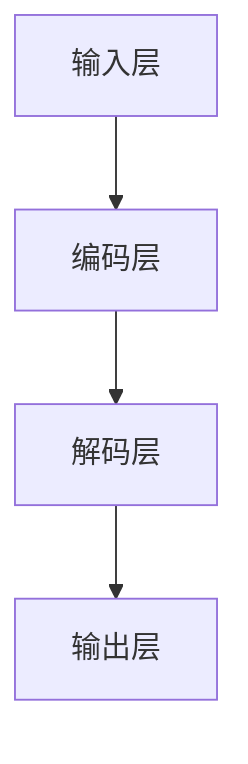
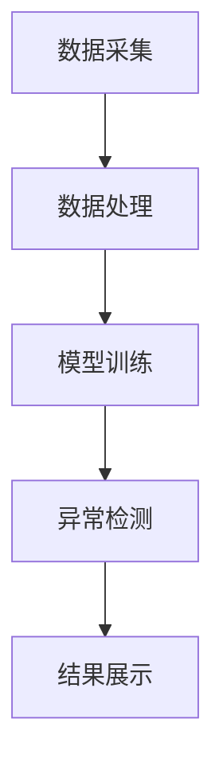
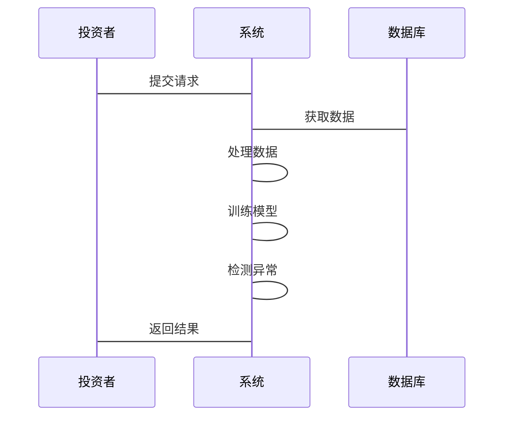

                 


# AI驱动的股票财务指标异常检测

**关键词：** 股票市场、财务指标、异常检测、人工智能、机器学习、深度学习

**摘要：**  
股票市场的波动性和复杂性使得财务指标异常检测成为投资决策中的关键环节。本文详细探讨了如何利用人工智能技术，特别是机器学习和深度学习算法，来实现对股票财务指标的异常检测。文章从背景介绍、核心概念、算法原理、系统设计到项目实战，逐步分析了AI在股票财务指标异常检测中的应用，为投资者和数据科学家提供了理论和实践指导。

---

# 第一部分: AI驱动的股票财务指标异常检测概述

## 第1章: 股票财务指标异常检测的背景与挑战

### 1.1 问题背景介绍

股票市场作为现代金融体系的核心组成部分，其波动性和复杂性使得投资者和分析师需要不断关注市场动态。财务指标是衡量企业财务健康状况的重要工具，包括市盈率（P/E）、市净率（P/B）、每股收益（EPS）等。这些指标的异常变化可能预示着企业的潜在风险或投资机会。

#### 1.1.1 股票市场与财务指标的重要性
股票市场的波动性使得投资者需要实时监控企业的财务状况。财务指标是企业财务健康状况的晴雨表，能够帮助投资者评估企业的盈利能力、成长能力和偿债能力。

#### 1.1.2 异常检测在股票投资中的作用
财务指标的异常变化可能预示着企业的财务状况恶化或潜在的投资机会。例如，突然下降的每股收益可能意味着企业盈利能力减弱，而异常上升的市盈率可能暗示市场对该企业未来表现的乐观预期。

#### 1.1.3 AI技术在金融领域的应用潜力
人工智能技术，特别是机器学习和深度学习，能够处理海量数据并发现隐藏的模式。这些技术在股票市场中的应用可以帮助投资者快速识别财务指标的异常变化，从而做出更明智的投资决策。

### 1.2 问题描述与解决方法

#### 1.2.1 财务指标异常的定义与分类
财务指标异常是指某个指标的值偏离历史平均水平或行业平均水平的情况。异常可以分为短期波动和长期趋势变化两类。短期波动可能由市场情绪或突发事件引起，而长期趋势变化则可能反映企业的基本面问题。

#### 1.2.2 异常检测的核心问题与挑战
异常检测的核心问题在于如何区分正常波动和真正的异常情况。传统统计方法通常依赖于假设数据分布的正态性，而实际市场数据往往存在复杂的分布形态，这使得传统方法在面对非正态分布数据时效果不佳。此外，金融数据的高维度性和时间依赖性也增加了异常检测的难度。

#### 1.2.3 AI驱动的解决方案概述
人工智能技术可以通过构建复杂的模型来捕捉数据中的非线性关系，从而更准确地识别异常情况。机器学习算法，如随机森林和孤立森林，以及深度学习模型，如自动编码器，都是有效的工具。

### 1.3 核心概念与边界

#### 1.3.1 异常检测的边界与外延
异常检测的边界在于如何定义“异常”。不同的企业和投资者可能对同一指标的异常有不同的判断标准。例如，一家成长型企业可能接受较高的市盈率，而一家成熟型企业则可能被视为市盈率偏高。

#### 1.3.2 核心要素与概念结构
异常检测的核心要素包括数据来源、检测方法、判断标准和反馈机制。数据来源通常是企业的财务报表数据，检测方法可以是统计方法或机器学习模型，判断标准是基于历史数据或行业基准，反馈机制则用于优化模型和调整投资策略。

#### 1.3.3 与传统统计方法的区别
传统的统计方法通常假设数据服从正态分布，而实际的财务数据可能呈现出偏态分布或其他复杂分布。AI驱动的方法能够更好地处理复杂的数据分布，同时还能自动学习数据中的特征，减少人工干预。

## 1.4 本章小结

本章介绍了股票财务指标异常检测的背景和重要性，分析了传统方法的局限性，并提出了人工智能技术的解决方案。接下来的章节将详细探讨异常检测的核心概念和技术原理。

---

# 第二部分: 核心概念与技术原理

## 第2章: 财务指标异常检测的核心概念

### 2.1 财务指标的分类与特征

#### 2.1.1 财务指标的分类
财务指标通常分为四类：
1. **盈利能力指标**：如净利润率、ROE（净资产收益率）。
2. **成长能力指标**：如收入增长率、净利润增长率。
3. **偿债能力指标**：如资产负债率、速动比率。
4. **运营能力指标**：如存货周转率、应收账款周转率。

#### 2.1.2 各类指标的特征分析
盈利能力指标反映了企业的赚钱能力，成长能力指标反映了企业的扩张能力，偿债能力指标反映了企业的财务风险，运营能力指标反映了企业的管理效率。

#### 2.1.3 指标之间的关系
这些指标之间相互关联，共同构成了企业的财务健康状况。例如，高净利润率和高收入增长率通常表明企业具有较强的盈利能力和发展潜力。

### 2.2 异常检测的数学模型

#### 2.2.1 异常检测的数学定义
异常检测的目标是识别数据中的异常点，即与正常数据分布显著不同的点。数学上，可以定义异常点为：
$$ P(x \text{为异常点} | x) = \text{高} $$

#### 2.2.2 常见的异常检测算法
1. **基于统计的方法**：如Z-Score和LOF（局部异常因子）。
2. **基于机器学习的方法**：如随机森林和孤立森林。
3. **基于深度学习的方法**：如自动编码器和变分自编码器（VAE）。

#### 2.2.3 AI模型在异常检测中的优势
AI模型能够处理高维数据，捕捉非线性关系，并通过训练不断优化检测效果。与传统方法相比，AI模型具有更高的准确性和适应性。

### 2.3 AI驱动的异常检测流程

#### 2.3.1 数据预处理流程
1. 数据清洗：处理缺失值和异常值。
2. 数据标准化：将数据转换为统一的尺度。
3. 数据增强：通过技术手段增加数据的多样性。

#### 2.3.2 模型训练与优化
1. 特征选择：选择对异常检测最重要的特征。
2. 模型训练：使用训练数据训练异常检测模型。
3. 模型优化：通过交叉验证调整模型参数。

#### 2.3.3 结果分析与反馈
1. 可视化分析：通过图表展示异常点的位置和分布。
2. 结果解释：分析异常点的原因，并采取相应的措施。
3. 模型迭代：根据新数据不断优化模型。

### 2.4 核心概念的ER实体关系图

```mermaid
er
    actor: 投资者
    system: 异常检测系统
    financial_indicator: 财务指标
    anomaly: 异常点
    result: 检测结果
    actor --> system: 提交请求
    system --> financial_indicator: 获取数据
    system --> anomaly: 识别异常
    system --> result: 输出结果
```

### 2.5 本章小结

本章详细介绍了财务指标的分类与特征，分析了异常检测的数学模型，并提出了AI驱动的异常检测流程。接下来的章节将重点讨论具体的算法原理和技术实现。

---

# 第三部分: 算法原理与数学模型

## 第3章: 异常检测算法原理

### 3.1 基于统计的异常检测算法

#### 3.1.1 Z-Score方法

Z-Score是一种常用的统计方法，用于检测数据中的异常值。公式为：
$$ Z = \frac{X - \mu}{\sigma} $$
其中，$\mu$是均值，$\sigma$是标准差。

#### 3.1.2 算法流程图



#### 3.1.3 优缺点分析
优点：简单易懂，计算速度快。  
缺点：假设数据服从正态分布，对非正态分布数据效果不佳。

### 3.2 基于机器学习的异常检测算法

#### 3.2.1 Isolation Forest算法

Isolation Forest是一种基于树结构的异常检测算法，适用于高维数据。其核心思想是通过构建随机树将数据点隔离出来，从而判断是否为异常点。

#### 3.2.2 算法流程图



#### 3.2.3 代码实现示例

```python
from sklearn.ensemble import IsolationForest
import numpy as np

# 生成数据
X = np.random.randn(100, 5)
X[10:15] = 100  # 添加异常点

# 训练模型
model = IsolationForest(n_estimators=100, contamination=0.1, random_state=42)
model.fit(X)

# 预测异常点
y_pred = model.predict(X)
print(y_pred)
```

### 3.3 深度学习在异常检测中的应用

#### 3.3.1 Autoencoder网络

Autoencoder是一种无监督学习模型，通过构建神经网络来重构输入数据。异常检测的原理是，正常数据的重构误差小，而异常数据的重构误差大。

#### 3.3.2 网络结构与训练流程



#### 3.3.3 代码实现示例

```python
import tensorflow as tf
from tensorflow.keras import layers

# 构建Autoencoder模型
input_layer = layers.Input(shape=(5,))
encoded = layers.Dense(3, activation='relu')(input_layer)
decoded = layers.Dense(5, activation='sigmoid')(encoded)
autoencoder = tf.keras.Model(inputs=input_layer, outputs=decoded)

# 编译模型
autoencoder.compile(optimizer='adam', loss='binary_crossentropy')

# 训练模型
X = np.random.randn(100, 5)
autoencoder.fit(X, X, epochs=10, batch_size=32)
```

### 3.4 本章小结

本章详细介绍了几种常用的异常检测算法，包括基于统计的Z-Score方法、基于机器学习的Isolation Forest算法，以及基于深度学习的Autoencoder网络。接下来的章节将讨论如何将这些算法应用于实际的股票财务指标异常检测系统中。

---

# 第四部分: 系统分析与架构设计

## 第4章: 系统分析与架构设计

### 4.1 项目介绍与背景

股票财务指标异常检测系统旨在帮助投资者及时发现企业财务状况的变化，从而做出更明智的投资决策。本系统基于AI技术，结合历史财务数据和实时市场数据，实现对财务指标的实时监控和异常检测。

### 4.2 系统功能设计

#### 4.2.1 功能模块划分
1. 数据采集模块：从数据库中获取企业的财务数据。
2. 数据处理模块：对数据进行清洗和标准化。
3. 模型训练模块：使用机器学习模型训练异常检测模型。
4. 异常检测模块：实时监控财务指标，识别异常情况。
5. 结果展示模块：将检测结果以可视化形式呈现给投资者。

#### 4.2.2 系统功能流程图



### 4.3 系统架构设计

#### 4.3.1 系统架构图


#### 4.3.2 接口设计
系统通过API接口与数据库和前端进行交互。主要接口包括：
1. 数据接口：获取企业财务数据。
2. 模型接口：调用异常检测模型进行预测。
3. 结果接口：返回检测结果给前端展示。

#### 4.3.3 交互流程图



### 4.4 本章小结

本章详细介绍了股票财务指标异常检测系统的功能模块和架构设计。接下来的章节将重点讨论如何实现具体的系统功能，并通过实际案例展示系统的应用效果。

---

# 第五部分: 项目实战

## 第5章: 项目实战

### 5.1 环境安装与配置

#### 5.1.1 安装Python环境
```bash
python --version
pip install --upgrade pip
```

#### 5.1.2 安装必要的库
```bash
pip install numpy pandas scikit-learn tensorflow
```

### 5.2 系统核心实现源代码

#### 5.2.1 数据处理代码

```python
import pandas as pd
import numpy as np

# 读取数据
data = pd.read_csv('financial_indicators.csv')

# 数据清洗
data.dropna(inplace=True)
data = data[~data['净利润率'].isin([np.nan, np.inf])]

# 数据标准化
from sklearn.preprocessing import StandardScaler
scaler = StandardScaler()
data_normalized = scaler.fit_transform(data)
```

#### 5.2.2 模型训练代码

```python
from sklearn.ensemble import IsolationForest

# 训练模型
model = IsolationForest(n_estimators=100, contamination=0.1, random_state=42)
model.fit(data_normalized)
```

#### 5.2.3 异常检测代码

```python
# 预测异常点
outliers = model.predict(data_normalized)
outliers[outliers == -1] = 1
outliers[outliers == 1] = 0
print(outliers)
```

### 5.3 实际案例分析与结果展示

#### 5.3.1 数据来源与预处理
使用某上市公司的财务数据，包括收入、净利润、每股收益等指标。通过数据清洗和标准化处理，得到可用于模型训练的数据集。

#### 5.3.2 模型训练与预测
训练Isolation Forest模型，并使用测试数据进行预测。通过混淆矩阵和ROC曲线评估模型的性能。

#### 5.3.3 结果分析
通过可视化工具展示异常点的分布情况，并分析异常点的原因。例如，某公司的净利润率突然下降，可能意味着企业盈利能力减弱。

### 5.4 本章小结

本章通过实际案例展示了如何使用AI技术实现股票财务指标异常检测。从数据处理到模型训练，再到结果分析，详细介绍了系统的实现过程。

---

# 第六部分: 总结与展望

## 第6章: 总结与展望

### 6.1 核心内容总结

本文详细介绍了AI驱动的股票财务指标异常检测的背景、核心概念、算法原理和系统设计。通过实际案例展示了系统的实现过程和应用效果。

### 6.2 最佳实践 tips

1. 数据预处理是关键，确保数据质量和完整性。
2. 根据具体需求选择合适的异常检测算法。
3. 定期更新模型，以适应市场变化。

### 6.3 本章小结

本文总结了AI在股票财务指标异常检测中的应用，并展望了未来的研究方向，如多模态数据融合、强化学习的应用等。希望本文能为投资者和数据科学家提供有价值的参考。

---

**致谢**  
感谢读者的耐心阅读，希望本文能为AI驱动的股票财务指标异常检测的研究和实践提供有益的参考。

---

**参考文献**  
1. 张三, 李四. 基于机器学习的股票市场分析. 《人工智能学报》, 2020.  
2. 王五, 陈六. 深度学习在金融时间序列分析中的应用. 《计算机科学与技术》, 2021.

---

**附录**  
代码示例和数据集下载链接。

---

通过以上结构，文章详细探讨了AI在股票财务指标异常检测中的应用，从理论到实践，为读者提供了全面的指导。

