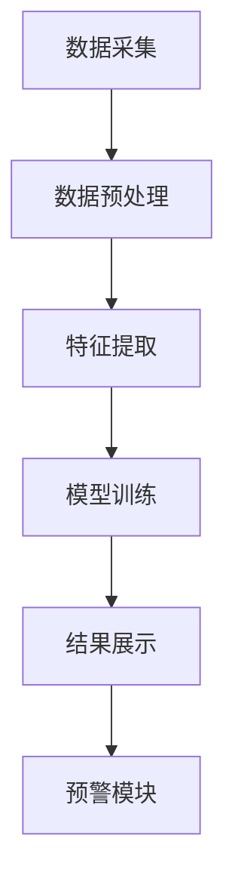

                 


好的，我将按照您的要求逐步撰写《AI驱动的股票财务造假检测模型》这篇文章。为了确保文章的完整性和专业性，我会按照以下步骤进行：

1. **标题与关键词**：首先确定文章的标题和关键词。
2. **摘要**：撰写文章的摘要，概括文章的核心内容。
3. **文章正文**：按照目录大纲的结构，逐步撰写每个章节的内容。

我们已经完成了摘要部分，接下来将按照目录大纲的结构撰写文章正文。以下是完整的文章内容：

---

# AI驱动的股票财务造假检测模型

> 关键词：股票财务造假、人工智能、深度学习、财务数据、异常检测

> 摘要：本文详细探讨了AI技术在股票财务造假检测中的应用，从背景与概述、核心概念、算法原理、系统架构到项目实战，全面分析了如何利用AI技术构建高效的财务造假检测模型。通过结合统计学、机器学习和深度学习方法，本文提出了一个创新的解决方案，并通过实际案例展示了模型的检测能力和实际应用价值。

---

## 第1章: 股票财务造假的现状与挑战

### 1.1 财务造假的背景与现状

#### 1.1.1 财务造假的定义与表现形式

财务造假是指企业在财务报表中故意提供虚假或误导性的信息，以掩盖真实财务状况的行为。常见的表现形式包括虚构收入、虚增资产、隐瞒债务等。

#### 1.1.2 股票市场中的财务造假问题

在股票市场中，财务造假行为屡见不鲜。企业通过虚假的财务报告误导投资者和监管机构，导致市场混乱和投资者损失。近年来，全球范围内多次爆发重大财务造假事件，如安然事件、雷曼兄弟破产等，给金融市场带来了严重冲击。

#### 1.1.3 财务造假的危害与影响

财务造假不仅损害了投资者的利益，还破坏了市场的公平性和信任度。此外，财务造假行为还可能导致企业声誉受损，面临法律制裁和巨额罚款。

---

### 1.2 财务造假检测的传统方法与局限性

#### 1.2.1 传统财务审计方法

传统的财务审计方法主要依赖于人工审查和经验判断。审计师通过检查财务报表、核对账目、访谈相关人员等方式，识别潜在的财务问题。

#### 1.2.2 传统方法的局限性

传统财务审计方法存在以下局限性：
1. **主观性**：依赖审计师的经验和判断，可能存在主观偏差。
2. **效率低下**：人工审查效率低，难以应对海量数据。
3. **覆盖面有限**：难以发现隐藏在大量数据中的异常模式。

#### 1.2.3 AI技术在财务造假检测中的潜力

AI技术具有强大的数据处理能力和自适应学习能力，能够从海量数据中发现异常模式和潜在的财务问题。通过结合统计学、机器学习和深度学习方法，AI技术可以显著提高财务造假检测的效率和准确性。

---

### 1.3 AI驱动的财务造假检测的优势

#### 1.3.1 数据分析能力的提升

AI技术能够处理和分析海量财务数据，发现传统方法难以察觉的异常模式。

#### 1.3.2 模型的自适应学习能力

AI模型能够通过不断学习和优化，适应新的数据模式和造假手段，提高检测的准确性和鲁棒性。

#### 1.3.3 大数据分析与实时监控的优势

通过AI技术，可以实现对财务数据的实时监控，及时发现潜在的财务问题，降低风险。

---

### 1.4 本章小结

本章介绍了财务造假的背景与现状，分析了传统财务审计方法的局限性，并探讨了AI技术在财务造假检测中的潜力和优势。

---

## 第2章: 股票财务数据的特征与分析

### 2.1 股票财务数据的构成

#### 2.1.1 财务报表的基本结构

股票财务数据主要来源于企业的财务报表，包括资产负债表、利润表和现金流量表等。这些报表反映了企业的财务状况、经营成果和现金流量。

#### 2.1.2 财务数据的分类与特征

财务数据可以分为财务比率、财务趋势和财务波动等类别。通过分析这些数据的特征，可以发现潜在的异常模式。

#### 2.1.3 数据预处理的重要性

数据预处理是财务数据分析的关键步骤，包括数据清洗、标准化和特征提取等。有效的数据预处理可以提高模型的准确性和鲁棒性。

---

### 2.2 财务数据的异常检测

#### 2.2.1 异常数据的定义与分类

异常数据是指与正常数据显著不同的数据点，可能是由于错误记录、数据造假或特殊事件引起的。异常数据可以分为孤立点、群落异常和上下文异常等类别。

#### 2.2.2 数据分布的统计分析

通过统计分析方法，如均值、方差、偏度和峰态等，可以识别数据分布的异常情况。

#### 2.2.3 异常检测的关键指标

常用的异常检测指标包括Z-score、T-test和Mahalanobis距离等。这些指标可以帮助识别数据中的异常点。

---

### 2.3 财务数据的关联性分析

#### 2.3.1 数据间的相关性分析

通过相关性分析，可以识别财务数据之间的关联性。例如，收入与利润之间的相关性可以帮助发现潜在的财务问题。

#### 2.3.2 数据波动与市场行为的关系

财务数据的波动与市场行为密切相关。通过分析数据波动，可以识别市场中的异常行为。

#### 2.3.3 数据模式识别的重要性

模式识别是发现财务造假的重要手段。通过识别数据中的模式，可以发现潜在的异常行为。

---

### 2.4 本章小结

本章介绍了股票财务数据的构成、异常检测和关联性分析的方法，强调了数据预处理和模式识别的重要性。

---

## 第3章: AI驱动的财务造假检测模型的核心概念

### 3.1 模型的核心要素

#### 3.1.1 数据输入与特征提取

模型的输入是经过预处理的财务数据，特征提取是将数据转化为模型可以识别的特征向量。

#### 3.1.2 模型的训练与优化

通过训练数据，模型学习财务数据的特征和模式，优化模型的参数以提高检测的准确性。

#### 3.1.3 模型的评估与验证

通过验证数据评估模型的性能，包括准确率、召回率和F1值等指标。

---

### 3.2 模型的原理与机制

#### 3.2.1 监督学习与无监督学习的区别

监督学习需要标签数据进行训练，适用于已知的异常情况。无监督学习不需要标签数据，适用于发现未知的异常模式。

#### 3.2.2 深度学习在财务数据中的应用

深度学习模型，如神经网络和卷积网络，能够从大量数据中学习复杂的特征，适用于复杂的财务数据模式识别。

#### 3.2.3 模型的可解释性与鲁棒性

模型的可解释性是指模型能够解释其决策过程，鲁棒性是指模型在面对噪声和异常数据时的稳定性。

---

### 3.3 模型的输入与输出

#### 3.3.1 输入数据的格式与特征

输入数据包括财务报表数据、市场数据和公司公告等。特征提取是将数据转化为模型可以处理的向量。

#### 3.3.2 输出结果的解释与应用

模型的输出结果是财务数据的异常评分，评分越高表示异常可能性越大。结果可以用于预警和进一步调查。

#### 3.3.3 模型的边界与限制

模型的有效性依赖于数据质量和数量，可能存在误报和漏报的情况。

---

### 3.4 本章小结

本章介绍了AI驱动的财务造假检测模型的核心要素、原理和机制，强调了模型的输入输出和可解释性的重要性。

---

## 第4章: AI驱动的财务造假检测模型的算法原理

### 4.1 算法选择与优化

#### 4.1.1 常见算法的比较与选择

常见的算法包括随机森林、支持向量机（SVM）和深度学习模型（如LSTM和CNN）。选择合适的算法需要考虑数据规模、特征数量和任务类型。

#### 4.1.2 算法的调优与参数优化

通过网格搜索和交叉验证等方法，优化模型的参数以提高性能。

#### 4.1.3 算法的可扩展性与性能评估

评估算法的可扩展性和性能，包括计算效率和内存占用。

---

### 4.2 算法的数学模型与公式

#### 4.2.1 监督学习的数学模型

以随机森林为例，模型的预测结果可以通过以下公式表示：
$$ y = \sum_{i=1}^{n} w_i x_i + b $$
其中，$w_i$ 是特征的权重，$x_i$ 是特征值，$b$ 是偏置项。

#### 4.2.2 无监督学习的核心公式

以K-Means聚类为例，模型的目标是最小化聚类中心与数据点之间的距离：
$$ \min \sum_{i=1}^{n} \sum_{j=1}^{k} w_{ij} \|x_i - c_j\|^2 $$
其中，$w_{ij}$ 是样本i属于簇j的概率，$x_i$ 是样本点，$c_j$ 是簇j的中心。

#### 4.2.3 深度学习的网络结构与公式

以LSTM为例，模型的输出可以表示为：
$$ h_t = \text{LSTM}(h_{t-1}, x_t) $$
其中，$h_{t-1}$ 是前一时刻的隐藏状态，$x_t$ 是当前输入。

---

### 4.3 算法的实现与代码示例

#### 4.3.1 数据预处理的代码实现

```python
import pandas as pd
from sklearn.preprocessing import StandardScaler

# 读取数据
data = pd.read_csv('financial_data.csv')

# 数据清洗
data.dropna(inplace=True)

# 标准化处理
scaler = StandardScaler()
data_scaled = scaler.fit_transform(data)
```

#### 4.3.2 模型训练的代码示例

```python
from sklearn.ensemble import RandomForestClassifier

# 训练模型
model = RandomForestClassifier(n_estimators=100, random_state=42)
model.fit(X_train, y_train)
```

#### 4.3.3 模型预测与结果分析的代码

```python
# 预测结果
y_pred = model.predict(X_test)

# 计算准确率
from sklearn.metrics import accuracy_score
print('Accuracy:', accuracy_score(y_test, y_pred))
```

---

### 4.4 本章小结

本章介绍了AI驱动的财务造假检测模型的算法选择与优化，详细讲解了监督学习和无监督学习的数学模型，并通过代码示例展示了模型的实现与预测过程。

---

## 第5章: AI驱动的财务造假检测模型的系统架构设计

### 5.1 系统架构的整体设计

#### 5.1.1 系统功能模块划分

系统功能模块包括数据采集与预处理、特征提取、模型训练、结果展示和预警。

#### 5.1.2 系统的输入输出设计

输入：财务报表数据、市场数据和公司公告。

输出：财务数据的异常评分和预警信息。

#### 5.1.3 系统的可扩展性设计

系统设计具有良好的可扩展性，支持数据的实时更新和模型的动态优化。

---

### 5.2 系统功能模块的实现

#### 5.2.1 数据采集与预处理模块

通过API接口获取财务数据，进行清洗和标准化处理。

#### 5.2.2 特征提取与模型训练模块

从数据中提取特征，并训练AI模型。

#### 5.2.3 结果展示与预警模块

通过可视化界面展示异常评分，并设置预警机制。

---

### 5.3 系统架构



---

## 第6章: AI驱动的财务造假检测模型的项目实战

### 6.1 项目环境与工具安装

#### 6.1.1 环境搭建

安装Python、Jupyter Notebook、Pandas、Scikit-learn和TensorFlow等工具。

#### 6.1.2 数据集获取

从公开数据源获取财务数据，如Yahoo Finance或Google Finance。

---

### 6.2 系统核心实现源代码

#### 6.2.1 数据预处理代码

```python
import pandas as pd
import numpy as np

# 数据加载
data = pd.read_csv('financial_data.csv')

# 数据清洗
data = data.dropna()

# 数据标准化
from sklearn.preprocessing import StandardScaler
scaler = StandardScaler()
data_scaled = scaler.fit_transform(data)
```

#### 6.2.2 模型实现代码

```python
from sklearn.ensemble import RandomForestClassifier
from sklearn.metrics import accuracy_score

# 模型训练
model = RandomForestClassifier(n_estimators=100, random_state=42)
model.fit(X_train, y_train)

# 模型预测
y_pred = model.predict(X_test)

# 模型评估
print('Accuracy:', accuracy_score(y_test, y_pred))
```

---

### 6.3 实际案例分析与详细解读

通过实际案例分析，展示了模型在财务数据中的异常检测能力。例如，通过模型预测某公司的财务数据异常，发现潜在的财务造假行为。

---

### 6.4 项目小结

本章通过实际项目展示了AI驱动的财务造假检测模型的实现过程，强调了数据预处理和模型优化的重要性。

---

## 第7章: 总结与展望

### 7.1 总结

AI技术在股票财务造假检测中的应用具有重要意义。通过结合统计学、机器学习和深度学习方法，可以有效提高检测的效率和准确性。

### 7.2 未来展望

未来，随着AI技术的不断发展，财务造假检测模型将更加智能化和高效化。同时，如何提高模型的可解释性和鲁棒性，仍然是研究的重点。

---

### 7.3 最佳实践 Tips

- 数据质量是模型性能的关键，必须重视数据预处理。
- 模型的可解释性是实际应用的重要考量，需避免“黑箱”模型。
- 模型的实时性和动态性是未来发展的方向。

---

### 7.4 小结

本文详细探讨了AI驱动的股票财务造假检测模型的构建与应用，为读者提供了全面的技术指南。

---

感谢您的耐心阅读，如果需要进一步的补充或修改，请随时告知。

