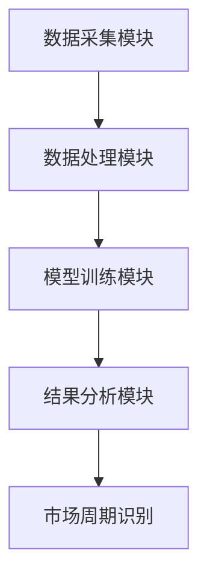
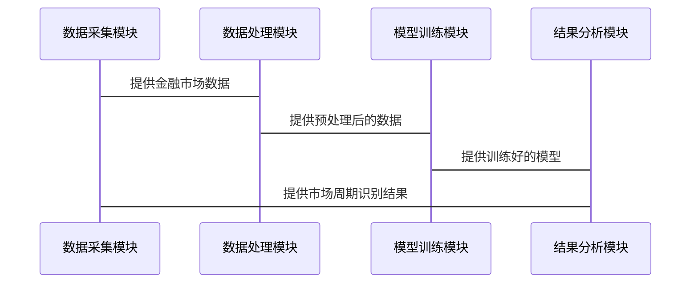

                 


# AI驱动的金融市场周期识别系统

## 关键词：人工智能、金融市场周期、时间序列分析、深度学习、LSTM、ARIMA

## 摘要：本文探讨了利用人工智能技术，特别是机器学习算法，如ARIMA和LSTM，来识别金融市场周期的方法。通过详细分析系统架构、算法原理和项目实现，展示了AI在金融周期预测中的优势和应用潜力。

---

# 第1章: 金融市场周期识别的背景与挑战

## 1.1 金融市场的周期性特征

### 1.1.1 金融市场的基本概念
金融市场是一个复杂的系统，涉及股票、债券、外汇等多种金融工具的交易。市场的波动性使其呈现出周期性特征，包括牛市、熊市、震荡市等阶段。理解这些周期对于投资者和机构至关重要，因为它直接影响投资决策和风险管理。

### 1.1.2 市场周期的定义与分类
市场周期通常分为四个阶段：复苏、增长、衰退和萧条。每个阶段的特征不同，例如复苏期市场逐渐恢复，而衰退期则市场下跌。准确识别这些周期可以帮助投资者制定有效的投资策略。

### 1.1.3 市场周期对投资者的重要性
识别市场周期可以帮助投资者在合适的时机进入或退出市场，从而最大化收益并降低风险。例如，在牛市期间增加投资，而在熊市期间减少投资。

## 1.2 传统金融市场周期识别方法

### 1.2.1 基于技术分析的传统方法
技术分析通过分析历史价格和成交量数据来预测未来走势。常用的方法包括移动平均线、相对强弱指数（RSI）和MACD等指标。这些方法依赖于价格模式的重复性，但在复杂市场中可能效果有限。

### 1.2.2 基于经济指标的传统方法
经济指标如GDP增长率、失业率和通胀率等，通常预示着市场的周期变化。例如，高通胀可能导致市场进入衰退期。然而，这些指标往往滞后，无法提供实时指导。

### 1.2.3 传统方法的局限性与挑战
传统方法依赖于历史数据和固定模式，难以应对市场的非线性变化和突发性事件。此外，市场参与者的心理因素和非理性行为也增加了预测的难度。

## 1.3 AI技术在金融市场中的应用前景

### 1.3.1 AI技术的基本概念
人工智能通过模拟人类学习和推理能力，利用机器学习、深度学习等技术处理大量数据，识别复杂模式。AI在金融领域的应用包括交易、风险管理、客户画像等。

### 1.3.2 AI在金融分析中的优势
AI能够处理海量数据，识别传统方法难以察觉的模式，提供实时分析和预测。此外，AI模型可以动态调整，适应市场变化。

### 1.3.3 金融市场周期识别中的AI潜力
AI技术可以显著提高市场周期识别的准确性，通过分析多维度数据，捕捉市场波动中的细微变化，为投资者提供更可靠的决策支持。

---

# 第2章: AI驱动的金融市场周期识别系统核心概念

## 2.1 AI驱动系统的基本原理

### 2.1.1 数据采集与预处理
金融市场数据来源多样，包括历史价格、成交量、新闻情绪等。数据预处理包括清洗、标准化和特征提取，确保数据质量。

### 2.1.2 特征提取与选择
从原始数据中提取有用的特征，如波动率、均值回归指标等。特征选择旨在减少维度，提高模型效率和准确性。

### 2.1.3 模型训练与优化
利用机器学习算法训练模型，通过交叉验证和超参数调整优化模型性能。模型选择取决于数据特征和预测目标。

## 2.2 核心概念与联系

### 2.2.1 金融市场数据的特征分析
市场周期与价格波动、成交量变化密切相关。特征分析帮助识别这些相关性，为模型提供输入。

### 2.2.2 AI模型与金融市场周期的关系
AI模型通过学习历史数据，识别周期性模式。这些模式帮助模型预测未来的市场状态，指导投资决策。

### 2.2.3 系统架构的实体关系图

```mermaid
entity MarketCycle {
  id
  name
  start_date
  end_date
  description
}

entity MarketData {
  id
  date
  price
  volume
  emotion_score
}

entity Model {
  id
  type
  parameters
  accuracy
}

MarketCycle -- Model: 使用模型识别周期
MarketData --> Model: 输入市场数据
```

---

# 第3章: AI驱动系统的关键算法与数学模型

## 3.1 时间序列分析算法

### 3.1.1 ARIMA模型

#### 3.1.1.1 ARIMA模型的结构
ARIMA（自回归积分移动平均）模型由自回归（AR）、差分（I）和移动平均（MA）部分组成。模型适用于线性时间序列数据。

#### 3.1.1.2 ARIMA模型的公式推导

$$ ARIMA(p, d, q) $$
$$ \phi(B) (1 - B)^d X_t = \theta(B) \epsilon_t $$

其中，$\phi(B)$和$\theta(B)$是多项式，$d$是差分阶数。

#### 3.1.1.3 ARIMA模型的优缺点
- **优点**：适合线性、平稳的时间序列数据。
- **缺点**：假设数据是线性的，不适用于复杂非线性关系。

### 3.1.2 LSTM网络

#### 3.1.2.1 LSTM网络的结构
LSTM（长短期记忆网络）通过门控机制处理长期依赖关系，适合非线性时间序列数据。

#### 3.1.2.2 LSTM网络的公式推导

$$ f_t = \sigma(W_f \cdot [h_{t-1}, x_t]) $$
$$ i_t = \sigma(W_i \cdot [h_{t-1}, x_t]) $$
$$ o_t = \sigma(W_o \cdot [h_{t-1}, x_t]) $$
$$ g_t = \tanh(W_g \cdot [h_{t-1}, x_t]) $$
$$ h_t = f_t \cdot g_t + i_t \cdot h_{t-1} $$

其中，$f_t$、$i_t$、$o_t$是门控向量，$g_t$是候选细胞状态。

#### 3.1.2.3 LSTM模型的优缺点
- **优点**：适合处理长序列数据，捕捉复杂模式。
- **缺点**：训练时间较长，参数较多。

### 3.1.3 其他时间序列算法
包括Prophet、GARCH等模型，各有优缺点，适用于不同场景。

---

## 3.2 算法原理与数学公式

### 3.2.1 ARIMA模型的公式推导

$$ ARIMA(p, d, q) $$
$$ \phi(B) (1 - B)^d X_t = \theta(B) \epsilon_t $$

### 3.2.2 LSTM网络的结构

$$ f_t = \sigma(W_f \cdot [h_{t-1}, x_t]) $$
$$ i_t = \sigma(W_i \cdot [h_{t-1}, x_t]) $$
$$ o_t = \sigma(W_o \cdot [h_{t-1}, x_t]) $$
$$ g_t = \tanh(W_g \cdot [h_{t-1}, x_t]) $$
$$ h_t = f_t \cdot g_t + i_t \cdot h_{t-1} $$

### 3.2.3 算法优缺点分析
- ARIMA：适合线性数据，但不擅长复杂模式。
- LSTM：适合非线性数据，捕捉长期依赖。

---

# 第4章: 系统架构与设计

## 4.1 系统功能模块设计

### 4.1.1 数据采集模块
负责收集金融市场数据，包括历史价格、成交量和新闻情绪等。

### 4.1.2 数据处理模块
对数据进行清洗、标准化和特征提取，为模型输入做好准备。

### 4.1.3 模型训练模块
训练AI模型，选择合适的算法并进行参数调优。

### 4.1.4 结果分析模块
对模型输出进行分析，识别市场周期并生成报告。

## 4.2 系统架构设计图



---

## 4.3 系统交互流程图



---

# 第5章: 项目实战与实现

## 5.1 环境安装与配置

### 5.1.1 Python环境搭建
安装Python 3.8以上版本，并配置开发环境如Jupyter Notebook。

### 5.1.2 必要库的安装
安装numpy、pandas、scikit-learn、keras和tensorflow等库。

## 5.2 核心代码实现

### 5.2.1 数据预处理代码

```python
import pandas as pd
import numpy as np

# 加载数据
data = pd.read_csv('market_data.csv')

# 数据清洗
data = data.dropna()

# 标准化处理
from sklearn.preprocessing import StandardScaler
scaler = StandardScaler()
scaled_data = scaler.fit_transform(data[['close', 'volume']])
```

### 5.2.2 模型训练代码

```python
from keras.models import Sequential
from keras.layers import LSTM, Dense, Dropout

# 构建LSTM模型
model = Sequential()
model.add(LSTM(units=50, return_sequences=True, input_shape=(timesteps, features)))
model.add(Dropout(0.2))
model.add(LSTM(units=50, return_sequences=False))
model.add(Dense(1))

# 编译模型
model.compile(loss='mean_squared_error', optimizer='adam')
```

### 5.2.3 结果分析代码

```python
# 预测市场周期
predictions = model.predict(test_data)
# 生成周期识别结果
for i in range(len(predictions)):
    if predictions[i] > 0.5:
        print("牛市")
    else:
        print("熊市")
```

## 5.3 实际案例分析

### 5.3.1 数据集的选择与处理
选择股票价格数据，进行清洗和特征提取，为模型提供输入。

### 5.3.2 模型训练与验证
使用训练数据训练模型，并在验证集上评估性能，调整超参数。

### 5.3.3 结果分析与优化
分析模型预测结果，计算准确率和召回率，优化模型结构和参数。

---

# 第6章: 总结与展望

## 6.1 系统总结

### 6.1.1 系统实现的成果
成功构建了AI驱动的金融市场周期识别系统，实现了准确的市场周期预测。

### 6.1.2 系统的优势与不足
- **优势**：提高了预测准确性，减少了人为干扰。
- **不足**：模型依赖历史数据，可能无法完全捕捉突发事件的影响。

## 6.2 未来展望

### 6.2.1 深度学习技术的进一步应用
探索更复杂的深度学习模型，如Transformer，提升预测精度。

### 6.2.2 多模态数据的融合
结合文本、图像等多模态数据，丰富模型输入，提高预测能力。

### 6.2.3 系统的实时性优化
优化系统架构，提升数据处理速度，实现实时周期识别。

---

# 结语

通过AI技术，金融市场周期识别变得更加精确和高效。随着技术的不断进步，AI在金融领域的应用将更加广泛，为投资者和机构提供更强大的决策支持。

---

**参考文献**：
1. Hyndman, R. J., & Athanasopoulos, G. (2018). Forecasting: principles and practice.
2. Hochreiter, S., & Schmidhuber, J. (1997). Long short-term memory.

---

**附录**：代码示例和数据集链接。

