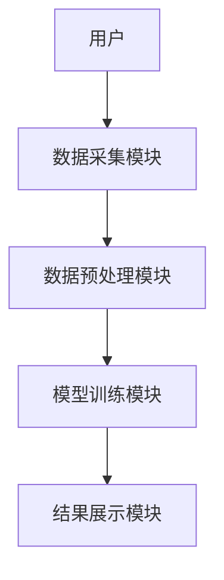
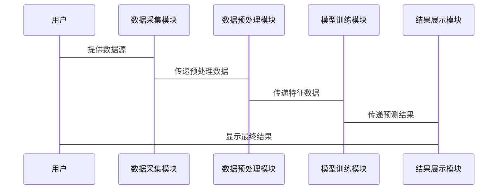

                 


# AI驱动的金融市场泡沫识别系统

## 关键词：AI，金融市场，泡沫识别，自然语言处理，时间序列分析，深度学习，系统架构

## 摘要：  
本文详细探讨了如何利用人工智能技术识别金融市场中的泡沫。通过结合机器学习、深度学习和自然语言处理技术，构建了一个完整的AI驱动的金融市场泡沫识别系统。文章从理论基础、算法实现、系统架构到实际案例进行了全面分析，为读者提供了从概念到实践的详细指导。

---

# 第1章: AI与金融市场的基本概念

## 1.1 AI在金融领域的应用背景

### 1.1.1 金融市场的基本概念  
金融市场是一个以价格、交易量和参与者行为为核心要素的复杂系统。它包括股票、债券、基金、外汇等多种金融工具，参与者包括投资者、机构、经纪商等。金融市场的波动性、不确定性以及非线性关系使得其分析具有极高的挑战性。

### 1.1.2 AI技术在金融领域的应用现状  
AI技术在金融领域的应用已经渗透到多个方面，包括金融数据分析、市场预测、风险评估、交易自动化等。例如，量化交易中广泛使用机器学习模型进行价格预测；自然语言处理技术被用于分析新闻、社交媒体等非结构化数据以预测市场情绪。

### 1.1.3 金融市场泡沫的定义与特征  
金融市场泡沫是指资产价格远高于其内在价值的现象。其特征包括价格的快速上涨、市场参与者情绪的过度乐观、交易量的激增等。泡沫的形成通常与市场情绪、信息不对称、过度杠杆等因素密切相关。

## 1.2 AI驱动的金融市场分析

### 1.2.1 AI在金融数据分析中的作用  
AI能够处理海量的金融数据，包括时间序列数据、文本数据等。通过机器学习算法，可以发现数据中的隐藏模式和关联性，为市场分析提供新的视角。

### 1.2.2 AI在市场预测中的应用  
AI技术可以用于预测股票价格、指数走势等。基于历史数据和市场行为，AI模型能够捕捉到一些人类难以察觉的规律，从而提高预测的准确性。

### 1.2.3 金融市场泡沫识别的挑战与机遇  
泡沫识别是金融市场分析中的一个难题。AI技术的引入为解决这一问题提供了新的可能性，但也面临数据质量、模型选择、计算资源等多方面的挑战。

## 1.3 本章小结

### 1.3.1 核心概念总结  
- AI技术在金融市场的应用日益广泛。
- 金融市场泡沫的定义和特征是理解后续内容的基础。

### 1.3.2 问题背景与目标明确  
- 泡沫识别的目的是为了提前预警市场风险，帮助投资者做出更明智的决策。

### 1.3.3 本书内容框架概述  
- 本书将从理论、算法、系统架构到实际案例全面探讨AI驱动的金融市场泡沫识别系统。

---

# 第2章: AI驱动的金融市场分析基础

## 2.1 金融市场数据的特征与分类

### 2.1.1 金融市场数据的分类  
- **结构化数据**：如股票价格、交易量等。
- **非结构化数据**：如新闻、社交媒体帖子等。

### 2.1.2 数据的时间序列特性  
时间序列数据是金融市场分析的核心，其特点是依赖于时间，具有趋势、季节性、周期性等特征。

### 2.1.3 数据的波动性与相关性  
金融市场的数据通常具有高度的波动性和相关性，不同资产之间可能存在复杂的关联关系。

## 2.2 AI在金融市场分析中的核心算法

### 2.2.1 机器学习算法简介  
- **线性回归**：用于预测资产价格。
- **支持向量机（SVM）**：用于分类任务，如判断市场是否处于泡沫状态。

### 2.2.2 深度学习算法简介  
- **LSTM（长短期记忆网络）**：适用于时间序列数据的预测。
- **Transformer**：用于处理长文本数据，如新闻和社交媒体。

### 2.2.3 自然语言处理在金融文本分析中的应用  
- **词嵌入（Word2Vec、GloVe）**：将文本转化为向量表示。
- **情感分析**：分析市场情绪，预测价格走势。

## 2.3 金融市场泡沫识别的理论基础

### 2.3.1 泡沫的定义与识别标准  
- 泡沫通常伴随着价格与价值的严重偏离，市场参与者情绪极度乐观。

### 2.3.2 市场参与者行为分析  
- 投资者行为、交易量变化、杠杆率等都是判断市场是否处于泡沫的重要指标。

### 2.3.3 市场情绪与价格波动的关系  
市场情绪可以通过新闻、社交媒体等非结构化数据进行分析，从而预测价格波动。

## 2.4 本章小结

### 2.4.1 数据特征与算法选择  
- 不同类型的数据需要选择不同的算法。

### 2.4.2 泡沫识别的理论基础  
- 泡沫识别需要结合市场情绪、参与者行为等多方面因素。

### 2.4.3 下一章内容预告  
- 下一章将详细介绍数据的收集与预处理方法。

---

# 第3章: AI驱动的金融市场数据分析

## 3.1 数据收集与预处理

### 3.1.1 数据来源与获取方法  
- 数据来源包括股票交易所、新闻网站、社交媒体等。
- 数据获取方法包括API接口、网络爬虫等。

### 3.1.2 数据清洗与标准化  
- 数据清洗：处理缺失值、异常值。
- 数据标准化：将数据转换为统一格式，便于后续分析。

### 3.1.3 时间序列数据的特征提取  
- 提取均值、方差、自相关性等特征。

## 3.2 数据分析与可视化

### 3.2.1 数据可视化的基本方法  
- 使用Matplotlib、Seaborn等工具绘制价格走势、交易量分布等图表。

### 3.2.2 时间序列数据的可视化分析  
- 通过绘制时间序列图，观察数据的趋势、周期性等特征。

### 3.2.3 市场情绪数据的可视化  
- 使用词云、情感趋势图等方式展示市场情绪的变化。

## 3.3 数据驱动的市场分析模型

### 3.3.1 传统统计模型  
- 如ARIMA模型，用于时间序列预测。

### 3.3.2 机器学习模型  
- 如随机森林、梯度提升树（XGBoost）等，用于分类和回归任务。

### 3.3.3 深度学习模型  
- 如LSTM网络，适用于复杂的时间序列预测任务。

## 3.4 本章小结

### 3.4.1 数据分析的关键步骤  
- 数据清洗、特征提取、模型选择是数据分析的核心步骤。

### 3.4.2 不同模型的适用场景  
- 根据数据类型和任务需求选择合适的模型。

### 3.4.3 数据驱动的市场分析框架  
- 综合运用多种数据和模型，构建全面的市场分析框架。

---

# 第4章: AI驱动的金融市场泡沫识别算法

## 4.1 泡沫识别的核心算法

### 4.1.1 基于时间序列的异常检测  
- 使用LSTM网络检测价格的异常波动。

### 4.1.2 基于NLP的市场情绪分析  
- 使用情感分析模型预测市场情绪的变化。

### 4.1.3 基于深度学习的市场预测  
- 使用Transformer模型捕捉长文本中的市场信号。

## 4.2 算法原理与实现

### 4.2.1 时间序列分析的数学模型  
- **ARIMA模型**：$y_t = \alpha + \beta y_{t-1} + \epsilon_t$
- **LSTM网络**：通过门控机制捕捉长期依赖关系。

### 4.2.2 情感分析的NLP算法  
- 使用预训练的词嵌入模型（如GloVe）提取文本特征。
- 使用朴素贝叶斯或深度学习模型进行分类。

### 4.2.3 深度学习模型的训练与优化  
- 使用交叉验证选择最优超参数。
- 通过早停法防止过拟合。

## 4.3 算法实现的代码示例

### 4.3.1 时间序列分析的Python代码  
```python
from keras.layers import LSTM, Dense
from keras.models import Sequential

model = Sequential()
model.add(LSTM(50, input_shape=(timesteps, features)))
model.add(Dense(1))
model.compile(loss='mean_squared_error', optimizer='adam')
```

### 4.3.2 情感分析的Python代码  
```python
from transformers import pipeline

classifier = pipeline("text-classification", model="bert-base-cased")
result = classifier("Market sentiment is bullish")
```

## 4.4 本章小结

### 4.4.1 算法原理总结  
- 时间序列分析和情感分析是泡沫识别的两大核心算法。

### 4.4.2 算法实现的关键步骤  
- 数据预处理、模型选择、超参数调优是算法实现的关键。

### 4.4.3 下一章内容预告  
- 下一章将详细介绍系统的架构设计。

---

# 第5章: 系统架构设计

## 5.1 系统功能设计

### 5.1.1 系统功能模块  
- 数据采集模块、数据分析模块、模型训练模块、结果展示模块。

### 5.1.2 系统功能流程  
- 数据采集→数据预处理→模型训练→结果展示。

## 5.2 系统架构设计

### 5.2.1 系统架构图  


### 5.2.2 模块之间的交互关系  
- 用户通过数据采集模块输入数据，经过预处理后，模型训练模块生成预测结果，最后通过结果展示模块呈现给用户。

## 5.3 系统接口设计

### 5.3.1 数据接口  
- API接口用于数据的输入输出。

### 5.3.2 模型接口  
- 模型服务接口用于接收数据并返回预测结果。

## 5.4 系统交互设计

### 5.4.1 交互流程图  


## 5.5 本章小结

### 5.5.1 系统架构设计的重要性  
- 好的架构设计能够提高系统的可扩展性和可维护性。

### 5.5.2 系统功能与模块划分  
- 每个模块都有明确的功能划分，确保系统运行高效。

### 5.5.3 系统交互流程的清晰性  
- 通过流程图展示模块之间的交互关系，使系统设计更加直观。

---

# 第6章: 项目实战

## 6.1 环境搭建

### 6.1.1 安装必要的库  
- 使用pip安装numpy、pandas、tensorflow、transformers等库。

### 6.1.2 环境配置  
- 设置GPU加速（如NVIDIA CUDA Toolkit）以提高计算效率。

## 6.2 系统核心实现

### 6.2.1 数据采集模块  
- 使用网络爬虫采集股票价格数据和社交媒体数据。

### 6.2.2 数据分析模块  
- 使用Pandas进行数据清洗和特征提取。

### 6.2.3 模型训练模块  
- 使用Keras或PyTorch训练LSTM和情感分析模型。

### 6.2.4 结果展示模块  
- 使用Dash或Plotly可视化预测结果。

## 6.3 代码实现与解读

### 6.3.1 数据采集代码  
```python
import requests
from bs4 import BeautifulSoup

def fetch_stock_data(ticker):
    url = f"https://finance.yahoo.com/quote/{ticker}"
    response = requests.get(url)
    soup = BeautifulSoup(response.text, 'html.parser')
    price = soup.find('div', {'class': 'quote слип'})
    return float(price.text)
```

### 6.3.2 模型训练代码  
```python
from tensorflow.keras.models import Sequential
from tensorflow.keras.layers import LSTM, Dense

model = Sequential()
model.add(LSTM(50, input_shape=(timesteps, features)))
model.add(Dense(1))
model.compile(loss='mean_squared_error', optimizer='adam')
model.fit(X_train, y_train, epochs=50, batch_size=32)
```

## 6.4 实际案例分析

### 6.4.1 数据分析结果  
- 通过模型预测，识别某段时间内市场的异常波动。

### 6.4.2 模型预测结果  
- 预测结果显示市场存在泡沫的可能性，并给出具体的预警信号。

## 6.5 本章小结

### 6.5.1 项目实现的关键点  
- 数据采集、模型训练和结果展示是项目实现的核心。

### 6.5.2 实战案例的价值  
- 通过实际案例验证系统的有效性和实用性。

### 6.5.3 项目扩展的方向  
- 可以进一步优化模型、增加更多的数据源或功能模块。

---

# 第7章: 总结与展望

## 7.1 项目总结

### 7.1.1 核心成果  
- 成功构建了一个AI驱动的金融市场泡沫识别系统。

### 7.1.2 技术总结  
- 综合运用了时间序列分析、自然语言处理和深度学习技术。

## 7.2 未来展望

### 7.2.1 技术改进方向  
- 引入更先进的模型（如Transformer）提高预测精度。
- 增加多模态数据（如图像数据）进行综合分析。

### 7.2.2 应用场景拓展  
- 将系统应用于更多金融产品，如加密货币、衍生品等。

## 7.3 注意事项

### 7.3.1 数据质量的重要性  
- 数据的准确性和完整性对模型性能影响重大。

### 7.3.2 模型的可解释性  
- 在实际应用中，模型的可解释性是用户信任的重要因素。

## 7.4 拓展阅读

### 7.4.1 推荐书籍  
- 《Python机器学习实战》
- 《深度学习》

### 7.4.2 推荐博客与资源  
- TensorFlow和PyTorch官方文档
- Kaggle上的金融数据分析案例

## 7.5 本章小结

### 7.5.1 项目总结  
- 通过本项目，我们掌握了AI驱动的金融市场分析的核心技术。

### 7.5.2 未来展望  
- AI技术在金融领域的应用将更加广泛和深入。

### 7.5.3 读者思考  
- 鼓励读者结合实际需求，探索更多创新的应用场景。

---

# 结语

通过本文的详细讲解，读者可以全面了解AI在金融市场泡沫识别中的应用。从理论到实践，从算法到系统设计，本文为读者提供了一个完整的解决方案。希望本文能够为相关领域的研究和实践者提供有价值的参考。

