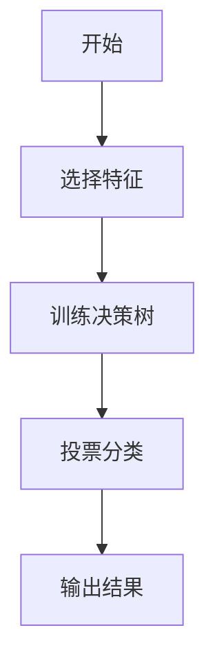
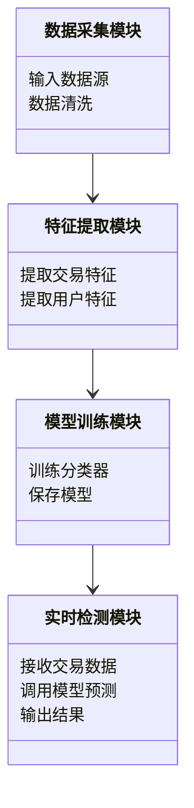

                 


# AI驱动的金融欺诈检测系统

## 关键词：人工智能，金融欺诈，机器学习，异常检测，深度学习

## 摘要：  
随着金融交易的日益复杂化和全球化，金融欺诈问题日益严重，传统的欺诈检测方法已难以应对新型的欺诈手段。本文将探讨如何利用人工智能（AI）技术，特别是机器学习和深度学习算法，构建高效、智能的金融欺诈检测系统。通过分析欺诈检测的核心概念、算法原理、系统架构及实际案例，本文将深入探讨AI在金融欺诈检测中的应用及其优势，为读者提供从理论到实践的全面解读。

---

# 第一部分: AI驱动的金融欺诈检测系统概述

## 第1章: 金融欺诈检测的背景与挑战

### 1.1 金融欺诈的现状与问题
#### 1.1.1 传统金融欺诈的常见形式  
金融欺诈的形式多种多样，包括信用卡欺诈、交易欺诈、身份盗窃、洗钱等。传统的欺诈检测方法主要依赖规则引擎和基于历史数据的黑名单匹配，这种方式在处理复杂和隐蔽的欺诈行为时显得力不从心。

#### 1.1.2 金融欺诈带来的损失与风险  
金融欺诈不仅给金融机构造成直接经济损失，还可能导致客户信任度下降，甚至引发系统性金融风险。据统计，全球每年因金融欺诈造成的损失高达数千亿美元。

#### 1.1.3 传统欺诈检测方法的局限性  
传统的欺诈检测方法依赖于规则和经验，难以应对新型的欺诈手段。此外，规则引擎的维护成本高，且难以实时处理海量数据。

### 1.2 AI在金融欺诈检测中的作用  
AI技术的引入为金融欺诈检测带来了革命性的变化。通过机器学习算法，系统能够自动识别异常交易模式，实时检测潜在的欺诈行为。

#### 1.2.1 AI技术如何提升欺诈检测效率  
AI能够从海量数据中提取特征，发现隐藏的模式，从而实现对欺诈行为的早期预警。

#### 1.2.2 基于AI的欺诈检测的优势  
AI系统能够快速处理大量数据，且能够根据新的数据不断优化模型，适应新的欺诈手段。

#### 1.2.3 金融行业对AI驱动检测的需求  
随着金融交易的复杂化，金融机构迫切需要一种高效、智能的欺诈检测方法，而AI技术正是满足这一需求的最佳选择。

---

## 第2章: AI驱动的金融欺诈检测核心概念

### 2.1 金融欺诈检测的关键要素  
金融欺诈检测的核心要素包括交易数据的特征分析、用户行为模式识别和异常检测的核心指标。

#### 2.1.1 交易数据的特征分析  
交易数据的特征包括交易金额、时间、地点、参与方等。通过对这些特征的分析，可以发现异常交易模式。

#### 2.1.2 用户行为模式识别  
用户行为模式识别是通过分析用户的交易历史和行为特征，发现异常行为模式。

#### 2.1.3 异常检测的核心指标  
异常检测的核心指标包括交易金额的波动性、交易频率的突变、地理位置的异常等。

### 2.2 AI算法在欺诈检测中的应用  
AI算法在欺诈检测中的应用主要包括监督学习、无监督学习和半监督学习。

#### 2.2.1 监督学习在欺诈分类中的应用  
监督学习通过标记的欺诈数据进行训练，能够准确分类正常交易和欺诈交易。

#### 2.2.2 无监督学习在异常检测中的优势  
无监督学习无需标记数据，能够发现数据中的潜在异常模式。

#### 2.2.3 半监督学习在数据稀疏场景中的应用  
半监督学习结合了监督学习和无监督学习的优势，适用于数据稀疏的场景。

### 2.3 概念对比与ER实体关系图  
以下是传统检测方法与AI驱动方法的对比表：

| **对比维度** | **传统检测方法** | **AI驱动方法** |
|--------------|------------------|----------------|
| 检测效率     | 低               | 高               |
| 模型更新     | 手动             | 自动             |
| 数据处理能力 | 有限             | 强大             |

以下是欺诈检测系统ER图（Mermaid）：

```mermaid
erDiagram
    customer[客户] {
        id : int
        name : string
        account : string
    }
    transaction[交易] {
        id : int
        amount : float
        time : datetime
        customer_id : int
    }
    fraud_detection[欺诈检测] {
        id : int
        transaction_id : int
        is_fraud : bool
        prediction_time : datetime
    }
    customer -> transaction : 进行
    transaction -> fraud_detection : 检测
```

---

# 第二部分: AI驱动的欺诈检测算法原理

## 第3章: 常见AI算法及其在欺诈检测中的应用

### 3.1 监督学习算法  
监督学习算法是欺诈检测中最常用的算法之一。

#### 3.1.1 随机森林算法  
随机森林是一种基于决策树的集成算法，通过投票机制进行分类。

- **随机森林流程图**（Mermaid）：



- **随机森林的数学模型**：
  - 随机森林通过随机选择特征和样本进行训练，能够有效避免过拟合。
  - 随机森林的投票机制如下：
    $$ \text{预测结果} = \text{多数决策树的预测结果} $$

#### 3.1.2 支持向量机（SVM）的数学模型  
支持向量机通过构建超平面实现分类。

- **SVM的数学模型**：
  $$ \text{目标函数} = \min \frac{1}{2}||\mathbf{w}||^2 + C \sum_{i=1}^n \xi_i $$
  $$ \text{约束条件} = y_i (\mathbf{w} \cdot \mathbf{x_i} + b) \geq 1 - \xi_i $$
  其中，$\mathbf{w}$ 是权重向量，$b$ 是偏置项，$\xi_i$ 是松弛变量。

#### 3.1.3 随机森林与SVM的对比  
随机森林适用于高维数据，而SVM适用于低维数据。

### 3.2 神经网络与深度学习算法  
神经网络和深度学习算法在处理复杂数据时表现优异。

#### 3.2.1 多层感知机（MLP）  
多层感知机是一种简单的神经网络模型。

- **MLP的数学模型**：
  $$ y = \sigma(\mathbf{w} \cdot \mathbf{x} + b) $$
  其中，$\sigma$ 是激活函数，$\mathbf{w}$ 是权重向量，$\mathbf{x}$ 是输入向量，$b$ 是偏置项。

#### 3.2.2 卷积神经网络（CNN）的应用场景  
CNN在图像识别和序列数据处理中表现优异。

---

## 第4章: 欺诈检测系统的架构设计

### 4.1 问题场景介绍  
欺诈检测系统需要处理海量交易数据，实时检测潜在的欺诈行为。

### 4.2 系统功能设计  
系统功能包括数据采集、特征提取、模型训练和实时检测。

- **系统功能设计图**（Mermaid）：



### 4.3 系统架构设计  
系统架构包括前端、后端、数据库和AI模型。

- **系统架构图**（Mermaid）：


### 4.4 系统接口设计  
系统接口包括数据输入接口、模型调用接口和结果返回接口。

### 4.5 系统交互流程图  
系统交互流程图展示了用户与系统之间的交互过程。

---

## 第5章: 项目实战

### 5.1 环境安装  
需要安装Python、机器学习库（如Scikit-learn、Keras）和可视化库（如Matplotlib）。

### 5.2 系统核心实现源代码  
以下是欺诈检测系统的Python代码示例：

```python
import pandas as pd
from sklearn.ensemble import RandomForestClassifier
from sklearn.metrics import accuracy_score

# 数据加载
data = pd.read_csv('transactions.csv')

# 特征提取
features = data[['amount', 'time', 'customer_id']]
labels = data['is_fraud']

# 模型训练
model = RandomForestClassifier()
model.fit(features, labels)

# 模型预测
 predictions = model.predict(features)
 print(f"模型准确率：{accuracy_score(labels, predictions)}")
```

### 5.3 代码应用解读与分析  
代码实现了基于随机森林的欺诈检测系统，能够对交易数据进行分类。

### 5.4 实际案例分析  
通过实际案例分析，验证系统的检测效果。

### 5.5 项目小结  
项目实现了基于AI的欺诈检测系统，验证了AI技术在金融领域的应用价值。

---

## 第6章: 最佳实践与总结

### 6.1 小结  
AI技术在金融欺诈检测中的应用前景广阔，能够显著提升检测效率和准确性。

### 6.2 注意事项  
在实际应用中，需要注意数据隐私保护和模型的实时性要求。

### 6.3 拓展阅读  
建议读者进一步学习深度学习算法和强化学习算法在金融领域的应用。

---

通过以上内容，我们可以看到，AI技术在金融欺诈检测中的应用前景广阔，能够显著提升检测效率和准确性。希望本文能够为读者提供有价值的参考和启发。

