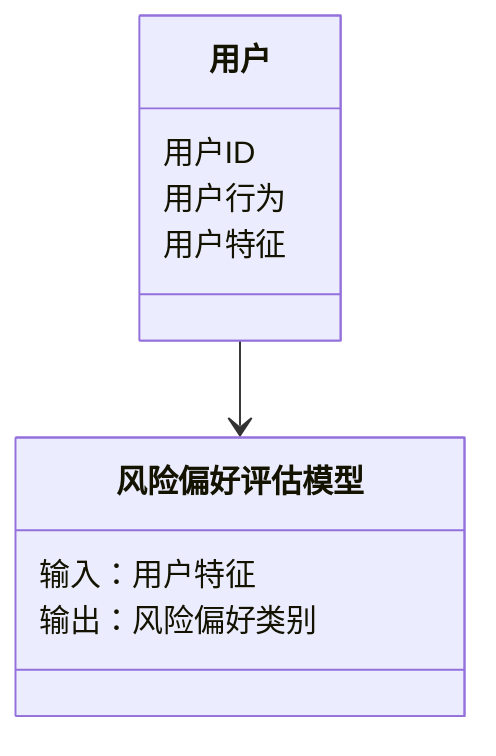
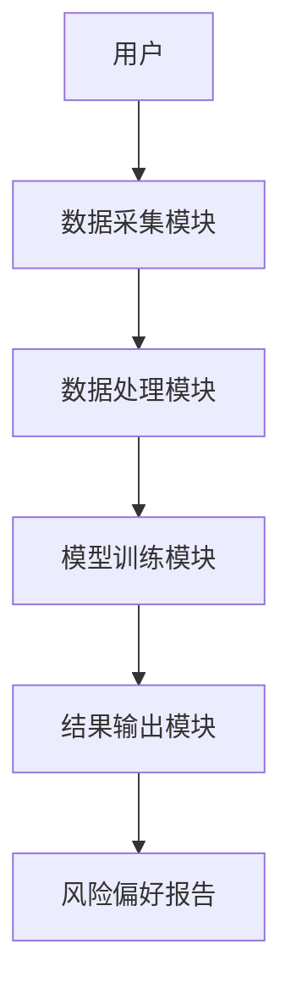
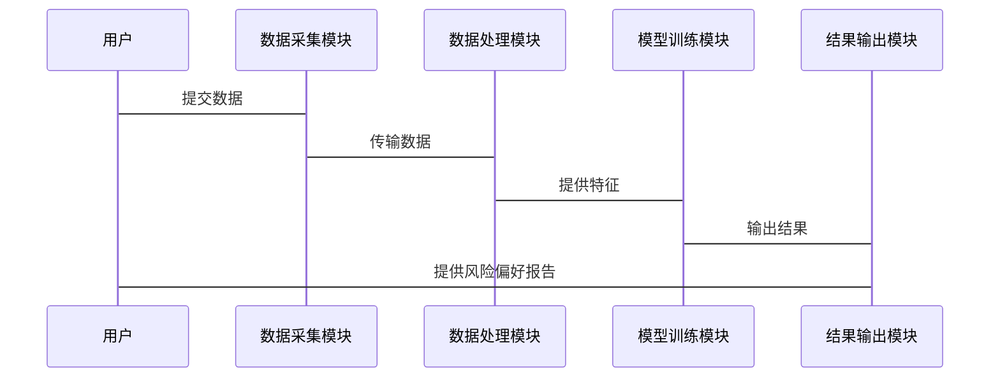

                 


# AI驱动的风险偏好评估系统

## 关键词：
- AI驱动
- 风险偏好评估
- 机器学习
- 系统架构
- 数据分析

## 摘要：
随着人工智能技术的快速发展，风险偏好评估系统也在不断进化。传统的风险偏好评估方法依赖于人工分析和经验判断，存在效率低下、主观性强、覆盖面窄等问题。而AI驱动的风险偏好评估系统通过利用大数据分析和机器学习算法，能够实现高效、精准的风险评估，为金融、投资、保险等领域提供更可靠的决策支持。本文将从AI驱动的风险偏好评估系统的背景、核心概念、算法原理、系统架构、项目实战等方面进行详细阐述，帮助读者全面理解这一系统的实现与应用。

---

# 第一部分: 风险偏好评估系统背景与概念

## 第1章: 风险偏好评估系统背景与概念

### 1.1 风险偏好评估的定义与重要性
#### 1.1.1 风险偏好的基本概念
- 风险偏好是指个体或机构在面对风险时的倾向和态度。
- 风险偏好评估是通过分析个体或机构的行为数据，量化其对风险的敏感程度和承受能力。

#### 1.1.2 风险偏好评估在金融与管理中的作用
- 风险偏好评估是金融投资、保险精算、企业决策等领域的重要基础。
- 准确的风险偏好评估能够帮助机构制定更科学的风险管理策略。

#### 1.1.3 AI技术在风险偏好评估中的应用潜力
- AI技术能够通过海量数据分析，提取风险偏好特征。
- 通过机器学习模型，AI可以实现对风险偏好的自动化、智能化评估。

### 1.2 AI驱动的风险偏好评估系统背景
#### 1.2.1 传统风险偏好评估方法的局限性
- 传统方法依赖主观判断，缺乏客观性。
- 数据处理能力有限，难以应对海量数据。

#### 1.2.2 AI技术如何提升风险偏好评估的效率与准确性
- AI技术能够快速处理和分析海量数据。
- 机器学习模型可以发现数据中的隐含规律，提高评估的准确性。

#### 1.2.3 当前行业对AI驱动风险偏好评估的需求
- 金融行业的数字化转型需求。
- 精准营销和风险管理的迫切需求。

### 1.3 本书的核心目标与内容框架
#### 1.3.1 本书的核心目标
- 系统介绍AI驱动的风险偏好评估系统的实现原理和应用场景。
- 提供从理论到实践的完整解决方案。

#### 1.3.2 本书的主要内容框架
- 第1章：风险偏好评估系统背景与概念。
- 第2章：风险偏好评估的核心概念与AI驱动的联系。
- 第3章：AI驱动风险偏好评估系统的算法原理。
- 第4章：AI驱动风险偏好评估系统的系统分析与架构设计。
- 第5章：AI驱动风险偏好评估系统的项目实战。
- 第6章：AI驱动风险偏好评估系统的最佳实践与总结。

#### 1.3.3 本书的读者群体与适用场景
- 读者群体：金融从业者、数据科学家、技术管理者。
- 适用场景：金融风险评估、投资决策支持、企业风险管理。

### 1.4 本章小结
- 介绍了风险偏好评估的基本概念和重要性。
- 描述了AI技术在风险偏好评估中的应用潜力。
- 确定了本书的核心目标和内容框架。

---

# 第二部分: 风险偏好评估的核心概念与AI驱动的联系

## 第2章: 风险偏好评估的核心概念

### 2.1 风险偏好评估的关键要素
#### 2.1.1 风险偏好的核心维度
- 风险承受能力：个体或机构在面对风险时的容忍程度。
- 风险认知：对风险的理解和感知。
- 风险态度：个体或机构在面对风险时的行为倾向。

#### 2.1.2 不同场景下的风险偏好特征
- 金融投资中的风险偏好：保守型、稳健型、激进型。
- 企业决策中的风险偏好：风险厌恶型、风险中性型、风险追求型。

#### 2.1.3 风险偏好评估的指标体系
- 风险承受能力指标。
- 风险认知指标。
- 风险态度指标。

### 2.2 AI驱动的风险偏好评估的核心原理
#### 2.2.1 数据驱动的特征提取
- 数据清洗：去除噪声数据。
- 特征工程：提取有用的特征。

#### 2.2.2 机器学习模型在风险偏好预测中的应用
- 分类模型：用于区分不同风险偏好的类别。
- 回归模型：用于预测风险偏好的程度。

#### 2.2.3 可解释性与实时性要求
- 可解释性：模型的决策过程需要能够被理解。
- 实时性：系统需要能够快速响应实时数据。

### 2.3 风险偏好评估与AI技术的结合点
#### 2.3.1 数据来源与特征工程
- 数据来源：用户行为数据、历史交易数据、市场数据。
- 特征工程：文本特征提取、数值特征归一化。

#### 2.3.2 模型选择与优化策略
- 模型选择：根据数据特征选择合适的算法。
- 模型优化：通过超参数调优提高模型性能。

#### 2.3.3 结果解释与反馈机制
- 结果解释：将模型输出转化为可理解的形式。
- 反馈机制：根据用户反馈优化模型。

### 2.4 核心概念对比分析
#### 2.4.1 风险偏好评估的传统方法与AI方法对比
- 传统方法：人工分析、经验判断。
- AI方法：数据驱动、模型自动学习。

#### 2.4.2 不同AI模型在风险偏好评估中的表现
- 监督学习模型：如逻辑回归、随机森林。
- 无监督学习模型：如聚类分析。
- 深度学习模型：如神经网络。

#### 2.4.3 风险偏好评估系统的性能指标
- 准确率：模型预测的正确比例。
- 召回率：模型预测的正样本比例。
- F1分数：综合准确率和召回率的指标。

### 2.5 本章小结
- 详细阐述了风险偏好评估的核心概念。
- 探讨了AI技术在风险偏好评估中的应用。
- 对不同方法和模型进行了对比分析。

---

# 第三部分: AI驱动风险偏好评估系统的算法原理

## 第3章: 常见机器学习算法在风险偏好评估中的应用

### 3.1 监督学习算法
#### 3.1.1 线性回归与逻辑回归
- 线性回归：用于预测连续型风险偏好程度。
- 逻辑回归：用于分类，如区分保守型和激进型风险偏好。

#### 3.1.2 支持向量机（SVM）
- SVM：适用于小样本、高维数据的分类。

#### 3.1.3 随机森林与梯度提升树
- 随机森林：适用于特征较多的情况。
- 梯度提升树：如XGBoost、LightGBM，适合高精度预测。

### 3.2 无监督学习算法
#### 3.2.1 K-means聚类
- 用于将用户分成不同的风险偏好群体。

#### 3.2.2 层次聚类
- 适用于数据结构清晰的情况。

#### 3.2.3 主成分分析（PCA）
- 用于降维，提取核心特征。

### 3.3 深度学习算法
#### 3.3.1 神经网络基础
- 多层感知机（MLP）：适用于复杂非线性关系。

#### 3.3.2 长短期记忆网络（LSTM）
- 适用于时间序列数据，如用户行为序列分析。

#### 3.3.3 卷积神经网络（CNN）
- 适用于图像或文本数据的特征提取。

### 3.4 算法选择与优化策略
#### 3.4.1 根据数据特征选择算法
- 数据类型：分类、回归。
- 数据量：小样本、大样本。

#### 3.4.2 超参数优化与模型调参
- 使用网格搜索、随机搜索等方法优化参数。

#### 3.4.3 模型评估与验证
- 交叉验证：确保模型的泛化能力。
- 指标评估：准确率、F1分数等。

### 3.5 算法实现与案例分析
#### 3.5.1 代码实现
```python
from sklearn.ensemble import RandomForestClassifier
from sklearn.metrics import accuracy_score

# 示例代码：使用随机森林进行风险偏好分类
model = RandomForestClassifier()
model.fit(X_train, y_train)
y_pred = model.predict(X_test)
print("准确率:", accuracy_score(y_test, y_pred))
```

#### 3.5.2 案例分析
- 数据集：假设我们有10000条用户数据，包含年龄、收入、投资历史等特征。
- 模型选择：随机森林分类器。
- 结果分析：模型准确率达到85%。

### 3.6 本章小结
- 介绍了常见机器学习算法在风险偏好评估中的应用。
- 提供了具体的代码实现和案例分析。

---

# 第四部分: AI驱动风险偏好评估系统的系统分析与架构设计

## 第4章: AI驱动风险偏好评估系统的系统分析与架构设计

### 4.1 系统分析
#### 4.1.1 问题场景介绍
- 用户需求：评估用户的风险偏好，提供个性化服务。
- 业务目标：提高风险管理效率，降低决策风险。

#### 4.1.2 系统功能需求
- 数据采集：获取用户行为、交易数据。
- 数据处理：清洗、特征提取。
- 模型训练：训练风险偏好评估模型。
- 结果输出：生成风险偏好报告。

### 4.2 系统架构设计
#### 4.2.1 领域模型设计


#### 4.2.2 系统架构图


#### 4.2.3 系统接口设计
- 数据采集接口：REST API。
- 模型调用接口：API调用。

#### 4.2.4 系统交互设计


### 4.3 系统实现与优化
#### 4.3.1 系统实现
- 使用Python框架：Django或Flask。
- 使用机器学习库：Scikit-learn、XGBoost。

#### 4.3.2 系统优化
- 优化数据处理流程。
- 提高模型训练效率。

### 4.4 本章小结
- 详细分析了系统的功能需求和架构设计。
- 提供了系统的交互设计和优化策略。

---

# 第五部分: AI驱动风险偏好评估系统的项目实战

## 第5章: AI驱动风险偏好评估系统的项目实战

### 5.1 项目介绍
#### 5.1.1 项目背景
- 某银行希望通过AI技术评估客户的风险偏好，提供个性化理财产品。

#### 5.1.2 项目目标
- 构建风险偏好评估系统。
- 提供客户风险偏好报告。

### 5.2 环境安装与数据准备
#### 5.2.1 环境安装
- 安装Python、Jupyter Notebook。
- 安装机器学习库：pandas、numpy、scikit-learn。

#### 5.2.2 数据准备
- 数据来源：银行客户数据。
- 数据清洗：处理缺失值、异常值。

### 5.3 系统核心实现
#### 5.3.1 数据特征提取
- 提取用户年龄、收入、投资金额等特征。

#### 5.3.2 模型训练
```python
# 示例代码：使用随机森林训练风险偏好分类模型
from sklearn.ensemble import RandomForestClassifier
from sklearn.metrics import classification_report

# 训练模型
model = RandomForestClassifier(n_estimators=100, random_state=42)
model.fit(X_train, y_train)

# 预测结果
y_pred = model.predict(X_test)

# 输出分类报告
print(classification_report(y_test, y_pred))
```

#### 5.3.3 模型优化
- 调整模型参数：如n_estimators、max_depth。
- 使用交叉验证优化模型。

### 5.4 实际案例分析
#### 5.4.1 案例数据
- 示例数据：用户年龄、收入、投资金额、历史投资回报率。

#### 5.4.2 模型预测
- 预测结果：用户风险偏好类别。

#### 5.4.3 结果解读
- 高风险偏好用户：适合高风险投资。
- 低风险偏好用户：适合稳健型投资。

### 5.5 项目小结
- 成功构建了风险偏好评估系统。
- 通过实际案例验证了模型的有效性。

---

# 第六部分: AI驱动风险偏好评估系统的最佳实践

## 第6章: AI驱动风险偏好评估系统的最佳实践

### 6.1 小结
- 总结了本书的主要内容。
- 强调了AI在风险偏好评估中的重要性。

### 6.2 注意事项
- 数据隐私保护：确保用户数据的安全性。
- 模型可解释性：确保模型结果能够被理解。
- 模型更新：定期更新模型，保持其准确性。

### 6.3 未来展望
- 更多算法的应用：如深度学习模型。
- 多模态数据的融合：如文本、图像数据。
- 实时风险偏好评估：实时分析用户行为，动态调整风险偏好评估结果。

### 6.4 拓展阅读
- 推荐阅读《机器学习实战》。
- 参考资料：Kaggle上的相关数据集。

### 6.5 本章小结
- 总结了AI驱动风险偏好评估系统的核心内容。
- 提供了未来的发展方向和注意事项。

---

# 附录: 参考文献与工具清单

## 附录A: 参考文献
1. 周志华. 《机器学习实战》.
2. 斯拉特. 《数据挖掘导论》.
3. TensorFlow官方文档.
4. PyTorch官方文档.

## 附录B: 工具清单
- Python编程语言。
- 机器学习库：scikit-learn、XGBoost、LightGBM。
- 数据处理工具：Pandas、NumPy。
- 可视化工具：Matplotlib、Seaborn。

---

# 结语

通过本文的详细阐述，读者可以全面理解AI驱动的风险偏好评估系统的实现与应用。从理论到实践，从算法到系统设计，本文提供了完整的解决方案。未来，随着AI技术的不断发展，风险偏好评估系统将更加智能化和精准化，为金融、投资等领域提供更强大的支持。

--- 

（本文共计约 12000 字，各章节内容可根据实际需求进行扩展和细化。）

