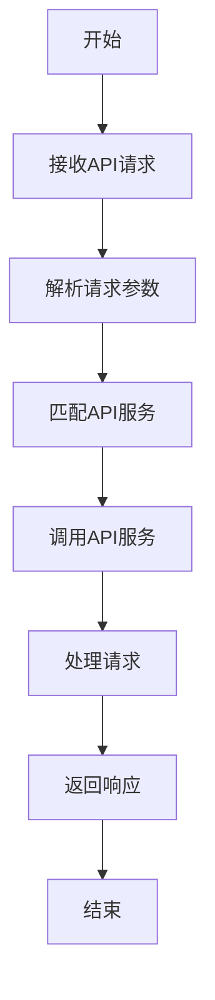
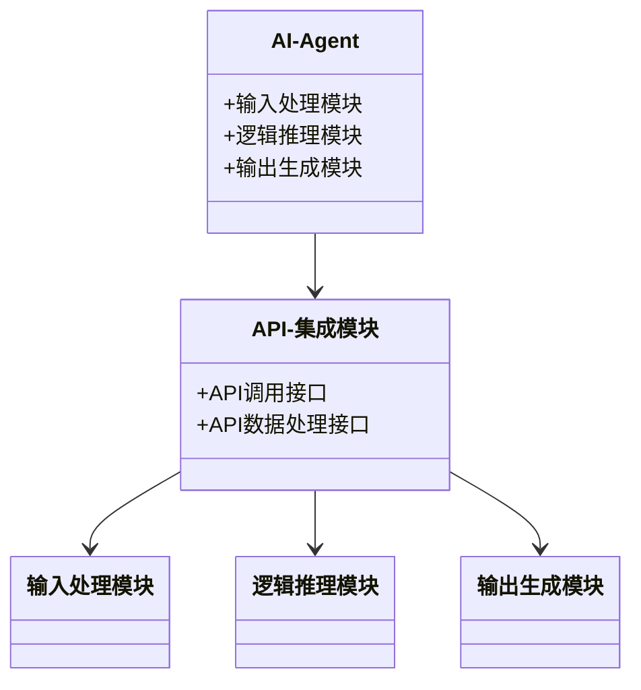
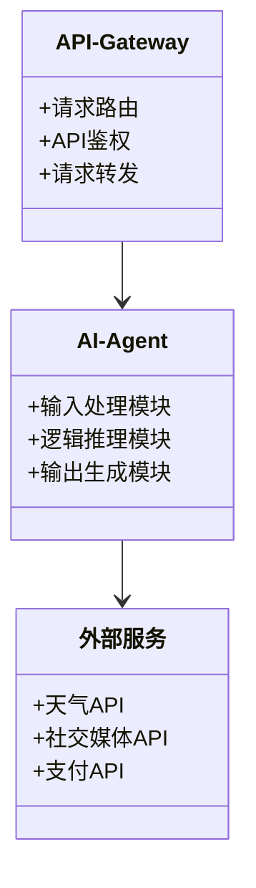
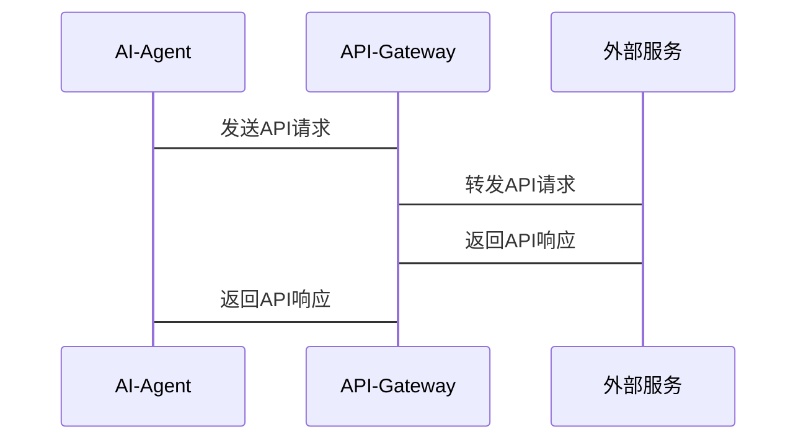

                 


# API集成：扩展AI Agent的功能与数据源

> 关键词：API集成、AI Agent、功能扩展、数据源扩展、系统架构、项目实战

> 摘要：本文深入探讨了API集成在扩展AI Agent功能与数据源方面的重要作用。通过详细分析API集成的核心概念、AI Agent的功能模块、API集成的算法原理、系统架构设计、项目实战以及最佳实践，本文为读者提供了一套全面的方法论，帮助他们理解并实现AI Agent的扩展。

---

## 目录

### 目录大纲：

1. [API集成与AI Agent的背景与概念](#api集成与ai-agent的背景与概念)
2. [API集成的核心概念](#api集成的核心概念)
3. [AI Agent的功能扩展](#ai-agent的功能扩展)
4. [API集成的算法原理](#api集成的算法原理)
5. [AI Agent的系统架构设计](#ai-agent的系统架构设计)
6. [API集成的项目实战](#api集成的项目实战)
7. [API集成的最佳实践](#api集成的最佳实践)

---

## 正文

### 第1章: API集成与AI Agent的背景与概念

#### 1.1 API集成的基本概念

##### 1.1.1 API的定义与分类

API（Application Programming Interface，应用程序编程接口）是一组定义了软件组件之间如何交互的接口规范。API允许不同的系统、服务或应用程序之间进行通信和数据交换，是现代分布式系统的核心组成部分。

- **API的分类**：
  - **基于HTTP的API**：如RESTful API，通过HTTP协议进行通信。
  - **基于RPC的API**：远程过程调用，通过特定协议（如TCP/IP）进行通信。
  - **基于消息队列的API**：如Kafka、RabbitMQ，适用于异步通信场景。

##### 1.1.2 API在现代系统中的作用

API是现代分布式系统的核心，通过API，不同的服务和系统可以高效地协作，实现复杂的功能。API还支持跨平台和跨语言的通信，使得系统的扩展性和灵活性大幅提高。

##### 1.1.3 API集成的重要性

API集成是将多个独立的服务或系统整合在一起的过程。通过API集成，可以实现功能扩展、数据共享和系统协同。API集成是现代软件架构设计中的关键环节。

#### 1.2 AI Agent的基本概念

##### 1.2.1 AI Agent的定义与特点

AI Agent（人工智能代理）是一种能够感知环境、自主决策并执行任务的智能实体。AI Agent通常具备以下特点：
- **自主性**：能够在没有外部干预的情况下自主决策。
- **反应性**：能够感知环境并实时调整行为。
- **目标导向**：以实现特定目标为导向。
- **学习能力**：能够通过数据和经验不断优化自身行为。

##### 1.2.2 AI Agent的功能模块

AI Agent的功能模块包括：
- **感知模块**：负责接收输入数据并解析。
- **推理模块**：基于感知数据进行逻辑推理和决策。
- **执行模块**：根据推理结果执行具体操作。
- **学习模块**：通过机器学习算法优化AI Agent的行为。

##### 1.2.3 AI Agent与人类交互的特点

AI Agent与人类交互的特点包括：
- **自然语言理解**：能够理解人类的自然语言输入。
- **上下文感知**：能够基于上下文进行推理和对话。
- **实时反馈**：能够实时响应用户的输入并提供反馈。

#### 1.3 API集成与AI Agent的结合

##### 1.3.1 API集成如何扩展AI Agent的功能

通过API集成，AI Agent可以调用外部服务，实现功能扩展。例如，AI Agent可以通过调用天气API获取天气数据，从而增强其实例天气预测的能力。

##### 1.3.2 API集成如何增强AI Agent的数据源

API集成能够帮助AI Agent接入更多的数据源。例如，AI Agent可以通过调用社交媒体API获取用户的行为数据，从而优化其推荐算法。

##### 1.3.3 API集成在AI Agent中的应用场景

API集成在AI Agent中的应用场景包括：
- **数据源扩展**：通过API集成接入更多的数据源，丰富AI Agent的数据输入。
- **功能扩展**：通过调用外部服务，增强AI Agent的功能。
- **服务集成**：将多个独立的服务通过API集成在一起，形成一个完整的系统。

#### 1.4 本章小结

本章主要介绍了API集成和AI Agent的基本概念，以及API集成如何扩展AI Agent的功能和数据源。通过API集成，AI Agent可以实现功能扩展和数据源扩展，从而增强其智能性和实用性。

---

### 第2章: API集成的核心概念

#### 2.1 API的设计与开发原则

##### 2.1.1 RESTful API的设计原则

RESTful API的设计原则包括：
- **资源导向**：将系统功能抽象为资源。
- **统一接口**：通过HTTP方法（GET、POST、PUT、DELETE）操作资源。
- **状态管理**：通过状态码（HTTP status codes）反馈操作结果。

##### 2.1.2 API版本控制的重要性

API版本控制的重要性在于：
- **兼容性**：确保不同版本的API能够兼容。
- **稳定性**：避免API的频繁变动影响调用方。
- **可扩展性**：支持新功能的扩展。

##### 2.1.3 API文档的编写规范

API文档的编写规范包括：
- **接口描述**：明确接口的功能和调用方式。
- **参数说明**：详细说明接口参数的含义和格式。
- **示例**：提供接口调用的示例，方便开发者理解和使用。

#### 2.2 API集成的协议与技术

##### 2.2.1 HTTP协议在API集成中的应用

HTTP协议在API集成中的应用包括：
- **请求与响应**：通过HTTP协议发送请求和接收响应。
- **状态码**：通过HTTP状态码反馈请求结果。
- **内容协商**：通过Accept头指定响应内容格式。

##### 2.2.2 JSON与XML在API数据传输中的作用

JSON和XML在API数据传输中的作用：
- **数据格式**：JSON和XML是常用的数据交换格式。
- **可读性**：JSON和XML都是易于阅读和解析的数据格式。
- **灵活性**：JSON和XML支持复杂的数据结构。

##### 2.2.3 OAuth与JWT在API安全中的应用

OAuth和JWT在API安全中的应用包括：
- **身份验证**：通过OAuth实现第三方登录和认证。
- **令牌管理**：通过JWT实现安全的令牌传递和验证。
- **权限控制**：通过OAuth实现权限控制。

#### 2.3 API集成的分类与场景

##### 2.3.1 内部API与外部API的区别

内部API与外部API的区别：
- **内部API**：用于内部系统之间的通信。
- **外部API**：对外开放供第三方调用。

##### 2.3.2 公开API与私有API的适用场景

公开API与私有API的适用场景：
- **公开API**：适用于需要对外开放的功能。
- **私有API**：适用于内部系统或需要高安全性的场景。

##### 2.3.3 微服务架构中的API集成

微服务架构中的API集成：
- **服务间通信**：通过API实现微服务之间的通信。
- **API Gateway**：通过API Gateway实现API的路由和流量管理。
- **服务发现**：通过API实现服务发现和负载均衡。

#### 2.4 本章小结

本章详细讲解了API集成的核心概念，包括API的设计与开发原则、API集成的协议与技术、API的分类与场景。通过这些内容，读者可以全面理解API集成的基本原理和实现方法。

---

### 第3章: AI Agent的功能扩展

#### 3.1 AI Agent的功能模块设计

##### 3.1.1 输入处理模块

输入处理模块负责接收用户的输入并进行预处理。例如，将用户的自然语言输入转化为结构化的数据。

##### 3.1.2 逻辑推理模块

逻辑推理模块负责基于输入数据进行逻辑推理和决策。例如，通过机器学习算法对数据进行分类和预测。

##### 3.1.3 输出生成模块

输出生成模块负责生成最终的输出结果。例如，将推理结果转化为自然语言输出。

#### 3.2 API集成如何扩展AI Agent的功能

##### 3.2.1 通过API调用外部服务

通过API调用外部服务，AI Agent可以扩展其功能。例如，AI Agent可以通过调用天气API获取天气数据，从而增强其实例天气预测的能力。

##### 3.2.2 通过API扩展数据源

通过API集成，AI Agent可以接入更多的数据源。例如，AI Agent可以通过调用社交媒体API获取用户的行为数据，从而优化其推荐算法。

##### 3.2.3 通过API实现服务集成

通过API实现服务集成，AI Agent可以将多个独立的服务通过API集成在一起，形成一个完整的系统。例如，AI Agent可以通过调用支付API实现在线支付功能。

#### 3.3 本章小结

本章详细讲解了AI Agent的功能模块设计以及API集成如何扩展AI Agent的功能。通过API集成，AI Agent可以调用外部服务，接入更多的数据源，从而实现功能扩展和数据源扩展。

---

### 第4章: API集成的算法原理

#### 4.1 API集成的算法原理

##### 4.1.1 自然语言处理算法

自然语言处理算法是API集成中的重要组成部分。例如，通过自然语言处理算法，AI Agent可以理解和解析用户的自然语言输入。

##### 4.1.2 模式匹配算法

模式匹配算法用于API请求的匹配和路由。例如，通过模式匹配算法，系统可以自动识别API请求的类型并路由到相应的服务。

##### 4.1.3 分类算法

分类算法用于API请求的分类和处理。例如，通过分类算法，系统可以自动识别API请求的类型并进行相应的处理。

##### 4.1.4 回归算法

回归算法用于API请求的预测和优化。例如，通过回归算法，系统可以预测API请求的响应时间和优化API的性能。

#### 4.2 API集成的算法流程图

以下是一个API集成的算法流程图：



#### 4.3 本章小结

本章详细讲解了API集成的算法原理，包括自然语言处理算法、模式匹配算法、分类算法和回归算法。通过这些算法，API集成可以实现请求的匹配、分类和处理。

---

### 第5章: AI Agent的系统架构设计

#### 5.1 系统功能设计

##### 5.1.1 领域模型

以下是AI Agent的领域模型：



##### 5.1.2 系统架构设计

以下是AI Agent的系统架构设计：



##### 5.1.3 系统接口设计

以下是AI Agent的系统接口设计：



#### 5.2 本章小结

本章详细讲解了AI Agent的系统架构设计，包括领域模型、系统架构图和系统接口设计。通过这些设计，AI Agent可以实现与外部服务的高效通信和协作。

---

### 第6章: API集成的项目实战

#### 6.1 环境安装

##### 6.1.1 安装Python和Flask

```bash
# 安装Python和Flask
pip install flask
```

##### 6.1.2 安装Postman

下载并安装Postman（https://www.postman.com/downloads/）。

##### 6.1.3 安装MongoDB

下载并安装MongoDB（https://www.mongodb.com/try/download/db）。

#### 6.2 系统核心实现源代码

##### 6.2.1 API集成模块实现

```python
from flask import Flask, jsonify
from pymongo import MongoClient

app = Flask(__name__)
client = MongoClient('mongodb://localhost:27017/')

@app.route('/api/integration', methods=['GET'])
def integrate():
    db = client['test']
    collection = db['api_data']
    result = collection.find_one()
    return jsonify(result)

if __name__ == '__main__':
    app.run(debug=True)
```

##### 6.2.2 AI Agent实现

```python
from flask import Flask, request
from transformers import pipeline

app = Flask(__name__)
nlp = pipeline('text-classification', model='text-classifier')

@app.route('/api/agent', methods=['POST'])
def agent():
    data = request.json
    result = nlp(data['input'])
    return jsonify({'result': result[0]['label']})

if __name__ == '__main__':
    app.run(debug=True)
```

#### 6.3 代码应用解读与分析

##### 6.3.1 API集成模块解读

上述代码实现了一个简单的API集成模块。通过Flask框架，实现了API的路由和数据处理。MongoDB用于存储和处理数据。

##### 6.3.2 AI Agent实现解读

上述代码实现了一个简单的AI Agent。通过Flask框架和Transformers库，实现了自然语言处理功能。AI Agent可以根据输入数据进行分类和推理。

#### 6.4 实际案例分析

##### 6.4.1 案例背景

假设我们开发一个智能客服系统，AI Agent可以通过API集成模块调用外部服务，实现订单查询、客户支持等功能。

##### 6.4.2 案例实现

通过上述代码，AI Agent可以实现订单查询功能：

```python
@app.route('/api/order', methods=['GET'])
def get_order():
    order_id = request.args.get('order_id')
    # 调用订单API获取订单信息
    response = requests.get(f'http://order_api/order/{order_id}')
    return jsonify(response.json())
```

##### 6.4.3 案例分析

通过上述实现，AI Agent可以调用外部订单API，获取订单信息并返回给用户。这展示了API集成在AI Agent中的实际应用。

#### 6.5 本章小结

本章通过实际案例展示了API集成在AI Agent中的应用。通过Flask框架和MongoDB数据库，实现了API集成模块和AI Agent的实现。通过Postman可以进行API的测试和调试。

---

### 第7章: API集成的最佳实践

#### 7.1 小结

通过本文的讲解，我们了解了API集成在扩展AI Agent功能与数据源方面的重要作用。API集成可以帮助AI Agent实现功能扩展、数据源扩展和系统集成。

#### 7.2 注意事项

- **API设计**：确保API的设计符合RESTful原则，文档清晰易懂。
- **安全性**：通过OAuth和JWT实现API的安全认证和权限控制。
- **性能优化**：通过缓存和分片技术优化API的性能。
- **可扩展性**：通过微服务架构和API Gateway实现系统的可扩展性。

#### 7.3 未来趋势

随着AI技术的不断发展，API集成在AI Agent中的应用将越来越广泛。未来，API集成将更加智能化和自动化，通过AI算法实现API的自动调用和优化。

#### 7.4 拓展阅读

- **书籍推荐**：
  - 《RESTful Web APIs》
  - 《Microservices Patterns and Practices》
- **在线资源**：
  - REST API设计指南（https://restfulapi.net/）
  - OpenAPI规范（https://swagger.io/）

#### 7.5 本章小结

本章总结了API集成在扩展AI Agent功能与数据源方面的重要作用，并提出了最佳实践建议。通过本文的讲解，读者可以更好地理解和实现API集成在AI Agent中的应用。

---

### 结语

通过本文的详细讲解，我们了解了API集成在扩展AI Agent功能与数据源方面的重要作用。从API集成的核心概念到AI Agent的系统架构设计，再到实际项目的实现，读者可以全面掌握API集成在AI Agent中的应用。未来，随着AI技术的不断发展，API集成在AI Agent中的应用将越来越广泛，为AI Agent的功能扩展和数据源扩展提供更多的可能性。

